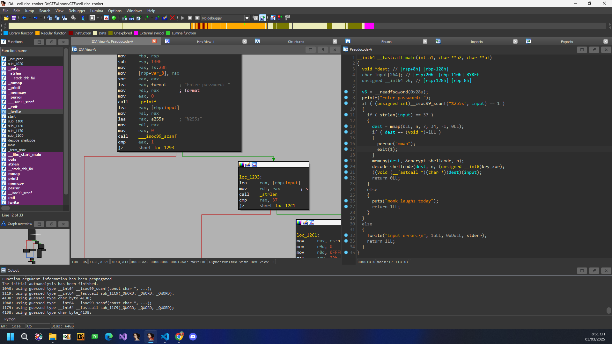
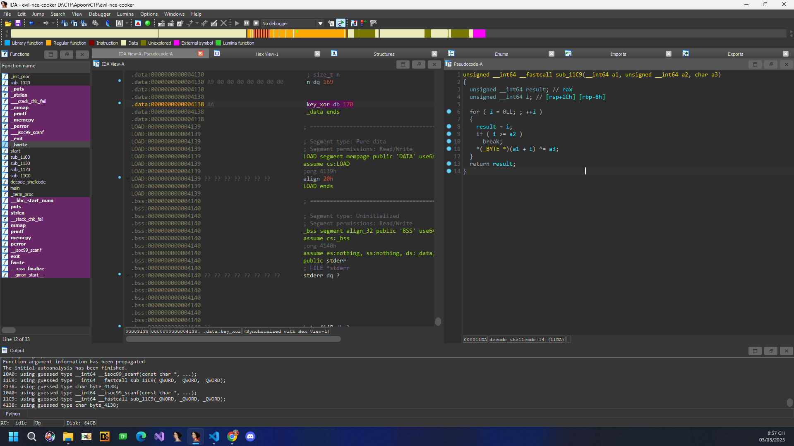
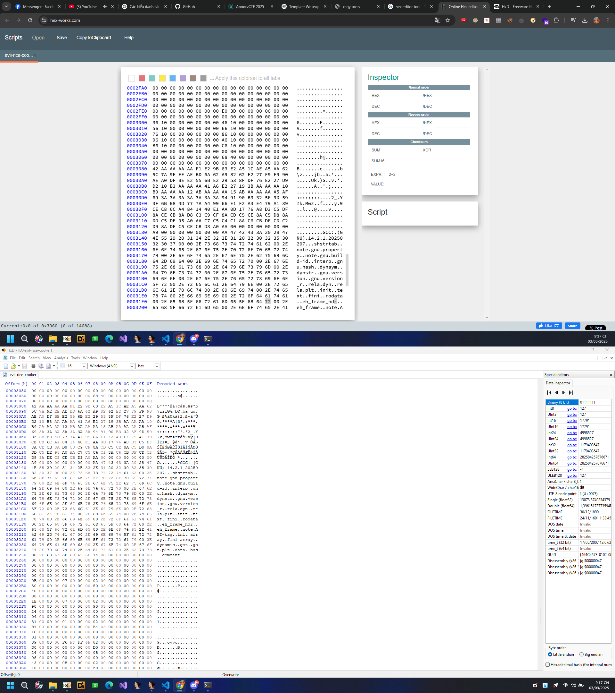
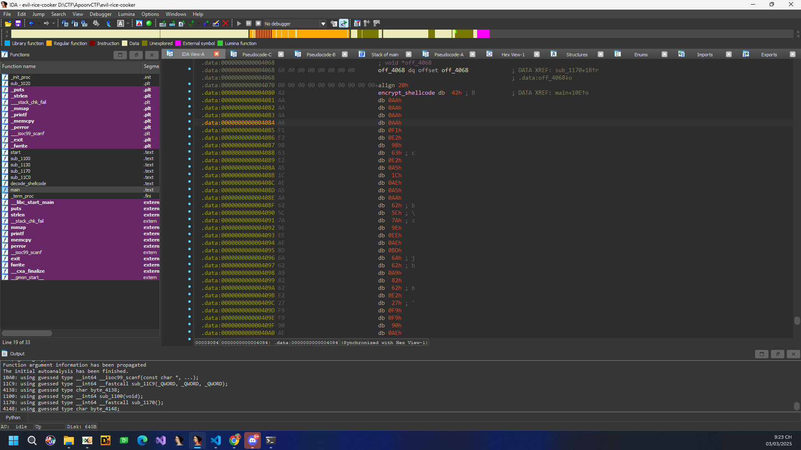
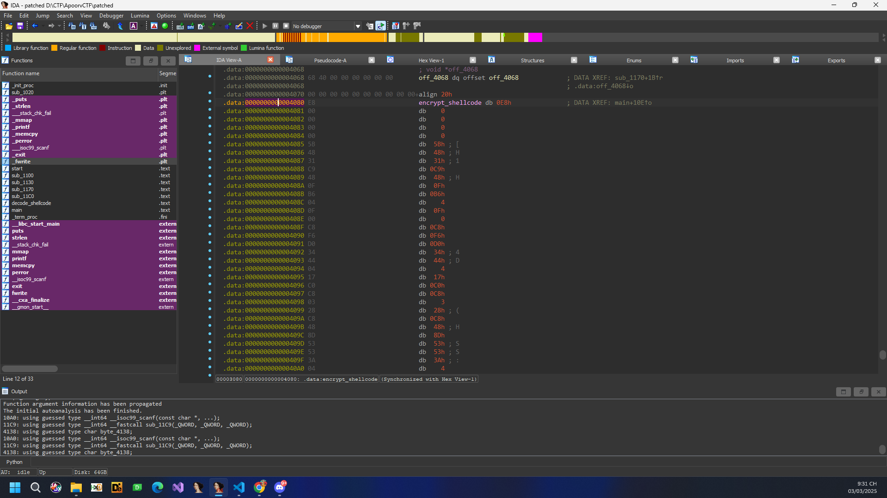
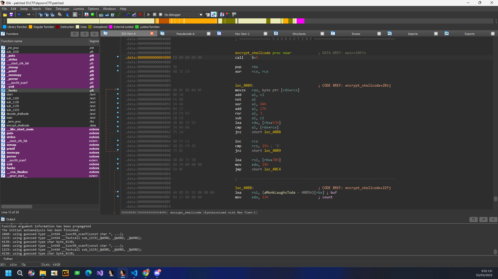
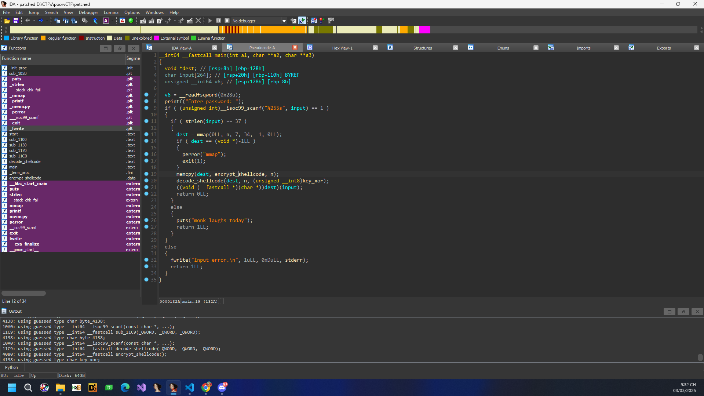
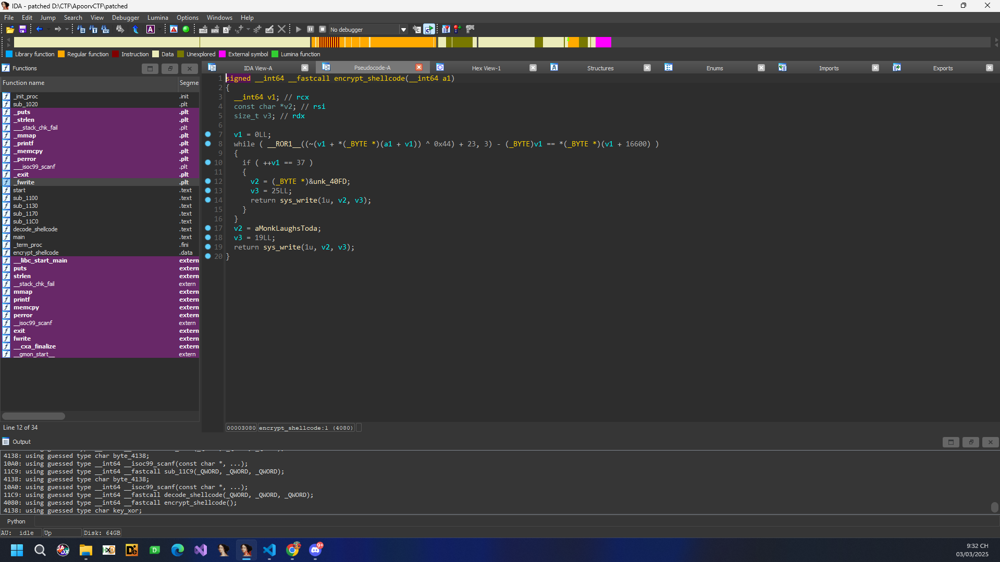

# Evil Rice - Writeup [luongvd]

## Thông tin
- **CTF**: ApoorvCTF
- **Tên**: Evil Rice
- **Mảng**: REV
- **Challenge**: [Evil Rice](./evil-rice-cooker)

## Phân tích


- Sau một lúc đọc mã giả và suy nghĩ, tôi thấy được logic của chương trình đơn giản là nhận input của người dùng.
  - Nhận thấy **input có chiều dài 37** thì tiến hành cấp phát bộ nhớ cho dest.
  - dest được copy với encrypt_shellcode ,**n = 169**, sau đó chạy vào hàm decode_shellcode với key_xor ở đây là **key_xor db 170** (xor từng kí tự ( 0 < i < n))

- Rồi sau đó input của chúng ta được truyền vào trong dest, để kiểm tra chính xác hàm dest là gì là xong ?

## Khai thác

- Ta tiến hành tìm địa chỉ của đoạn shellcode kia rồi xor ta thực hiện chuyển nó thành mã lệnh , hàm.

### Note phím tắt trong IDA
- **`Phím C`** → Chuyển một vùng dữ liệu thành **mã lệnh (code)**.
  - Nếu IDA nhận diện sai một đoạn mã là dữ liệu, nhấn `C` để buộc IDA xem nó như code.
  - Để chuyển về dạng dữ liệu, nhấn `D` (Data).

- **`Phím P`** → Tạo **hàm (procedure)** tại vị trí con trỏ.
  - Nếu IDA không tự động nhận diện một hàm, nhấn `P` để tạo thủ công.
  - Nhấn `Alt + P` để xóa hàm nếu cần.



- Sử dụng tất cả các công cụ mà bạn muốn để tìm địa chỉ (offset) của shellcode kia vì trong IDA hiện thị không đúng.


**Vậy chúng ta đã tìm được offset của shell code bắt đầu từ 0x3080 đến 0x3080 + n = 0x3080 + 169**
- Tiến hành code python để đọc tất cả các bytes rồi xor với xor_key rồi lưu lại (việc này nhằm mục đích khi chúng ta tạo mã lệnh có thể đẹp nhất)

```Python
with open("evil-rice-cooker", 'rb') as f:
    code = f.read()
    
offset = 0x3080
length = 0xa9

code = bytearray(code)
for i in range(offset, offset + length):
    code[i] ^= 0xaa
    
with open("patched", 'wb') as f:
    f.write(code)
print(code)
```

- Tiến hành mở IDA Pro phân tích file patch, và ấn P tại dòng shellcode





- Sau đó F5 lại mã giả IDA, thu được hàm hoàn chỉnh







- Phân tích cơ chế check lấy các byte từ địa chỉ [16600,16600+36] = [0x40d8,0x40fc]
- Export trong IDA
```Python
unk_40FD = [0x3E, 0x3B, 0x3A, 0x19, 0x98, 0xF5, 0x37, 0xF3, 
       0x95, 0xC1, 0x12, 0xE7, 0xDD, 0xD0, 0x0E, 0x33, 
       0xCC, 0x4B, 0x58, 0x09, 0x4E, 0xD3, 0x0B, 0x93, 
       0x64, 0x62, 0xC6, 0x0E, 0x2E, 0xBE, 0xEA, 0x4B, 
       0x00, 0xA7, 0xBD, 0xDC, 0x02]
```
```Python
signed __int64 __fastcall encrypt_shellcode(__int64 input)
{
  __int64 v1; // rcx
  const char *v2; // rsi
  size_t v3; // rdx

  v1 = 0LL;
  while ( __ROR1__((~(v1 + *(_BYTE *)(input + v1)) ^ 0x44) + 23, 3) - (_BYTE)v1 == *(_BYTE *)(v1 + 16600) )
  {
    if ( ++v1 == 37 )
    {
      v2 = (_BYTE *)&unk_40FD;
      v3 = 25LL;
      return sys_write(1u, v2, v3);
    }
  }
  v2 = aMonkLaughsToda;
  v3 = 19LL;
  return sys_write(1u, v2, v3);
}
```

### Code giải mã
```Python
def rol(value, bits, width=8):
    """Rotate left (ROL) operation."""
    mask = (1 << width) - 1  # Giới hạn trong 8-bit
    return ((value << bits) & mask) | ((value & mask) >> (width - bits))

def decrypt(enc):
    plaintext = []
    for v1 in range(len(enc)):
        # Giải phương trình: enc[v1] = ROR1(((~(v1 + input[v1]) ^ 0x44) + 23), 3) - v1
        rotated_back = (enc[v1] + v1) & 0xFF  # Giải ROR1 trước
        original_value = rol(rotated_back, 3)  # Đảo ngược ROR1 bằng ROL

        # Đảo ngược ((~(v1 + input[v1]) ^ 0x44) + 23)
        original_value = (original_value - 23) & 0xFF  # Trừ 23
        original_value ^= 0x44  # XOR với 0x44
        inverted_value = ~original_value & 0xFF  # Đảo bit

        # Giải phương trình v1 + input[v1] = inverted_value
        input_byte = (inverted_value - v1) & 0xFF
        plaintext.append(input_byte)

    return bytes(plaintext)

# Giải mã chuỗi enc
decoded_text = decrypt([0x3E, 0x3B, 0x3A, 0x19, 0x98, 0xF5, 0x37, 0xF3, 
                        0x95, 0xC1, 0x12, 0xE7, 0xDD, 0xD0, 0x0E, 0x33, 
                        0xCC, 0x4B, 0x58, 0x09, 0x4E, 0xD3, 0x0B, 0x93, 
                        0x64, 0x62, 0xC6, 0x0E, 0x2E, 0xBE, 0xEA, 0x4B, 
                        0x00, 0xA7, 0xBD, 0xDC, 0x02])

print(decoded_text.decode(errors='ignore'))# Giải mã ra chuỗi có thể đọc được

```
## Flag
```
apoorvctf{h0w_d1d_u_3v3n_f1nd_th1s:0}
```

