# Writeup [luongvd]


## B1. easyre

Mở IDA chúng ta thấy ngay flag hoặc chỉ cần nhập vào 2 số giống nhau là sẽ nhận được flag
 
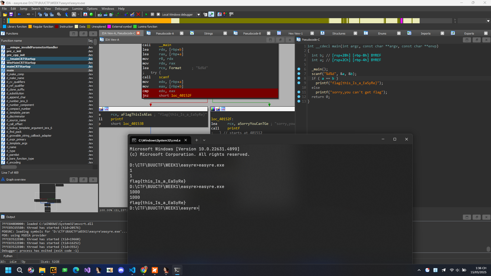

<details>
<summary>Flag</summary>

flag{this_Is_a_EaSyRe}

</details>  


## B2. reverse1

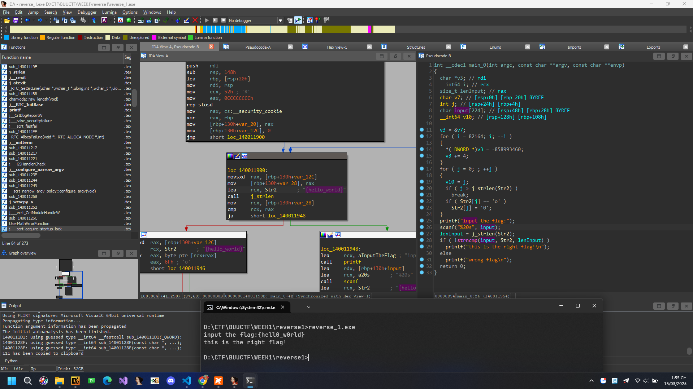


Đơn giản nhập input từ người dùng so sánh với chuỗi Str2 ban đầu Str2 = "{hello_world}" nhưng lại chạy qua 1 vòng for để đổi o thành 0 => chuỗi cần nhập sẽ phải là {hell0_w0rld}

<details>
<summary>Flag</summary>

flag{hell0_w0rld}

</details>  

## B3. reverse2

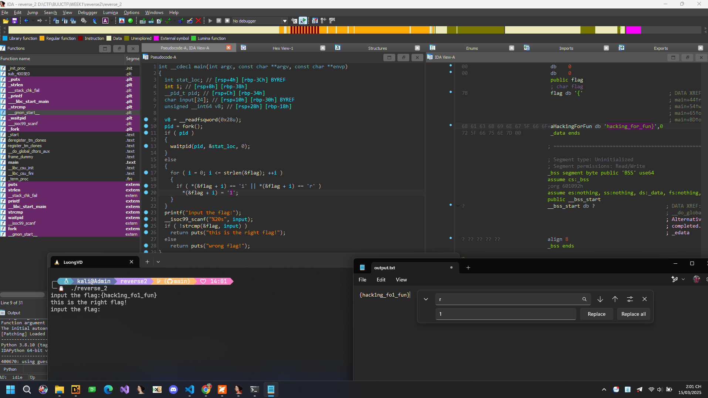


Nhập input so sánh với flag, flag ban đầu {hacking_for_fun} đổi kí tự i , r thành 1 

<details>
<summary>Flag</summary>

flag{hack1ng_fo1_fun}
</details>  

## B4. 内涵的软件

Ngay ở hàm main ta thấy được chuỗi giống flag, đặt con trỏ rồi ấn X phát hiện nó không được gọi ở đâu nữa, không được sửa đổi, nghi ngờ là flag sub
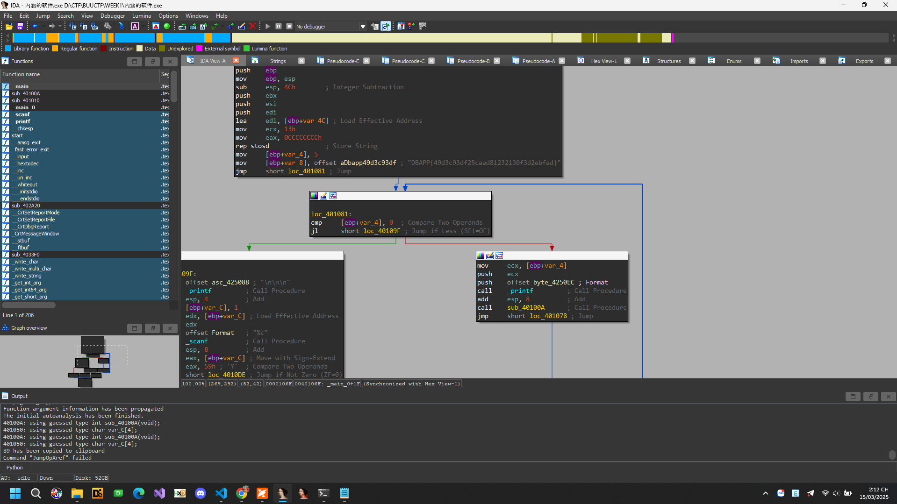

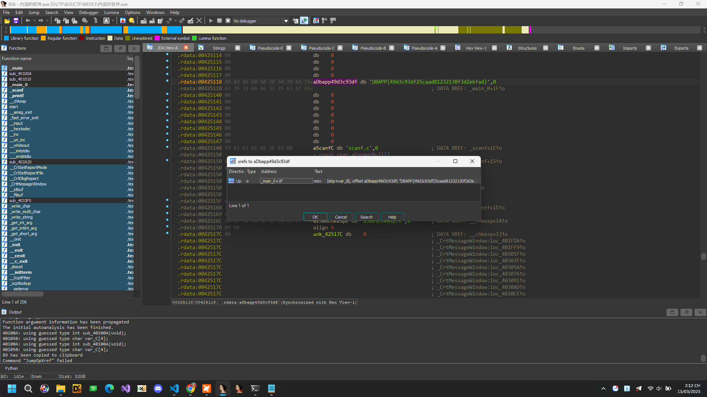


<details>
<summary>Flag</summary>

flag{49d3c93df25caad81232130f3d2ebfad}
</details>  


## B5. 新年快乐

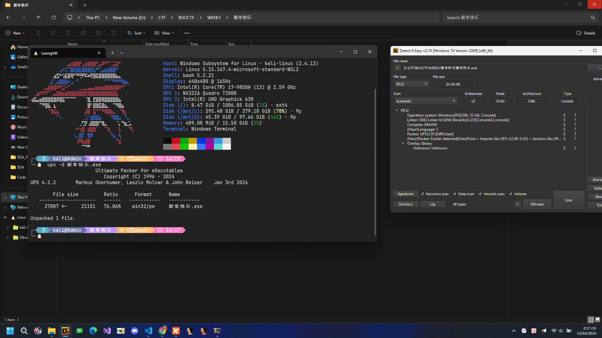


Check = DIE thấy có pack = UPX chúng ta thực hiện unpack.

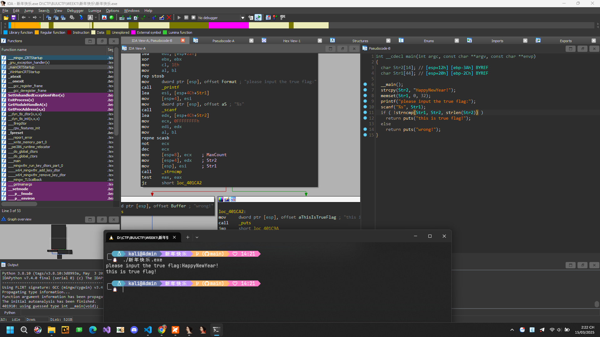

Quá dễ giờ chỉ cần thêm form flag, đây chỉ là 1 lệnh compare đơn giản
<details>
<summary>Flag</summary>

flag{HappyNewYear!}
</details>  

## B6. xor

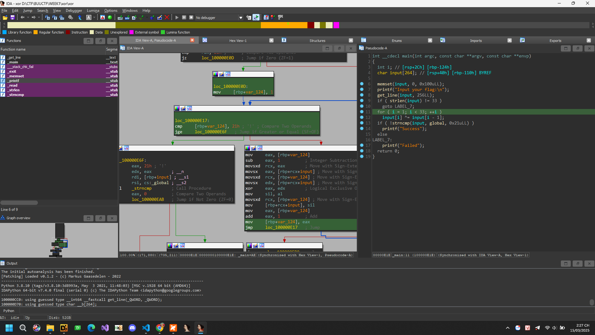


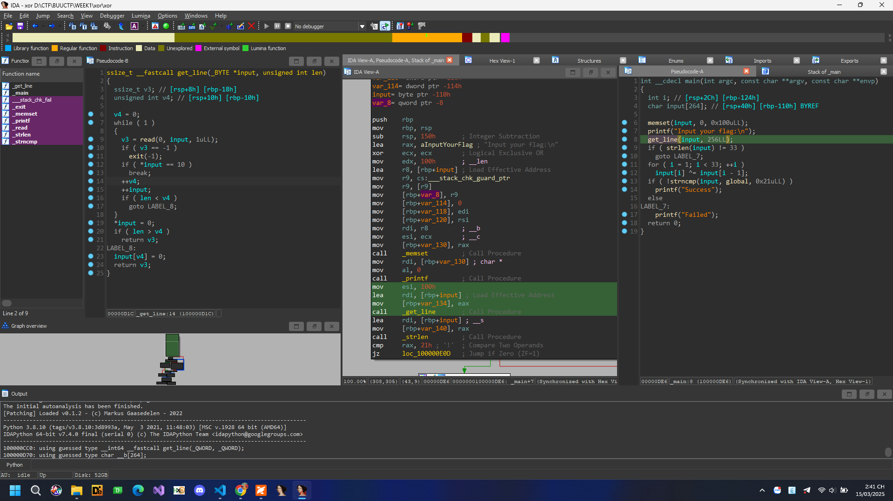
Thay vì scanf ở đây lại có hàm _get_line tìm hiểu nó như nào. Hàm này nhận vào 2 tham số thứ nhất là input thứ hai là len input.

Nó tiến hành đọc từng byte 1 cho đến khi vượt quá len input là 256 thì dừng tự động chèn kí tự \0 để kết thúc chuỗi.

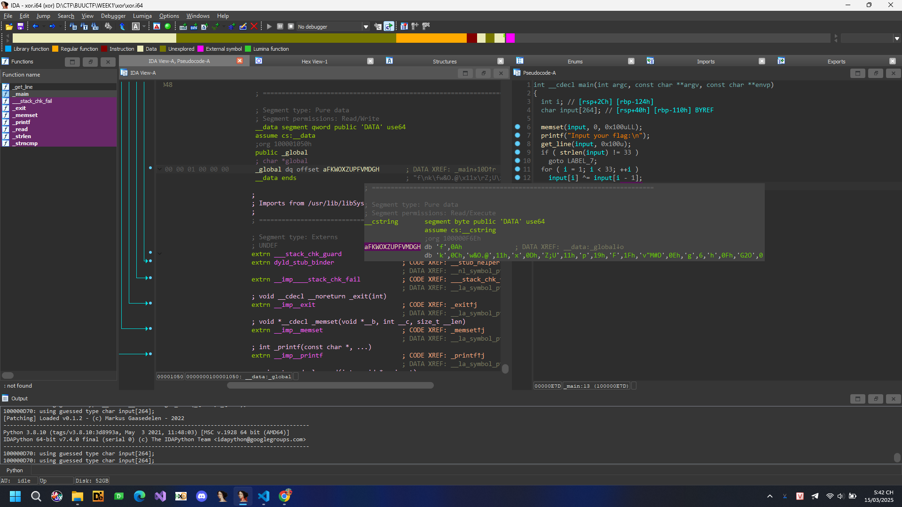

Ta tiến hành export biến global từ offset aFKWOXZUPFVMDGH và viết code python chúng ta chỉ cần xor ngược từ cuối về đầu là sẽ thu được flag


```Python
aFKWOXZUPFVMDGH = [
  0x66, 0x0A, 0x6B, 0x0C, 0x77, 0x26, 0x4F, 0x2E, 0x40, 0x11, 
  0x78, 0x0D, 0x5A, 0x3B, 0x55, 0x11, 0x70, 0x19, 0x46, 0x1F, 
  0x76, 0x22, 0x4D, 0x23, 0x44, 0x0E, 0x67, 0x06, 0x68, 0x0F, 
  0x47, 0x32, 0x4F
]

for i in range(len(aFKWOXZUPFVMDGH) - 1, 0, - 1):
    aFKWOXZUPFVMDGH[i] ^= aFKWOXZUPFVMDGH[i - 1]
for i in range(len(aFKWOXZUPFVMDGH)):
    print(chr(aFKWOXZUPFVMDGH[i]),end="") 
```

<details>
<summary>Flag</summary>
flag{QianQiuWanDai_YiTongJiangHu}
</details>  

## B7. reverse3
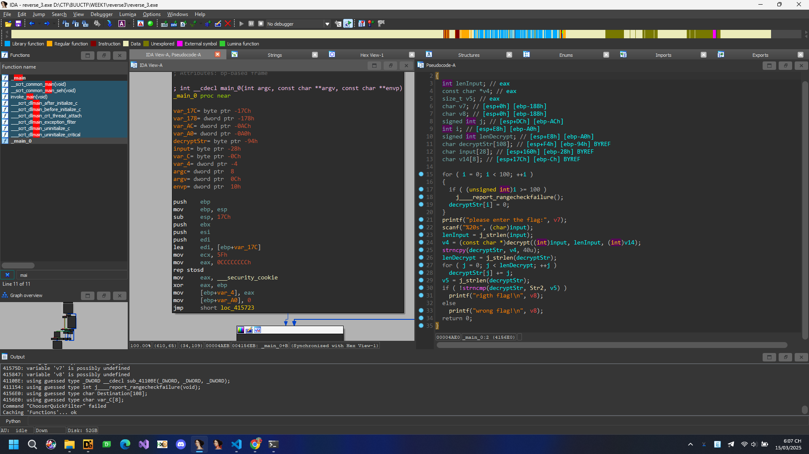

Sau khi đọc source và rename các biến chúng ta có thể hiểu rằng khi chúng ta nhập input rồi input đi qua 1 hàm decrypt rồi với chuỗi decrypt đấy mỗi kí tự lại được dịch đúng với index của nó. Sau đó chuỗi decrypt được so sánh với Str2. Rồi vậy quan trọng nhất là hàm decrypt kia nó là gì là xong việc.

```C++
void *__cdecl decrypt(char *input, unsigned int inputLen, int *v14)
{
  int v4; // [esp+D4h] [ebp-38h]
  int v5; // [esp+D4h] [ebp-38h]
  int v6; // [esp+D4h] [ebp-38h]
  int v7; // [esp+D4h] [ebp-38h]
  int i; // [esp+E0h] [ebp-2Ch]
  unsigned int v9; // [esp+ECh] [ebp-20h]
  int v10; // [esp+ECh] [ebp-20h]
  int v11; // [esp+ECh] [ebp-20h]
  void *v12; // [esp+F8h] [ebp-14h]
  char *v13; // [esp+104h] [ebp-8h]

  if ( !input || !inputLen )
    return 0;
  v9 = inputLen / 3;
  if ( (int)(inputLen / 3) % 3 )
    ++v9;
  v10 = 4 * v9;
  *v14 = v10;
  v12 = malloc(v10 + 1);
  if ( !v12 )
    return 0;
  j_memset(v12, 0, v10 + 1);
  v13 = input;
  v11 = inputLen;
  v4 = 0;
  while ( v11 > 0 )
  {
    byte_41A144[2] = 0;
    byte_41A144[1] = 0;
    byte_41A144[0] = 0;
    for ( i = 0; i < 3 && v11 >= 1; ++i )
    {
      byte_41A144[i] = *v13;
      --v11;
      ++v13;
    }
    if ( !i )
      break;
    switch ( i )
    {
      case 1:
        *((_BYTE *)v12 + v4) = aAbcdefghijklmn[(int)(unsigned __int8)byte_41A144[0] >> 2];
        v5 = v4 + 1;
        *((_BYTE *)v12 + v5) = aAbcdefghijklmn[((byte_41A144[1] & 0xF0) >> 4) | (16 * (byte_41A144[0] & 3))];
        *((_BYTE *)v12 + ++v5) = aAbcdefghijklmn[64];
        *((_BYTE *)v12 + ++v5) = aAbcdefghijklmn[64];
        v4 = v5 + 1;
        break;
      case 2:
        *((_BYTE *)v12 + v4) = aAbcdefghijklmn[(int)(unsigned __int8)byte_41A144[0] >> 2];
        v6 = v4 + 1;
        *((_BYTE *)v12 + v6) = aAbcdefghijklmn[((byte_41A144[1] & 0xF0) >> 4) | (16 * (byte_41A144[0] & 3))];
        *((_BYTE *)v12 + ++v6) = aAbcdefghijklmn[((byte_41A144[2] & 0xC0) >> 6) | (4 * (byte_41A144[1] & 0xF))];
        *((_BYTE *)v12 + ++v6) = aAbcdefghijklmn[64];
        v4 = v6 + 1;
        break;
      case 3:
        *((_BYTE *)v12 + v4) = aAbcdefghijklmn[(int)(unsigned __int8)byte_41A144[0] >> 2];
        v7 = v4 + 1;
        *((_BYTE *)v12 + v7) = aAbcdefghijklmn[((byte_41A144[1] & 0xF0) >> 4) | (16 * (byte_41A144[0] & 3))];
        *((_BYTE *)v12 + ++v7) = aAbcdefghijklmn[((byte_41A144[2] & 0xC0) >> 6) | (4 * (byte_41A144[1] & 0xF))];
        *((_BYTE *)v12 + ++v7) = aAbcdefghijklmn[byte_41A144[2] & 0x3F];
        v4 = v7 + 1;
        break;
    }
  }
  *((_BYTE *)v12 + v4) = 0;
  return v12;
}
```
```Python
Trông khá của chuỗi nhưng dạng này e cũng đã gặp 1 lần trông khá giống base64.
Thử dùng ChatGPT thử.
import base64

def encode_base64(input_data: bytes) -> bytes:
    if not input_data:
        return b''
    
    encoded_data = base64.b64encode(input_data)
    return encoded_data
# Example usage
input_bytes = b"Hello, World!"
encoded_bytes = encode_base64(input_bytes)
print(encoded_bytes.decode())
```
Oke vậy là đã rõ việc bây giờ chúng ta là viết code để decode với Str2 = "e3nifIH9b_C@n@dH"
```Python
import base64

str_enc = "e3nifIH9b_C@n@dH"
str_enc = list(str_enc)

for i in range(len(str_enc)):
    str_enc[i] = chr(ord(str_enc[i]) - i)

decoded_str = "".join(str_enc)
decoded_bytes = base64.b64decode(decoded_str)
print(decoded_bytes.decode(errors="ignore"))  

```

<details>
<summary>Flag</summary>
flag{i_l0ve_you}
</details>  

## B8. helloword


Chúng ta nhận được file apk sử dụng công cụ jadx để view source. Với 1 file apk thường e sẽ đi tìm MainActivity đây như là 1 điểm khởi đầu của ứng dụng hay là entry point!, dễ dàng thấy được flag.
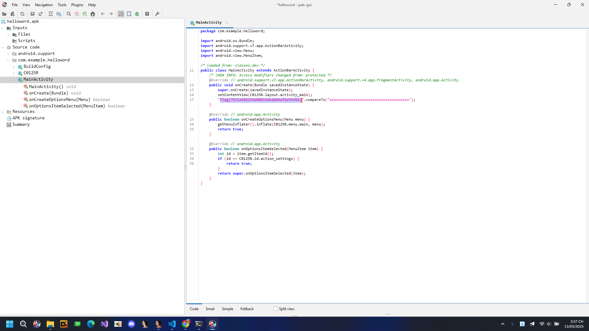

<details>
<summary>Flag</summary>
flag{7631a988259a00816deda84afb29430a}
</details>  

## B9.不一样的flag

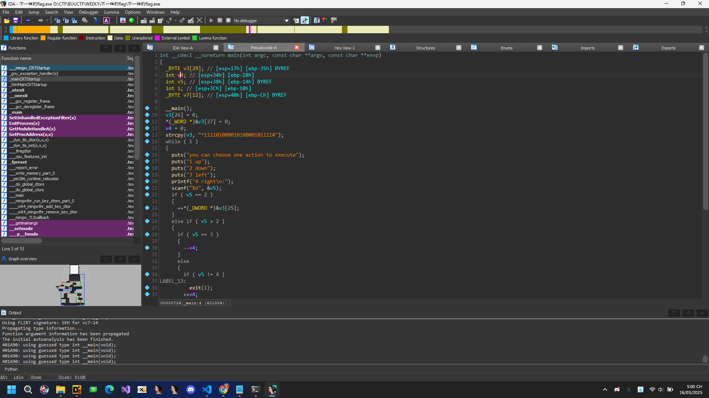

Chúng ta nhận được 1 file mở lên, chuyển sang code py cho dễ đọc

```Python
import sys

def main():
    grid = "*11110100001010000101111#"
    pos_x, pos_y = 0, 0  # Tọa độ ban đầu
    
    while True:
        print("you can choose one action to execute")
        print("1 up")
        print("2 down")
        print("3 left")
        action = input("4 right\n:")
        
        try:
            action = int(action)
        except ValueError:
            sys.exit(1)
        
        if action == 1:
            pos_y -= 1
        elif action == 2:
            pos_y += 1
        elif action == 3:
            pos_x -= 1
        elif action == 4:
            pos_x += 1
        else:
            sys.exit(1)
        
        # Kiểm tra giới hạn
        if pos_x >= 5 or pos_y >= 5:
            sys.exit(1)
        
        index = 5 * pos_y + pos_x
        if grid[index] == '1':
            sys.exit(1)
        
        if grid[index] == '#':
            print("\nok, the order you enter is the flag!")
            sys.exit(0)

if __name__ == "__main__":
    main()
```

```Oke clear vậy là đây chính là 1 ma trận 5*5 
*1111
01000
01010
00010
1111#
Di chuyển
222441144222
```
<details>
<summary>Flag</summary>
flag{222441144222}
</details>  

## B10. SimpleRev
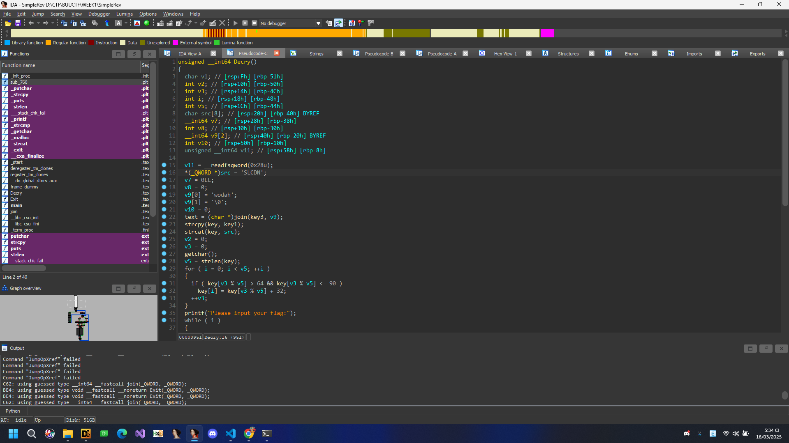
Mở IDA thì hàm main không có gì đặc biệt chú ý đến hàm Decry
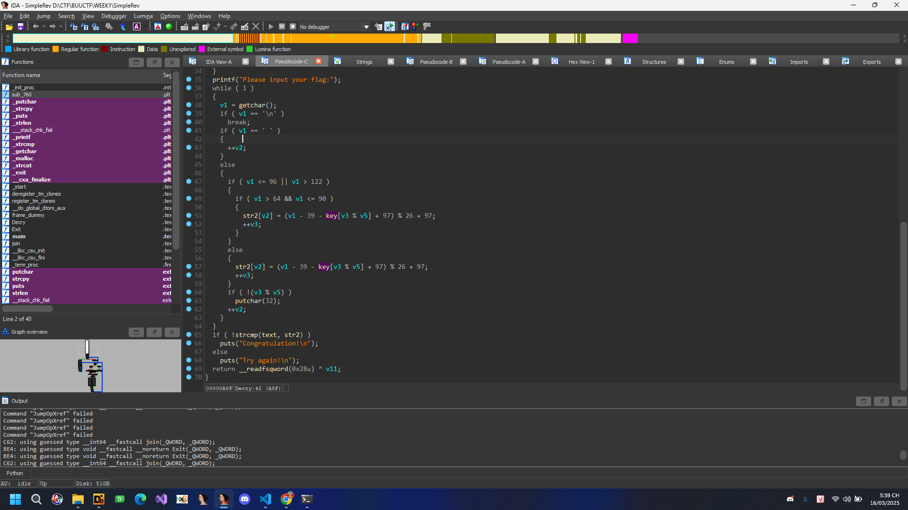


Oke trông khá là loằng ngoằng. 

```C
unsigned __int64 Decry()
{
  __int64 v0; // rdx
  char v2; // [rsp+Fh] [rbp-51h]
  int v3; // [rsp+10h] [rbp-50h]
  int v4; // [rsp+14h] [rbp-4Ch]
  int i; // [rsp+18h] [rbp-48h]
  int v6; // [rsp+1Ch] [rbp-44h]
  _QWORD v7[2]; // [rsp+20h] [rbp-40h] BYREF
  int v8; // [rsp+30h] [rbp-30h]
  _QWORD v9[2]; // [rsp+40h] [rbp-20h] BYREF
  int v10; // [rsp+50h] [rbp-10h]
  unsigned __int64 v11; // [rsp+58h] [rbp-8h]

  v11 = __readfsqword(0x28u);
  v7[0] = 'SLCDN';
  v7[1] = '\0';
  v8 = 0;
  v9[0] = 'wodah';
  v9[1] = '\0';
  v10 = 0;
  text = join(key3, v9); //key3 db 'kills'
  // text = killshadow
  strcpy(key, key1); //key1 db 'ADSFK'
  strcat(key, v7);  
  // key = ADSFKNDCLS
  v3 = 0;
  v4 = 0;
  getchar();
  v6 = strlen(key);
  for ( i = 0; i < v6; ++i )
  {
    v0 = v4 % v6;
    if ( key[v0] > 64 )
    {
      v0 = v4 % v6;
      if ( key[v0] <= 90 )
      {
        v0 = i;
        key[i] = key[v4 % v6] + 32;
      }
    }
    ++v4;
  }
  // Sau vòng for này key = adsfkndcls
  printf("Please input your flag:", v7, v0);
  while ( 1 )
  {
    v2 = getchar();
    if ( v2 == '\n' )
      break;
    if ( v2 == ' ' )
    {
      ++v3;
    }
    else
    {
      if ( v2 <= 96 || v2 > 122 )
      {
        if ( v2 > 64 && v2 <= 90 )
        {
          str2[v3] = (v2 - 39 - key[v4 % v6] + 97) % 26 + 97;
          ++v4;
        }
      }
      else
      {
        str2[v3] = (v2 - 39 - key[v4 % v6] + 97) % 26 + 97;
        ++v4;
      }
      if ( !(v4 % v6) )
        putchar(32LL);
      ++v3;
    }
  }
  if ( !(unsigned int)strcmp(text, str2) )
    puts("Congratulation!\n");
  else
    puts("Try again!\n");
  return __readfsqword(0x28u) ^ v11;
}
```
Oke vậy v2 là input của chúng ta nhập sao cho str2 == text là xong viết code python để tìm lại chuỗi chúng ta cần nhập 
```Python
text = "killshadow"
key = "adsfkndcls"
v3 = 10

for i in range(10):  
    for j in range(65, 123):  
        if ('A' <= chr(j) <= 'Z') or ('a' <= chr(j) <= 'z'):  
            if ((j - 39 - ord(key[v3 % 10]) + 97) % 26 + 97) == ord(text[i]):  
                v3 += 1
                print(chr(j), end="")
                break
```

<details>
<summary>Flag</summary>
flag{KLDQCUDFZO}
</details>  


## B11. [GXYCTF2019]luck_guy

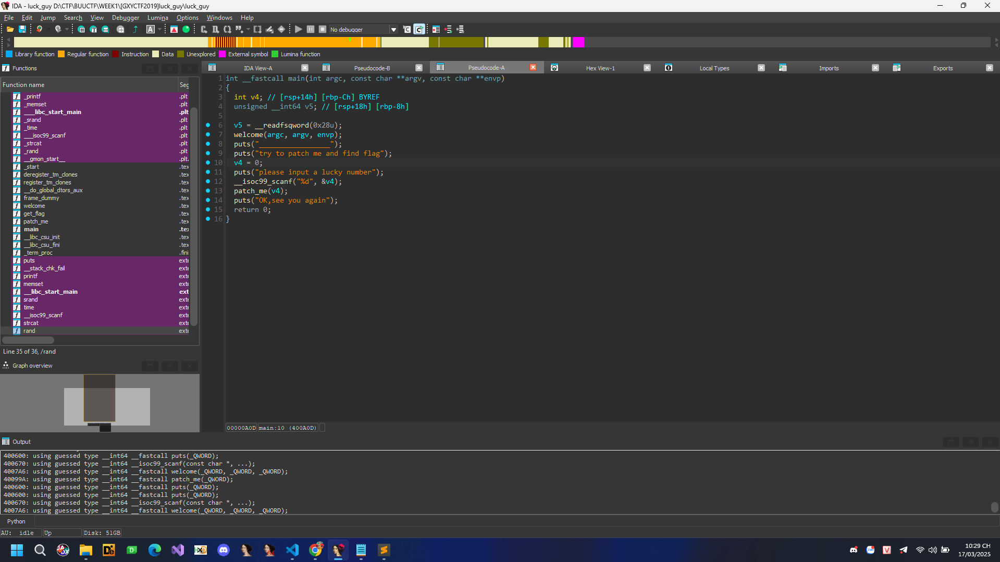
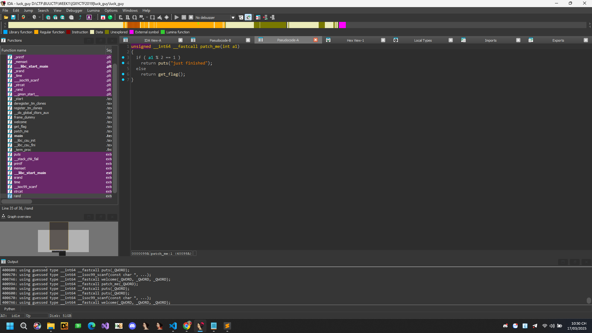

Oke sơ sơ là nó bắt chúng ta nhập vào 1 số nếu mà là số chẵn thì mới xét tiếp vào get_flag, xem trong get flag có gì
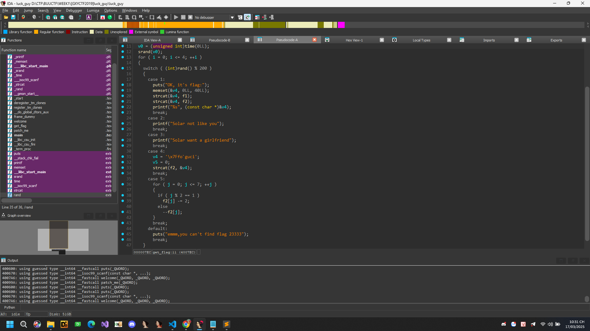

Oke đọc kiểu vậy chúng ta cần đi qua mấy cái case kia rồi tìm dược hướng đúng để ghép được flag
thứ tự e nghĩ đúng là 4,5 về 1 là có flag. Tiến hành triển khai code Python
```Python
flag = ""
f1 = "GXY{do_not_"
flag += f1
v4 = '\x7Ffo`guci'[::-1]
v4 = [ord(x) for x in v4]
for i in range(0,8):
    if(i % 2 == 1):
        v4[i] = v4[i] - 2
    elif(i % 2 == 0):
        v4[i] = v4[i] - 1
f2 = "".join(chr(x) for x in v4)
flag += f2
print(flag)
```
<details>
<summary>Flag</summary>
GXY{do_not_hate_me}
flag{do_not_hate_me}
</details>  

## B12. Java逆向解密

Chúng ta nhận được 1 file Reverse.class tiến hành view bằng jadx
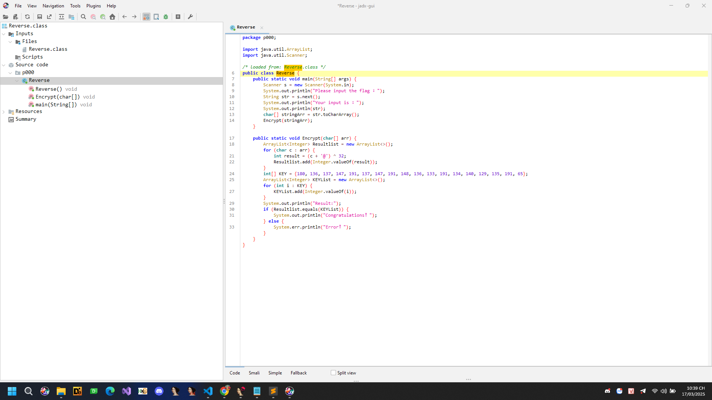


Oke khá đơn giản nó đổi input thành array rồi mỗi kí tự + '@' rồi ^ 32 rồi nó check xem có giống mảng KEY không, viết code python làm ngược lại là xong

```Python
KEY = [180, 136, 137, 147, 191, 137, 147, 191, 148, 136, 133, 191, 134, 140, 129, 135, 191, 65]
for c in KEY:
    tmp = (c - ord('@')) ^ 32
    print(chr(tmp),end="")
```

<details>
<summary>Flag</summary>
flag{This_is_the_flag_!}
</details> 


## B13. [BJDCTF2020]JustRE
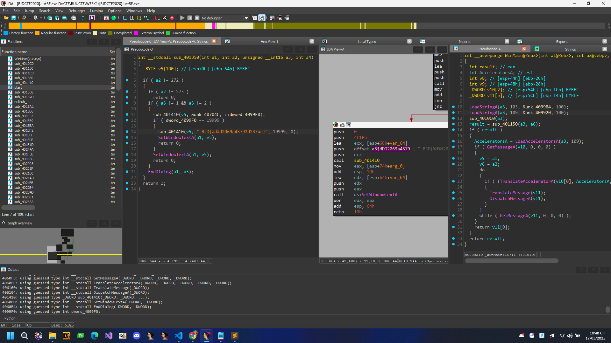

Mở bằng IDA rồi Shift F12 ấn X chúng ta tìm thấy 1 chuỗi giống flag, oke 2 cái phần trăm d kia là 2 cái số tham số bên cạnh, sub_401410(v5, " BJD{%d%d2069a45792d233ac}", 19999, 0);, thử thay và chúng ta có được flag


<details>
<summary>Flag</summary>
flag{1999902069a45792d233ac}
</details> 

## B14. 刮开有奖
E không có ý tưởng bài này ạ


## B15. [ACTF新生赛2020]easyre
Unpack UPX
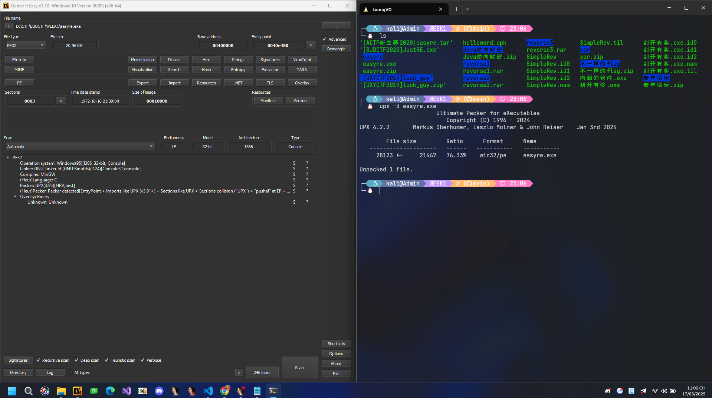

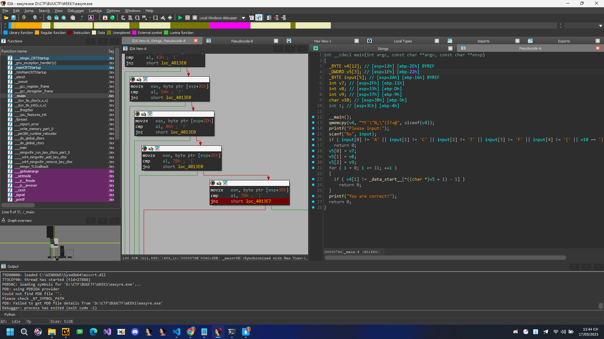

Bài này khá lạ mã giả khá xấu thử chuyển qua python

```Python
import struct

def main():
    v4 = bytearray(b"*F'\"N,\"(I?+@")
    input_str = input("Please input:")
    
    if len(input_str) < 6 or input_str[:5] != "ACTF{" or input_str[-1] == '}':
        return 0
    
    v5 = bytearray(input_str[5:-1].encode())  # Lấy phần giữa flag
    
    _data_start__ = bytearray(range(256))  # Giả lập _data_start__
    
    for i in range(12):
        if v4[i] != _data_start__[v5[i] - 1]:
            return 0
    
    print("You are correct!")
    return 0

if __name__ == "__main__":
    main()
```
Oke dễ hiểu hơn hẳn tức là chuỗi flag của chúng ta có 6 kí tự  đầu là ACTF{ và 12 kí tự chưa biết, chúng lấy 12 giá trị flag đó chuyển thành v5 rồi check. Chúng ta đã có v4 bây giờ thử tìm ngược lại v5 là xong.
```Python
v4 = "*F'\"N,\"(I?+@"
v4 = [ord(x) for x in v4]
__data_start__ = [
  0x7E, 0x7D, 0x7C, 0x7B, 0x7A, 0x79, 0x78, 0x77, 0x76, 0x75, 
  0x74, 0x73, 0x72, 0x71, 0x70, 0x6F, 0x6E, 0x6D, 0x6C, 0x6B, 
  0x6A, 0x69, 0x68, 0x67, 0x66, 0x65, 0x64, 0x63, 0x62, 0x61, 
  0x60, 0x5F, 0x5E, 0x5D, 0x5C, 0x5B, 0x5A, 0x59, 0x58, 0x57, 
  0x56, 0x55, 0x54, 0x53, 0x52, 0x51, 0x50, 0x4F, 0x4E, 0x4D, 
  0x4C, 0x4B, 0x4A, 0x49, 0x48, 0x47, 0x46, 0x45, 0x44, 0x43, 
  0x42, 0x41, 0x40, 0x3F, 0x3E, 0x3D, 0x3C, 0x3B, 0x3A, 0x39, 
  0x38, 0x37, 0x36, 0x35, 0x34, 0x33, 0x32, 0x31, 0x30, 0x2F, 
  0x2E, 0x2D, 0x2C, 0x2B, 0x2A, 0x29, 0x28, 0x27, 0x26, 0x25, 
  0x24, 0x23, 0x20, 0x21, 0x22, 0x00
]
print("flag{")
for i in range(len(v4)):
    print(chr(__data_start__[v4[i]] + 1) , end = "")
print("}")
```
<details>
<summary>Flag</summary>
flag{U9X_1S_W6@T?}
</details> 

## B16. 简单注册器
Nhận được file apk mở = jadx

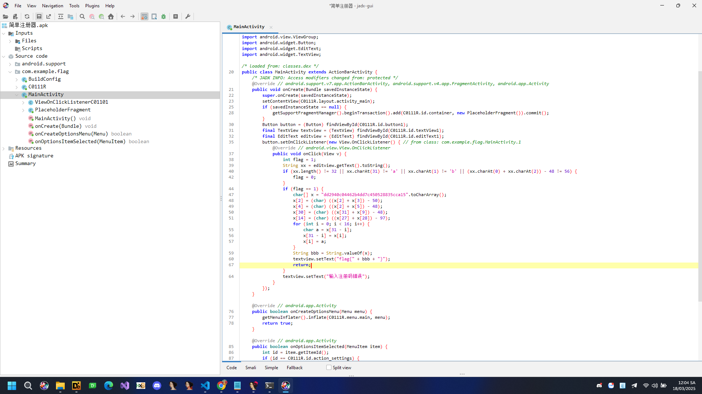


Nhìn thấy ngay ra chỗ cần rev là đoạn này 
```
 public void onClick(View v) {
                int flag = 1;
                String xx = editview.getText().toString();
                if (xx.length() != 32 || xx.charAt(31) != 'a' || xx.charAt(1) != 'b' || (xx.charAt(0) + xx.charAt(2)) - 48 != 56) {
                    flag = 0;
                }
                if (flag == 1) {
                    char[] x = "dd2940c04462b4dd7c450528835cca15".toCharArray();
                    x[2] = (char) ((x[2] + x[3]) - 50);
                    x[4] = (char) ((x[2] + x[5]) - 48);
                    x[30] = (char) ((x[31] + x[9]) - 48);
                    x[14] = (char) ((x[27] + x[28]) - 97);
                    for (int i = 0; i < 16; i++) {
                        char a = x[31 - i];
                        x[31 - i] = x[i];
                        x[i] = a;
                    }
                    String bbb = String.valueOf(x);
                    textview.setText("flag{" + bbb + "}");
                    return;
                }
                textview.setText("输入注册码错误");
            }
```

Oke flag == 1 thì chúng ta biến đổi chuỗi kia thế là được flag. Viết code python
```Python
x = list("dd2940c04462b4dd7c450528835cca15")

x[2] = chr((ord(x[2]) + ord(x[3])) - 50)
x[4] = chr((ord(x[2]) + ord(x[5])) - 48)
x[30] = chr((ord(x[31]) + ord(x[9])) - 48)
x[14] = chr((ord(x[27]) + ord(x[28])) - 97)

for i in range(16):
    x[31 - i], x[i] = x[i], x[31 - i]

x = "".join(x)
print(x)

```

<details>
<summary>Flag</summary>
flag{59acc538825054c7de4b26440c0999dd}
</details> 


## B17. [GWCTF 2019]pyre