# Writeup [luongvd]

## B17. [GWCTF 2019]pyre

Thấy file pyc chúng ta sử dụng [web](https://www.lddgo.net/en/string/pyc-compile-decompile) để view source


```Python
# Visit https://www.lddgo.net/en/string/pyc-compile-decompile for more information
# Version : Python 2.7

print 'Welcome to Re World!'
print 'Your input1 is your flag~'
l = len(input1)
for i in range(l):
    num = ((input1[i] + i) % 128 + 128) % 128
    code += num

for i in range(l - 1):
    code[i] = code[i] ^ code[i + 1]

print code
code = [
    '\x1f',
    '\x12',
    '\x1d',
    '(',
    '0',
    '4',
    '\x01',
    '\x06',
    '\x14',
    '4',
    ',',
    '\x1b',
    'U',
    '?',
    'o',
    '6',
    '*',
    ':',
    '\x01',
    'D',
    ';',
    '%',
    '\x13']

```
Tiến hành viết code giải mã 
```Python
code = [
    '\x1f',
    '\x12',
    '\x1d',
    '(',
    '0',
    '4',
    '\x01',
    '\x06',
    '\x14',
    '4',
    ',',
    '\x1b',
    'U',
    '?',
    'o',
    '6',
    '*',
    ':',
    '\x01',
    'D',
    ';',
    '%',
    '\x13']
for i in range(len(code)):
    code[i] = ord(code[i])
for i in range(len(code) - 2, - 1, - 1):
    code[i] ^= code[i + 1]
for i in range(len(code)):
    code[i] = (code[i] - i) % 128
print("".join(chr(c) for c in code))
```
<details>
<summary>Flag</summary>
flag{Just_Re_1s_Ha66y!}
</details> 


## B18. findit

Nhận được file apk mở bằng jadx, chúng ta nhận được thông tin đổi tý tên biến để clear hơn

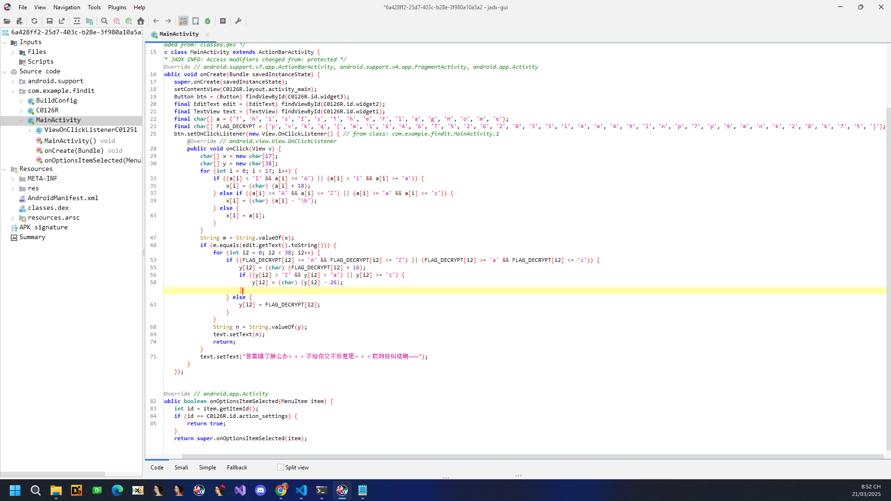

Oke quá rõ rồi, nhìn dạng này tôi đoán có thể là dạng ROT gì đó hhh trông khá quen guessing. Thử viết code python hoặc guessing 1 chút.

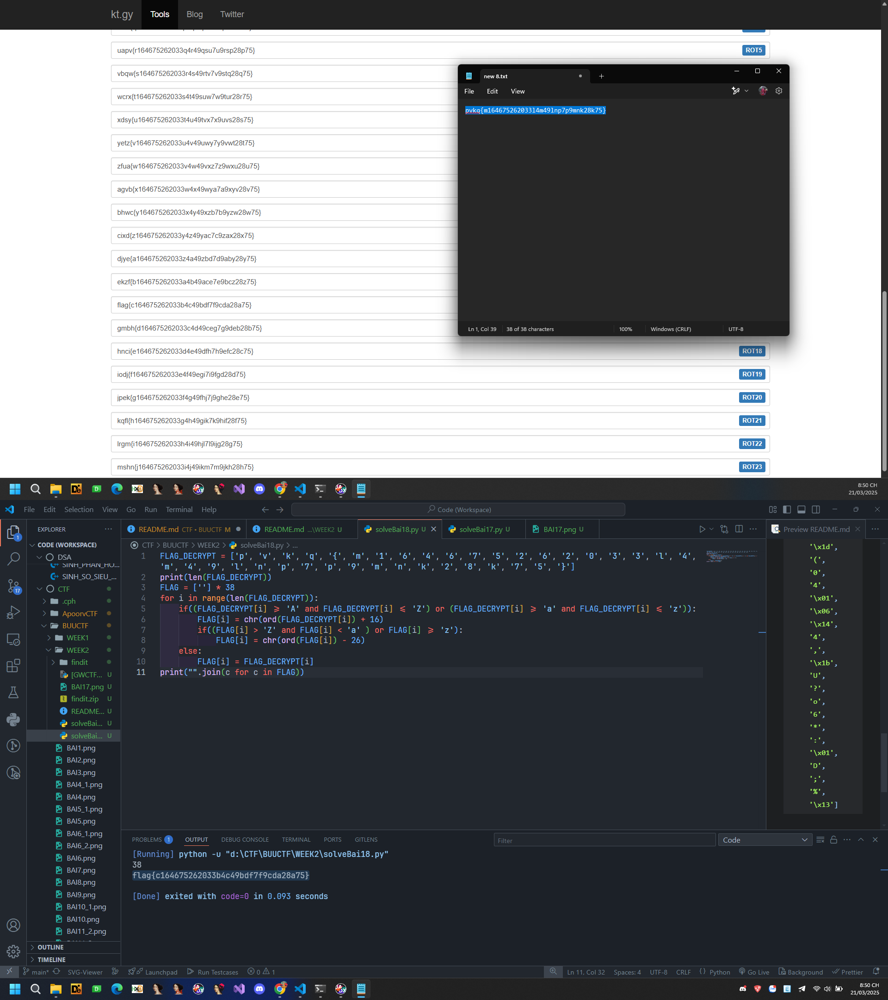

```Python
FLAG_DECRYPT = ['p', 'v', 'k', 'q', '{', 'm', '1', '6', '4', '6', '7', '5', '2', '6', '2', '0', '3', '3', 'l', '4', 'm', '4', '9', 'l', 'n', 'p', '7', 'p', '9', 'm', 'n', 'k', '2', '8', 'k', '7', '5', '}']
print(len(FLAG_DECRYPT))
FLAG = [''] * 38
for i in range(len(FLAG_DECRYPT)):
    if((FLAG_DECRYPT[i] >= 'A' and FLAG_DECRYPT[i] <= 'Z') or (FLAG_DECRYPT[i] >= 'a' and FLAG_DECRYPT[i] <= 'z')):
        FLAG[i] = chr(ord(FLAG_DECRYPT[i]) + 16)
        if((FLAG[i] > 'Z' and FLAG[i] < 'a' ) or FLAG[i] >= 'z'):
            FLAG[i] = chr(ord(FLAG[i]) - 26)
    else:
        FLAG[i] = FLAG_DECRYPT[i] 
print("".join(c for c in FLAG))
```

<details>
<summary>Flag</summary>
flag{c164675262033b4c49bdf7f9cda28a75}
</details> 

## B19. [ACTF新生赛2020]rome


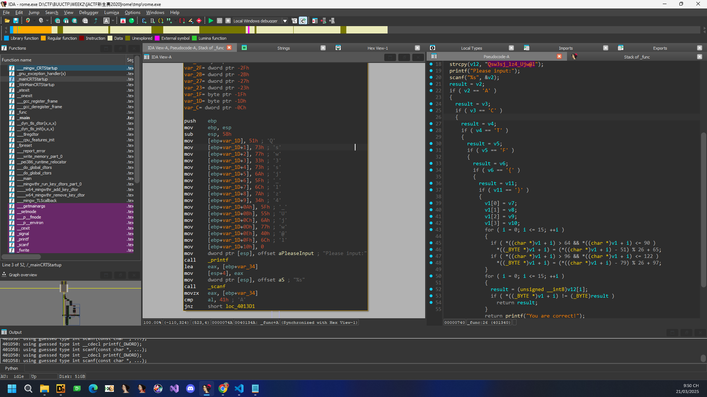

Oke có file view vào IDA ý tưởng của tôi khi nhìn cái này là form flag là ACTF{} nó check như thế trước rồi check đến 16 kí tự bên trong ta lại biết enc của 16 kí tự đó là v12. Tiến hành viết code python giải mã

```Python
import string

v12 = "Qsw3sj_lz4_Ujw@l"
v12 = [ord(x) for x in v12]  

listStr = string.ascii_letters  
listStr = [ord(c) for c in listStr]

print(len(v12))

for i in range(len(v12)):
    oke = 0
    for j in listStr:
        if j >= 97:
            if(v12[i] == (j - 79)%26 + 97):
                oke = 1
                print(chr(j),end="")
                break
        elif j >= 65:
            if(v12[i] == (j - 51)%26 + 65):
                oke = 1
                print(chr(j),end="")
                break
    if oke == 0:
        print(chr(v12[i]),end="")
```
Thu được flag
<details>
<summary>Flag</summary>
flag{Cae3ar_th4_Gre@t}
</details> 

## B20. [FlareOn4]login

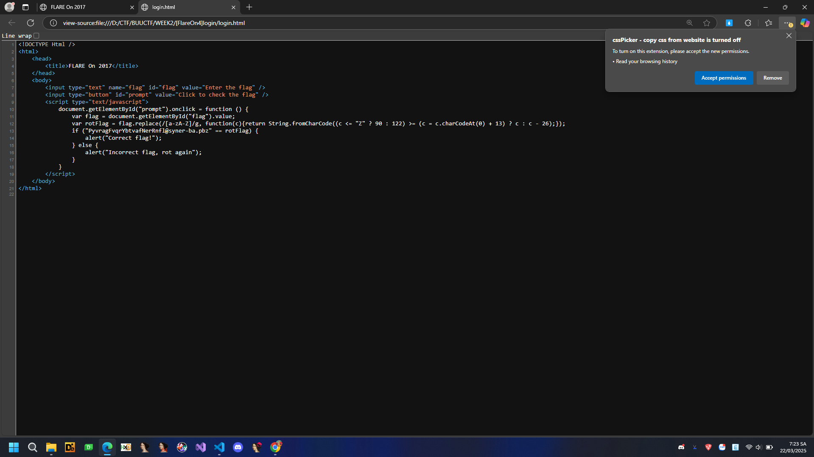
view source thấy ngay đây là ROT-13 decode và nhận được flag
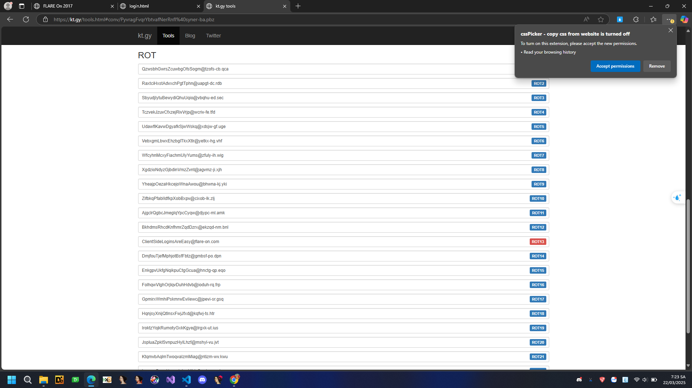


Thu được flag
<details>
<summary>Flag</summary>
flag{ClientSideLoginsAreEasy@flare-on.com}
</details> 

## B21 rsa

Mã hóa RSA viết code giải mã.
```Python
from Crypto.PublicKey import RSA
from Crypto.Util.number import *


f = open('pub.key','r')
key = RSA.importKey(f.read())
n = key.n
e = key.e

print(f'{n=}\n{e=}')


p = 285960468890451637935629440372639283459
q = 304008741604601924494328155975272418463
n = p*q
phi = (p-1)*(q-1)
e = 65537
d = inverse(e, phi)

with open('flag.enc', 'rb') as f:
    s = f.read()
    c = bytes_to_long(s)

print(long_to_bytes(pow(c, d, n)))
```

Thu được flag
<details>
<summary>Flag</summary>
flag{decrypt_256}
</details> 

## B22. [WUSTCTF2020]level1


Đọc sơ sơ qua source 

Nếu ở vị trí lẻ thì dịch trái i bit.
Còn nếu ở vị trí chẵn thì bằng idx nhân với.
Viết code python giải mã.

```Python
enc = [
    198,
    232,
    816,
    200,
    1536,
    300,
    6144,
    984,
    51200,
    570,
    92160,
    1200,
    565248,
    756,
    1474560,
    800,
    6291456,
    1782,
    65536000
]
for i in range(1,20):
    if i & 1 != 0:
        enc[i - 1] = enc[i - 1] >> i
    else:
        enc[i - 1] = enc[i - 1] / i
print("".join(chr(int(c)) for c in enc))
```

Thu được flag
<details>
<summary>Flag</summary>
ctf2020{d9-dE6-20c}
flag{d9-dE6-20c}
</details> 

## B23. [GUET-CTF2019]re


Thấy pack bằng UPX chúng ta unpack UPX trước và dễ dàng tìm thấy đoạn checker flag trong main.

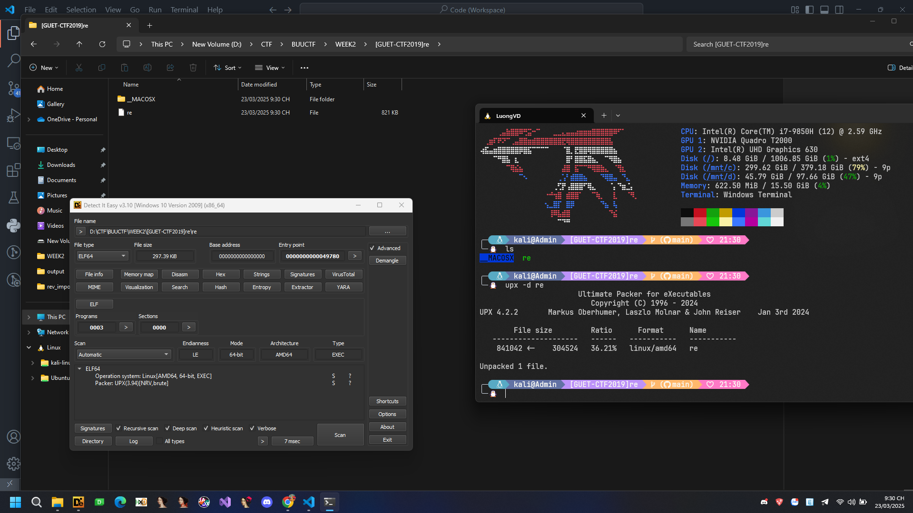

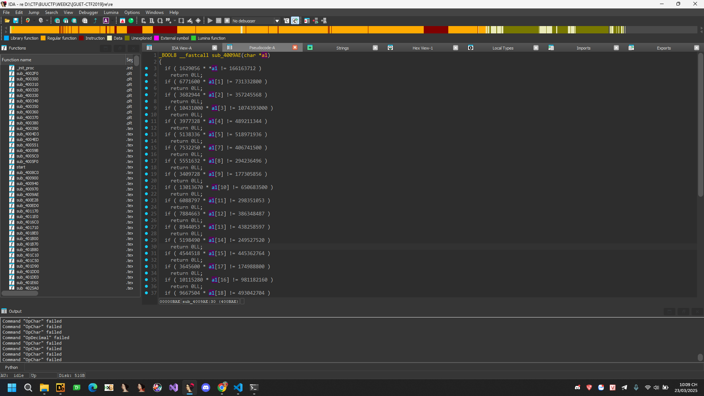

Thấy đầy đủ chỉ duy nhất thiếu có a[6]


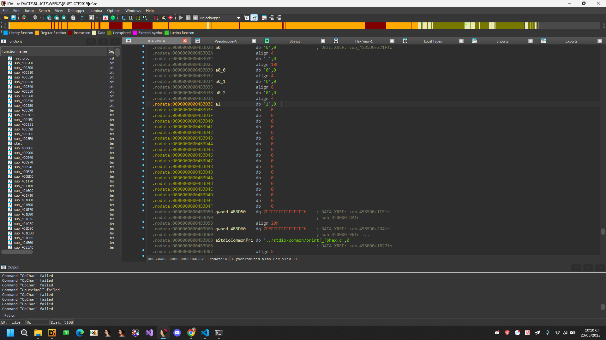 ở đây thấy 1 giá trị được khai báo trước tôi đoán có thể a[6] == 1

Viết code sử dụng module z3 để solver trước 

```Python
from z3 import *
a1 = [Int(f'a1[{i}]') for i in range(32)]
solver = Solver()
for i in range(32):
    solver.add(a1[i] >= 32, a1[i] <= 126)  
solver.add(1629056 * a1[0] == 166163712)
solver.add(6771600 * a1[1] == 731332800)
solver.add(3682944 * a1[2] == 357245568)
solver.add(10431000 * a1[3] == 1074393000)
solver.add(3977328 * a1[4] == 489211344)
solver.add(5138336 * a1[5] == 518971936)
solver.add(a1[6] == ord('1'))
solver.add(7532250 * a1[7] == 406741500)
solver.add(5551632 * a1[8] == 294236496)
solver.add(3409728 * a1[9] == 177305856)
solver.add(13013670 * a1[10] == 650683500)
solver.add(6088797 * a1[11] == 298351053)
solver.add(7884663 * a1[12] == 386348487)
solver.add(8944053 * a1[13] == 438258597)
solver.add(5198490 * a1[14] == 249527520)
solver.add(4544518 * a1[15] == 445362764)
solver.add(3645600 * a1[17] == 174988800)
solver.add(10115280 * a1[16] == 981182160)
solver.add(9667504 * a1[18] == 493042704)
solver.add(5364450 * a1[19] == 257493600)
solver.add(13464540 * a1[20] == 767478780)
solver.add(5488432 * a1[21] == 312840624)
solver.add(14479500 * a1[22] == 1404511500)
solver.add(6451830 * a1[23] == 316139670)
solver.add(6252576 * a1[24] == 619005024)
solver.add(7763364 * a1[25] == 372641472)
solver.add(7327320 * a1[26] == 373693320)
solver.add(8741520 * a1[27] == 498266640)
solver.add(8871876 * a1[28] == 452465676)
solver.add(4086720 * a1[29] == 208422720)
solver.add(9374400 * a1[30] == 515592000)
solver.add(5759124 * a1[31] == 719890500)
if solver.check() == sat:
    model = solver.model()
    result = ''.join(chr(model[a1[i]].as_long()) for i in range(32))
    print("Solution:", result)
else:
    print("No solution found")
```
Thu được flag hoặc chúng ta chỉ cần brute 1 kí tự là oke.


Thu được flag
<details>
<summary>Flag</summary>
flag{e165421110ba03099a1c039337}
</details> 

## B24. [WUSTCTF2020]level2

Unpack = UPX và nhận được flag.s

<details>
<summary>Flag</summary>
flag{Just_upx_-d}
</details> 


## B25. CrackRTF

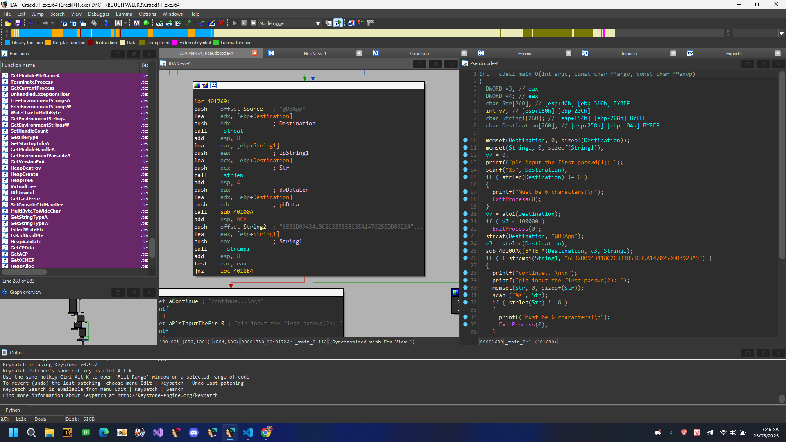

Oke oke, Nhìn sơ sơ thì chúng ta phải đi qua 2 phần nhập pass. Chúng ta sẽ tiến hành từng phần 1.


#### Phần 1


Chúng ta thấy đoạn này chương trình yêu cầu nhập vào 1 số có 6 chữ số, rồi sau đó nối chuỗi với @DBApp sau đó truyền qua hàm decrypt rồi so sánh với chuỗi 6E32D0943418C2C33385BC35A1470250DD8923A9 

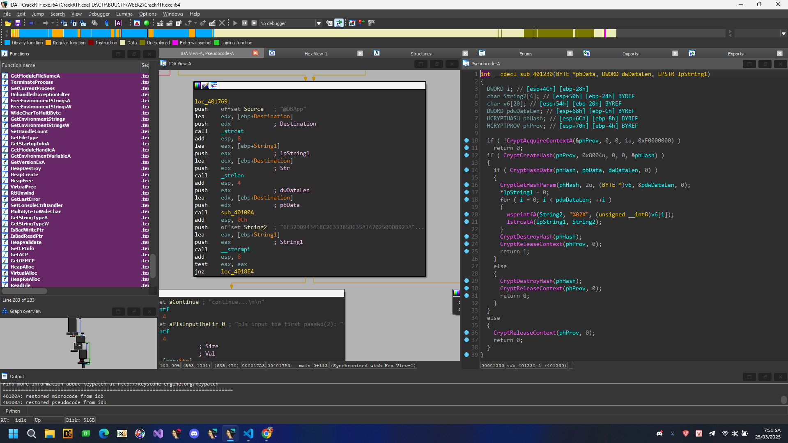


Chú ý đến CryptCreateHash là một hàm trong Windows API thuộc thư viện Cryptographic API (CryptoAPI), được sử dụng để tạo một đối tượng băm (hash object) nhằm thực hiện các thao tác băm dữ liệu bằng một thuật toán băm cụ thể.


```
BOOL CryptCreateHash(
  HCRYPTPROV   hProv,
  ALG_ID       Algid,
  HCRYPTKEY    hKey,
  DWORD        dwFlags,
  HCRYPTHASH   *phHash
);
```
Chú ý An ALG_ID value that identifies the hash algorithm to use.
Valid values for this parameter vary, depending on the CSP that is used. For a list of default algorithms, see Remarks.

```CryptCreateHash(phProv, 0x8004u, 0, 0, &phHash)```

Nhờ tham số được truyền vào hàm này mà chúng ta có thể xác định thuật toán mã hóa 

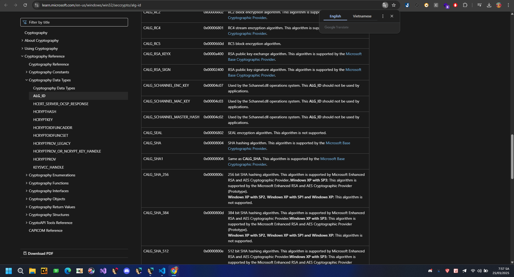

Oke clear vậy, đây là hàm mã hóa bằng SHA-1.

Vậy chúng ta đã biết bây giờ pass sẽ là 


6 số + @DBApp sau đó hash bằng SHA-1 rồi so sánh 6E32D0943418C2C33385BC35A1470250DD8923A9. Tôi sẽ tiến hành viết script để brute pass này.

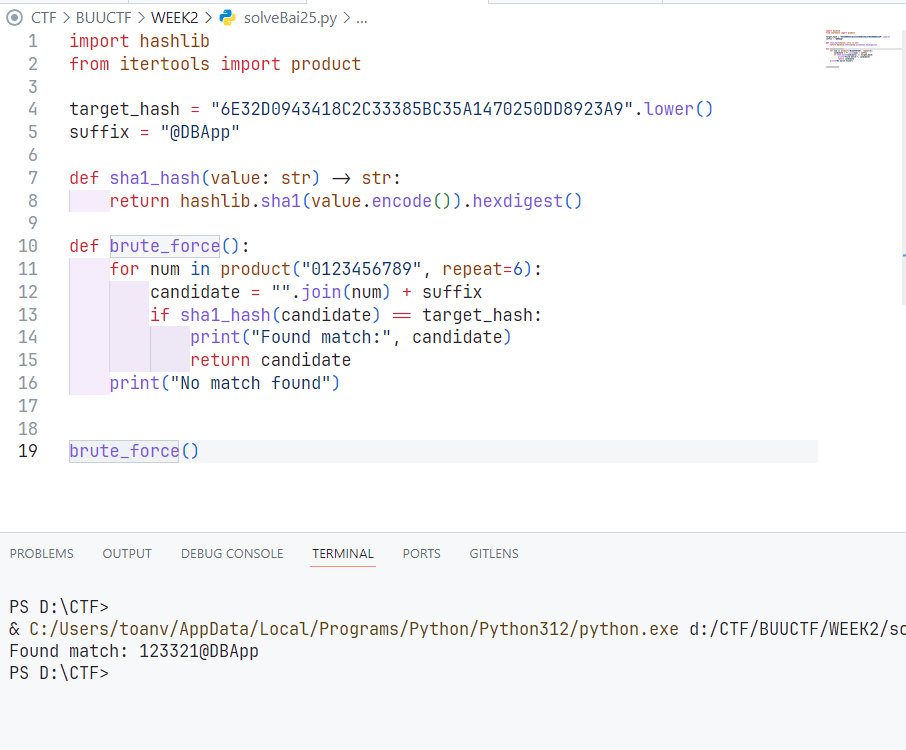

Oke vậy pass đầu tiên là 123321@DBApp input chúng ta cần nhập là 123321.

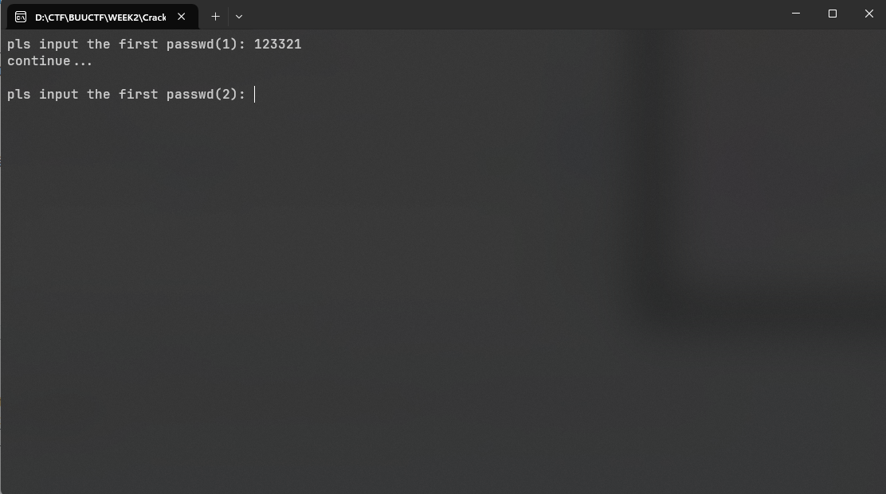


#### Phần 2

Tương tự đến phần nhập pass thứ hai xem thử thuật toán mã hóa bên trong là gì 

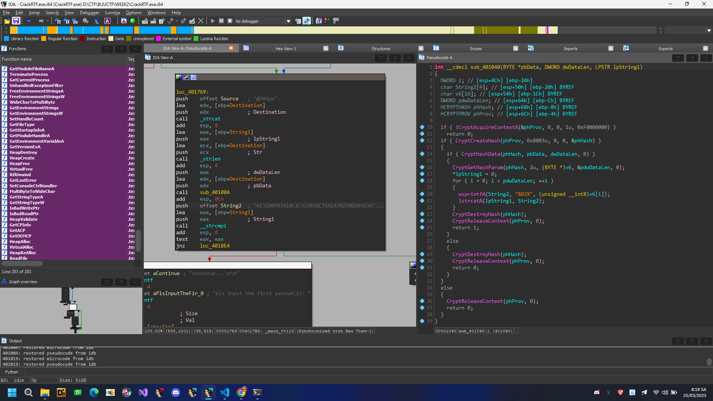

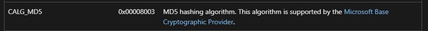

Nhập 6 kí tự sau rồi lại cat với pass đầu tiên, quá khó để brute khả năng phải nghĩ hướng khác r.

#### Phần 3

Xem trong hàm sub_40100F

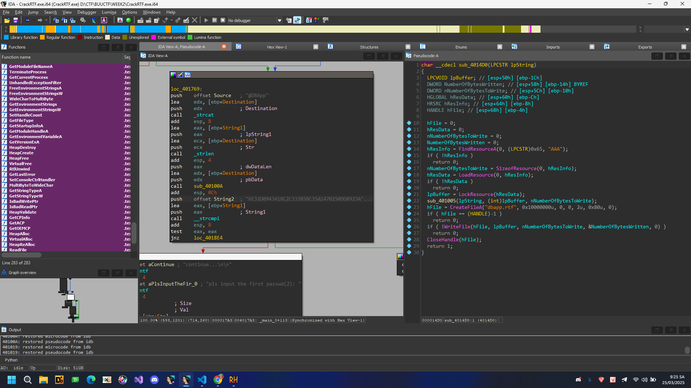

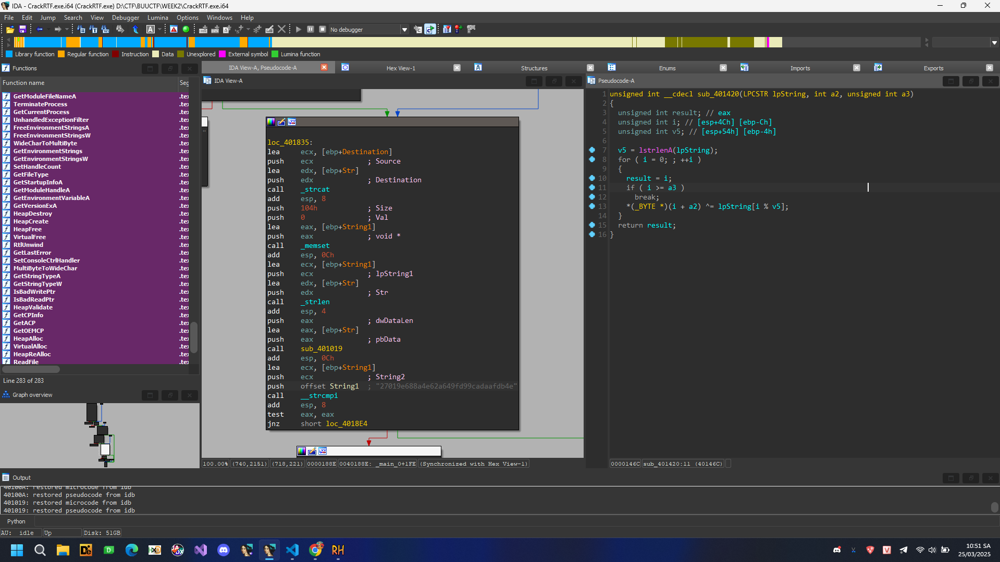

Oke như vậy là nó sẽ đọc file trong resource AAA kia rồi giải mã tạo thành file rtf. 

```
LPCVOID lpBuffer; // Con trỏ trỏ đến dữ liệu tài nguyên sau khi được khóa.
DWORD NumberOfBytesWritten; // Biến lưu số byte đã ghi vào tệp.
DWORD nNumberOfBytesToWrite; // Biến lưu kích thước của tài nguyên.
HGLOBAL hResData; // Biến lưu handle của tài nguyên đã tải.
HRSRC hResInfo; // Biến lưu handle của thông tin tài nguyên.
HANDLE hFile; // Handle của tệp sẽ được ghi.
```

Sử dụng resource hacker để export.


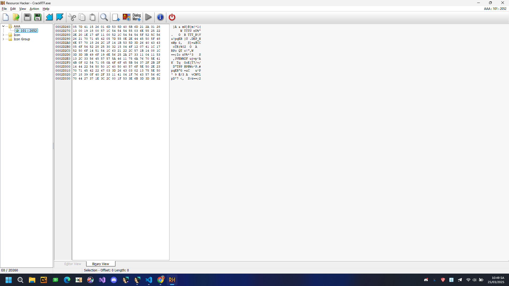


Mớ này sẽ được xor với key hoàn chỉnh tức là 6 kí tự + 123321@DBApp để tạo thành file rtf. Giờ chúng ta sẽ thử đi tìm header của file này là xong thôi :> .

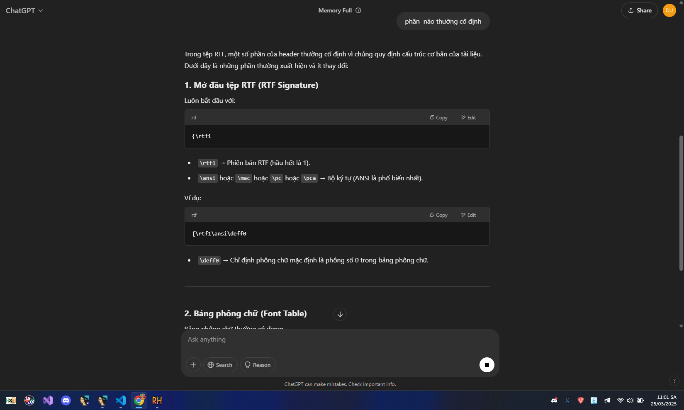

Ngon luôn, như vậy chúng ta chỉ cần xor 6 bytes đầu tiên với {\rtf1 là sẽ ra đoạn pass còn lại.


```Python
def xor_bytes(input_str, key_bytes):
    input_bytes = input_str.encode()  
    result = [input_bytes[i] ^ key_bytes[i] for i in range(len(input_bytes))]
    return bytes(result).decode(errors='ignore') 
input_str = "{\\rtf1"
key_bytes = [0x05, 0x7D, 0x41, 0x15, 0x26, 0x01]

output = xor_bytes(input_str, key_bytes)
print(output)  
~!3a@0
```

Vậy Input 1 sẽ là 123321, input 2 ~!3a@0
Chạy và chúng ta thu được file flag.
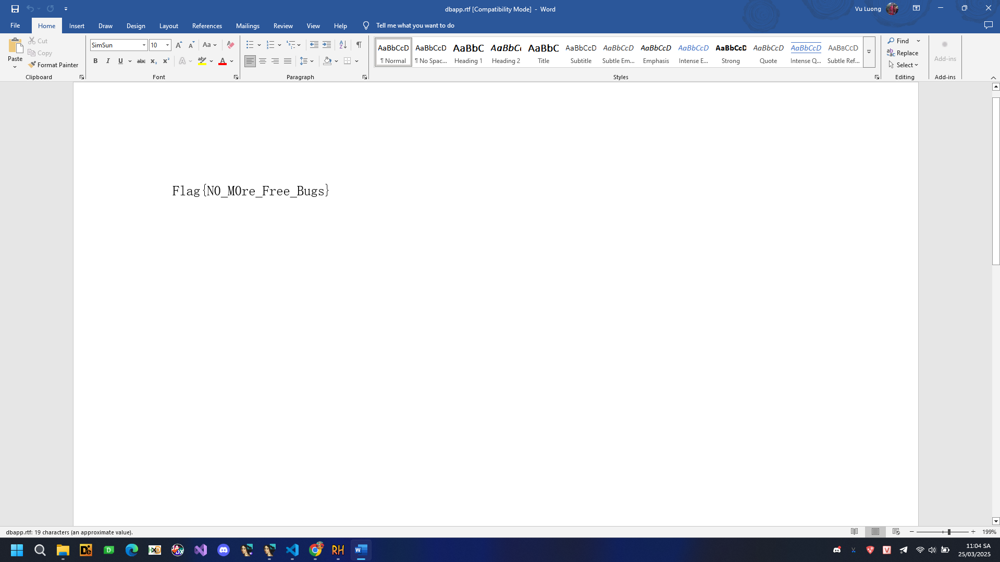
