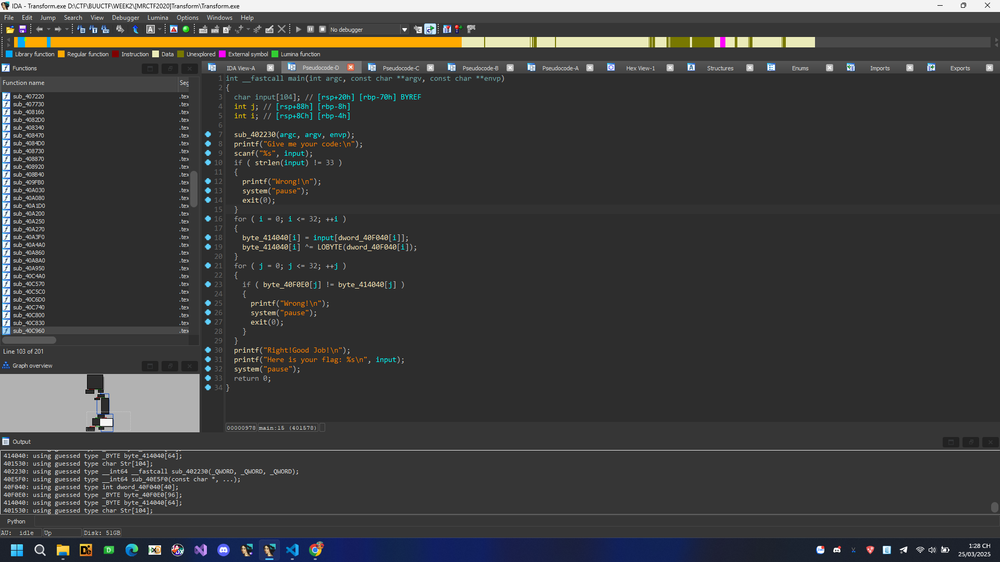
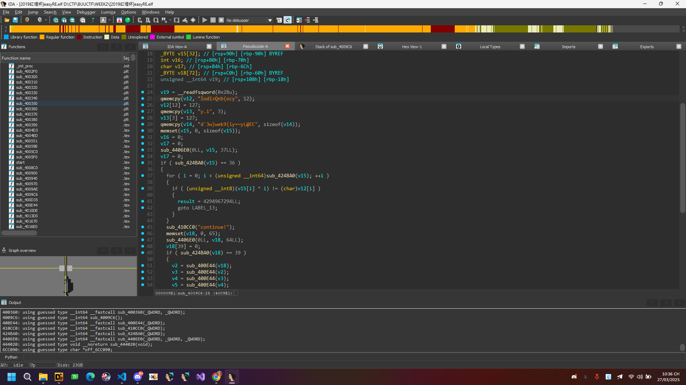
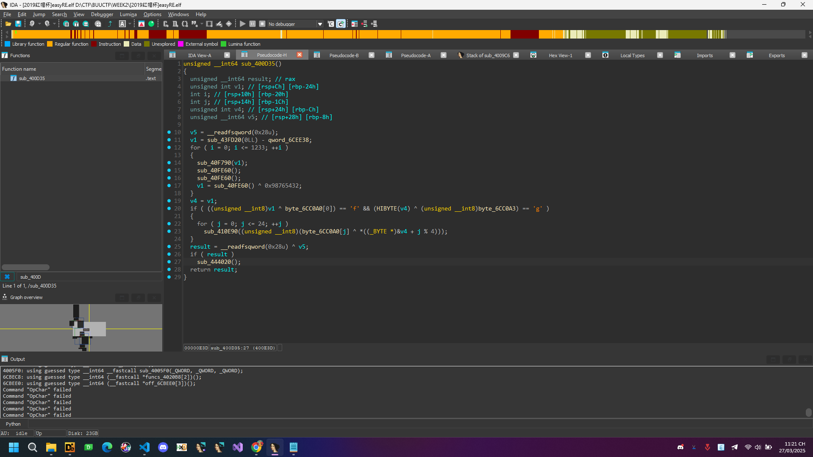
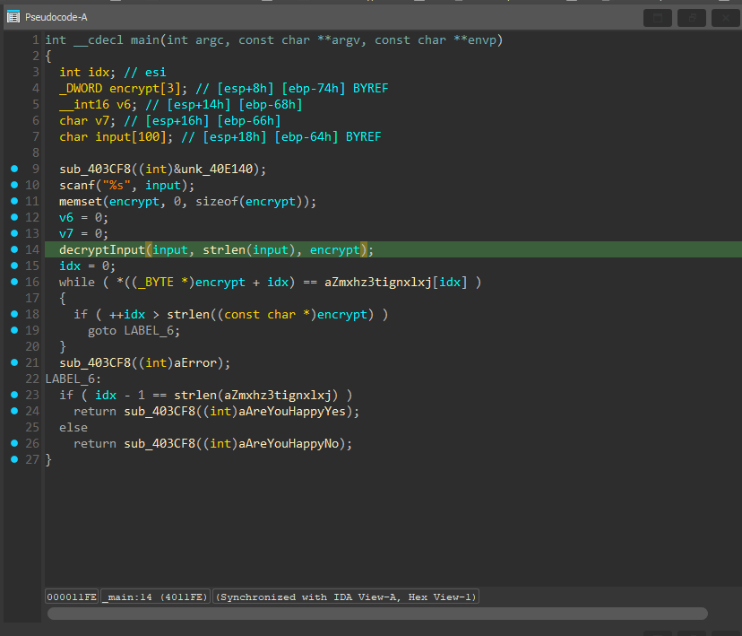
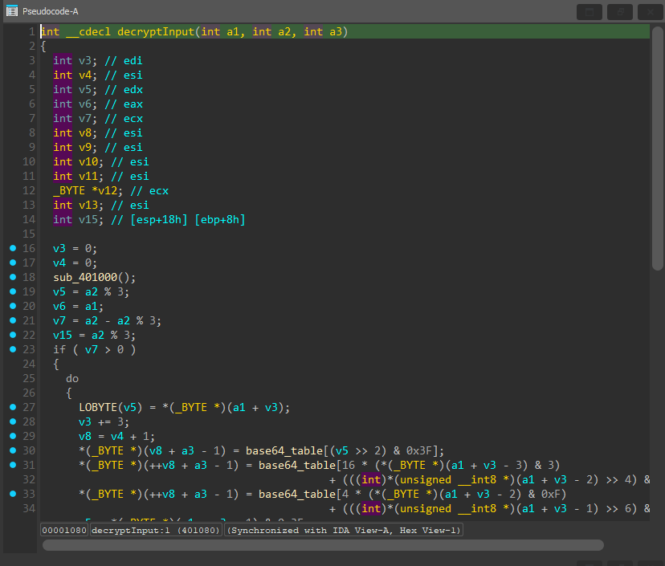
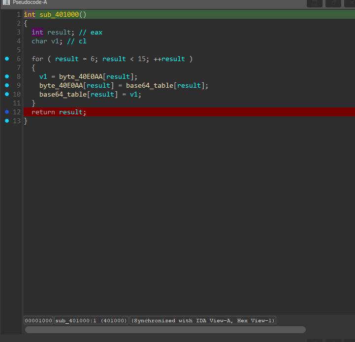
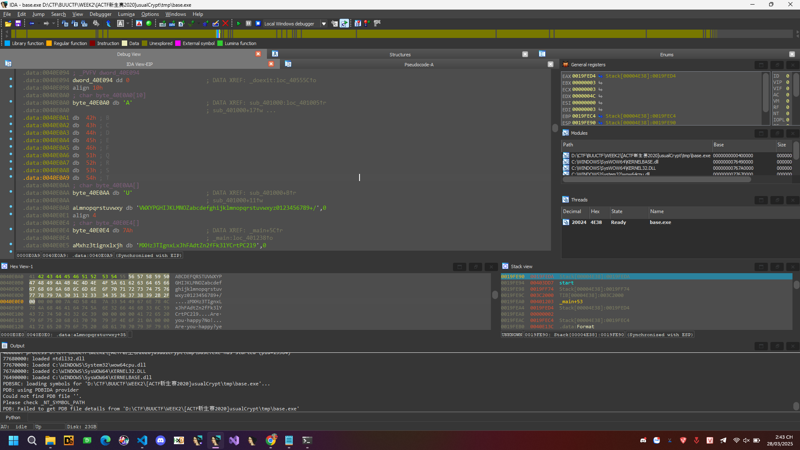
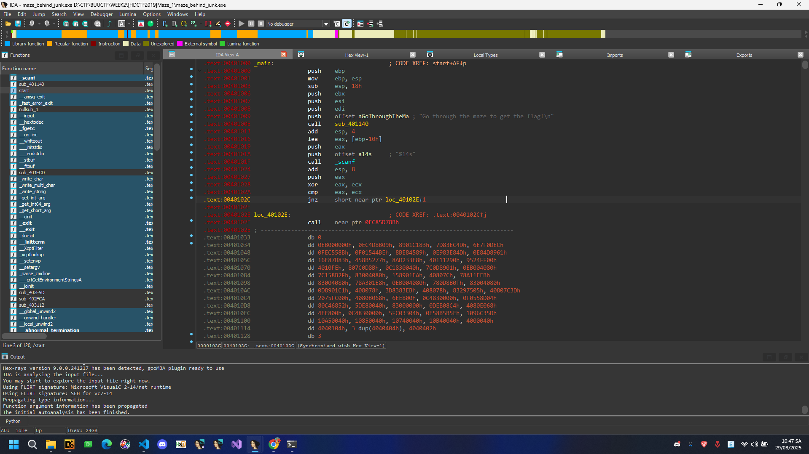
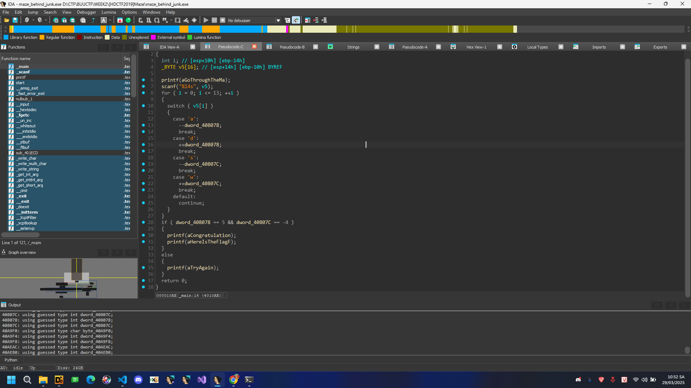
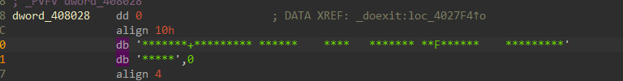

# Writeup [luongvd]

## B17. [GWCTF 2019]pyre

Thấy file pyc chúng ta sử dụng [web](https://www.lddgo.net/en/string/pyc-compile-decompile) để view source


```Python
# Visit https://www.lddgo.net/en/string/pyc-compile-decompile for more information
# Version : Python 2.7

print 'Welcome to Re World!'
print 'Your input1 is your flag~'
l = len(input1)
for i in range(l):
    num = ((input1[i] + i) % 128 + 128) % 128
    code += num

for i in range(l - 1):
    code[i] = code[i] ^ code[i + 1]

print code
code = [
    '\x1f',
    '\x12',
    '\x1d',
    '(',
    '0',
    '4',
    '\x01',
    '\x06',
    '\x14',
    '4',
    ',',
    '\x1b',
    'U',
    '?',
    'o',
    '6',
    '*',
    ':',
    '\x01',
    'D',
    ';',
    '%',
    '\x13']

```
Tiến hành viết code giải mã 
```Python
code = [
    '\x1f',
    '\x12',
    '\x1d',
    '(',
    '0',
    '4',
    '\x01',
    '\x06',
    '\x14',
    '4',
    ',',
    '\x1b',
    'U',
    '?',
    'o',
    '6',
    '*',
    ':',
    '\x01',
    'D',
    ';',
    '%',
    '\x13']
for i in range(len(code)):
    code[i] = ord(code[i])
for i in range(len(code) - 2, - 1, - 1):
    code[i] ^= code[i + 1]
for i in range(len(code)):
    code[i] = (code[i] - i) % 128
print("".join(chr(c) for c in code))
```
<details>
<summary>Flag</summary>
flag{Just_Re_1s_Ha66y!}
</details> 


## B18. findit

Nhận được file apk mở bằng jadx, chúng ta nhận được thông tin đổi tý tên biến để clear hơn


Oke quá rõ rồi, nhìn dạng này tôi đoán có thể là dạng ROT gì đó hhh trông khá quen guessing. Thử viết code python hoặc guessing 1 chút.


```Python
FLAG_DECRYPT = ['p', 'v', 'k', 'q', '{', 'm', '1', '6', '4', '6', '7', '5', '2', '6', '2', '0', '3', '3', 'l', '4', 'm', '4', '9', 'l', 'n', 'p', '7', 'p', '9', 'm', 'n', 'k', '2', '8', 'k', '7', '5', '}']
print(len(FLAG_DECRYPT))
FLAG = [''] * 38
for i in range(len(FLAG_DECRYPT)):
    if((FLAG_DECRYPT[i] >= 'A' and FLAG_DECRYPT[i] <= 'Z') or (FLAG_DECRYPT[i] >= 'a' and FLAG_DECRYPT[i] <= 'z')):
        FLAG[i] = chr(ord(FLAG_DECRYPT[i]) + 16)
        if((FLAG[i] > 'Z' and FLAG[i] < 'a' ) or FLAG[i] >= 'z'):
            FLAG[i] = chr(ord(FLAG[i]) - 26)
    else:
        FLAG[i] = FLAG_DECRYPT[i] 
print("".join(c for c in FLAG))
```

<details>
<summary>Flag</summary>
flag{c164675262033b4c49bdf7f9cda28a75}
</details> 

## B19. [ACTF新生赛2020]rome


Oke có file view vào IDA ý tưởng của tôi khi nhìn cái này là form flag là ACTF{} nó check như thế trước rồi check đến 16 kí tự bên trong ta lại biết enc của 16 kí tự đó là v12. Tiến hành viết code python giải mã

```Python
import string

v12 = "Qsw3sj_lz4_Ujw@l"
v12 = [ord(x) for x in v12]  

listStr = string.ascii_letters  
listStr = [ord(c) for c in listStr]

print(len(v12))

for i in range(len(v12)):
    oke = 0
    for j in listStr:
        if j >= 97:
            if(v12[i] == (j - 79)%26 + 97):
                oke = 1
                print(chr(j),end="")
                break
        elif j >= 65:
            if(v12[i] == (j - 51)%26 + 65):
                oke = 1
                print(chr(j),end="")
                break
    if oke == 0:
        print(chr(v12[i]),end="")
```
Thu được flag
<details>
<summary>Flag</summary>
flag{Cae3ar_th4_Gre@t}
</details> 

## B20. [FlareOn4]login


view source thấy ngay đây là ROT-13 decode và nhận được flag


Thu được flag
<details>
<summary>Flag</summary>
flag{ClientSideLoginsAreEasy@flare-on.com}
</details> 

## B21 rsa

Mã hóa RSA viết code giải mã.
```Python
from Crypto.PublicKey import RSA
from Crypto.Util.number import *


f = open('pub.key','r')
key = RSA.importKey(f.read())
n = key.n
e = key.e

print(f'{n=}\n{e=}')


p = 285960468890451637935629440372639283459
q = 304008741604601924494328155975272418463
n = p*q
phi = (p-1)*(q-1)
e = 65537
d = inverse(e, phi)

with open('flag.enc', 'rb') as f:
    s = f.read()
    c = bytes_to_long(s)

print(long_to_bytes(pow(c, d, n)))
```

Thu được flag
<details>
<summary>Flag</summary>
flag{decrypt_256}
</details> 

## B22. [WUSTCTF2020]level1


Đọc sơ sơ qua source 

Nếu ở vị trí lẻ thì dịch trái i bit.
Còn nếu ở vị trí chẵn thì bằng idx nhân với.
Viết code python giải mã.

```Python
enc = [
    198,
    232,
    816,
    200,
    1536,
    300,
    6144,
    984,
    51200,
    570,
    92160,
    1200,
    565248,
    756,
    1474560,
    800,
    6291456,
    1782,
    65536000
]
for i in range(1,20):
    if i & 1 != 0:
        enc[i - 1] = enc[i - 1] >> i
    else:
        enc[i - 1] = enc[i - 1] / i
print("".join(chr(int(c)) for c in enc))
```

Thu được flag
<details>
<summary>Flag</summary>
ctf2020{d9-dE6-20c}
flag{d9-dE6-20c}
</details> 

## B23. [GUET-CTF2019]re


Thấy pack bằng UPX chúng ta unpack UPX trước và dễ dàng tìm thấy đoạn checker flag trong main.


Thấy đầy đủ chỉ duy nhất thiếu có a[6]


 ở đây thấy 1 giá trị được khai báo trước tôi đoán có thể a[6] == 1

Viết code sử dụng module z3 để solver trước 

```Python
from z3 import *
a1 = [Int(f'a1[{i}]') for i in range(32)]
solver = Solver()
for i in range(32):
    solver.add(a1[i] >= 32, a1[i] <= 126)  
solver.add(1629056 * a1[0] == 166163712)
solver.add(6771600 * a1[1] == 731332800)
solver.add(3682944 * a1[2] == 357245568)
solver.add(10431000 * a1[3] == 1074393000)
solver.add(3977328 * a1[4] == 489211344)
solver.add(5138336 * a1[5] == 518971936)
solver.add(a1[6] == ord('1'))
solver.add(7532250 * a1[7] == 406741500)
solver.add(5551632 * a1[8] == 294236496)
solver.add(3409728 * a1[9] == 177305856)
solver.add(13013670 * a1[10] == 650683500)
solver.add(6088797 * a1[11] == 298351053)
solver.add(7884663 * a1[12] == 386348487)
solver.add(8944053 * a1[13] == 438258597)
solver.add(5198490 * a1[14] == 249527520)
solver.add(4544518 * a1[15] == 445362764)
solver.add(3645600 * a1[17] == 174988800)
solver.add(10115280 * a1[16] == 981182160)
solver.add(9667504 * a1[18] == 493042704)
solver.add(5364450 * a1[19] == 257493600)
solver.add(13464540 * a1[20] == 767478780)
solver.add(5488432 * a1[21] == 312840624)
solver.add(14479500 * a1[22] == 1404511500)
solver.add(6451830 * a1[23] == 316139670)
solver.add(6252576 * a1[24] == 619005024)
solver.add(7763364 * a1[25] == 372641472)
solver.add(7327320 * a1[26] == 373693320)
solver.add(8741520 * a1[27] == 498266640)
solver.add(8871876 * a1[28] == 452465676)
solver.add(4086720 * a1[29] == 208422720)
solver.add(9374400 * a1[30] == 515592000)
solver.add(5759124 * a1[31] == 719890500)
if solver.check() == sat:
    model = solver.model()
    result = ''.join(chr(model[a1[i]].as_long()) for i in range(32))
    print("Solution:", result)
else:
    print("No solution found")
```
Thu được flag hoặc chúng ta chỉ cần brute 1 kí tự là oke.


Thu được flag
<details>
<summary>Flag</summary>
flag{e165421110ba03099a1c039337}
</details> 

## B24. [WUSTCTF2020]level2

Unpack = UPX và nhận được flag.s

<details>
<summary>Flag</summary>
flag{Just_upx_-d}
</details> 


## B25. CrackRTF


Oke oke, Nhìn sơ sơ thì chúng ta phải đi qua 2 phần nhập pass. Chúng ta sẽ tiến hành từng phần 1.


#### Phần 1


Chúng ta thấy đoạn này chương trình yêu cầu nhập vào 1 số có 6 chữ số, rồi sau đó nối chuỗi với @DBApp sau đó truyền qua hàm decrypt rồi so sánh với chuỗi 6E32D0943418C2C33385BC35A1470250DD8923A9 


Chú ý đến CryptCreateHash là một hàm trong Windows API thuộc thư viện Cryptographic API (CryptoAPI), được sử dụng để tạo một đối tượng băm (hash object) nhằm thực hiện các thao tác băm dữ liệu bằng một thuật toán băm cụ thể.


```
BOOL CryptCreateHash(
  HCRYPTPROV   hProv,
  ALG_ID       Algid,
  HCRYPTKEY    hKey,
  DWORD        dwFlags,
  HCRYPTHASH   *phHash
);
```
Chú ý An ALG_ID value that identifies the hash algorithm to use.
Valid values for this parameter vary, depending on the CSP that is used. For a list of default algorithms, see Remarks.

```CryptCreateHash(phProv, 0x8004u, 0, 0, &phHash)```

Nhờ tham số được truyền vào hàm này mà chúng ta có thể xác định thuật toán mã hóa 


Oke clear vậy, đây là hàm mã hóa bằng SHA-1.

Vậy chúng ta đã biết bây giờ pass sẽ là 


6 số + @DBApp sau đó hash bằng SHA-1 rồi so sánh 6E32D0943418C2C33385BC35A1470250DD8923A9. Tôi sẽ tiến hành viết script để brute pass này.


Oke vậy pass đầu tiên là 123321@DBApp input chúng ta cần nhập là 123321.


#### Phần 2

Tương tự đến phần nhập pass thứ hai xem thử thuật toán mã hóa bên trong là gì 


Nhập 6 kí tự sau rồi lại cat với pass đầu tiên, quá khó để brute khả năng phải nghĩ hướng khác r.

#### Phần 3

Xem trong hàm sub_40100F


Oke như vậy là nó sẽ đọc file trong resource AAA kia rồi giải mã tạo thành file rtf. 

```
LPCVOID lpBuffer; // Con trỏ trỏ đến dữ liệu tài nguyên sau khi được khóa.
DWORD NumberOfBytesWritten; // Biến lưu số byte đã ghi vào tệp.
DWORD nNumberOfBytesToWrite; // Biến lưu kích thước của tài nguyên.
HGLOBAL hResData; // Biến lưu handle của tài nguyên đã tải.
HRSRC hResInfo; // Biến lưu handle của thông tin tài nguyên.
HANDLE hFile; // Handle của tệp sẽ được ghi.
```

Sử dụng resource hacker để export.


Mớ này sẽ được xor với key hoàn chỉnh tức là 6 kí tự + 123321@DBApp để tạo thành file rtf. Giờ chúng ta sẽ thử đi tìm header của file này là xong thôi :> .


Ngon luôn, như vậy chúng ta chỉ cần xor 6 bytes đầu tiên với {\rtf1 là sẽ ra đoạn pass còn lại.


```Python
def xor_bytes(input_str, key_bytes):
    input_bytes = input_str.encode()  
    result = [input_bytes[i] ^ key_bytes[i] for i in range(len(input_bytes))]
    return bytes(result).decode(errors='ignore') 
input_str = "{\\rtf1"
key_bytes = [0x05, 0x7D, 0x41, 0x15, 0x26, 0x01]

output = xor_bytes(input_str, key_bytes)
print(output)  
~!3a@0
```

Vậy Input 1 sẽ là 123321, input 2 ~!3a@0
Chạy và chúng ta thu được file flag.


## B26.[MRCTF2020]Transform




Logic khá đơn giản chúng ta tiến hành viết code python solve luôn.

```Python
byte_40F0E0 = [
  0x67, 0x79, 0x7B, 0x7F, 0x75, 0x2B, 0x3C, 0x52, 0x53, 0x79, 
  0x57, 0x5E, 0x5D, 0x42, 0x7B, 0x2D, 0x2A, 0x66, 0x42, 0x7E, 
  0x4C, 0x57, 0x79, 0x41, 0x6B, 0x7E, 0x65, 0x3C, 0x5C, 0x45, 
  0x6F, 0x62, 0x4D
]
byte_414040 = byte_40F0E0
dword_40F040 = [
  0x09 , 0x0A , 0x0F, 
   0x17 , 0x07 , 
  0x18 , 0x0C , 0x06, 
   0x01 , 0x10 , 
  0x03 , 0x11 , 0x20, 
   0x1D , 0x0B , 
  0x1E , 0x1B , 0x16, 
   0x04 , 0x0D , 
  0x13 , 0x14 , 0x15, 
   0x02 , 0x19 , 
  0x05 , 0x1F , 0x08, 
   0x12 , 0x1A , 
  0x1C , 0x0E, 0x00
]
input = [0] * 34
for i in range(len(byte_40F0E0)):
    byte_40F0E0[i] ^= dword_40F040[i] % 0xFF
    input[int(dword_40F040[i])] = byte_40F0E0[i]
print("".join(chr(x) for x in input))
```
<details>
<summary>Flag</summary>
MRCTF{Tr4nsp0sltiON_Clph3r_1s_3z}
flag{Tr4nsp0sltiON_Clph3r_1s_3z}
</details> 


## B27. [2019红帽杯]easyRE



Bản chất v12,v13,v14 chỉ là một mảng, v15 của chúng ta là 36 kí tự sau đó nó lấy từng kí tự một xor với index của chính nó.

Chúng ta thử giải mã thử xem có gì khả quan không.
```Python
v12 = "Iodl>Qnb(ocy\x7Fy.i\x7Fd`3w}wek9{iy=~yL@EC"
v12 = list(v12)
for i in range(len(v12)):
    print(chr(ord(v12[i]) ^ i),end="")
#Info:The first four chars are `flag`
```

Có 1 đoạn base64 nhưng chỉ là lừa, khả năng có thể có hàm ẩn nào bên trong gọi ẩn dữ liệu mà không được gọi.



Sau một hồi đọc wu, :( mò mẫn các thứ thì cuối cùng chúng ta tìm thấy hàm này.
Thấy nó xor với các mảng 4 kí tự kia, mà chúng ta lại biết 4 kí tự đầu tiên là flag có thể dễ dàng tìm lại key xor. 

Export data ra rồi xor thử.

```Python
v12 = "Iodl>Qnb(ocy\x7Fy.i\x7Fd`3w}wek9{iy=~yL@EC"
v12 = list(v12)
for i in range(len(v12)):
    print(chr(ord(v12[i]) ^ i),end="")
print(end="\n")
byte_6CC0A0_byte_6CC0A3 = [
  0x40, 0x35, 0x20, 0x56, 0x5D, 0x18, 0x22, 0x45, 0x17, 0x2F, 
  0x24, 0x6E, 0x62, 0x3C, 0x27, 0x54, 0x48, 0x6C, 0x24, 0x6E, 
  0x72, 0x3C, 0x32, 0x45, 0x5B
]
key = [0] * 4
know = "flag"
know = list(know)
for i in range(0,4):
    key[i] = ord(know[i]) ^ byte_6CC0A0_byte_6CC0A3[i]
for i in range(0,len(byte_6CC0A0_byte_6CC0A3)):
    print(chr(byte_6CC0A0_byte_6CC0A3[i] ^ key[i % 4]),end="")
```

<details>
<summary>Flag</summary>
flag{Act1ve_Defen5e_Test}
</details> 

## B28. [MRCTF2020]Xor

Quá dễ chỉ là xor, sau khi giải quá nhiều bài thì bài này thật đơn giản.

```Python
flag_enc = [
  0x4D, 0x53, 0x41, 0x57, 0x42, 0x7E, 0x46, 0x58, 0x5A, 0x3A, 
  0x4A, 0x3A, 0x60, 0x74, 0x51, 0x4A, 0x22, 0x4E, 0x40, 0x20, 
  0x62, 0x70, 0x64, 0x64, 0x7D, 0x38, 0x67, 0x00
]   
for i in range(len(flag_enc)):
    print(chr(flag_enc[i] ^ i),end="")
```

<details>
<summary>Flag</summary>
MRCTF{@_R3@1ly_E2_R3verse!}
flag{@_R3@1ly_E2_R3verse!}
</details> 

## B29. [ACTF新生赛2020]usualCrypt



Thả vào IDA chúng sau 1 lúc đổi tên biến chúng ta đã có cái nhìn cơ bản về chương trình này.

Đơn giản là input của chúng ta được decryt và sau đó check từng kí tự một có giống aZmxhz3tignxlxj.



Chúng ta thấy các hàm đi qua là sub_401000, 1 đoạn trông giống mã hóa base64, và cuối cùng,sub_401030.


Hàm sub_401030 trả về kết quả lúc compare ở hàm main, cái này thực hiện việc đổi chữ cái từ a-z nếu đang là chữ hoa thì thành chữ thường và ngược lại. 


Vậy lúc này chuỗi enc của chúng ta là aZmxhz3tignxlxj = "zMXHz3TIgnxLxJhFAdtZn2fFk3lYCrtPC2l9" thật chất đúng phải là "ZmxhZ3tiGNXlXjHfaDTzN2FfK3LycRTpc2L9" đoạn này thử decode base64 thử thì chỉ ra được flag{

Khả năng đã có sử biến đổi cái base64 table kia đây là kiểu base64 custom.




Đúng vậy, tôi xem đoạn này không hiểu lắm thôi debug lấy xem giá trị cho lành.

Thu được giá trị table
```
byte_40E0A0 db 'A'                      ; DATA XREF: sub_401000:loc_401005↑r
.data:0040E0A0                                         ; sub_401000+17↑w ...
.data:0040E0A1 db  42h ; B
.data:0040E0A2 db  43h ; C
.data:0040E0A3 db  44h ; D
.data:0040E0A4 db  45h ; E
.data:0040E0A5 db  46h ; F
.data:0040E0A6 db  51h ; Q
.data:0040E0A7 db  52h ; R
.data:0040E0A8 db  53h ; S
.data:0040E0A9 db  54h ; T
.data:0040E0AA ; char byte_40E0AA[]
.data:0040E0AA byte_40E0AA db 'U'                      ; DATA XREF: sub_401000+B↑r
.data:0040E0AA                                         ; sub_401000+11↑w
.data:0040E0AB aLmnopqrstuvwxy db 'VWXYPGHIJKLMNOZabcdefghijklmnopqrstuvwxyz0123456789+/',0

ABCDEFQRSTUVWXYPGHIJKLMNOZabcdefghijklmnopqrstuvwxyz0123456789+/
```



Viết code lấy flag

```Python
import base64

# Bảng mã base64 tùy chỉnh của bạn
custom_b64 = "ABCDEFQRSTUVWXYPGHIJKLMNOZabcdefghijklmnopqrstuvwxyz0123456789+/"
standard_b64 = "ABCDEFGHIJKLMNOPQRSTUVWXYZabcdefghijklmnopqrstuvwxyz0123456789+/"

# Bản đồ hoán đổi ký tự từ bảng mã tùy chỉnh về bảng chuẩn
trans_table = str.maketrans(custom_b64, standard_b64)

# Chuỗi base64 mã hóa
encoded_str = "ZmxhZ3tiGNXlXjHfaDTzN2FfK3LycRTpc2L9"

# Chuyển đổi sang base64 chuẩn
standard_encoded = encoded_str.translate(trans_table)

# Giải mã base64
decoded_bytes = base64.b64decode(standard_encoded)
decoded_str = decoded_bytes.decode(errors="ignore")

```

<details>
<summary>Flag</summary>
flag{bAse64_h2s_a_Surprise}
</details> 

## B30.[MRCTF2020]hello_world_go
Xem trong string có flag hoặc xem đoạn compare.

<details>
<summary>Flag</summary>
flag{hello_world_gogogo}
</details> 

## B31. [HDCTF2019]Maze



Đoạn này chúng ta thấy không F5 được nhưng chúng ta thấy có 1 câu lệnh không hợp lệ 
đó là:
- jnz short near ptr loc_40102E+1 không hợp lệ vì:

- short và near ptr không thể dùng chung.

- loc_40102E+1 không phải cách viết đúng địa chỉ.

Thử nop lệnh này xong đó patched lại.


Ngon chúng ta đã view được mã giả.




Đây là 1 bài ma trận điển hình chúng ta chỉ cần thử sắp xếp lại ma trận, cũng có thể đoán là sau 14 bước thì giải mã được mê cung sau 1 hồi sắp xếp tôi được 1 ma trận như sau


```
*******+**
******* **
****    **
**   *****
** **F****
**    ****
**********
```


```
*******+**
*******0**
****0000**
**000*****
**0**F****
**0000****
**********
```

Đường đi đúng sẽ là ssaaasaassdddww


Oke nhập chương trình và thu được flag


<details>
<summary>Flag</summary>

- Go through the maze to get the flag!
- ssaaasaassdddww
- Congratulations!
- Here is the flag:flag{ssaaasaassdddw}

</details> 

## B32. [SUCTF2019]SignIn


## **📜 Phân tích từng dòng của `main`**
### **1️⃣ Khai báo biến cục bộ**
```c
  _BYTE v4[16];  // Số N (modulus trong RSA)
  _BYTE v5[16];  // Số e (exponent trong RSA)
  _BYTE v6[16];  // Giá trị flag đã mã hóa
  _BYTE v7[16];  // Giá trị hash mục tiêu
  _BYTE v8[112]; // Buffer lưu flag nhập vào
  _BYTE v9[1000];// Buffer lưu flag sau khi chuyển thành hex
  unsigned __int64 v10;
```
- `v4`: Biến chứa **số nguyên RSA modulus \( N \)**  
- `v5`: Biến chứa **exponent \( e = 65537 \)**  
- `v6`: Biến chứa **input đã mã hóa** (sẽ so sánh với giá trị chuẩn `v7`)  
- `v7`: **Giá trị hash mục tiêu** (đã mã hóa từ flag đúng)  
- `v8`: **Buffer nhập input** từ người dùng  
- `v9`: **Chuyển đổi input thành dạng hex** (bằng `sub_96A`)  

---

### **2️⃣ Lấy canary stack (chống lỗi tràn bộ đệm)**
```c
v10 = __readfsqword(0x28u);
```
- **Lấy giá trị canary của stack** (bảo vệ khỏi tấn công stack smashing).  
- **Không quan trọng trong bài toán RSA**, nhưng cần biết để tránh khai thác lỗi buffer overflow.  

---

### **3️⃣ Hiển thị và nhận flag từ người dùng**
```c
puts("[sign in]");
printf("[input your flag]: ");
__isoc99_scanf("%99s", v8);
```
- In thông báo `[sign in]`
- Yêu cầu nhập flag (`scanf("%99s", v8)` giới hạn tối đa 99 ký tự)

---

### **4️⃣ Chuyển đổi flag nhập vào thành hex**
```c
sub_96A(v8, v9);
```
Hàm `sub_96A` chuyển đổi từng ký tự của `v8` thành **chuỗi hex**.  
Ví dụ: nếu nhập `flag`, nó sẽ chuyển thành `666c6167`.  
Dữ liệu hex này sẽ được **mã hóa RSA** sau đó.

---

### **5️⃣ Gán các giá trị RSA**
```c
__gmpz_init_set_str(v7, "ad939ff59f6e70bcbfad406f2494993757eee98b91bc244184a377520d06fc35", 16LL);
__gmpz_init_set_str(v6, v9, 16LL);
__gmpz_init_set_str(v4, "103461035900816914121390101299049044413950405173712170434161686539878160984549", 10LL);
__gmpz_init_set_str(v5, "65537", 10LL);
```
- `v7`: **Chuỗi hash mục tiêu**, flag đúng sau khi mã hóa.  
- `v6`: **Dữ liệu nhập từ người dùng (dạng hex)**  
- `v4`: **Modulus \( N \) của RSA**  
- `v5`: **Số mũ công khai \( e = 65537 \)**  

---

### **6️⃣ Mã hóa input nhập vào bằng RSA**
```c
__gmpz_powm(v6, v6, v5, v4);
```
- **RSA Encryption:**  
  \[
  v6 = v6^{65537} \mod v4
  \]
- Dữ liệu nhập (`v6`) được nâng lũy thừa lên `e = 65537` rồi lấy `mod N`.

---

### **7️⃣ So sánh kết quả với giá trị chuẩn**
```c
if ( (unsigned int)__gmpz_cmp(v6, v7) )
    puts("GG!");  // Sai
else
    puts("TTTTTTTTTTql!");  // Đúng
```
- Nếu giá trị **mã hóa từ input** (`v6`) **khớp với hash mục tiêu** (`v7`) → **in ra `"TTTTTTTTTTql!"` (FLAG ĐÚNG!)**  
- Nếu không → `"GG!"` (FLAG SAI).  

---

## **🔑 Cách tìm flag**
### 🚀 **Mục tiêu**
**Tìm flag sao cho khi mã hóa bằng RSA, nó khớp với `v7`**  
\[
m^{65537} \mod N = 0xad939ff59f6e70bcbfad406f2494993757eee98b91bc244184a377520d06fc35
\]

---

### 🛠 **Giải mã RSA**
Vì ta biết:
- **Ciphertext**: `ad939ff59f6e70bcbfad406f2494993757eee98b91bc244184a377520d06fc35`
- **Modulus \( N \)**: `103461035900816914121390101299049044413950405173712170434161686539878160984549`
- **Exponent \( e = 65537 \)**

➡ Cần **tìm plaintext \( m \)** bằng cách **giải mã RSA**:
\[
m = c^d \mod N
\]
Với:
\[
d = e^{-1} \mod \varphi(N)
\]
Mà:
\[
\varphi(N) = (p-1)(q-1)
\]
Với:
\[
p = 282164587459512124844245113950593348271
\]
\[
q = 366669102002966856876605669837014229419
\]

### **💻 Code Python để giải mã**
```python
from Crypto.Util.number import inverse, long_to_bytes

# Cho trước
p = 282164587459512124844245113950593348271
q = 366669102002966856876605669837014229419
N = p * q
e = 65537
c = int("ad939ff59f6e70bcbfad406f2494993757eee98b91bc244184a377520d06fc35", 16)

# Tính φ(N)
phi = (p - 1) * (q - 1)

# Tính d (private key)
d = inverse(e, phi)

# Giải mã flag
m = pow(c, d, N)
flag = long_to_bytes(m)

print(flag.decode())
```

<details>
<summary>Flag</summary>
suctf{Pwn_@_hundred_years}
</details> 