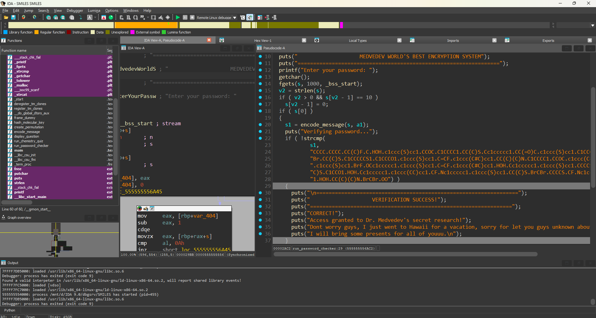
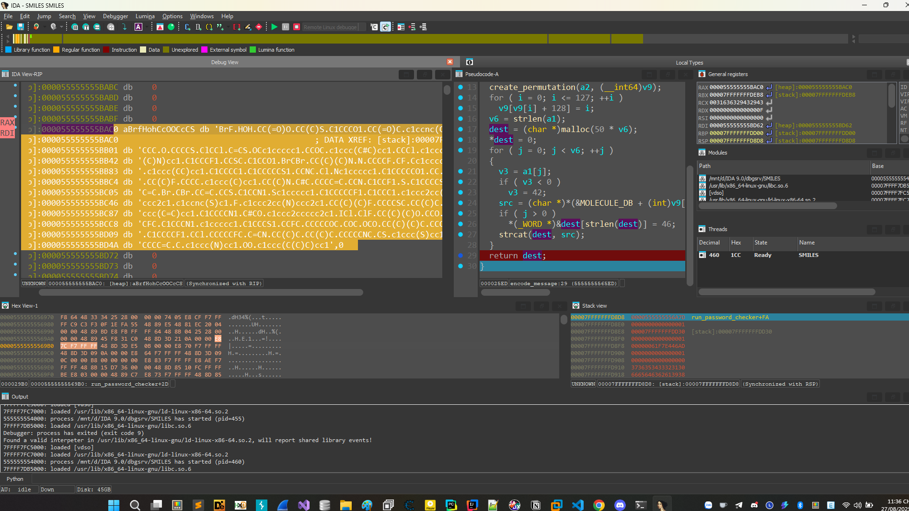

# AlcheSMILES

Chương trình được pack bằng upx tiến hành giải mã bằng câu lệnh ```upx -d SMILES``` và load vào ida để phân tích.

```
┌──(luongvd㉿LuongVD)-[/mnt/d]
└─$ ./SMILES
=================================================================
                    ARE YOU ONE OF MY STUDENTS?
=================================================================
ALL answers must be correct to verify if you are one of my students...
Enter your answer (a/b/c/d) for each question.

=================================================================
Question 1:
2H2 + O2 --> 2?

H-H   O=O --> ?

What is the product of hydrogen and oxygen reaction?

Options:
  a) H2O (HOH)
  b) H2O2 (HOOH)
  c) NH3 (NH3)
  d) CH4 (CH4)

Your answer: a
Correct!

=================================================================
Question 2:
C6H12O6 + 6O2 --> 6CO2 + 6?
glucose + oxygen --> carbon dioxide + ?

This is cellular respiration process

What is the missing product in glucose metabolism?

Options:
  a) CH4 (CH4)
  b) H2O (HOH)
  c) NH3 (NH3)
  d) C2H4 (CC)

Your answer: b
Correct!

=================================================================
Question 3:
C2H5OH + 3O2 → 2CO2 + 3H2O + energy

But if we use KMnO4 oxidation:
C2H5OH + [O] --> ? + H2O
ethanol --> ?

What is the first oxidation product of ethanol with KMnO4?

Options:
  a) HCOOH (OCO)
  b) CH3CHO (CCO)
  c) CO2 (OCO)
  d) CH3OH (CO)

Your answer: b
Correct!

=================================================================
Question 4:
C6H6 + Br2 --> C6H5Br + HBr

benzene + bromine --> ? + hydrogen bromide
This is electrophilic aromatic substitution

What is the product of benzene bromination?

Options:
  a) CH3CH2OH (CCO)
  b) C6H4Br2 (ClCCl)
  c) C6H5OH (c1ccc(O)cc1)
  d) C6H5NO2 (c1ccc(N)cc1)

Your answer: c
Correct!

=================================================================
Question 5:
CH3-CH2-NH2 + HCl --> ?

ethylamine + hydrochloric acid --> ?
This is acid-base reaction

What is the product when ethylamine reacts with HCl?

Options:
  a) CH3CH2OH (CCO)
  b) CH3CH2Cl (CCCl)
  c) CH3COOH (OCO)
  d) CH3CH2NH3Cl (CCNC)

Your answer: d
Correct!

Correct answers: 5/5
I am impressed, good job!

=================================================================
                    MEDVEDEV WORLD'S BEST ENCRYPTION SYSTEM
=================================================================
Enter your password: a
Verifying password...

=================================================================
                    VERIFICATION FAILED
=================================================================
INCORRECT!
Access denied. The molecular structure doesn't match.
Dr. Medvedev's secrets remain hidden...
```

Chương trình bắt trả lời 5 câu hỏi hóa học sau đó đến hàm check pass chính là flag checker. 




```
char *__fastcall encode_message(const char *a1, __int64 a2)
{
  char v3; // [rsp+1Fh] [rbp-431h]
  int i; // [rsp+20h] [rbp-430h]
  int j; // [rsp+24h] [rbp-42Ch]
  int v6; // [rsp+28h] [rbp-428h]
  char *dest; // [rsp+30h] [rbp-420h]
  char *src; // [rsp+38h] [rbp-418h]
  _DWORD v9[258]; // [rsp+40h] [rbp-410h] BYREF
  unsigned __int64 v10; // [rsp+448h] [rbp-8h]

  v10 = __readfsqword(0x28u);
  create_permutation(a2, (__int64)v9);
  for ( i = 0; i <= 127; ++i )
    v9[v9[i] + 128] = i;
  v6 = strlen(a1);
  dest = (char *)malloc(50 * v6);
  *dest = 0;
  for ( j = 0; j < v6; ++j )
  {
    v3 = a1[j];
    if ( v3 < 0 )
      v3 = 42;
    src = (char *)*(&MOLECULE_DB + (int)v9[(unsigned __int8)v3 + 128]);
    if ( j > 0 )
      *(_WORD *)&dest[strlen(dest)] = 46;
    strcat(dest, src);
  }
  return dest;
}

```

Tóm lại 1 kí tự sẽ được mã hóa bởi 1 công thức hóa học và nối nhau cách nhau bằng dấu . .

Tôi tiến hành debug nhập tất cả các kí tự có thể in được rồi sau đó mapping lại để giải và có được flag.

Input debug 

```Python
list_string = list("0123456789abcdefghijklmnopqrstuvwxyzABCDEFGHIJKLMNOPQRSTUVWXYZ!\"#$%&'()*+,-./:;<=>?@[\\]^_`{|}~")
```



Rồi oke, chúng ta đã biết kí tự nào tương đương với công thức nào rồi. Viết chương trình và có được flag.

```Python
MOLECULE_DB = [
"C","CC","CCC","O","CO","CCO","N","CN","CCN","S","CS","CCS","F","CF","CCF","Cl","CCl","CCCl","Br","CBr","HOH","OO","OCO",
"c1ccccc1","Cc1ccccc1","OCc1ccccc1","Nc1ccccc1","Sc1ccccc1","c1ccc(C)cc1","c1ccc(O)cc1","c1ccc(N)cc1","c1ccc(S)cc1",
"c1ccc(F)cc1","CC(C)C","CC(C)O","CC(C)N","CC(C)S","CC(C)F","CCCC","CCCCO","CCCCN","CCCCS","CCCCF","C1CC1","C1CCO1","C1CCN1","C1CCS1","C1CCF1",
"C=C","C=CO","C=CN","C=CS","C=CF","C#C","C#CO","C#CN","C#CS","C#CF","c1ccncc1","c1ccnc(C)c1","c1ccnc(O)c1","c1ccnc(N)c1","c1ccnc(S)c1",
"CC=C","CCC=C","CCCC=C","CCCCC=C","CCCCCC=C","c1cccnc1","c1ccc(C=C)cc1","c1ccc(C#C)cc1","c1ccc(CC)cc1","c1ccc(CCC)cc1",
"COC","CCOC","CCCOC","CCCCOC","CCCCCOC","CNC","CCNC","CCCNC","CCCCNC","CCCCCNC","CSC","CCSC","CCCSC","CCCCSC","CCCCCSC",
"CFC","CCFC","CCCFC","CCCCFC","CCCCCFC","ClCCl","BrCBr","ICl","ClF","BrF","c1ccc2ccccc2c1","c1ccc2cc(C)ccc2c1","c1ccc2cc(O)ccc2c1","c1ccc2cc(N)ccc2c1","c1ccc2cc(S)ccc2c1",
"CC(C)(C)C","CC(C)(C)O","CC(C)(C)N","CC(C)(C)S","CC(C)(C)F","C1CCC1","C1CCCO1","C1CCCN1","C1CCCS1","C1CCCF1","C1CCCC1","C1CCCCO1","C1CCCCN1","C1CCCCS1","C1CCCCF1",
"C1CCCCC1","C1CCCCCO1","C1CCCCCN1","C1CCCCCS1","C1CCCCCF1","c1ccc(C(C)C)cc1","c1ccc(C(C)O)cc1","c1ccc(C(C)N)cc1","CC(=O)C","CC(=O)O"
]

ENCODED = ("CCCC.CCCC.CC(C)F.C.HOH.c1ccc(S)cc1.CCOC.C1CCCC1.CC(C)S.Cc1ccccc1.CC(=O)C.c1ccc(S)cc1.C1CCCC1.c1ccc(S)cc1."
           "BrCBr.CC(C)S.C1CCCCCS1.C1CCCO1.c1ccc(S)cc1.C=CF.c1ccc(C#C)cc1.CC(C)(C)N.C1CCCC1.CCOC.c1ccc(C#C)cc1.c1ccc(CC)"
           "cc1.c1ccc(S)cc1.BrF.OCc1ccccc1.c1ccc(S)cc1.C=CF.c1ccc(C#C)cc1.HOH.Cc1ccccc1.c1ccc(S)cc1.CCCCS.c1ccc(C#C)cc1."
           "CC(C)S.C1CCO1.HOH.Cc1ccccc1.c1ccc(CC)cc1.CF.Nc1ccccc1.c1ccc(S)cc1.CC(C)S.BrCBr.CCCCS.CF.Nc1ccccc1.N.c1ccc(CC)"
           "cc1.HOH.CC(C)(C)N.BrCBr.OO")
list_string = list("0123456789abcdefghijklmnopqrstuvwxyzABCDEFGHIJKLMNOPQRSTUVWXYZ!\"#$%&'()*+,-./:;<=>?@[\\]^_`{|}~")
list_string_enc = "BrF.HOH.CC(=O)O.CC(C)S.C1CCCO1.CC(=O)C.c1ccnc(C)c1.C=CF.CSC.C#CS.CCC.O.CCCCS.ClCCl.C=CS.OCc1ccccc1.CCOC.c1ccc(C#C)cc1.CCCl.c1ccc(C(C)N)cc1.C1CCCF1.CCSC.C1CCO1.BrCBr.CC(C)(C)N.N.CCCCF.CF.Cc1ccccc1.c1ccc(CC)cc1.C1CCCC1.C1CCCCCS1.CCNC.Cl.Nc1ccccc1.C1CCCCCO1.CC.CN.CC(C)F.CCCC.c1ccc(C)cc1.CC(C)N.C#C.CCCC=C.CCN.C1CCF1.S.C1CCCCS1.C=C.Br.CBr.CC=C.CCS.C1CCN1.Sc1ccccc1.C1CCCCCF1.C1CCC1.c1ccc2cc(O)ccc2c1.c1ccnc(S)c1.F.c1ccc2cc(N)ccc2c1.CC(C)(C)F.CCCCSC.c1ccc(C=C)cc1.C1CCCCN1.C#CO.c1ccc2ccccc2c1.ICl.ClF.CC(C)(C)O.CCO.CCCFC.C1CCC N1.c1ccccc1.C1CCCS1.CCFC.CCCCCOC.COC.OCO.CC(C)(C)C.CCC=C.C1CCCCF1.CCl.CCCCCFC.C=CN.CC(C)C.CCCCCNC.CS.c1ccc(S)cc1.CCCCC=C.C.c1ccc(N)cc1.OO.c1ccc(C(C)C)cc1"
list_string_enc = list_string_enc.split(".")
ENCODED = ENCODED.split(".")
for i in range(len(ENCODED)):
    for j in range(len(list_string_enc)):
        if ENCODED[i] == list_string_enc[j]:
           print(list_string[j], end="")

# DDC{1_gu3s5_u_n3v4_7hought_0f_7h1s_ch3m1stry_3ncrypt1on}
```