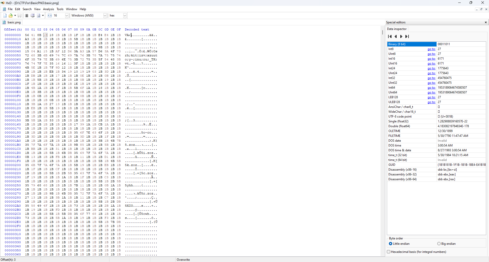
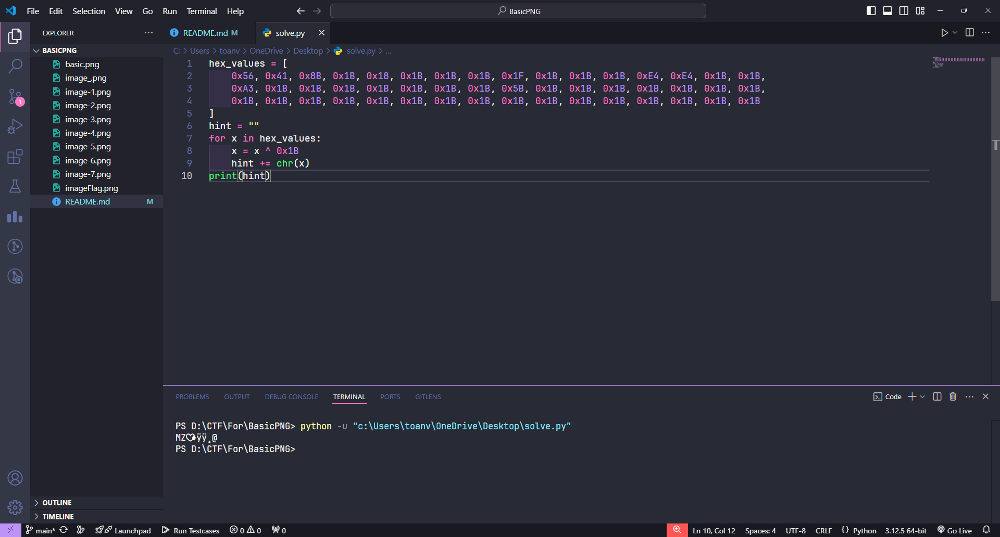
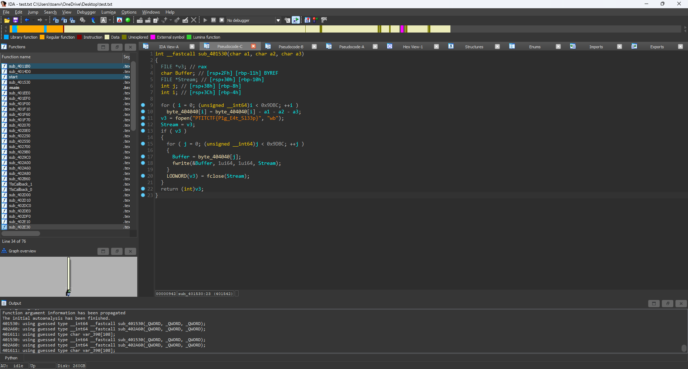

# BasicPNG

# Solution

- Sau khi mở ảnh bằng HXD,tôi không thấy có gì khả quan.

- Sau khi đọc và nhận được sự gợi ý từ các bạn, tôi đã thử cộng trừ các byte và brute, nhưng không có gì khả thi, tôi tiến hành xor byte với 0x1b và nhận được kết quả khả quan hơn

- MZ dấu hiệu khá quen thuộc của 1 file thực thi tôi tiến hành viết code lấy các byte xor 0x1b và lưu lại file
```Python
def xor_bytes(byte_array, key=0x1B):
    return bytes([byte ^ key for byte in byte_array])
def main():
    input = r"C:\Users\toanv\OneDrive\Desktop\basic.png"
    output = r"C:\Users\toanv\OneDrive\Desktop\test.txt"
    with open(input, "rb") as f:
        data = f.read()
    xor_data = xor_bytes(data)
    with open(output, "wb") as f:
        f.write(xor_data)
if __name__ == "__main__":
    main()
```
- Sau khi chạy code chúng ta sẽ nhận được file

- Yeye ngon thí, giờ sẽ đến phần dịch ngược

- Thường thì chương trình tôi sẽ vào xem mã giả, nhưng ở mã giả này chúng ta không thể hiểu chương trình đang làm gì,không có gì để phân tích cả.

- Why ? Tại sao điều gì đã xảy ra, tại sao khi view bằng cách này chúng ta lại có thể thấy được nhánh khác mà khi view bằng mã giả lại không thấy.

- Ồ vậy đây là 1 đoạn so sánh luôn đúng chương trình sẽ luôn nhảy về hàm in ra Segmentation fault, điều mà chúng ta không mong muốn.
- Sau khi nhận được lời khuyên của ```Eenosse``` tôi đã sửa jzn thành jz và view lại mã giả.
- 
- Tuyệt vậy là chúng ta đã xem được nhánh tiếp
- Phân tích luồng chương trình thì bắt chúng ta nhập v4 và v5[0] , sau khi đọc code tôi thấy v4 không liên quan gì cả, tập trung vào v5[0]
- Chúng ta vào xem hàm kia làm gì
- 
- Đơn giản thì hàm này đọc cái byte_404040 và ghi lại sau khi trừ với 3 cái kia. Dựa vào điều kiện của hàm main,ta có thể xác định v5[0] là số chẵn và chia hết cho 3. Là các bội của 6 ví dụ 6 , 12 , 18 
- Tôi tiến hành lấy một số byte ban đầu của byte_404040 và tiến hành brute, mục đích của tôi là xem chính xác, byte này sau ghi chính xác là file gì, như thế nào.
```Python
bytes_404040= [ 
89,  91,  88,  74,  75, 115, 242,  19, 242,  19, 
153, 240,  18, 108,  60,  26, 112,  65,  31, 114, 
67,  34, 116,  69,  35, 117,  71,  37, 118,  73, 
39, 120,  74,  40, 120,  75,  41, 121,  77,  44, 
122,  76,  42, 122,  79,  46, 124,  79,  46, 125]
for i in range(256):
    try:
        print(i)
        tmp = [chr(b-i) for b in bytes_404040]
        print(tmp[:10])
    except:
        print("An exception occurred")
```
Đây là code brute của tôi, sau khi chạy , ở giá trị i = 18 tôi nhận được ```['G', 'I', 'F', '8', '9', 'a', 'à', '\x01', 'à', '\x01']```
Tôi đoán đây là file GIF.
Vậy vậy vậy ```(unsigned int)(v5[0] % 10), (unsigned int)(v5[0] / 10), (unsigned int)(v5[0] / 2) = 18```. Sau khi tính toán xác định được ```v5[0] = 18```
- Tôi tiến hành debug và nhập v4 bừa , v5[0] = 18.
- Tôi nhận được file PTITCTF{P1g_E4t_Sl33p} là file gif
## Kết
- Tôi đã nhận được flag trong file gif
