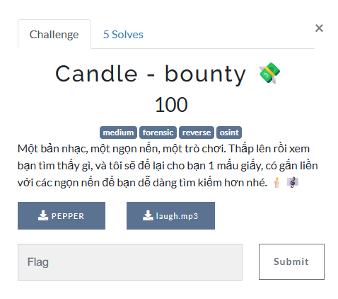
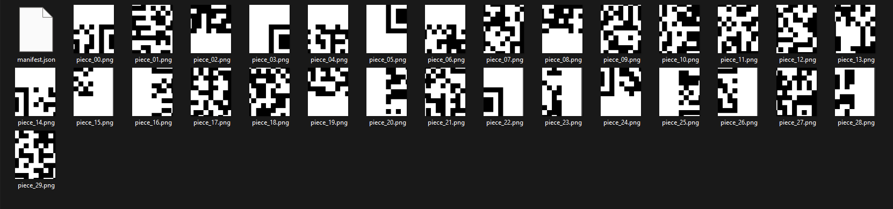

# Forensic 2 (Candle)



Khi mở phân tích thử file [PEPPER](File/PEPPER) bằng các công cụ thì không có gì khả thi lắm.

Khi chuyển qua [laugh.mp3](File/laugh.mp3) tôi thử kéo nó vào DIE.


Phát hiện bị nén là rar tiến hành đổi đuôi file thành rar và giải nén ra chúng ta sẽ thu được.



Thu được 1 mớ ảnh cùng với file manifest.json.

Việc chúng ta cần làm có lẽ là phân tích file json kia từ đó ghép lại QR rồi mới tính tiếp.


Oke vậy đã rõ, cần ghép, ghép như nào cho nhanh, đúng thứ tự.


Thử sort theo date như hình thì nhận ra có vẻ chúng khá là liền mạch với nhau.


Oke vậy là đã rõ có thể chúng được ghép như này, thử viết code python ghép lại xem thu được gì.

[File Code Python](File/solve.py)

```Python
from PIL import Image

rows, cols = 5, 6
tile_w, tile_h = 82, 98
orig_w, orig_h = 490, 490
padded_w, padded_h = 492, 490

file_order = [
    "piece_03.png", "piece_14.png", "piece_06.png", "piece_04.png", "piece_00.png", "piece_22.png",
    "piece_16.png", "piece_01.png", "piece_09.png", "piece_18.png", "piece_21.png", "piece_26.png",
    "piece_20.png", "piece_11.png", "piece_10.png", "piece_07.png", "piece_13.png", "piece_28.png",
    "piece_25.png", "piece_29.png", "piece_17.png", "piece_12.png", "piece_27.png", "piece_23.png",
    "piece_05.png", "piece_24.png", "piece_19.png", "piece_08.png", "piece_02.png", "piece_15.png"
]

canvas = Image.new("RGB", (padded_w, padded_h), "white")

for idx, fname in enumerate(file_order):
    r = idx // cols
    c = idx % cols
    img = Image.open(fname)
    x, y = c * tile_w, r * tile_h
    canvas.paste(img, (x, y))

final_qr = canvas.crop((0, 0, orig_w, orig_h))
final_qr.save("qr_reconstructed.png")

print("✅ Đã ghép QR thành công theo thứ tự file, lưu ở qr_reconstructed.png")
```

Chạy xong thu được.


Tiến hành quét thử chúng ta sẽ thu được link https://x.com/hanh588344/status/1965362524624457958


Thu được 1 đoạn mã base64 nhưng rất tiếc đó là fake flag.

Vọc tiếp trong nick này chúng ta sẽ thu được 1 link github bị mã hóa ROT13.


Tiến hành tải file exe ở github về để phân tích.


Một chương trình viết bằng C, 64 bit cho phép chúng ta cá cược như hình được thì thắng tiền, điểm chúng ta cần đến có lẽ là target để đạt được flag.

Tiến hành sử dụng Cheat Engine (64-bit) để quét giá trị thử.


Tiến hành thêm tiến trình và quét giá trị tiền đang có là 900$ sau đó chúng ta thử cược và scan tiếp giá trị để tìm đâu là cái đúng để sửa giá trị.


Thử cược thua còn 800$ tiến hành scan thì thấy giá trị thay đổi chúng ta thử sửa giá tại đó lên qua giá trị mà chúng ta cần đạt được.


Thử đổi và bet lại chúng ta đã thu được flag.