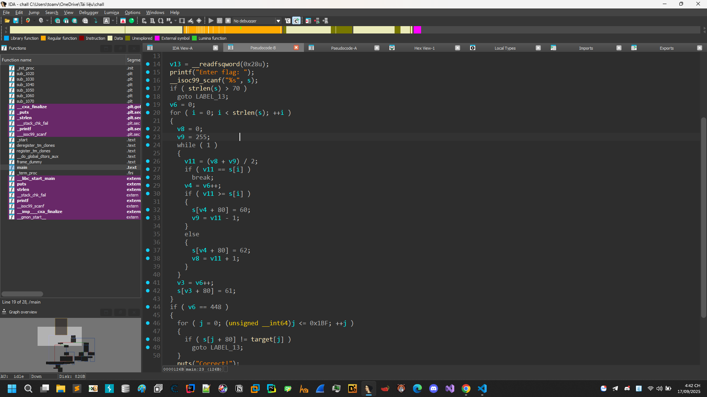

# Intro Rev



Một bài check flag đơn giản nó tiến hành việc tìm kiếm nhị phân cho input, nếu sau khi tính giá trị lớn hơn thì nó cho ra các kí hiệu < và > và =. Dấu = xuất hiện khi nó gặp được giá trị thỏa mãn.

Cũng dễ dàng nhìn thấy chiều dài flag là dưới 70 kí tự.

Oke đã rõ tiến hành viết code solve và có được flag.

```Python
target = (
    "<><<<>>=<>>=<>>><<>=<>>><><=<><<><=<><<<><=<>>>>=<<>><=<>><<<=<<>"
    ">=<>=<><>><=<<>><<<=<>>><>=<>>><<>=<>=<><><>>=<<>><=<>><=<>><=<<>"
    "><<=<>><<>=<<>><>=<>=<<>><><=<>><>>>=<>><<><=<>=<><<>><=<<>><=<>>"
    "><<>=<>><>>>=<>=<><>><=<<>><<<=<>>><>=<>>><<>=<>=<><<<>>=<>>><>=<"
    ">><>>>=<>><<><=<<>><><=<>><>>=<<>><=<>><>>>=<<>>=<<>><><=<<>><<=<"
    ">=<><><=<<>><=<>><<<=<>>><<>=<>><<=<>><><<=<>=<><<<<=<>><>><=<>><"
    "=<<>><<<=<>>><<>=<<>><<=<<>>=<>><><<=<>><>>=<<>><>=<>>>>>>="
)

def decode(seq):
    low, high = 0, 255
    for ch in seq:
        mid = (low + high) // 2
        if ch == '<':
            high = mid - 1
        elif ch == '>':
            low = mid + 1
        elif ch == '=':
            return chr(mid)
    return '?'


flag = ""
segment = ""
for ch in target:
    segment += ch
    if ch == '=':
        flag += decode(segment)
        segment = ""

print("Flag:", flag)
# FortID{3a7_Y0ur_V3gg1e5_4nd_L3rn_Y0ur_Fund4m3n741_S3arch_Alg0r17hm5}
```

# Rev From the Past


Chương trình kiểm tra đối số dòng lệnh có dạng `FortID{<33 bytes>}`. Nó:

1. Tạo một bảng hoán vị 256-byte bằng Fisher–Yates với PRNG LFSR (seed `0xB4C1`, đa thức `0xB400`),
2. Giải mã một khối **33 byte** nhúng tại `0x37E` bằng XOR với `0x64`,
3. Ánh xạ từng byte người dùng qua bảng (XLAT) và so khớp với khối vừa giải mã.

Đảo ngược quy trình (lấy **bảng nghịch**) cho ta phần ruột flag:

```
N0w_S4v3_S3t71ng5_4nd_L4unch_D00M
```

Vậy flag đầy đủ là:

```
FortID{N0w_S4v3_S3t71ng5_4nd_L4unch_D00M}
```

---

## Phân tích chi tiết

### 1) Khởi tạo & parse input (`start` → `sub_10160`)

* Thiết lập các segment rồi gọi `sub_10160`.
* `sub_10160` đọc command tail tại `PSP:80h`, bỏ khoảng trắng đầu, **so khớp đúng 7 ký tự** với chuỗi tại `0x0234`: `"FortID{"`.
* Ghi tiếp tối đa **0x21 (33)** ký tự vào `ds:0258`, dừng khi gặp `'}'`.
* Nếu **không đúng đúng 33 ký tự** rồi mới tới `'}'` → fail. Sau `'}'` chỉ cho phép space/CR/LF.
* Trả về **CF=0** nếu hợp lệ, CF=1 nếu sai.

### 2) Bảng hoán vị (S-box) cho XLAT (`sub_101E1`)

* Điểm dữ liệu:

  * `word_10254 = 0xB4C1` (seed).
  * `word_10256` là trạng thái PRNG.
* Lấp đầy `ds:0279` bằng dãy `0..255`.
* Với `cx` chạy **từ 0xFF xuống 1**:

  * Bước LFSR 16-bit:

    ```
    state = word_10256
    if (state & 1) state = (state >> 1) ^ 0xB400
    else           state = (state >> 1)
    word_10256 = state
    ```
  * Tính `r = state % (cx+1)` rồi **hoán vị** `S[cx] ↔ S[r]`.
* Đây chính là **Fisher–Yates** với nguồn ngẫu nhiên LFSR (đa thức 0xB400 – biến thể CRC-16 kiểu reflected).

### 3) Giải mã mục tiêu so khớp

* Tại `start`:

  * Lấy `AL = low(word_10254) = 0xC1`, `AL ^= 0xA5` → `0x64`.
  * Dùng `0x64` để **XOR in-place 33 byte** tại `0x037E`. Đây là “chuỗi đích” sau khi người dùng được ánh xạ qua S-box.
* Vòng so khớp:

  * `SI=0x0258` (33 byte do user nhập), `BX=0x0279` (bảng), `DI=0x037E` (đích).
  * Lặp 33 lần:

    ```
    AL = [SI++]          ; byte người dùng
    AL = S[AL] (XLAT)    ; ánh xạ qua bảng
    cmp AL, [DI++]       ; so với byte đích
    jne fail
    ```
* Nếu trùng hết → in chuỗi `"Correct!"`, nếu không → `"Nope."`. (Các chuỗi tại `0x0234` chứa `FortID{` và thông báo.)

### 4) Khôi phục flag

Muốn tìm input đúng, ta cần **bảng nghịch** `S^{-1}` để đảo XLAT:

```
user_byte[i] = S^{-1}[ target[i] ]
```

Trong đó `target[i]` là 33 byte nhúng tại `0x37E` sau khi XOR với `0x64`.

Các byte nhúng (địa chỉ `0x037E`) là:

```
2A 35 A9 11 E3 6F 17 79 11 E3 79 88 94 B2 01 FD
68 11 6F 01 B7 11 AC 6F 53 01 CE E2 11 84 35 35 51
```

XOR `0x64` → ta nhận được dãy “đích” `target`. Dùng S-box sinh từ seed `0xB4C1`, tính bảng nghịch rồi áp vào `target` cho ra:

```
N0w_S4v3_S3t71ng5_4nd_L4unch_D00M
```

Ghép khung yêu cầu của parser (7 ký tự đầu phải là `FortID{` và đúng 33 ký tự trước `}`) → **flag**:

```
FortID{N0w_S4v3_S3t71ng5_4nd_L4unch_D00M}
```

---

## PoC script (Python)

```python
# bytes mã hoá ở 0x37E
enc = [0x2A,0x35,0xA9,0x11,0xE3,0x6F,0x17,0x79,0x11,0xE3,0x79,0x88,0x94,
       0xB2,0x01,0xFD,0x68,0x11,0x6F,0x01,0xB7,0x11,0xAC,0x6F,0x53,0x01,
       0xCE,0xE2,0x11,0x84,0x35,0x35,0x51]

# 1) giải XOR
target = [b ^ 0x64 for b in enc]

# 2) xây S-box bằng Fisher–Yates + LFSR(0xB400), seed 0xB4C1
S = list(range(256))
state = 0xB4C1
for cx in range(0xFF, 0, -1):
    state = ((state >> 1) ^ 0xB400) if (state & 1) else (state >> 1)
    r = state % (cx + 1)
    S[cx], S[r] = S[r], S[cx]

# 3) bảng nghịch
inv = [0]*256
for i,v in enumerate(S):
    inv[v] = i

# 4) khôi phục input
inner = bytes(inv[t] for t in target).decode('ascii')
flag = f"FortID{{{inner}}}"
print(flag)
# FortID{N0w_S4v3_S3t71ng5_4nd_L4unch_D00M}
```

Xong! Nếu chạy file trong DOSBox, truyền đối số đúng như trên, chương trình sẽ in `"Correct!"`.
