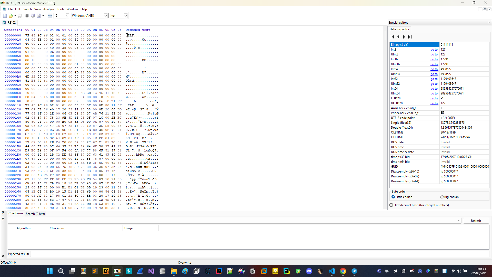
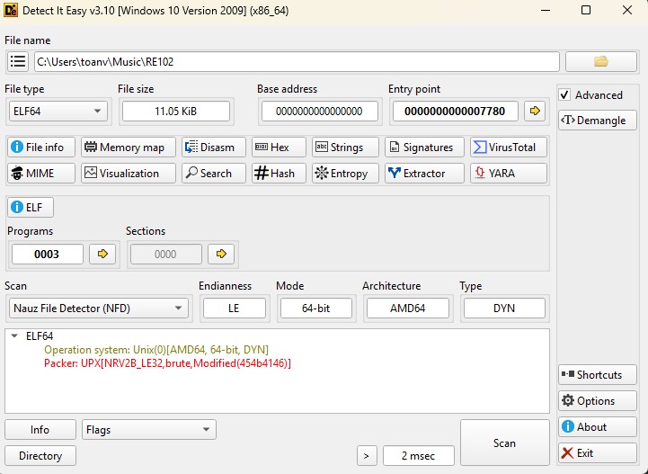
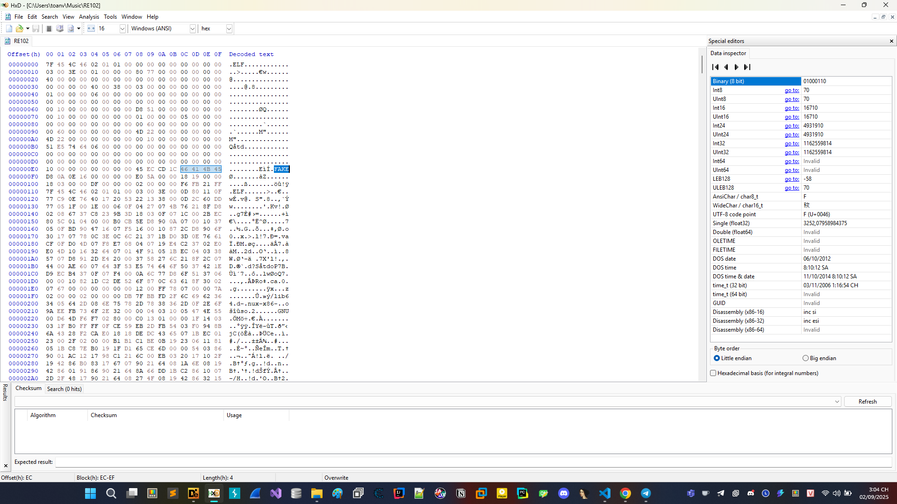
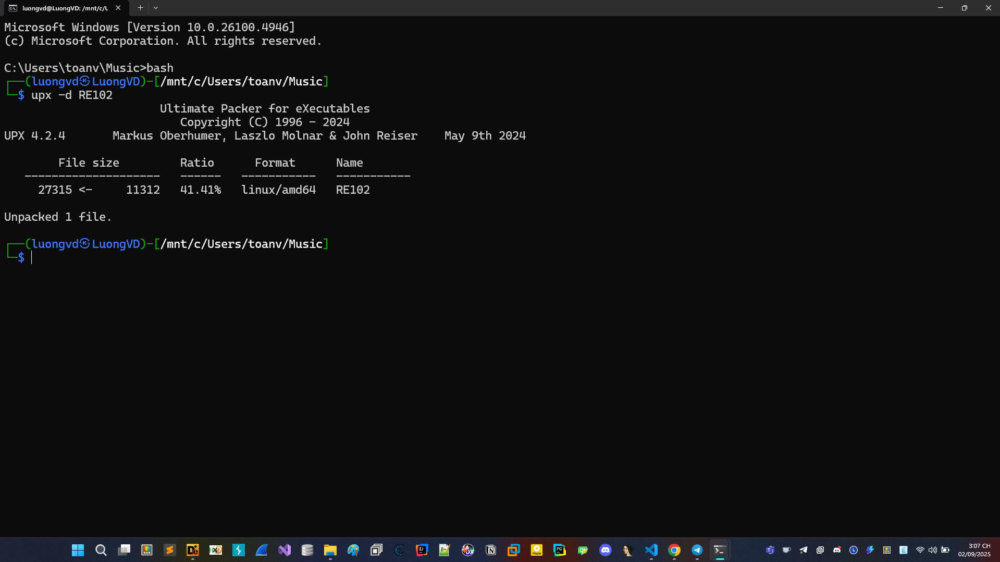
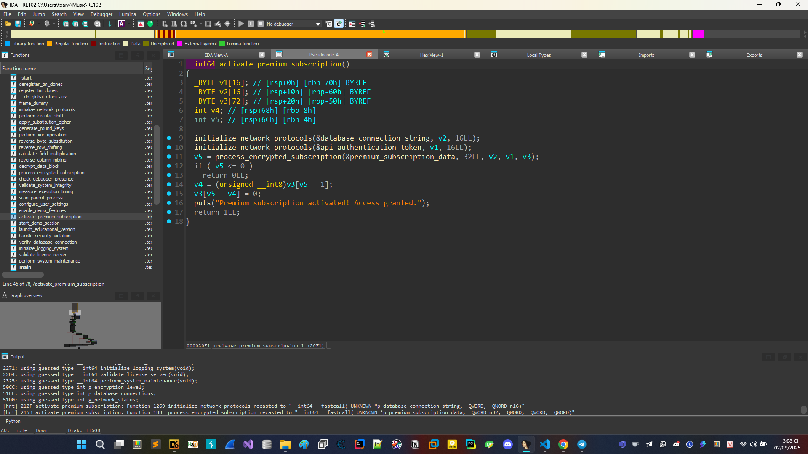
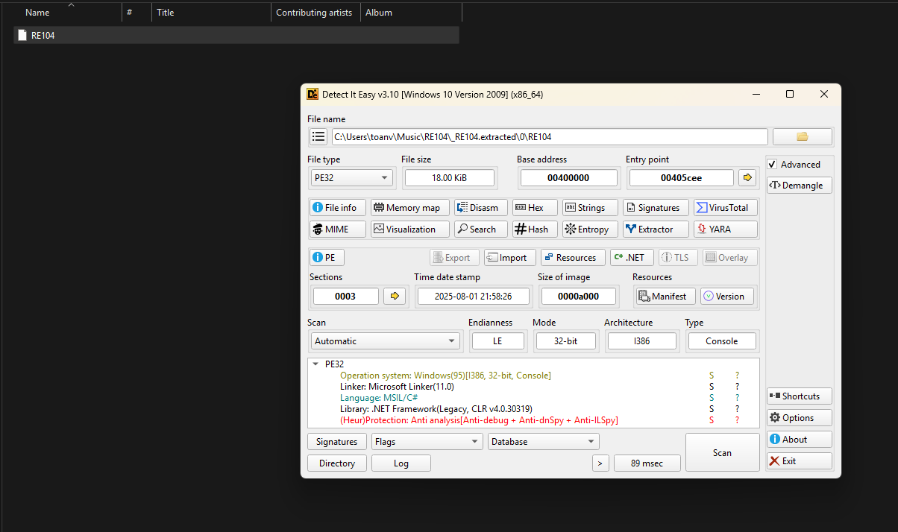
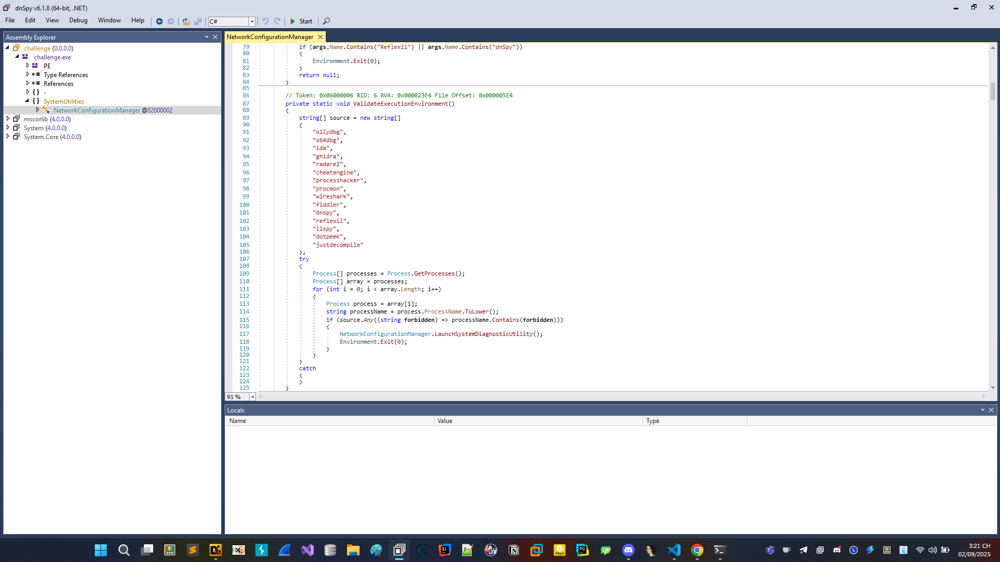
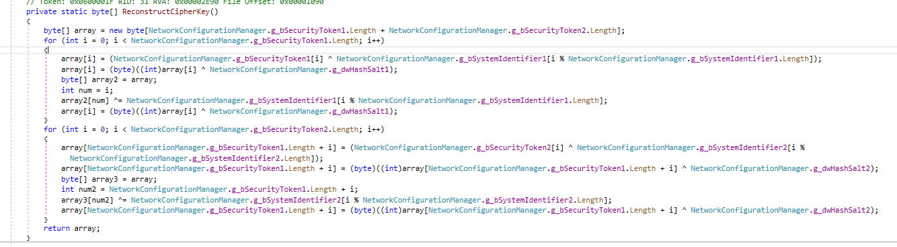
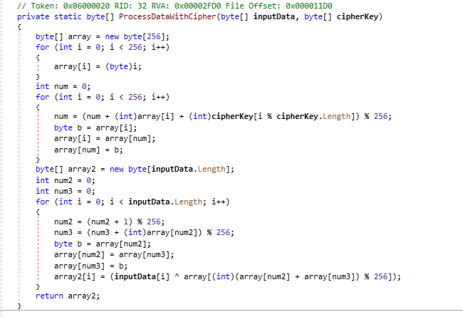

# HOLA CTF 2025

## RE102



Khi mở file này vào IDA thì giống bị nén dùng DIE bình thường thì quét không ra chỉnh thêm 1 ít thì nó ra được như hình.



Sau khi đã rõ chúng ta thấy rằng đây chính là UPX thôi, chắc author đã sửa gì trong hex khiến cho chúng ta khó detect cũng như unpack.



Sau 1 hồi tìm hiểu thì đáng nghẽ mấy chữ FAKE phải là UPX! thì trình unpacker mới nhận là UPX được tiến hành sửa FAKE thành UPX! và giải mã thử.



Vậy là đã unpack thành công. Đem vào IDA phân tích.



Dễ dàng tìm được entry có flag, vấn đề là lúc mình làm tác giả không hề đề cập flag chỉ là cái đoạn hex khiến mình tưởng mình đã làm sai và có lẽ nhiều đội khác cũng vậy.

Đoạn này thực chất chỉ là AES với 

```
Key: MySecretKey12345
IV: 1234567890123456
```

Dump data từ premium_subscription_data ra được và giải mã được 1b0b403ac790763ba5218d13801aa4e801c5947d4d25705006e5c603b08807f2 chúng ta tự nối nốt form flag vào là được.


```FLAG: HOLACTF{1b0b403ac790763ba5218d13801aa4e801c5947d4d25705006e5c603b08807f2}```


## RE104



Chúng ta nhận được 1 file C# tiến hành dùng dnSpy để phân tích.



Chương trình xử lý anti debug, rồi truyền linh tinh dẫn đến khó phân tích nhưng để ý đoạn giống gen ra flag thật nhất là.


Việc chúng ta cần tìm là cipher và key, cipher đã có sẵn còn key



Hàm này chỉ làm rối thôi còn thực chất chỉ là ghép 2 mảng vào với nhau 

```C#
private static readonly byte[] g_lpCriticalSystemData = new byte[]
		{
			135,
			116,
			43,
			205,
			242,
			219,
			162,
			153,
			39,
			86,
			151,
			35,
			169,
			72,
			219,
			6,
			232,
			131,
			21,
			211,
			120,
			125,
			79,
			93,
			11,
			233,
			51,
			146,
			65,
			182,
			177,
			104,
			154,
			123,
			29,
			115,
			212,
			109,
			133,
			16
		};

		// Token: 0x0400000B RID: 11
		private static readonly byte[] g_bSecurityToken1 = new byte[]
		{
			95,
			96,
			125,
			118,
			117
		};

		// Token: 0x0400000C RID: 12
		private static readonly byte[] g_bSecurityToken2 = new byte[]
		{
			126,
			114,
			125,
			126,
			118
		};
```

Oke đã có cipher và key

```Cipher: 87 74 2b cd f2 db a2 99 27 56 97 23 a9 48 db 06 e8 83 15 d3 78 7d 4f 5d 0b e9 33 92 41 b6 b1 68 9a 7b 1d 73 d4 6d 85 10```

```Key: 5f 60 7d 76 75 7e 72 7d 7e 76```




Nhìn mảng 256 quá quen thuộc đúng không chính là RC4 đấy.

```FLAG: HOLACTF{745d40e06ec4ab2f33d11cd84215f62cd4b2e2705c0428df0249db3370bbc8a3990447771481ba85}```

Vấn đề chính ở giải này cũng là điều khá đáng tiếc với mình khi đã không thử nộp hex, ... khá buồn đấy.

