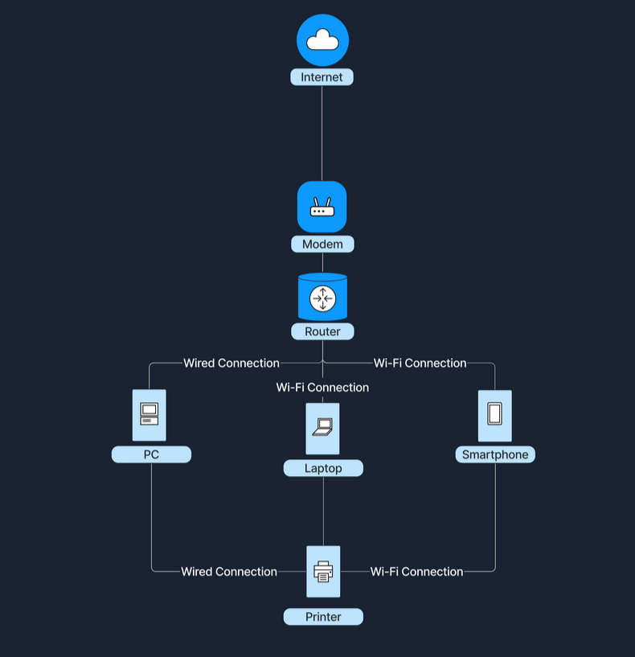
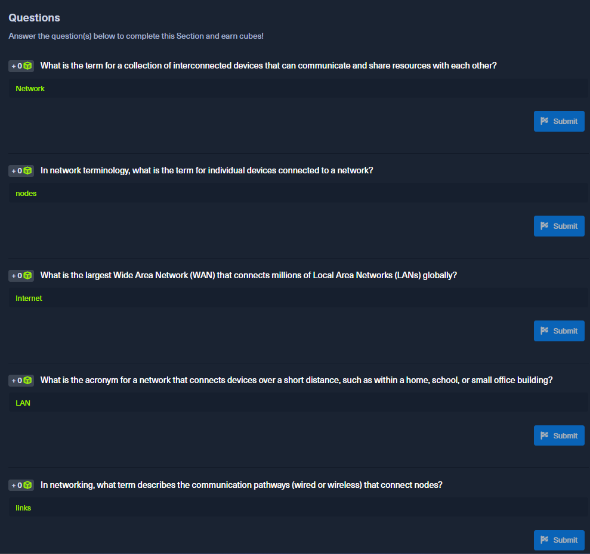

##  Network Foundations

<ol>
  <li><strong>Giới thiệu</strong></li>
   

        Trong module này chúng ta sẽ cùng tìm hiểu về công nghệ đứng sau mạng máy tính còn được gọi là mạng hoặc networking và lí do tại sao chúng lại quan trọng với cuộc sống của chúng ta.
        Chủ yếu tập trung vào 2 loại mạng chính:
        <ul>
            <li>Mạng cục bộ (LAN - Local Area Network)</li>
            <li>Mạng diện rộng (WAN - Wide Area Network)</li>
        </ul>
   

   

        Hiểu các thiết bị có thể giao tiếp với nhau, từ trong nhà ra đến thế giới. Đây là kiến thức nền tảng cho ai muốn bước vào lĩnh vực an ninh mạng. Sự kết nối giữa các thiết bị ngày càng tăng dẫn đến buối cảnh ngày càng tăng về các chuyên gia bảo mật.
   

   <li><strong>Mạng là gì?</strong></li>
   

        Một mạng là tập hợp các thiết bị được kết nối với nhau, có thể giao tiếp nhận gửi dữ liệu, cũng như chia sẻ tài nguyên.
        Các thiết bị đầu cuối riêng lẻ thường được gọi là các nút (nodes), bao gồm máy tính, điện thoại thông minh, máy in và máy chủ. Tuy nhiên chỉ có các nút thì chưa gọi là một mạng hoàn chỉnh.
   

    
|Khái niệm | Mô tả  |
|-----------|------|
|Nút (Nodes)   | Các thiết bị riêng lẻ kết nối trong 1 mạng.   |
|Liên kết (Links)   | Đường truyền kết nối các nút (có thể là có dây hoặc không dây) | 
|Chia sẻ dữ liệu (Data Sharing)   | Mục đích chính của mạng là trao đổi dữ liệu  

    Ví dụ thực thế:
    <ul>
        <li>
            

                Trong phòng chat giữa các bạn, mỗi người tượng trưng cho một thiết bị (nodes).
            

        </li>
        <li>
            

                Việc họ nói chuyện và lắng nghe nhau tượng trưng cho liên kết truyền thông (links).
            

        </li>
        <li>
            

                Cuộc trò chuyện chính là dữ liệu đang được chia sẻ.
            

        </li>
    </ul>

    <li><strong>Tại sao mạng lại quan trọng.</strong></li>
    
Mạng máy tính, đặc biệt à từ khi Internet ra đời, đã thay đổi hoàn toàn xã hội, mở ra vô số khả năng và trở thành một phần không thể thiếu trong cuộc sống. Dưới đây là một số lợi ích quan trọng mà công nghệ mạng mang lại.
    

|Chức năng | Mô tả  |
|-----------|------|
|Chia sẻ tài nguyên  | Nhiều thiết bị có thể chung phần cứng (ổ cứng, máy in) và phần mềm   |
|Giao tiếp   | Nhắn tin,email,gọi video đều dựa vào mạng | 
|Truy cập dữ liệu   | Mục đích chính của mạng là trao đổi dữ liệu  |
|Hợp tác   | Làm việc cùng nhau theo thời gian thực, dù ở bất kỳ đâu. |

<li><strong>Các loại mạng</strong></li>

Mạng máy tính có nhiều kích thước và phạm vi khác nhau. Hai loại mạng chính là Mạng cục bộ (LAN) và mạng diện rộng (WAN).

    
<li><strong>Mạng cục bộ (LAN - Local Area Network)</strong></li>

Mạng LAN kết nối các thiết bị trong một khu vực nhỏ, như trong nhà, trường học hoặc văn phòng.

|Đặc điểm | Mô tả  |
|-----------|------|
|Phạm vi địa lý | Chỉ bao phủ một khu vực nhỏ   |
|Quyền sở hữu   | Thường thuộc sở hữ và quản lý bởi một cá nhân hoặc tổ chức | 
|Tốc độ   | Tốc độ truyền dữ liệu cao  |
|Phương thức kết nối   | Sử dụng kết nối có dây (Ethernet) hoặc không dây (Wi-Fi) |

Đồ thị dưới dây chỉ ra cách mà Wi-Fi trong nhà có thể kết nối các thiết bị như laptop, điện thoại thông minh, TV thông mình chúng chia sẻ file với nhau và kết nối với internet.

<li><strong>Mạng diện rộng (WAN - Wide Area Network)</strong></li>

Mạng WAN bao phủ một khu vựng rộng lớn, kết nối nhiều mạng LAN lại với nhau.

|Đặc điểm | Mô tả  |
|-----------|------|
|Phạm vi địa lý | Kết nối các thành phố, quốc gia châu lục.  |
|Quyền sở hữu   | Thường thuốc sở hữu của nhiều tổ chức (VD: nhà cung cấp dịch vụ Internet - ISP) | 
|Tốc độ   | Chậm hơn mạng LAN do dữ liệu truyền đi xa.  |
|Phương thức kết nối   | Dùng cáp quang, vệ tinh, hoặc đường truyền viễn thông thuê bao. |

Internet là ví dụ lớn nhất của WAN, kết nối hàng triệu LANS trên toàn cầu.

<li><strong>So sánh giữa LAN và WAN</strong></li>

| **Khía cạnh**        | **LAN** 🏠 | **WAN** 🌍 |
|----------------------|------------|------------|
| **Kích thước (Size)** | Nhỏ, trong một khu vực cụ thể. | Rộng, bao phủ nhiều khu vực, quốc gia hoặc châu lục. |
| **Quyền sở hữu (Ownership)** | Một cá nhân hoặc tổ chức quản lý. | Nhiều tổ chức hoặc nhà cung cấp dịch vụ (ISP). |
| **Tốc độ (Speed)** | Cao, truyền tải dữ liệu nhanh. | Thấp hơn LAN do dữ liệu phải di chuyển xa. |
| **Bảo trì (Maintenance)** | Dễ dàng, chi phí thấp. | Phức tạp, tốn kém hơn. |
| **Ví dụ (Example)** | Mạng Wi-Fi trong nhà hoặc công ty. | Internet, hệ thống mạng toàn cầu của ngân hàng. |

<li><strong>Làm thế nào để LANs và WANs làm việc cùng nhau?</strong></li>

- Các mạng cục bộ (LAN) có kết nối với mạng diện rộng (WAN) để truy cập các mạng lớn hơn ngoài phạm vị truy cập của chúng. Sự kết nối này cho phép mở rộng giao tiếp và chia sẻ tài nguyên trên quy mô lớn hơn rất nhiều.
- Ví dụ khi truy cập internet một mạng LAN trong gia đình kết nối với mạng WAN của nhà cung cấp dịch vụ Internet (ISP) cho phép tất cả các thiết bị trong mạng truy cập Internet. ISP là một công ty cung cấp quyền truy cập Internet cho các cá nhân và tổ chức. Trong mô hình này, một thiết bị gọi là modem (bộ điều chế - giải điều chế) đóng vai trò quan trọng. Modem hoạt động như một cầu nối giữa mạng gia đình và hạ tầng của ISP, chuyển đổi tín hiệu số từ bộ định tuyến router thành định dạng phù hợp để truyền qua nhiều phương tiện khác nhau như đường dây điện thoại, hệ thống cáp hoặc cáp quang. Kết nối này biến một mạng cục bộ đơn giản thành một cỏng truy cập các tài nguyên trực tuyến.
- Trong môi trường doanh nghiệp, các công ty liên kết nhiều mạng LAN tại các văn phòng thông qua mạng WAN để đạt được sự giao tiếp thống nhất giữa các địa điểm khác nhau. Bằng cách kết nối các mạng LAN này qua WAN, nhân viên tại nhiều văn phòng có thể chia sẻ thông tin, truy cập cơ sở dữ liệu tập trung và làm việc trong thời gian thực, giúp tăng năng suất.
- Ví dụ minh họa, ở nhà các thiết bị như laptop, điện thoại thông minh và máy tính kết nối với bộ định tuyến tại nhà, tao thành một mạng LAN. Bộ định tuyến không chỉ quản lý lưu lượng mạng nội bộ mà còn giao tiếp với mạng WAN của ISP. Thông qua kết nối WAN này, mạng gia đình có thể truy cập các trang web dịch vụ trực tuyến tên toàn cầu. Sự tích hợp liền mạch giữa LAN và WAN này cho phép chúng ta tiếp cận nội dung toàn cầu và tương tác với các dịch vụ bên ngoài mạng cục bộ.

</ol>

 
