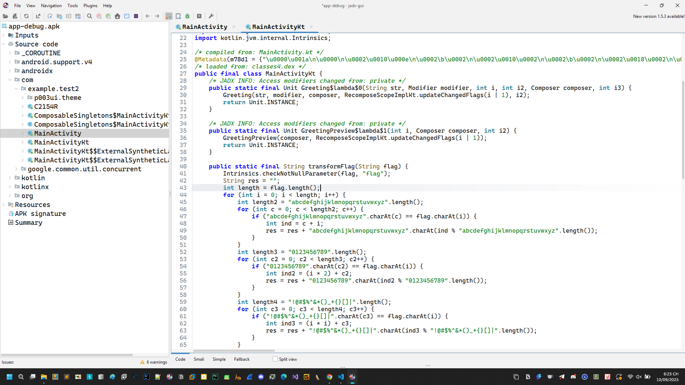

# weird-app

Một bài rev apk đơn giản, may mắn mình đã dành được first solve bài này.

Dễ dàng tìm được entry gốc ở



```
Transformed flag: idvi+1{s6e3{)arg2zv[moqa905+
```

Hàm đáng ngờ là `transformFlag(flag: String): String`. Nó duyệt từng ký tự `flag[i]` và **thay thế theo vị trí i (0-based)**, với 3 bảng ký tự riêng:

* Chữ thường: `abc = "abcdefghijklmnopqrstuvwxyz"`

  * Xuất ra: `abc[(pos + i) mod 26]`
* Chữ số: `dig = "0123456789"`

  * Xuất ra: `dig[(pos + 2*i) mod 10]`
* Ký tự đặc biệt: `spe = "!@#$%^&*()_+{}[]|"` (độ dài **17**)

  * Xuất ra: `spe[(pos + i*i) mod 17]`

> Lưu ý: chỉ một trong ba nhánh chạy cho mỗi ký tự vì đầu vào không thể vừa là chữ vừa là số/đặc biệt.

---

# Ý tưởng đảo ngược

Vì đầu ra luôn ở **cùng bảng** với đầu vào, ta xác định bảng dựa trên chính ký tự đã biến đổi, rồi đảo công thức:

Với ký tự đã biến đổi `out[i]`:

* Nếu `out[i] ∈ abc`
  `pos_in = (pos_out − i) mod 26`
* Nếu `out[i] ∈ dig`
  `pos_in = (pos_out − 2*i) mod 10`
* Nếu `out[i] ∈ spe` (độ dài 17)
  `pos_in = (pos_out − i*i) mod 17`

Lấy `pos_in` để rút ra ký tự gốc trong bảng tương ứng.

# Áp dụng cho chuỗi đã cho

Chuỗi cần đảo:
`idvi+1{s6e3{)arg2zv[moqa905+`

Đảo theo công thức trên (i chạy từ 0) ta thu được:

```
ictf{1_l0v3_@ndr0id_stud103}
```

# Kết luận (Flag)

**`ictf{1_l0v3_@ndr0id_stud103}`**
