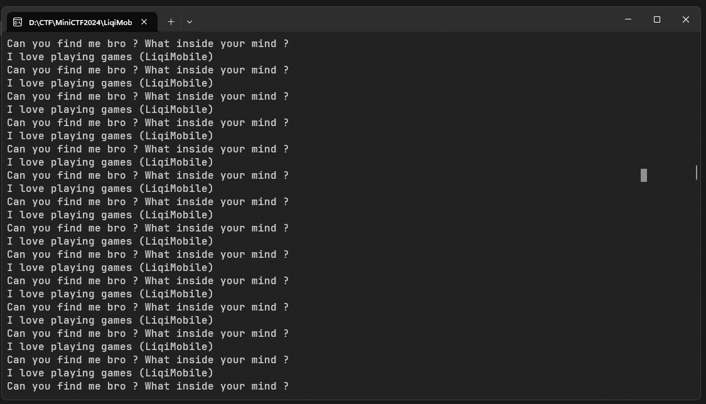
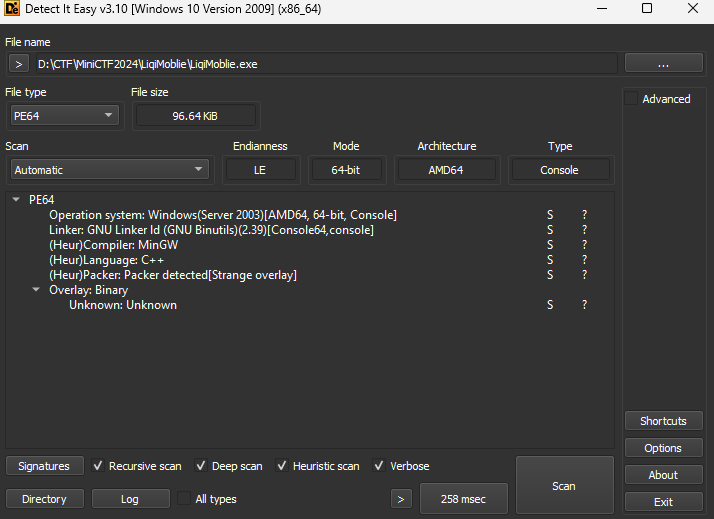
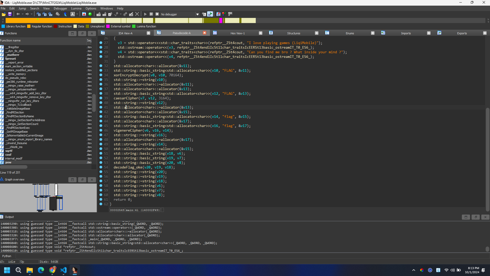
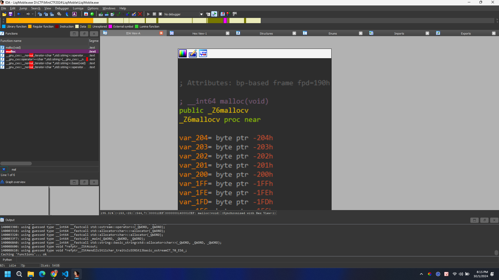
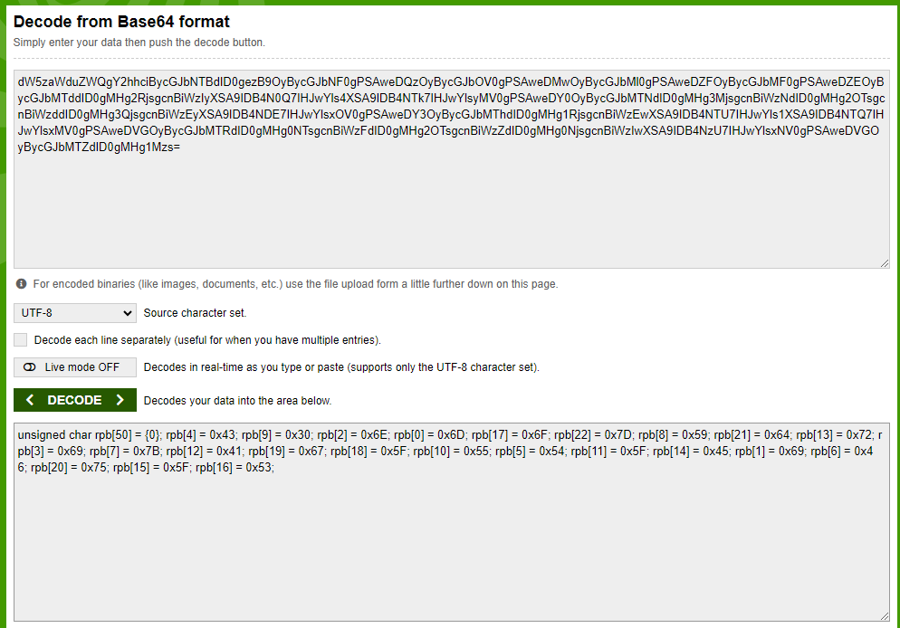
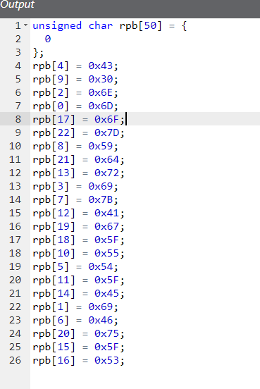

# LiqiMoblie 
## Solution

- Thử mở có thể các bạn thiếu thư viện code C++, tìm hiểu và cài sẽ chạy được. Chương trình in ra 2 dòng chữ như hình.
- Chúng ta có hint

- Nếu bạn chơi liên quân nhiều có thể đoán đây là vị trí đường top.

- Sử dụng công cụ như hình, chúng ta thấy đây là file 64-bit , LE , C++.

- Sử dụng công cụ IDA 64 bit chúng ta tiến hành phân tích, sau một hồi bạn nhận ra tất cả những thứ trong hàm main chỉ là rác và làm rối chương trình.

- Sau một hồi mò và liên quan đến đề bài , chúng ta tìm đến hàm Ma Lốc vị tướng trong liên quân nè, hàm này khởi tạo rất rất nhiều biến lưu giá trị các kí tự khác nhau , tôi thử ghép tất cả các kí tự được khai báo lại
```Python
chars = [
    'd', 'W', '5', 'z', 'a', 'W', 'd', 'u', 'Z', 'W', 'Q', 'g', 'Y', '2', 'h', 'h', 'c', 'i', 'B', 'y', 'c', 'G', 
    'J', 'b', 'N', 'T', 'B', 'd', 'I', 'D', '0', 'g', 'e', 'z', 'B', '9', 'O', 'y', 'B', 'y', 'c', 'G', 'J', 'b', 
    'N', 'F', '0', 'g', 'P', 'S', 'A', 'w', 'e', 'D', 'Q', 'z', 'O', 'y', 'B', 'y', 'c', 'G', 'J', 'b', 'O', 'V', 
    '0', 'g', 'P', 'S', 'A', 'w', 'e', 'D', 'M', 'w', 'O', 'y', 'B', 'y', 'c', 'G', 'J', 'b', 'M', 'l', '0', 'g', 
    'P', 'S', 'A', 'w', 'e', 'D', 'Z', 'F', 'O', 'y', 'B', 'y', 'c', 'G', 'J', 'b', 'M', 'F', '0', 'g', 'P', 'S', 
    'A', 'w', 'e', 'D', 'Z', 'E', 'O', 'y', 'B', 'y', 'c', 'G', 'J', 'b', 'M', 'T', 'd', 'd', 'I', 'D', '0', 'g', 
    'M', 'H', 'g', '2', 'R', 'j', 's', 'g', 'c', 'n', 'B', 'i', 'W', 'z', 'I', 'y', 'X', 'S', 'A', '9', 'I', 'D', 
    'B', '4', 'N', '0', 'Q', '7', 'I', 'H', 'J', 'w', 'Y', 'l', 's', '4', 'X', 'S', 'A', '9', 'I', 'D', 'B', '4', 
    'N', 'T', 'k', '7', 'I', 'H', 'J', 'w', 'Y', 'l', 's', 'y', 'M', 'V', '0', 'g', 'P', 'S', 'A', 'w', 'e', 'D', 
    'Y', '0', 'O', 'y', 'B', 'y', 'c', 'G', 'J', 'b', 'M', 'T', 'N', 'd', 'I', 'D', '0', 'g', 'M', 'H', 'g', '3', 
    'M', 'j', 's', 'g', 'c', 'n', 'B', 'i', 'W', 'z', 'N', 'd', 'I', 'D', '0', 'g', 'M', 'H', 'g', '2', 'O', 'T', 
    's', 'g', 'c', 'n', 'B', 'i', 'W', 'z', 'd', 'd', 'I', 'D', '0', 'g', 'M', 'H', 'g', '3', 'Q', 'j', 's', 'g', 
    'c', 'n', 'B', 'i', 'W', 'z', 'E', 'y', 'X', 'S', 'A', '9', 'I', 'D', 'B', '4', 'N', 'D', 'E', '7', 'I', 'H', 
    'J', 'w', 'Y', 'l', 's', 'x', 'O', 'V', '0', 'g', 'P', 'S', 'A', 'w', 'e', 'D', 'Y', '3', 'O', 'y', 'B', 'y', 
    'c', 'G', 'J', 'b', 'M', 'T', 'h', 'd', 'I', 'D', '0', 'g', 'M', 'H', 'g', '1', 'R', 'j', 's', 'g', 'c', 'n', 
    'B', 'i', 'W', 'z', 'E', 'w', 'X', 'S', 'A', '9', 'I', 'D', 'B', '4', 'N', 'T', 'U', '7', 'I', 'H', 'J', 'w', 
    'Y', 'l', 's', '1', 'X', 'S', 'A', '9', 'I', 'D', 'B', '4', 'N', 'T', 'Q', '7', 'I', 'H', 'J', 'w', 'Y', 'l', 
    's', 'x', 'M', 'V', '0', 'g', 'P', 'S', 'A', 'w', 'e', 'D', 'V', 'G', 'O', 'y', 'B', 'y', 'c', 'G', 'J', 'b', 
    'M', 'T', 'R', 'd', 'I', 'D', '0', 'g', 'M', 'H', 'g', '0', 'N', 'T', 's', 'g', 'c', 'n', 'B', 'i', 'W', 'z', 
    'F', 'd', 'I', 'D', '0', 'g', 'M', 'H', 'g', '2', 'O', 'T', 's', 'g', 'c', 'n', 'B', 'i', 'W', 'z', 'Z', 'd', 
    'I', 'D', '0', 'g', 'M', 'H', 'g', '0', 'N', 'j', 's', 'g', 'c', 'n', 'B', 'i', 'W', 'z', 'I', 'w', 'X', 'S', 
    'A', '9', 'I', 'D', 'B', '4', 'N', 'z', 'U', '7', 'I', 'H', 'J', 'w', 'Y', 'l', 's', 'x', 'N', 'V', '0', 'g', 
    'P', 'S', 'A', 'w', 'e', 'D', 'V', 'G', 'O', 'y', 'B', 'y', 'c', 'G', 'J', 'b', 'M', 'T', 'Z', 'd', 'I', 'D', 
    '0', 'g', 'M', 'H', 'g', '1', 'M', 'z', 's', '='
]
result = ''.join(chars)
print(result)
```
- Sau khi chạy code tôi thu được chuỗi ```dW5zaWduZWQgY2hhciBycGJbNTBdID0gezB9OyBycGJbNF0gPSAweDQzOyBycGJbOV0gPSAweDMwOyBycGJbMl0gPSAweDZFOyBycGJbMF0gPSAweDZEOyBycGJbMTddID0gMHg2RjsgcnBiWzIyXSA9IDB4N0Q7IHJwYls4XSA9IDB4NTk7IHJwYlsyMV0gPSAweDY0OyBycGJbMTNdID0gMHg3MjsgcnBiWzNdID0gMHg2OTsgcnBiWzddID0gMHg3QjsgcnBiWzEyXSA9IDB4NDE7IHJwYlsxOV0gPSAweDY3OyBycGJbMThdID0gMHg1RjsgcnBiWzEwXSA9IDB4NTU7IHJwYls1XSA9IDB4NTQ7IHJwYlsxMV0gPSAweDVGOyBycGJbMTRdID0gMHg0NTsgcnBiWzFdID0gMHg2OTsgcnBiWzZdID0gMHg0NjsgcnBiWzIwXSA9IDB4NzU7IHJwYlsxNV0gPSAweDVGOyBycGJbMTZdID0gMHg1Mzs=```  đây chính là chuỗi base64 chúng ta tiến hành decode.

- Chúng ta thu được mã code tiến hành beautiful code lại

Đây là 1 mảng bằng mã hex tôi tiến hành decode xem nó là gì.
```Python
rpb= [0]*50
rpb[4] = 0x43
rpb[9] = 0x30
rpb[2] = 0x6E
rpb[0] = 0x6D
rpb[17] = 0x6F
rpb[22] = 0x7D
rpb[8] = 0x59
rpb[21] = 0x64
rpb[13] = 0x72
rpb[3] = 0x69
rpb[7] = 0x7B
rpb[12] = 0x41
rpb[19] = 0x67
rpb[18] = 0x5F
rpb[10] = 0x55
rpb[5] = 0x54
rpb[11] = 0x5F
rpb[14] = 0x45
rpb[1] = 0x69
rpb[6] = 0x46
rpb[20] = 0x75
rpb[15] = 0x5F
rpb[16] = 0x53
for i in range(23):
    print(chr(rpb[i]),end="")
```
- Sau khi chạy code tôi nhận được flag ```miniCTF{Y0U_ArE_So_gud}```