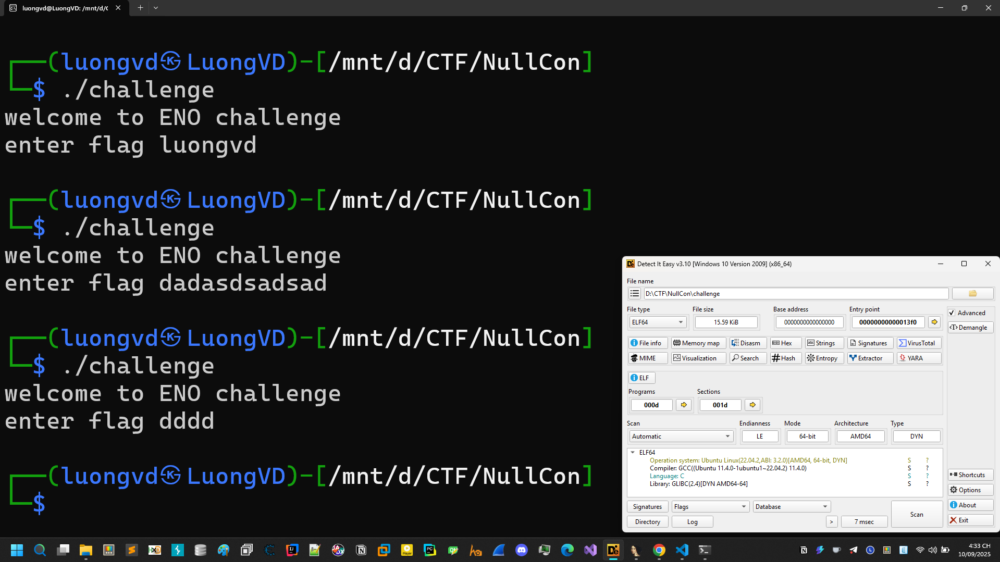
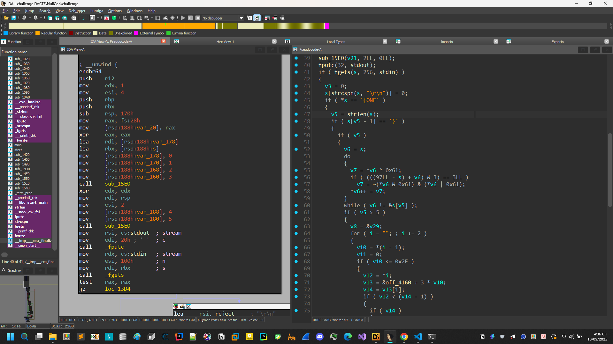
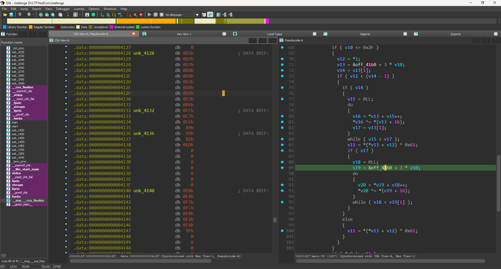

# hidden_strings



Bài này là 1 dạng flag checker thông thường tiến hành mở IDA để phân tích.



Đoạn này thực hiện tính chiều dài nhập vào kiểm tra việc bắt đầu và kết thúc "ENO{" và "}". 



Đoạn này nó thực hiện việc lấy v13 lần lượt các mảng trong binary. Tiến hành debug và rename chúng ta thu được:

```C
__int64 __fastcall main(int a1, char **a2, char **a3)
{
  unsigned int v3; // r12d
  size_t v5; // r9
  char *v6; // rax
  char v7; // si
  char *v8; // r8
  unsigned __int8 *i; // r10
  unsigned __int64 isEven; // r9
  char tmp; // bl
  unsigned __int64 isOdd; // rbp
  struct_isEncrypt *isEncrypt; // rdx
  __int64 lenEncrypt; // rax
  unsigned __int64 idxOfEnc; // rax
  _BYTE *elementEnc; // rcx
  unsigned __int64 isLen; // rcx
  unsigned __int64 v18; // rax
  _UNKNOWN **v19; // rdx
  _BYTE *v20; // rcx
  _QWORD v21[2]; // [rsp+0h] [rbp-188h] BYREF
  _QWORD v22[4]; // [rsp+10h] [rbp-178h] BYREF
  __int64 v23; // [rsp+30h] [rbp-158h] BYREF
  __int64 v24; // [rsp+38h] [rbp-150h]
  __int64 v25; // [rsp+40h] [rbp-148h]
  __int64 v26; // [rsp+48h] [rbp-140h]
  __int64 v27; // [rsp+50h] [rbp-138h]
  char inp[4]; // [rsp+60h] [rbp-128h] BYREF
  char v29; // [rsp+64h] [rbp-124h] BYREF
  _BYTE v30[279]; // [rsp+71h] [rbp-117h] BYREF

  *&v30[247] = __readfsqword(0x28u);
  v22[0] = 0LL;
  v22[1] = 1LL;
  v22[2] = 2LL;
  v22[3] = 3LL;
  sub_5555555555E0(v22, 4LL, 1LL);
  v21[0] = 4LL;
  v21[1] = 5LL;
  sub_5555555555E0(v21, 2LL, 0LL);
  fputc(32, stdout);
  if ( fgets(inp, 256, stdin) )
  {
    v3 = 0;
    inp[strcspn(inp, "\r\n")] = 0;
    if ( *inp == '{ONE' )
    {
      v5 = strlen(inp);
      if ( inp[v5 - 1] == '}' )
      {
        if ( v5 )
        {
          v6 = inp;
          do
          {
            v7 = *v6 ^ 0x61;
            if ( (((97LL - inp) + v6) & 3) == 3LL )
              v7 = ~(*v6 & 0x61) & (*v6 | 0x61);
            *v6++ = v7;
          }
          while ( v6 != &inp[v5] );
          if ( v5 > 5 )
          {
            v8 = &v29;
            for ( i = &unk_555555556021; ; i += 2 )
            {
              isEven = *(i - 1);
              tmp = 0;
              if ( isEven <= 47 )
              {
                isOdd = *i;
                isEncrypt = (&off_555555558160 + 3 * isEven);
                lenEncrypt = *&isEncrypt->cipher[8];
                if ( isOdd < lenEncrypt - 1 )
                {
                  if ( lenEncrypt )
                  {
                    idxOfEnc = 0LL;
                    do
                    {
                      elementEnc = (idxOfEnc + *isEncrypt->cipher);
                      ++idxOfEnc;
                      *elementEnc ^= isEncrypt->lenCipher;
                      isLen = *&isEncrypt->cipher[8];
                    }
                    while ( idxOfEnc < isLen ); // xor enc với cả giá trị có sẵn cách 16 byte
                    tmp = *(*isEncrypt->cipher + isOdd) ^ 0x61;
                    if ( isLen )
                    {
                      v18 = 0LL;
                      v19 = &off_555555558160 + 3 * isEven;
                      do
                      {
                        v20 = *v19 + v18++;
                        *v20 ^= *(v19 + 16);
                      }
                      while ( v18 < v19[1] );
                    }
                  }
                  else
                  {
                    tmp = *(*isEncrypt->cipher + isOdd) ^ 0x61;
                  }
                }
              }
              if ( *v8 != tmp )
                break;
              if ( v30 == ++v8 )
              {
                v23 = 7LL;
                v24 = 5LL;
                sub_5555555555E0(&v23, 2LL, 1LL);
                return v3;
              }
            }
          }
        }
        v23 = 6LL;
        v24 = 5LL;
        v3 = 2;
        v25 = 38LL;
        v26 = 39LL;
        v27 = 40LL;
        sub_5555555555E0(&v23, 5LL, 1LL);
      }
    }
  }
  else
  {
    return 1;
  }
  return v3;
}
```

```Python
off_4160 = [
    [0xE8, 0xFA, 0xF3, 0xFC, 0xF0, 0xF2, 0xFA, 0x9F],
    [0x99, 0x82, 0xED],
    [0xCC, 0xC7, 0xC6, 0x89],
    [0xD5, 0xDE, 0xD7, 0xDA, 0xDA, 0xD3, 0xD8, 0xD1, 0xD3, 0xB6],
    [0x3B, 0x30, 0x2A, 0x3B, 0x2C, 0x5E],
    [0xF5, 0xFF, 0xF2, 0xF4, 0x93],
    [0xE1, 0xE4, 0xF9, 0xF8, 0xF1, 0x96],
    [0xE0, 0xEC, 0xF1, 0xF1, 0xE6, 0xE0, 0xF7, 0x83],
    [0x81, 0x80, 0x87, 0x90, 0x82, 0xE5],
    [0x88, 0x9F, 0x9B, 0x99, 0x92, 0x9F, 0x9E, 0xFA],
    [0x06, 0x01, 0x10, 0x05, 0x75],
    [0x16, 0x1F, 0x14, 0x1D, 0x0E, 0x12, 0x7A],
    [0x83, 0x87, 0xEC],
    [0xA6, 0xAD, 0xA0, 0xA6, 0xAE, 0xAC, 0xAB, 0xA2, 0xC5],
    [0xCA, 0xD3, 0xDF, 0xD9, 0xDF, 0xBA],
    [0x16, 0x11, 0x04, 0x06, 0x0E, 0x65],
    [0xFE, 0xF9, 0xFF, 0xE4, 0xE3, 0xEA, 0xFE, 0x8D],
    [0xB2, 0xA1, 0xB6, 0xD3],
    [0x9D, 0x8E, 0x95, 0xFB],
    [0xC7, 0xD0, 0xCD, 0xBF],
]
isIdx = [
    0x0A, 0x00, 0x01, 0x00, 0x03, 0x02, 0x00, 0x03,
    0x0C, 0x01, 0x13, 0x00, 0x00, 0x04, 0x04, 0x04,
    0x06, 0x01, 0x01, 0x01, 0x03, 0x00, 0x0D, 0x04,
    0x0F, 0x00
]
print("ENO{", end = "")
for i in range(0, len(isIdx), 2):
    v10 = isIdx[i]
    v12 = isIdx[i + 1]
    print(chr(off_4160[v10][v12] ^ off_4160[v10][-1]), end = "")
print("}")
```

Chạy script và thu được flag.
