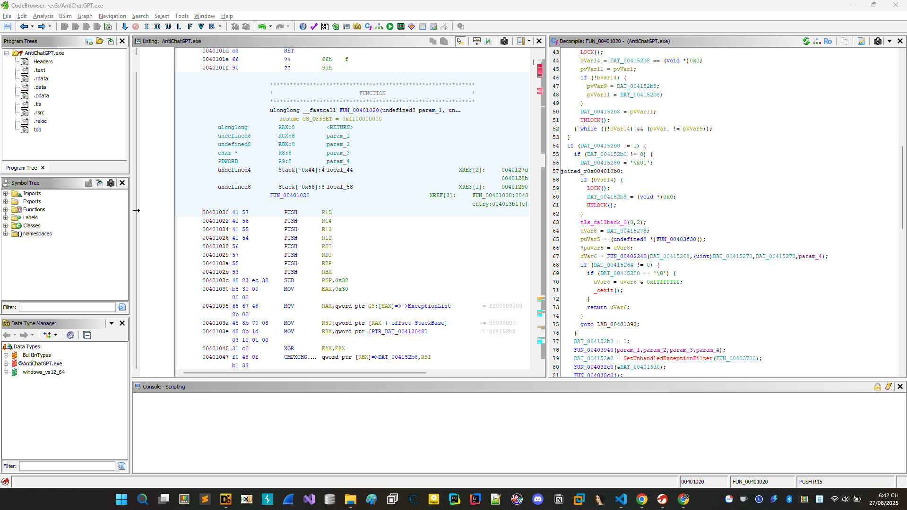
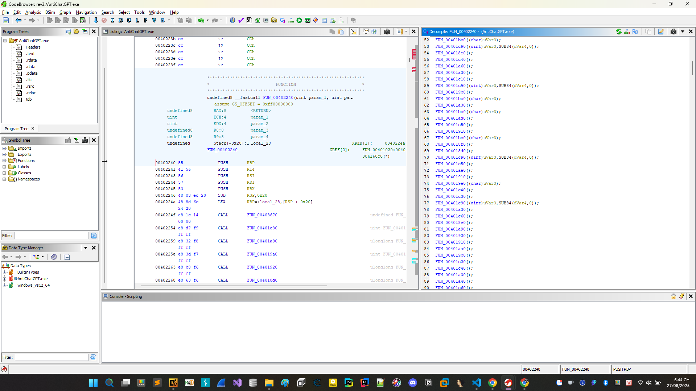
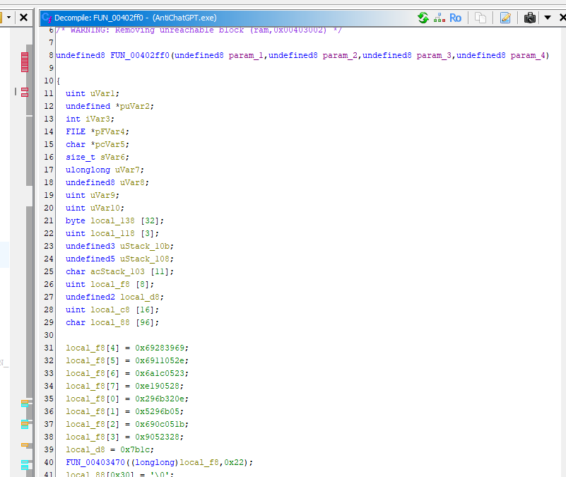
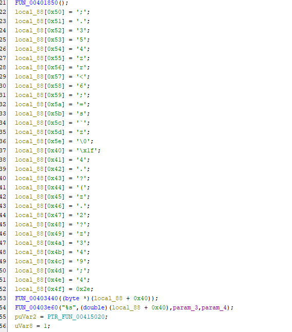
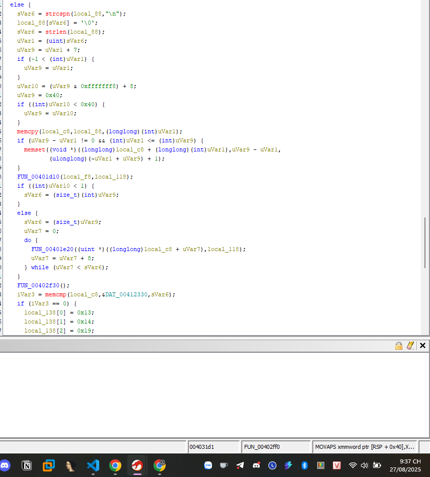

# AntiChatGPT

Vẫn là code C mình định quăng vào IDA tiếp nhưng thấy code khá bựa nên chúng ta sẽ qua ghidra nhìn cho dễ hơn.

 

FUN_00402240 là hàm main.

Bay vô thì thấy quá ối dồi ôi quá nhiều hàm, func tùm lum



Chương trình này search string cũng không có gì hot, khi người ta làm bài này chắc cũng tránh đến chuyện bị bắt string tìm lại entry 1 cách dễ dàng nên chắc đã làm gì đó ảnh hưởng rùi.


Đây chính là hàm main của chương trình bởi nó truyền tham số trông hợp lí nhất là FUN_00402ff0.



Đoạn này và hàm FUN_00403470 chỉ đơn giản là xor với 0x5A

```Python
local_f8 = [
    (0x296b320e).to_bytes(4, 'little'),
    (0x5296b05).to_bytes(4, 'little'),
    (0x690c051b).to_bytes(4, 'little'),
    (0x9052328).to_bytes(4, 'little'),
    (0x69283969).to_bytes(4, 'little'),
    (0x6911052e).to_bytes(4, 'little'),
    (0x6a1c0523).to_bytes(4, 'little'),
    (0xe190528).to_bytes(4, 'little')
]
local_d8 = (0x7b1c).to_bytes(2, 'little')

result = ''.join(
    chr(b ^ 0x5A)
    for arr in local_f8 + [local_d8]
    for b in arr
)

print(result)

# Th1s_1s_A_V3ry_S3cr3t_K3y_F0r_CTF!
```
Đoạn này chỉ đơn giản là xor với 0x5A



Đoạn này là ```Enter the incantation (flag):```

Sau đó nó xử lí chuyện nhập đầu vào.


Nếu thất bại thì in ra là Failed to read incantation! nó cũng chỉ xor với 0x5A thôi.

Tiếp là đoạn xử lí input.



- Nhận input local_88, loại bỏ newline.

- ính độ dài, chuẩn hóa thành block 8-byte, tối đa 64 byte.

- Copy input vào buffer local_c8 và thêm padding nếu cần

- Xử lý từng block (mã hóa/hash) với FUN_00401e20.

- So sánh kết quả với mảng cố định (DAT_00412330).


```
import struct

# ===== S-box tại DAT_004120f0 =====
SBOX = [
    0x63,0x7c,0x77,0x7b,0xf2,0x6b,0x6f,0xc5,0x30,0x01,0x67,0x2b,0xfe,0xd7,0xab,0x76,
    0xca,0x82,0xc9,0x7d,0xfa,0x59,0x47,0xf0,0xad,0xd4,0xa2,0xaf,0x9c,0xa4,0x72,0xc0,
    0xb7,0xfd,0x93,0x26,0x36,0x3f,0xf7,0xcc,0x34,0xa5,0xe5,0xf1,0x71,0xd8,0x31,0x15,
    0x04,0xc7,0x23,0xc3,0x18,0x96,0x05,0x9a,0x07,0x12,0x80,0xe2,0xeb,0x27,0xb2,0x75,
    0x09,0x83,0x2c,0x1a,0x1b,0x6e,0x5a,0xa0,0x52,0x3b,0xd6,0xb3,0x29,0xe3,0x2f,0x84,
    0x53,0xd1,0x00,0xed,0x20,0xfc,0xb1,0x5b,0x6a,0xcb,0xbe,0x39,0x4a,0x4c,0x58,0xcf,
    0xd0,0xef,0xaa,0xfb,0x43,0x4d,0x33,0x85,0x45,0xf9,0x02,0x7f,0x50,0x3c,0x9f,0xa8,
    0x51,0xa3,0x40,0x8f,0x92,0x9d,0x38,0xf5,0xbc,0xb6,0xda,0x21,0x10,0xff,0xf3,0xd2,
    0xcd,0x0c,0x13,0xec,0x5f,0x97,0x44,0x17,0xc4,0xa7,0x7e,0x3d,0x64,0x5d,0x19,0x73,
    0x60,0x81,0x4f,0xdc,0x22,0x2a,0x90,0x88,0x46,0xee,0xb8,0x14,0xde,0x5e,0x0b,0xdb,
    0xe0,0x32,0x3a,0x0a,0x49,0x06,0x24,0x5c,0xc2,0xd3,0xac,0x62,0x91,0x95,0xe4,0x79,
    0xe7,0xc8,0x37,0x6d,0x8d,0xd5,0x4e,0xa9,0x6c,0x56,0xf4,0xea,0x65,0x7a,0xae,0x08,
    0xba,0x78,0x25,0x2e,0x1c,0xa6,0xb4,0xc6,0xe8,0xdd,0x74,0x1f,0x4b,0xbd,0x8b,0x8a,
    0x70,0x3e,0xb5,0x66,0x48,0x03,0xf6,0x0e,0x61,0x35,0x57,0xb9,0x86,0xc1,0x1d,0x9e,
    0xe1,0xf8,0x98,0x11,0x69,0xd9,0x8e,0x94,0x9b,0x1e,0x87,0xe9,0xce,0x55,0x28,0xdf,
    0x8c,0xa1,0x89,0x0d,0xbf,0xe6,0x42,0x68,0x41,0x99,0x2d,0x0f,0xb0,0x54,0xbb,0x16
]

# ===== Các hằng trong binary =====

# Dữ liệu key ban đầu (local_f8[0..7]) + local_d8 (0x7b1c) — tổng 0x22 bytes
INIT_WORDS = [
    0x296b320e, 0x05296b05, 0x690c051b, 0x09052328,
    0x69283969, 0x6911052e, 0x6a1c0523, 0x0e190528
]
LOCAL_D8 = 0x7b1c  # 2 bytes

# Ciphertext 48 bytes (DAT_00412330)
CT_HEX = (
    "40 32 C4 DA 67 A9 1C 97"
    " 69 A1 D8 BE 1F EE E9 A1"
    " F5 28 54 09 55 5D C5 7D"
    " CD 26 6B 36 22 15 0C E2"
    " 5E 5E BE A5 FF 4A 24 34"
    " 05 F5 7D DD BA 9F 62 EB"
)

# ===== Tiện ích =====

def rol32(x, r):
    x &= 0xFFFFFFFF
    return ((x << r) | (x >> (32 - r))) & 0xFFFFFFFF

def xor_0x5a_region(b: bytes) -> bytes:
    # FUN_00403470: XOR 0x5A cho 0x22 bytes (byte-wise là đủ cho mục đích lấy 16 byte đầu)
    return bytes([x ^ 0x5A for x in b])

def f_round(x: int, k: int) -> int:
    # FUN_00401cb0
    u = (x ^ k) & 0xFFFFFFFF
    b3 = (u >> 24) & 0xFF
    b2 = (u >> 16) & 0xFF
    b1 = (u >> 8) & 0xFF
    b0 = u & 0xFF
    v = (SBOX[b3] << 24) | (SBOX[b2] << 16) | (SBOX[b1] << 8) | SBOX[b0]
    v = rol32(v, 13)
    v = (v + 0x9E3779B9) & 0xFFFFFFFF
    return v

def key_schedule_from_post_words(p1: list[int]) -> list[int]:
    # FUN_00401d10 — sinh 8 subkeys từ 4 word đầu (đã XOR 0x5A trước đó)
    param_1 = [x & 0xFFFFFFFF for x in p1]
    param_2 = [0]*8

    u5 = param_1[3]
    u4 = rol32(u5, 11) ^ param_1[0]
    u1 = param_1[1]
    u2 = (param_1[2] ^ ((u1 + u4) & 0xFFFFFFFF)) & 0xFFFFFFFF
    u5 = ((u2 ^ 99) + u5) & 0xFFFFFFFF
    param_2[0] = u4

    u3 = (((u5 * 0x800) & 0xFFFFFFFF) | (u5 >> 0x15)) ^ u4
    u1 = (u1 + u4 + u3) & 0xFFFFFFFF
    u2 ^= u1
    u5 = ((u2 ^ 0x1F) + u5) & 0xFFFFFFFF
    param_2[1] = u1

    u3 = (((u5 * 0x800) & 0xFFFFFFFF) | (u5 >> 0x15)) ^ u3
    u1 = (u1 + u3) & 0xFFFFFFFF
    u2 ^= u1
    u4 = u2 ^ 0x68
    u5 = (u5 + u4) & 0xFFFFFFFF
    param_2[2] = u4

    u3 = (((u5 * 0x800) & 0xFFFFFFFF) | (u5 >> 0x15)) ^ u3
    u1 = (u1 + u3) & 0xFFFFFFFF
    u2 ^= u1
    u5 = ((u2 ^ 0x13) + u5) & 0xFFFFFFFF
    param_2[3] = u5

    u3 = (((u5 * 0x800) & 0xFFFFFFFF) | (u5 >> 0x15)) ^ u3
    u1 = (u1 + u3) & 0xFFFFFFFF
    u2 ^= u1
    u5 = ((u2 ^ 0xE1) + u5) & 0xFFFFFFFF
    param_2[4] = u3

    u3 = (((u5 * 0x800) & 0xFFFFFFFF) | (u5 >> 0x15)) ^ u3
    u1 = (u1 + u3) & 0xFFFFFFFF
    u2 ^= u1
    u4 = u2 ^ 0x8A
    u5 = (u5 + u4) & 0xFFFFFFFF
    param_2[5] = u1

    u3 = (((u5 * 0x800) & 0xFFFFFFFF) | (u5 >> 0x15)) ^ u3
    u1 = (u1 + u3) & 0xFFFFFFFF
    u2 ^= u1
    u4 = u2 ^ 0xE5
    u5 = (u5 + u4) & 0xFFFFFFFF
    param_2[6] = u4

    param_2[7] = (((((u5 * 0x800) & 0xFFFFFFFF) | (u5 >> 0x15)) ^ u3) + u1) & 0xFFFFFFFF
    param_2[7] = ((param_2[7] ^ u2 ^ 0x20) + u5) & 0xFFFFFFFF

    return [x & 0xFFFFFFFF for x in param_2]

def feistel_decrypt_block(block8: bytes, K: list[int]) -> bytes:
    # Đảo ngược FUN_00401e20 (8 vòng), chú ý vòng cuối không swap trước khi return
    L = struct.unpack('<I', block8[:4])[0]
    R = struct.unpack('<I', block8[4:])[0]

    # Hoàn tác bước cuối: trước khi return, code đã làm: param_1[1] = f(L,K7) ^ R
    # Nên để lấy lại R_truoc: R' = R ^ f(L, K7)
    R = R ^ f_round(L, K[7])

    # Các vòng 6..0, đảo ngược swap/XOR:
    for i in range(6, -1, -1):
        L, R = R, (L ^ f_round(R, K[i])) & 0xFFFFFFFF

    return struct.pack('<I', L) + struct.pack('<I', R)

def pkcs7_unpad(b: bytes, block_size: int = 8) -> bytes:
    if not b or len(b) % block_size != 0:
        raise ValueError("Dữ liệu không chia hết block size.")
    pad = b[-1]
    if pad == 0 or pad > block_size:
        raise ValueError("Padding không hợp lệ.")
    if b[-pad:] != bytes([pad]) * pad:
        raise ValueError("Padding không hợp lệ (mẫu không khớp).")
    return b[:-pad]

def main():
    # 1) Dựng vùng key 0x22 bytes như trong binary rồi XOR 0x5A (FUN_00403470)
    key_region = b''.join(struct.pack('<I', w) for w in INIT_WORDS) + struct.pack('<H', LOCAL_D8)  # 8*4 + 2 = 34 bytes
    key_region_dec = xor_0x5a_region(key_region)

    # 2) Lấy 16 byte đầu (4 word) sau XOR làm input cho key schedule
    post_words = list(struct.unpack('<IIII', key_region_dec[:16]))

    # 3) Sinh 8 subkey (FUN_00401d10)
    K = key_schedule_from_post_words(post_words)

    # 4) Nạp ciphertext và giải mã từng block 8B
    ct = bytes(int(x, 16) for x in CT_HEX.split())
    if len(ct) % 8 != 0:
        raise ValueError("Ciphertext không chia hết 8.")
    pt = b''.join(feistel_decrypt_block(ct[i:i+8], K) for i in range(0, len(ct), 8))

    # 5) Bỏ padding PKCS#7
    msg = pkcs7_unpad(pt, 8)

    # 6) In ra flag
    try:
        print(msg.decode('utf-8'))
    except UnicodeDecodeError:
        # fallback nếu có ký tự ngoài UTF-8
        print(msg.decode('latin-1'))

if __name__ == "__main__":
    main()

# PTITCTF{k1ng_0f_Pt1t_NigM4o_z3ro_d4Y_zxo}
```