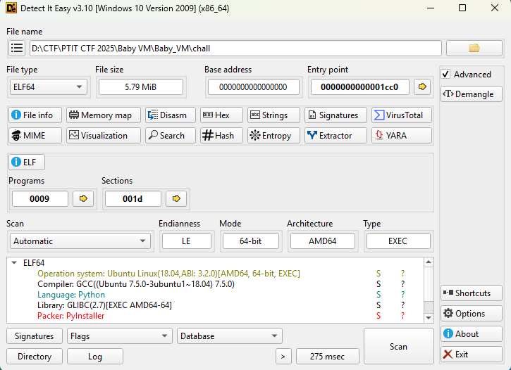
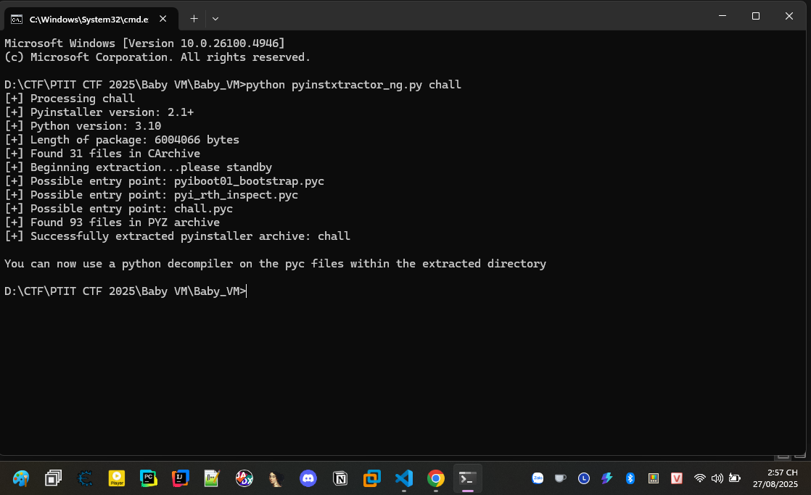
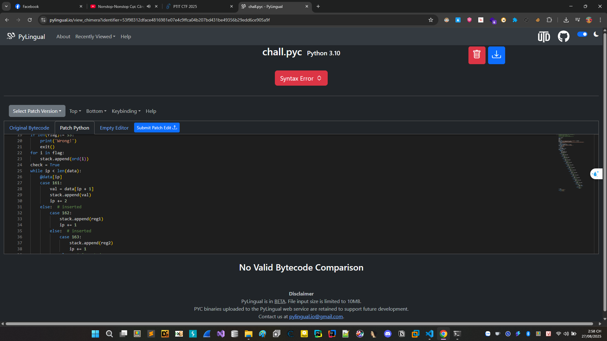
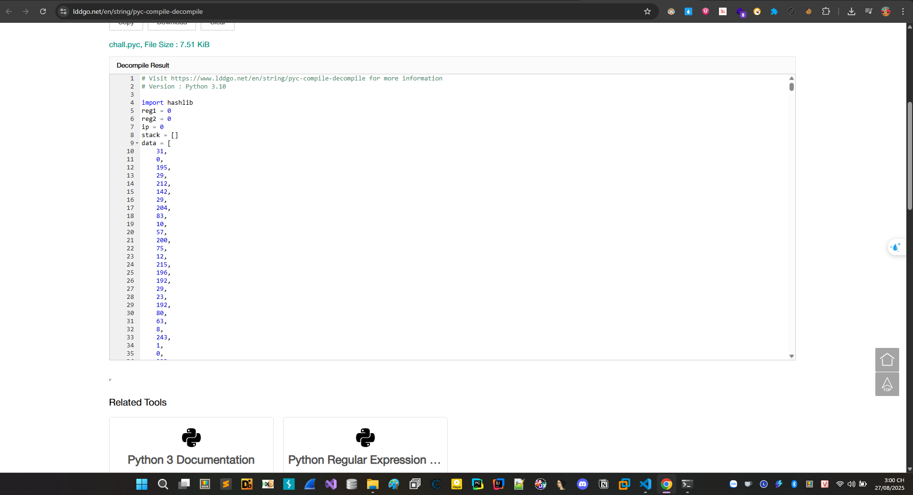

# Baby_VM

Mới vào chúng ta tiến hành quăng vào công cụ DIE.



Thấy rằng đây là 1 file bằng được viết bằng ngôn ngữ python và build bằng pyinstaller. 

Ý tưởng khi ngay khi gặp phải là chúng ta sẽ sử dụng ngay ```https://github.com/pyinstxtractor/pyinstxtractor-ng``` để extract ra được file pyc xong rồi tính tiếp.



Oke, thành công tiến hành decode tiếp cái file chall.pyc bên trong. Như mọi người thấy thì phiên bản python đang đướcử dụng ở đây là 3.10.


Mình biết mọi người hay sử dụng ```https://pylingual.io/``` để hay decode file pyc thành file py để ngâm tiếp, nhưng vì là python 3.10 nên mọi người thấy có vẻ web này làm không hiệu quả và code chưa được đẹp cho lắm.



Mình muốn gợi ý 1 web mới decode đẹp hơn đó là ```https://www.lddgo.net/en/string/pyc-compile-decompile```




Anh em sẽ thấy code ngon hơn đọc oke hơn nhiều.

```
# Visit https://www.lddgo.net/en/string/pyc-compile-decompile for more information
# Version : Python 3.10

import hashlib
reg1 = 0
reg2 = 0
ip = 0
stack = []
data = [
    31,
    0,
    195,
    29,
    212,
    142,
    29,
    204,
    83,
    10,
    57,
    200,
    75,
    12,
    215,
    196,
    192,
    29,
    23,
    192,
    80,
    63,
    8,
    243,
    1,
    0,
    223,
    12,
    215,
    108,
    35,
    29,
    212,
    99,
    5,
    236,
    8,
    194,
    103,
    0,
    207,
    111,
    196,
    0,
    240,
    29,
    212,
    115,
    14,
    253,
    8,
    210,
    201,
    107,
    7,
    228,
    215,
    52,
    3,
    29,
    212,
    77,
    205,
    210,
    8,
    209,
    58,
    200,
    86,
    7,
    230,
    0,
    27,
    197,
    212,
    99,
    237,
    4,
    192,
    120,
    1,
    56,
    207,
    237,
    31,
    200,
    232,
    198,
    7,
    192,
    181,
    63,
    8,
    243,
    1,
    216,
    207,
    120,
    39,
    0,
    211,
    118,
    244,
    192,
    98,
    204,
    243,
    209,
    10,
    200,
    122,
    55,
    31,
    249,
    27,
    197,
    212,
    110,
    13,
    204,
    48,
    18,
    1,
    200,
    74,
    196,
    113,
    219,
    32,
    29,
    212,
    94,
    5,
    31,
    8,
    243,
    1,
    216,
    207,
    33,
    31,
    24,
    27,
    213,
    119,
    224,
    205,
    113,
    8,
    194,
    91,
    0,
    220,
    12,
    36,
    200,
    101,
    29,
    23,
    8,
    252,
    4,
    208,
    194,
    109,
    56,
    7,
    196,
    116,
    232,
    27,
    213,
    119,
    192,
    232,
    223,
    8,
    1,
    1,
    200,
    26,
    23,
    230,
    0,
    27,
    29,
    196,
    192,
    203,
    28,
    192,
    14,
    9,
    0,
    207,
    97,
    215,
    109,
    27,
    198,
    247,
    192,
    237,
    63,
    241,
    10,
    1,
    0,
    223,
    12,
    215,
    100,
    27,
    21,
    212,
    67,
    5,
    60,
    8,
    194,
    44,
    0,
    207,
    214,
    196,
    0,
    16,
    213,
    152,
    19,
    5,
    253,
    8,
    10,
    217,
    0,
    207,
    17,
    31,
    24,
    211,
    113,
    244,
    192,
    97,
    204,
    111,
    10,
    218,
    11,
    7,
    196,
    114,
    59,
    226,
    29,
    28,
    208,
    205,
    26,
    48,
    10,
    201,
    111,
    15,
    12,
    215,
    98,
    211,
    112,
    199,
    8,
    238,
    204,
    205,
    10,
    58,
    0,
    254,
    12,
    31,
    0,
    195,
    29,
    212,
    27,
    5,
    60,
    8,
    194,
    18,
    0,
    31,
    196,
    50,
    200,
    65,
    29,
    199,
    8,
    62,
    4,
    192,
    209,
    26,
    0,
    254,
    212,
    31,
    200,
    108,
    29,
    36,
    8,
    205,
    111,
    224,
    10,
    201,
    158,
    7,
    196,
    158,
    0,
    192,
    29,
    7,
    8,
    205,
    156,
    8,
    17,
    248,
    0,
    7,
    212,
    31,
    200,
    112,
    245,
    28,
    192,
    189,
    12,
    192,
    61,
    1,
    200,
    48,
    12,
    196,
    0,
    0,
    213,
    108,
    19,
    5,
    253,
    8,
    10,
    1,
    216,
    207,
    19,
    39,
    0,
    211,
    76,
    28,
    0,
    205,
    63,
    192,
    3,
    218,
    0,
    60,
    12,
    215,
    123,
    27,
    6,
    28,
    241,
    221,
    204,
    114,
    10,
    25,
    200,
    108,
    12,
    247,
    200,
    112,
    29,
    212,
    110,
    222,
    4,
    227,
    10,
    201,
    167,
    7,
    55,
    230,
    0,
    195,
    213,
    119,
    8,
    237,
    204,
    48,
    2,
    1,
    200,
    97,
    196,
    102,
    0,
    192,
    29,
    247,
    192,
    161,
    31,
    8,
    243,
    1,
    216,
    207,
    12,
    39,
    200,
    10,
    29,
    20,
    192,
    97,
    204,
    49,
    209,
    1,
    59,
    7,
    196,
    98,
    11,
    226,
    29,
    28,
    208,
    205,
    110,
    8,
    226,
    201,
    118,
    7,
    20,
    215,
    95,
    27,
    213,
    31,
    211,
    30,
    204,
    35,
    49,
    1,
    249,
    223,
    196,
    116,
    232,
    27,
    213,
    82,
    8,
    29,
    204,
    42,
    10,
    201,
    194,
    220,
    12,
    20,
    200,
    211,
    6,
    229,
    8,
    5,
    220,
    192,
    67,
    1,
    56,
    207,
    62,
    23,
    200,
    5,
    213,
    10,
    8,
    222,
    4,
    19,
    10,
    201,
    106,
    7,
    231,
    230,
    0,
    195,
    213,
    96,
    8,
    29,
    204,
    99,
    10,
    233,
    0,
    207,
    224,
    215,
    219,
    27,
    198,
    28,
    3,
    5,
    204,
    242,
    17,
    248,
    0,
    7,
    212,
    31,
    200,
    127,
    21,
    212,
    253,
    5,
    28,
    8,
    194,
    109,
    200,
    73,
    12,
    196,
    235,
    27,
    213,
    125,
    8,
    14,
    253,
    8,
    210,
    201,
    30,
    63,
    196,
    137,
    0,
    3,
    29,
    212,
    105,
    5,
    204,
    105,
    209,
    1,
    235,
    207,
    63,
    31,
    27,
    27,
    228,
    196,
    8,
    205,
    93,
    48,
    10,
    201,
    237,
    15,
    12,
    215,
    93,
    211,
    72,
    199,
    8,
    14,
    4,
    192,
    118,
    58,
    249,
    7,
    212,
    31,
    200,
    232,
    29,
    36,
    192,
    216,
    12,
    8,
    194,
    109,
    0,
    207,
    75,
    31,
    219,
    27,
    246,
    212,
    157,
    5,
    31,
    8,
    243,
    1,
    0,
    7,
    212,
    31,
    200,
    37,
    37,
    212,
    26,
    5,
    28,
    8,
    194,
    67,
    200,
    240,
    215,
    4,
    0,
    211,
    125,
    7,
    8,
    252,
    4,
    208,
    194,
    106,
    0,
    239,
    196,
    112,
    0,
    19,
    29,
    212,
    107,
    5,
    204,
    99,
    10,
    218,
    0,
    236,
    12,
    215,
    199,
    32,
    29,
    229,
    208,
    5,
    204,
    108,
    10,
    57,
    200,
    108,
    228,
    31,
    200,
    118,
    213,
    124,
    8,
    222,
    239,
    192,
    61,
    1,
    27,
    7,
    245,
    31,
    0,
    27,
    197,
    28,
    192,
    42,
    4,
    0,
    194,
    106,
    0,
    239,
    12,
    215,
    100,
    27,
    213,
    213,
    211,
    5,
    63,
    8,
    194,
    231,
    0,
    12,
    12,
    230,
    216,
    211,
    118,
    244,
    8,
    205,
    107,
    8,
    50,
    1,
    200,
    54,
    196,
    247,
    0,
    192,
    29,
    39,
    192,
    13,
    4,
    3,
    10,
    248,
    0,
    7,
    212,
    31,
    200,
    107,
    21,
    28,
    192,
    110,
    4,
    224,
    10,
    201,
    210,
    7,
    196,
    149,
    219,
    0,
    29,
    212,
    99,
    5,
    31,
    241,
    10,
    217,
    0,
    207,
    206,
    7,
    200,
    113,
    37,
    212,
    104,
    5,
    204,
    98,
    10,
    218,
    235,
    7,
    196,
    243,
    0,
    32,
    228,
    28,
    208,
    205,
    17,
    8,
    50,
    1,
    200,
    204,
    4,
    215,
    101,
    27,
    213,
    102,
    211,
    5,
    239,
    8,
    194,
    208,
    0,
    12,
    245,
    31,
    0,
    195,
    29,
    212,
    79,
    5,
    12,
    192,
    97,
    233,
    200,
    97,
    12,
    215,
    102,
    27,
    198,
    247,
    192,
    247,
    4,
    3,
    243,
    1,
    216,
    7,
    196,
    116,
    232,
    211,
    27,
    28,
    16,
    5,
    204,
    92,
    194,
    211,
    0,
    220,
    12,
    4,
    0,
    211,
    51,
    7,
    241,
    5,
    4,
    8,
    210,
    1,
    200,
    33,
    12,
    7,
    200,
    112,
    29,
    244,
    192,
    100,
    204,
    107,
    10,
    218,
    235,
    7,
    196,
    78,
    11,
    226,
    29,
    28,
    208,
    5,
    204,
    99,
    10,
    233,
    0,
    207,
    96,
    39,
    0,
    211,
    39,
    212,
    14,
    222,
    15,
    8,
    194,
    253,
    0,
    60,
    245,
    31,
    216,
    211,
    118,
    28,
    224,
    5,
    204,
    43,
    50,
    1,
    200,
    187,
    12,
    215,
    138,
    27,
    198,
    28,
    19,
    5,
    204,
    101,
    10,
    234,
    249,
    7,
    12,
    31,
    216,
    211,
    78,
    28,
    48,
    5,
    204,
    162,
    18,
    201,
    76,
    207,
    37,
    196,
    0,
    32,
    29,
    212,
    99,
    14,
    253,
    8,
    210,
    1,
    200,
    96,
    12,
    39,
    200,
    112,
    29,
    244,
    8,
    205,
    75,
    8,
    194,
    88,
    219,
    7,
    23,
    31,
    200,
    121,
    29,
    247,
    241,
    5,
    4,
    208,
    10,
    201,
    51,
    31,
    196,
    114,
    0,
    243,
    213,
    23,
    192,
    24,
    223,
    19,
    10,
    201,
    97,
    236,
    245,
    31,
    216,
    211,
    190,
    4,
    192,
    40,
    12,
    8,
    194,
    53,
    200,
    33,
    215,
    36,
    200,
    36,
    22,
    229,
    8,
    221,
    204,
    99,
    226,
    1,
    200,
    105,
    12,
    23,
    200,
    226,
    213,
    191,
    211,
    5,
    31,
    8,
    194,
    33,
    59,
    254,
    12,
    31,
    216,
    211,
    100,
    20,
    8,
    205,
    111,
    8,
    226,
    1,
    200,
    92,
    12,
    215,
    131,
    192,
    22,
    28,
    192,
    114,
    4,
    51,
    10,
    248,
    0,
    223,
    196,
    73,
    0,
    19,
    213,
    62,
    8,
    61,
    4,
    192,
    86,
    201,
    48,
    220,
    12,
    20,
    0,
    211,
    90,
    28,
    51,
    252,
    4,
    208,
    194,
    98,
    0,
    63,
    196,
    116,
    232,
    211,
    56,
    212,
    209,
    5,
    223,
    8,
    49,
    1,
    200,
    46,
    12,
    20,
    249,
    195,
    29,
    212,
    113,
    5,
    60,
    192,
    20,
    1,
    24,
    7,
    196,
    122,
    200,
    120,
    198,
    247,
    8,
    205,
    57,
    3,
    10,
    248,
    0,
    223,
    196,
    48,
    24,
    211,
    29,
    28,
    48,
    205,
    240,
    192,
    248,
    218,
    27,
    207,
    16,
    36,
    0,
    226,
    29,
    28,
    208,
    5,
    204,
    73,
    10,
    9,
    200,
    108,
    228,
    215,
    113,
    211,
    66,
    28,
    211,
    5,
    63,
    8,
    194,
    100,
    0,
    28,
    245,
    31,
    0,
    195,
    29,
    212,
    68,
    61,
    4,
    192,
    97,
    233,
    200,
    99,
    196,
    113,
    0,
    192,
    246,
    212,
    246,
    62,
    4,
    241,
    10,
    1,
    216,
    207,
    20,
    31,
    56,
    211,
    50,
    4,
    8,
    205,
    206,
    8,
    194,
    230,
    219,
    7,
    23,
    215,
    106,
    240,
    29,
    229]
key = input("Do you know what this chall's about?\n> ").encode()
hash_key = hashlib.sha256(key).hexdigest()
if hash_key != 'da985b099592755e04c6be1188e42c8a2c1d7a7e1783076a8127b79933cee55f':
    print('Wrong!')
    exit()
for i in range(len(data)):
    data[i] = data[i] ^ key[i % len(key)]
flag = input('Good! Now give me the flag\n> ')
if len(flag) != 53:
    print('Wrong!')
    exit()
for i in flag:
    stack.append(ord(i))
check = True
if ip < len(data):
    if data[ip] == 161:
        data[ip]
        val = data[ip + 1]
        stack.append(val)
        ip += 2
    elif data[ip] == 162:
        data[ip]
        stack.append(reg1)
        ip += 1
    elif data[ip] == 163:
        data[ip]
        stack.append(reg2)
        ip += 1
    elif data[ip] == 177:
        data[ip]
        reg1 = stack.pop()
        ip += 1
    elif data[ip] == 178:
        data[ip]
        reg2 = stack.pop()
        ip += 1
    elif data[ip] == 81:
        data[ip]
        reg1 += stack.pop()
        ip += 1
    elif data[ip] == 82:
        data[ip]
        reg2 += stack.pop()
        ip += 1
    elif data[ip] == 97:
        data[ip]
        reg1 -= stack.pop()
        ip += 1
    elif data[ip] == 98:
        data[ip]
        reg2 -= stack.pop()
        ip += 1
    elif data[ip] == 113:
        data[ip]
        reg1 ^= stack.pop()
        ip += 1
    elif data[ip] == 114:
        data[ip]
        reg2 ^= stack.pop()
        ip += 1
    elif data[ip] == 129:
        data[ip]
        reg1 *= stack.pop()
        ip += 1
    elif data[ip] == 130:
        data[ip]
        reg2 *= stack.pop()
        ip += 1
    elif data[ip] == 144:
        data[ip]
        if reg1 != reg2:
            check = False
        ip += 1
    elif data[ip] == 105:
        ip += 1
    if ip < len(data) or check:
        print('Correct!')
        return None
    None('Wrong!')
    return None
```

- Đọc sơ sơ thì thông tin đầu tiên mà chúng ta có là chiều dài flag là 53 kí tự.

- hash_key chắc chắn là 1 đoạn hash phổ biến dùng https://crackstation.net/ là dễ dàng tìm lại được key chính là virtualmachine

- Đoạn tiếp theo là nó biến đổi các lệnh để check flag thôi (đoạn này là đau đầu nhất), có vẻ trend năm nay là vm rồi.

Dưới đây là code chi tiết cùng log quá trình khá rõ ràng việc mình giải và tìm ngược lại flag

```
KEY = [ord(c) for c in "virtualmachine"]
DATA = [
    31, 0, 195, 29, 212, 142, 29, 204, 83, 10, 57, 200, 75, 12, 215, 196, 192, 29, 23, 192,
    80, 63, 8, 243, 1, 0, 223, 12, 215, 108, 35, 29, 212, 99, 5, 236, 8, 194, 103, 0,
    207, 111, 196, 0, 240, 29, 212, 115, 14, 253, 8, 210, 201, 107, 7, 228, 215, 52, 3, 29,
    212, 77, 205, 210, 8, 209, 58, 200, 86, 7, 230, 0, 27, 197, 212, 99, 237, 4, 192, 120, 1,
    56, 207, 237, 31, 200, 232, 198, 7, 192, 181, 63, 8, 243, 1, 216, 207, 120, 39, 0, 211,
    118, 244, 192, 98, 204, 243, 209, 10, 200, 122, 55, 31, 249, 27, 197, 212, 110, 13, 204, 48,
    18, 1, 200, 74, 196, 113, 219, 32, 29, 212, 94, 5, 31, 8, 243, 1, 216, 207, 33, 31,
    24, 27, 213, 119, 224, 205, 113, 8, 194, 91, 0, 220, 12, 36, 200, 101, 29, 23, 8, 252,
    4, 208, 194, 109, 56, 7, 196, 116, 232, 27, 213, 119, 192, 232, 223, 8, 1, 1, 200, 26,
    23, 230, 0, 27, 29, 196, 192, 203, 28, 192, 14, 9, 0, 207, 97, 215, 109, 27, 198, 247,
    192, 237, 63, 241, 10, 1, 0, 223, 12, 215, 100, 27, 21, 212, 67, 5, 60, 8, 194, 44,
    0, 207, 214, 196, 0, 16, 213, 152, 19, 5, 253, 8, 10, 217, 0, 207, 17, 31, 24, 211,
    113, 244, 192, 97, 204, 111, 10, 218, 11, 7, 196, 114, 59, 226, 29, 28, 208, 205, 26, 48, 10,
    201, 111, 15, 12, 215, 98, 211, 112, 199, 8, 238, 204, 205, 10, 58, 0, 254, 12, 31, 0,
    195, 29, 212, 27, 5, 60, 8, 194, 18, 0, 31, 196, 50, 200, 65, 29, 199, 8, 62, 4,
    192, 209, 26, 0, 254, 212, 31, 200, 108, 29, 36, 8, 205, 111, 224, 10, 201, 158, 7, 196,
    158, 0, 192, 29, 7, 8, 205, 156, 8, 17, 248, 0, 7, 212, 31, 200, 112, 245, 28, 192,
    189, 12, 192, 61, 1, 200, 48, 12, 196, 0, 0, 213, 108, 19, 5, 253, 8, 10, 1, 216,
    207, 19, 39, 0, 211, 76, 28, 0, 205, 63, 192, 3, 218, 0, 60, 12, 215, 123, 27, 6,
    28, 241, 221, 204, 114, 10, 25, 200, 108, 12, 247, 200, 112, 29, 212, 110, 222, 4, 227, 10,
    201, 167, 7, 55, 230, 0, 195, 213, 119, 8, 237, 204, 48, 2, 1, 200, 97, 196, 102, 0,
    192, 29, 247, 192, 161, 31, 8, 243, 1, 216, 207, 12, 39, 200, 10, 29, 20, 192, 97, 204,
    49, 209, 1, 59, 7, 196, 98, 11, 226, 29, 28, 208, 205, 110, 8, 226, 201, 118, 7, 20,
    215, 95, 27, 213, 31, 211, 30, 204, 35, 49, 1, 249, 223, 196, 116, 232, 27, 213, 82, 8,
    29, 204, 42, 10, 201, 194, 220, 12, 20, 200, 211, 6, 229, 8, 5, 220, 192, 67, 1, 56,
    207, 62, 23, 200, 5, 213, 10, 8, 222, 4, 19, 10, 201, 106, 7, 231, 230, 0, 195, 213,
    96, 8, 29, 204, 99, 10, 233, 0, 207, 224, 215, 219, 27, 198, 28, 3, 5, 204, 242, 17,
    248, 0, 7, 212, 31, 200, 127, 21, 212, 253, 5, 28, 8, 194, 109, 200, 73, 12, 196, 235,
    27, 213, 125, 8, 14, 253, 8, 210, 201, 30, 63, 196, 137, 0, 3, 29, 212, 105, 5, 204,
    105, 209, 1, 235, 207, 63, 31, 27, 27, 228, 196, 8, 205, 93, 48, 10, 201, 237, 15, 12,
    215, 93, 211, 72, 199, 8, 14, 4, 192, 118, 58, 249, 7, 212, 31, 200, 232, 29, 36, 192,
    216, 12, 8, 194, 109, 0, 207, 75, 31, 219, 27, 246, 212, 157, 5, 31, 8, 243, 1, 0,
    7, 212, 31, 200, 37, 37, 212, 26, 5, 28, 8, 194, 67, 200, 240, 215, 4, 0, 211, 125,
    7, 8, 252, 4, 208, 194, 106, 0, 239, 196, 112, 0, 19, 29, 212, 107, 5, 204, 99, 10,
    218, 0, 236, 12, 215, 199, 32, 29, 229, 208, 5, 204, 108, 10, 57, 200, 108, 228, 31, 200,
    118, 213, 124, 8, 222, 239, 192, 61, 1, 27, 7, 245, 31, 0, 27, 197, 28, 192, 42, 4,
    0, 194, 106, 0, 239, 12, 215, 100, 27, 213, 213, 211, 5, 63, 8, 194, 231, 0, 12, 12,
    230, 216, 211, 118, 244, 8, 205, 107, 8, 50, 1, 200, 54, 196, 247, 0, 192, 29, 39, 192,
    13, 4, 3, 10, 248, 0, 7, 212, 31, 200, 107, 21, 28, 192, 110, 4, 224, 10, 201, 210,
    7, 196, 149, 219, 0, 29, 212, 99, 5, 31, 241, 10, 217, 0, 207, 206, 7, 200, 113, 37,
    212, 104, 5, 204, 98, 10, 218, 235, 7, 196, 243, 0, 32, 228, 28, 208, 205, 17, 8, 50,
    1, 200, 204, 4, 215, 101, 27, 213, 102, 211, 5, 239, 8, 194, 208, 0, 12, 245, 31, 0,
    195, 29, 212, 79, 5, 12, 192, 97, 233, 200, 97, 12, 215, 102, 27, 198, 247, 192, 247, 4,
    3, 243, 1, 216, 7, 196, 116, 232, 211, 27, 28, 16, 5, 204, 92, 194, 211, 0, 220, 12,
    4, 0, 211, 51, 7, 241, 5, 4, 8, 210, 1, 200, 33, 12, 7, 200, 112, 29, 244, 192,
    100, 204, 107, 10, 218, 235, 7, 196, 78, 11, 226, 29, 28, 208, 5, 204, 99, 10, 233, 0,
    207, 96, 39, 0, 211, 39, 212, 14, 222, 15, 8, 194, 253, 0, 60, 245, 31, 216, 211, 118,
    28, 224, 5, 204, 43, 50, 1, 200, 187, 12, 215, 138, 27, 198, 28, 19, 5, 204, 101, 10,
    234, 249, 7, 12, 31, 216, 211, 78, 28, 48, 5, 204, 162, 18, 201, 76, 207, 37, 196, 0,
    32, 29, 212, 99, 14, 253, 8, 210, 1, 200, 96, 12, 39, 200, 112, 29, 244, 8, 205, 75,
    8, 194, 88, 219, 7, 23, 31, 200, 121, 29, 247, 241, 5, 4, 208, 10, 201, 51, 31, 196,
    114, 0, 243, 213, 23, 192, 24, 223, 19, 10, 201, 97, 236, 245, 31, 216, 211, 190, 4, 192,
    40, 12, 8, 194, 53, 200, 33, 215, 36, 200, 36, 22, 229, 8, 221, 204, 99, 226, 1, 200,
    105, 12, 23, 200, 226, 213, 191, 211, 5, 31, 8, 194, 33, 59, 254, 12, 31, 216, 211, 100,
    20, 8, 205, 111, 8, 226, 1, 200, 92, 12, 215, 131, 192, 22, 28, 192, 114, 4, 51, 10,
    248, 0, 223, 196, 73, 0, 19, 213, 62, 8, 61, 4, 192, 86, 201, 48, 220, 12, 20, 0,
    211, 90, 28, 51, 252, 4, 208, 194, 98, 0, 63, 196, 116, 232, 211, 56, 212, 209, 5, 223,
    8, 49, 1, 200, 46, 12, 20, 249, 195, 29, 212, 113, 5, 60, 192, 20, 1, 24, 7, 196,
    122, 200, 120, 198, 247, 8, 205, 57, 3, 10, 248, 0, 223, 196, 48, 24, 211, 29, 28, 48,
    205, 240, 192, 248, 218, 27, 207, 16, 36, 0, 226, 29, 28, 208, 5, 204, 73, 10, 9, 200,
    108, 228, 215, 113, 211, 66, 28, 211, 5, 63, 8, 194, 100, 0, 28, 245, 31, 0, 195, 29,
    212, 68, 61, 4, 192, 97, 233, 200, 99, 196, 113, 0, 192, 246, 212, 246, 62, 4, 241, 10,
    1, 216, 207, 20, 31, 56, 211, 50, 4, 8, 205, 206, 8, 194, 230, 219, 7, 23, 215, 106,
    240, 29, 229
]
def decode_bytecode():
    return [b ^ KEY[i % len(KEY)] for i, b in enumerate(DATA)]
# Giải flag từ các điều kiện ràng buộc
def solve_flag():
    bc = decode_bytecode()
    for j in range(len(bc)):
        print(f"BC[{j}] = {bc[j]}")
    # Stack ban đầu: F0..F52 (53 ký tự flag)
    stack = [('FLAGCHAR', i) for i in range(53)]
    r1 = r2 = 0
    assigns = {}   # Lưu kết quả F[i] = giá trị nào
    def add_op(expr, op, val):
        """Gắn thêm phép toán vào biểu thức và log."""
        import pprint
        if isinstance(expr, tuple) and expr[0] == 'VAR':
            idx, ops = expr[1], expr[2][:]
            ops.append((op, val))
            print(f"Biểu thức: F{idx} với các phép toán: {ops}")
            return ('VAR', idx, ops)
        if isinstance(expr, int):  # Biểu thức là hằng số
            print(f"Biểu thức: {expr} thực hiện {op} với {val}")
            if op == 'ADD': return expr + val
            if op == 'SUB': return expr - val
            if op == 'XOR': return expr ^ val
            if op == 'MUL': return expr * val
        print(f"Biểu thức không xác định: {expr}")
        return ('UNKNOWN',)
    def invert_ops(expr, const_val):
        """Từ expr == const_val -> tìm giá trị biến và log."""
        if not (isinstance(expr, tuple) and expr[0] == 'VAR'):
            return None
        idx, ops = expr[1], expr[2]
        v = const_val
        print(f"Giải ngược biểu thức F{idx} với các phép toán: {ops}, giá trị cuối cùng: {const_val}")
        for op, val in reversed(ops):
            print(f"  Thực hiện ngược phép toán {op} với {val} trên {v}")
            if op == 'ADD': v -= val
            elif op == 'SUB': v += val
            elif op == 'XOR': v ^= val
            elif op == 'MUL':
                if val == 0 or v % val != 0: return None
                v //= val
        print(f"  Kết quả: F{idx} = {v}")
        return idx, v
    i = 0
    
    while i < len(bc):
        op = bc[i]
        print(f"PC={i}, OP={op}, STACK={stack}, R1={r1}, R2={r2}")
        print("-"*150)
        if op == 161:  # PUSH imm8
            stack.append(bc[i+1]); i += 2
        elif op == 177:  # POP -> R1
            top = stack.pop()
            r1 = ('VAR', top[1], []) if isinstance(top, tuple) else top
            i += 1
        elif op == 178:  # POP -> R2
            top = stack.pop()
            r2 = ('VAR', top[1], []) if isinstance(top, tuple) else top
            i += 1
        elif op == 81:   # ADD R1
            r1 = add_op(r1, 'ADD', stack.pop()); i += 1
        elif op == 82:   # ADD R2
            r2 = add_op(r2, 'ADD', stack.pop()); i += 1
        elif op == 97:   # SUB R1
            r1 = add_op(r1, 'SUB', stack.pop()); i += 1
        elif op == 98:   # SUB R2
            r2 = add_op(r2, 'SUB', stack.pop()); i += 1
        elif op == 113:  # XOR R1
            r1 = add_op(r1, 'XOR', stack.pop()); i += 1
        elif op == 114:  # XOR R2
            r2 = add_op(r2, 'XOR', stack.pop()); i += 1
        elif op == 129:  # MUL R1
            r1 = add_op(r1, 'MUL', stack.pop()); i += 1
        elif op == 130:  # MUL R2
            r2 = add_op(r2, 'MUL', stack.pop()); i += 1
        elif op == 144:  # CMP_EQ
            if isinstance(r1, int) and isinstance(r2, tuple):
                res = invert_ops(r2, r1)
                if res: assigns[res[0]] = res[1]
            elif isinstance(r2, int) and isinstance(r1, tuple):
                res = invert_ops(r1, r2)
                if res: assigns[res[0]] = res[1]
            i += 1
        else:
            i += 1
    # Ghép flag từ F0..F52
    return ''.join(chr(assigns[i]) for i in range(53))

if __name__ == "__main__":
    flag = solve_flag()
    print("Flag:", flag)
```


```PTITCTF{UPvkfGVCWQR6F9U0dp4qn4JSs+XGebuYEgumYvXT/hw=}```