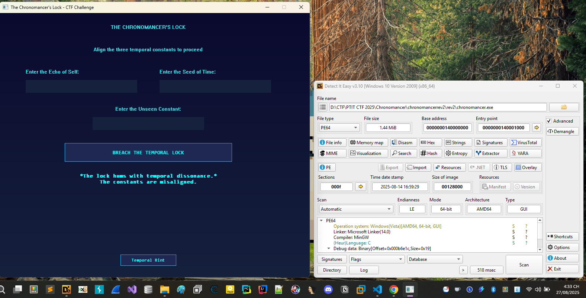
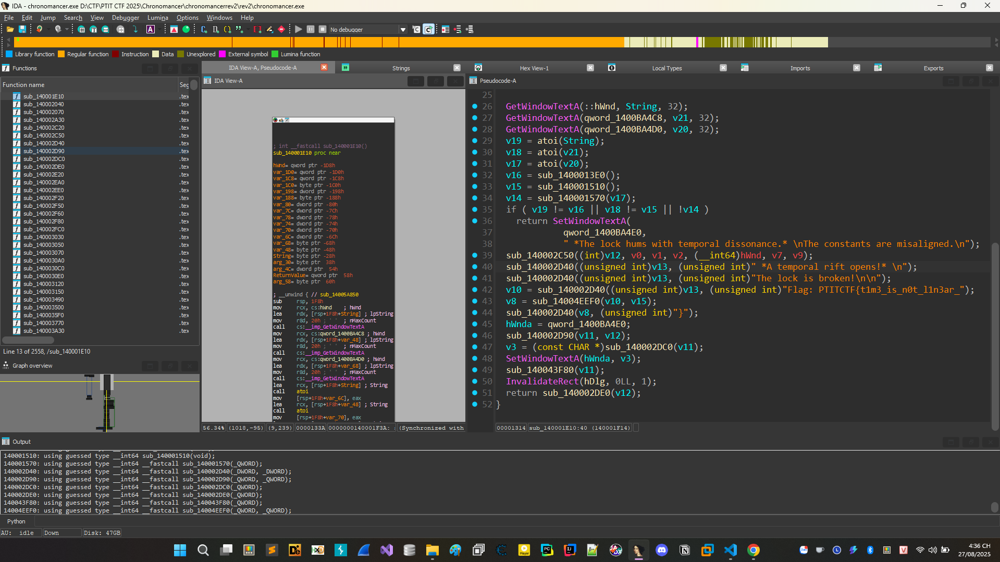
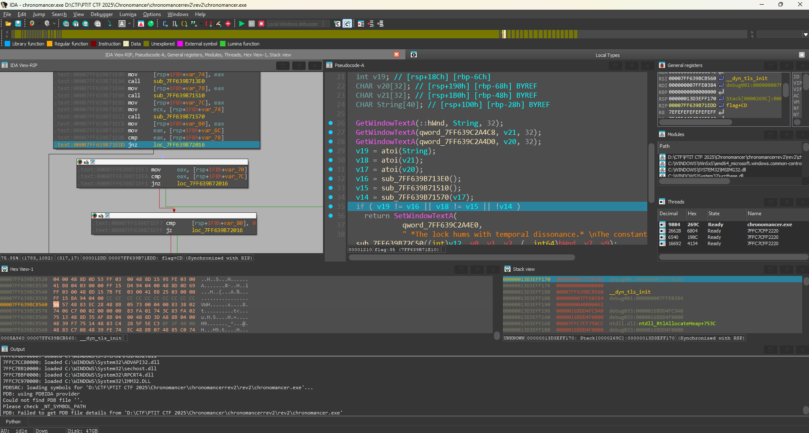
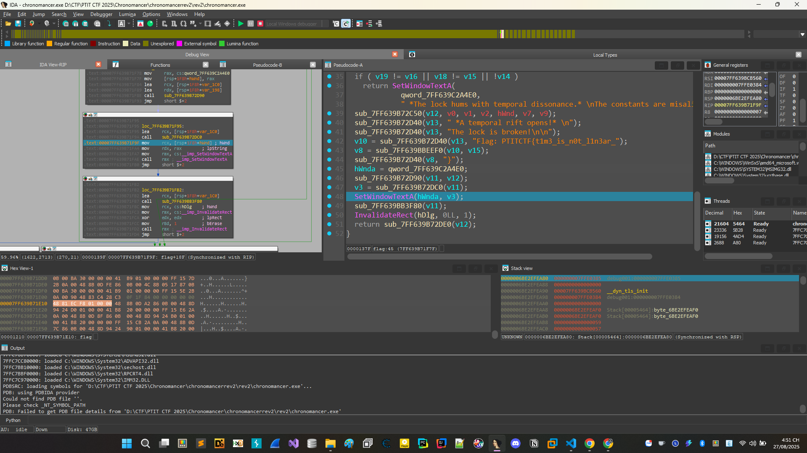
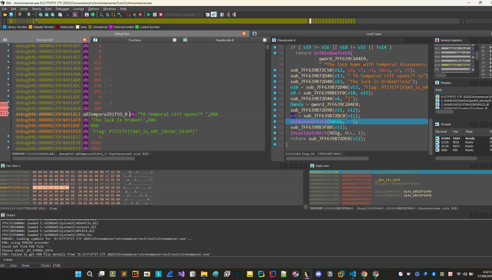

# Chronomancer



Oke mới vào thấy chương trình khá phức tạp phải nhập nhập gì đấy, code C tiến hành mở bằng IDA lên tìm thử xem có gì hay ho không.



Sau khi load vào IDA mình sử dụng String để tìm kiếm các chuỗi vào xref được đến hàm này, lúc này mình thấy khá nhiều ae solve nhanh bài này mình đã nghĩ ngay đến việc debug láo nhảy hảy đến đây xem luôn có gì hay ho không.

Trông đoạn này khá giống việc nó nối và in ra flag. Oke tiến hành đặt breakpoint ở đầu hàm và debug.



Debug nhảy RIP đến cái hàm nãy chúng ta vừa nói đoạn này mình sẽ thực hiện việc chỉnh cờ hoặc code (hoặc gì đó tùy các bạn), miễn là nhảy được vào bên trong xem nó làm cái gì, cứ như vậy sửa tiếp và đi sâu vào đúng luồng mà chúng ta muốn.



Khi debug đoạn này anh em thấy nó sẽ set đoạn text kia lên gui và hiển thị chúng ta ấn vào v3 và thu được flag




```PTITCTF{t1m3_is_n0t_l1n3ar_15347}```