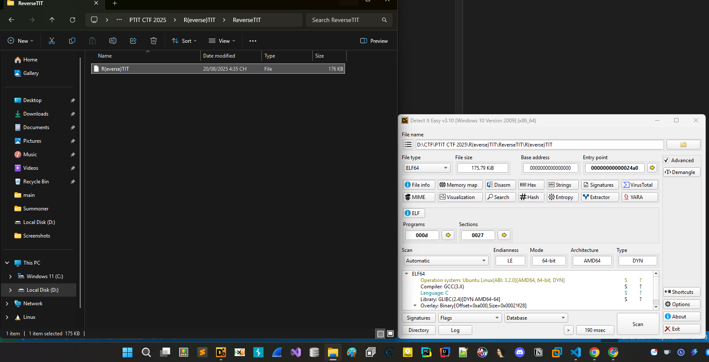
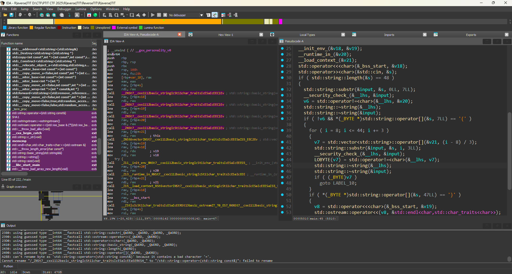
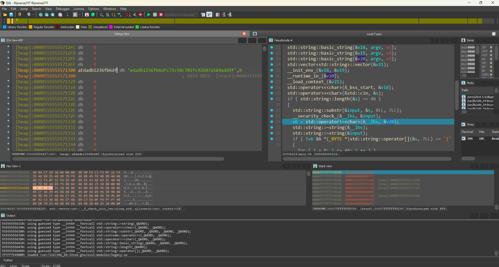
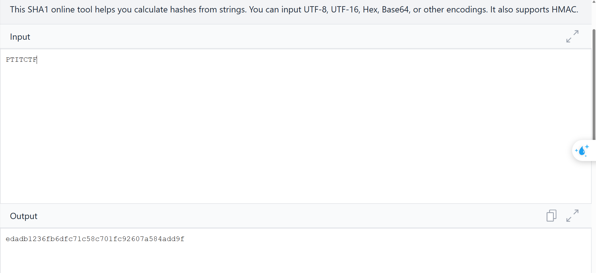
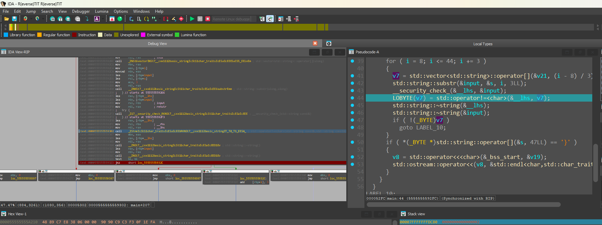

# R(everse)TIT



Lại là 1 chương trình C tiến hành load vào ida để phân tích.



Nhìn sơ sơ có vẻ flag có độ dài 48, tiến hành debug để hiểu sâu hơn về chương trình.

Debug với flag: 

```PTITCTF{AAAAAAAAAAAAAAAAAAAAAAAAAAAAAAAAAAAAAAA}```



Anh em có thể thấy chương trình cắt cái PTITCTF sau đó chuyển thành hash kia rồi compare tiếp. Rồi check kí tự tiếp theo có là { không. 
Đoạn này thực chất là check chuỗi có bằng SHA1 của chuỗi PTITCTF không.

Anh em có thể kiểm tra lại để chắc chắn hoặc thấy trong đống functions có hàm SHA1 nên cũng sẽ hơi nghi ngờ rồi.



Oke chuẩn.

Đoạn sau cũng tương tự anh em debug 1 hồi hoặc đọc sẽ hiểu nó cứ lấy 3 kí tự một đổi thành hash rồi so sánh việc của anh em lúc này là lấy ra từng hash một rồi brute sha1 3 kí tự và cuối cùng sẽ ghép ra được 1 flag hoàn chỉnh vì 3 kí tự nên sẽ brute được hết thôi.



Anh em cứ debug ở đoạn này chỉnh cái jz thành jnz rồi cứ nhảy nhảy lấy hết cái hash ở v7 là sẽ được list hash flag.

```Python3
import hashlib
import itertools
import string

hash_flag = [
    "0a4d82caaf74346c40ca0ba69f89369724ca9035",
    "ea9259b4a6f43783cdf6aa523e9db3412963b31c",
    "156cc4c77e3bf1dcb387b189b56309dde6ef6220",
    "b5efa8eadf6f33f30d19468ebdf52d155526d2de",
    "987e2a2582fa4ddd068259c1ae224615e5062157",
    "6512cf6bb1044e3dc68030a8d6d669257dafa9bc",
    "44e5a6f66307595eae078a70dd059662aadfc43b",
    "7925a6c0d9b673bbdef61b8f4c45fe3e14ba9e03",
    "a7a3472af6383407428a85ed8062165fb2ca772f",
    "6fa550f5c70df6f3b67e3483ba841a2aa2a0a89e",
    "2ae7b876a4073754b71cc8501a3fc2b255c154ce",
    "542ec1a1f6d635ffa543cc877622854254d8e25f",
    "c1d5e47df628b6ca0f1f832e6dd29897e2b0b9fe"
]
charset = string.printable  

list_hash = []

print("PTITCTF{",end="")
for tup in itertools.product(charset, repeat=3):
    s = ''.join(tup)
    h = hashlib.sha1(s.encode('utf-8')).hexdigest()
    list_hash.append(h + "|" + s)

for i in range(len(hash_flag)):
    for item in list_hash:
        h, s = item.split("|", 1)
        if h == hash_flag[i]:
            print(f"{s}",end="")

print("}",end="")
# PTITCTF{7h47_15_7h3_W4Y_W3_50lv3_7h15_ch4ll3n93
```