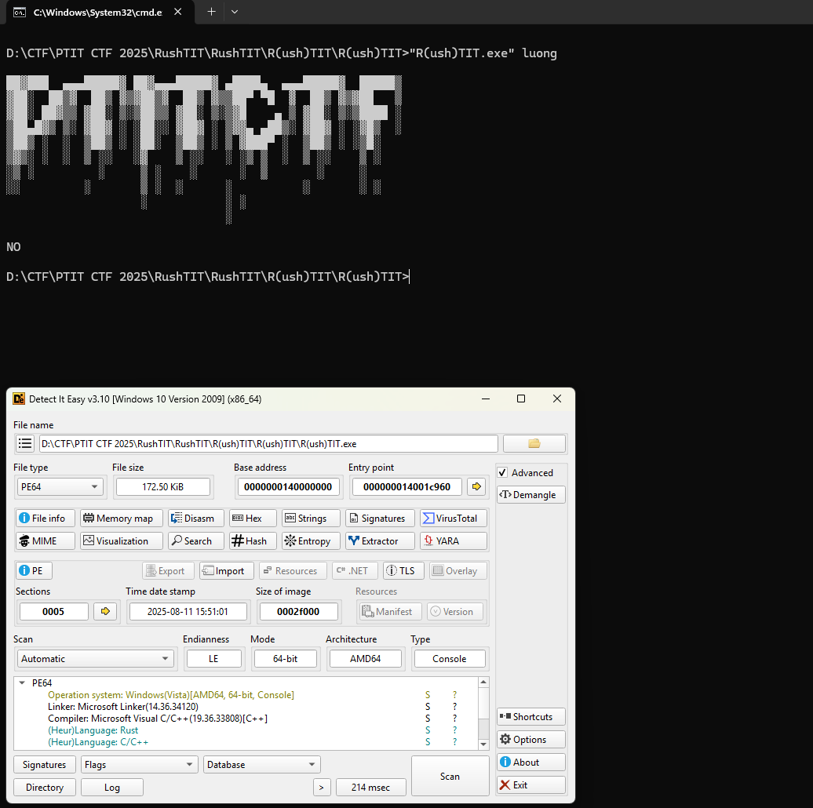
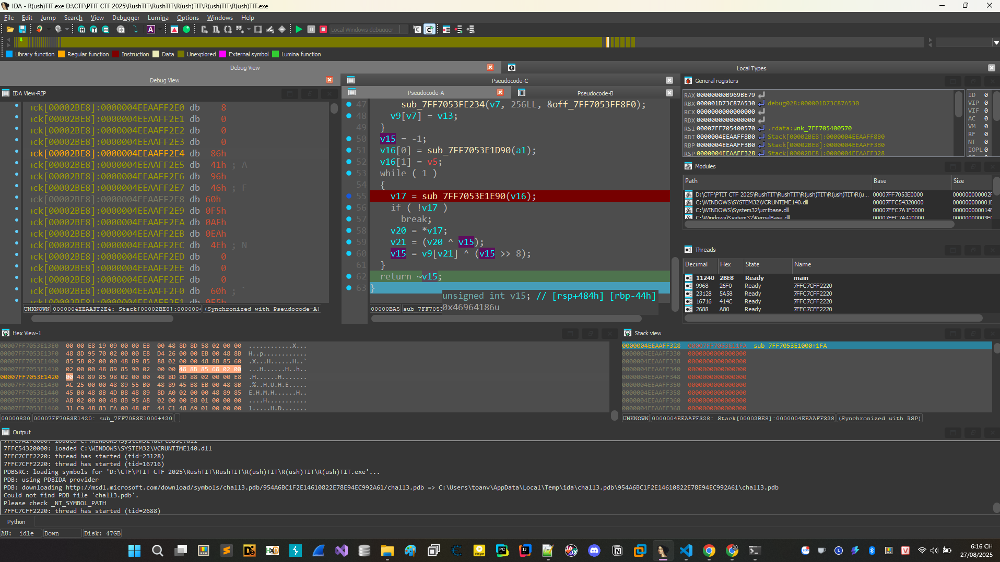

# R(ush)TIT

Có vẻ bài này tiếp tục là 1 bài flag checker nhưng lại được viết bằng rust.



Tiến hành load vào ida để phân tích.


```
__int64 sub_7FF7053E1000()
{
  __int64 copy_inp; // rax
  __int64 v1; // rdx
  __int64 v2; // rax
  __int64 v3; // rax
  __int64 v4; // rdx
  int *v5; // rdx
  int v7; // [rsp+2Ch] [rbp-54h]
  unsigned __int64 lenInp; // [rsp+98h] [rbp+18h]
  __int64 v9; // [rsp+A0h] [rbp+20h]
  int (__cdecl *inp)(unsigned __int16); // [rsp+A8h] [rbp+28h]
  _QWORD v11[2]; // [rsp+D0h] [rbp+50h] BYREF
  _QWORD v12[6]; // [rsp+E0h] [rbp+60h] BYREF
  __int128 v13; // [rsp+110h] [rbp+90h] BYREF
  __int128 v14; // [rsp+128h] [rbp+A8h] BYREF
  unsigned __int64 v15[3]; // [rsp+138h] [rbp+B8h] BYREF
  __int128 v16[2]; // [rsp+150h] [rbp+D0h] BYREF
  _QWORD v17[6]; // [rsp+170h] [rbp+F0h] BYREF
  __int128 v18; // [rsp+1A0h] [rbp+120h] BYREF
  __int128 v19; // [rsp+1B8h] [rbp+138h] BYREF
  unsigned __int64 v20[6]; // [rsp+1C8h] [rbp+148h] BYREF
  unsigned __int64 v21[3]; // [rsp+1F8h] [rbp+178h] BYREF
  __int64 v22[2]; // [rsp+210h] [rbp+190h] BYREF
  _BYTE *v23; // [rsp+220h] [rbp+1A0h]
  char charOfInput; // [rsp+22Fh] [rbp+1AFh] BYREF
  _DWORD v25[42]; // [rsp+230h] [rbp+1B0h]
  _QWORD v26[3]; // [rsp+2D8h] [rbp+258h] BYREF
  _QWORD v27[3]; // [rsp+2F0h] [rbp+270h] BYREF
  __int64 v28[3]; // [rsp+308h] [rbp+288h] BYREF
  unsigned __int64 v29; // [rsp+320h] [rbp+2A0h]
  int *v30; // [rsp+328h] [rbp+2A8h]
  _QWORD v31[6]; // [rsp+330h] [rbp+2B0h] BYREF
  _QWORD v32[8]; // [rsp+360h] [rbp+2E0h] BYREF
  int v33; // [rsp+3A4h] [rbp+324h]
  _BYTE *v34; // [rsp+3A8h] [rbp+328h]
  int v35; // [rsp+3B4h] [rbp+334h]
  __int64 v36; // [rsp+3B8h] [rbp+338h]

  v36 = -2LL;
  v11[0] = asc_7FF7053FF380;
  v11[1] = 1097LL;
  sub_7FF7053E4220(&v14, v11);
  v13 = v14;
  sub_7FF7053E1C70(v12, &unk_7FF7053FF7D0, &v13);
  sub_7FF7053EA750(v12);
  sub_7FF7053E88E0(v16);
  sub_7FF7053E4820(v15, v16);
  if ( sub_7FF7053E5A90(v15) != 2 )
  {
    v9 = sub_7FF7053E5D20(v15, 0LL, &off_7FF7053FF890);
    sub_7FF7053E41E0(&v19, v9);
    v18 = v19;
    sub_7FF7053E1C70(v17, &off_7FF7053FF8B8, &v18);
    sub_7FF7053EA860(v17);
    sub_7FF7053ECB90(1u);
  }
  inp = sub_7FF7053E5D20(v15, 1uLL, &off_7FF7053FF800);
  v32[6] = inp;
  lenInp = len(inp);
  if ( lenInp < 4 )
    sub_7FF7053FE560(&off_7FF7053FF818);
  if ( lenInp != 42 )
  {
    sub_7FF7053E1CC0(v20, &off_7FF7053FF868);
    sub_7FF7053EA860(v20);
    sub_7FF7053ECB90(1u);
  }
  sub_7FF7053E58A0(v21);
  copy_inp = sub_7FF7053E18B0(inp);
  v22[0] = sub_7FF7053E1D90(copy_inp);
  v22[1] = v1;
  while ( 1 )
  {
    v23 = sub_7FF7053E1E90(v22);
    if ( !v23 )
      break;
    v34 = v23;
    charOfInput = *v23;
    v35 = sub_7FF7053E1640(&charOfInput, 1LL);
    sub_7FF7053E5AA0(v21, v35, &off_7FF7053FF878);
  }
  v25[0] = 0xB969BE79;
  v25[1] = 0xBE047A60;
  v25[2] = 0xDD0216B9;
  v25[3] = 0xBE047A60;
  v25[4] = 0x3DD7FFA7;
  v25[5] = 0xBE047A60;
  v25[6] = 0x4DBD0B28;
  v25[7] = 0x15D54739;
  v25[8] = 0x4AD0CF31;
  v25[9] = 0x83DCEFB7;
  v25[10] = 0x7808A3D2;
  v25[11] = 0x8D076785;
  v25[12] = -186917087;
  v25[13] = -1637089325;
  v25[14] = 701932520;
  v25[15] = 1466425173;
  v25[16] = -227710402;
  v25[17] = -2068763730;
  v25[18] = 1790921346;
  v25[19] = -69523947;
  v25[20] = 701932520;
  v25[21] = 1037565863;
  v25[22] = -206169288;
  v25[23] = 1812594589;
  v25[24] = 30677878;
  v25[25] = -186917087;
  v25[26] = 701932520;
  v25[27] = -2082672713;
  v25[28] = 2013832146;
  v25[29] = 701932520;
  v25[30] = -1107002784;
  v25[31] = -1855256857;
  v25[32] = 1842515611;
  v25[33] = 701932520;
  v25[34] = 1466425173;
  v25[35] = 1842515611;
  v25[36] = 1801730948;
  v25[37] = 1842515611;
  v25[38] = 0x6C09FF9D;
  v25[39] = 0x84B12BAE;
  v25[40] = 0x6DD28E9B;
  v25[41] = 0xFCB6E20C;
  v2 = sub_7FF7053E5D00(v21);
  v3 = sub_7FF7053E31E0(v2);
  sub_7FF7053E1D00(v27, v3, v4);
  sub_7FF7053E3AD0(v26, v27);
  v28[0] = v26[0];
  v28[1] = v26[1];
  v28[2] = v26[2];
  while ( 1 )
  {
    v29 = sub_7FF7053E39E0(v28);
    v30 = v5;
    if ( !v5 )
      break;
    v32[7] = v29;
    v7 = *v30;
    v33 = *v30;
    if ( v29 >= 42 )
      sub_7FF7053FE234(v29, 42LL, &off_7FF7053FF848);
    if ( v7 != v25[v29] )
    {
      sub_7FF7053E1CC0(v31, &off_7FF7053FF868);
      sub_7FF7053EA750(v31);
      sub_7FF7053ECB90(1u);
    }
  }
  sub_7FF7053E1CC0(v32, &off_7FF7053FF838);
  sub_7FF7053EA750(v32);
  sub_7FF7053E34E0(v21);
  return sub_7FF7053E3760(v15);
}
```


Sau một hồi tôi phân tích được như thế này anh em có thể thấy luồng  input bị thay đổi như thế nào. Tiến hành debug để hiểu thêm về chương trình.

Điều quan trọng ae nên để ý đoạn này là hàm sub_7FF7053E1640 chúng thực hiện việc nhả từng kí tự vào để mã hóa anh em để ý bên ngoài lại có mảng cipher bằng đúng độ dài của flag chuẩn.

Lúc này anh em có thể đoán rằng chương trình mã hóa từng kí tự ra cái hash kia. 

Bên trong hàm mã hóa kia

```
__int64 __fastcall sub_7FF7053E1640(__int64 a1, __int64 a2)
{
  __int64 v2; // rdx
  unsigned __int64 v3; // rdx
  int v4; // edx
  __int64 v5; // rdx
  unsigned __int64 v7; // [rsp+40h] [rbp-488h]
  _DWORD v9[256]; // [rsp+58h] [rbp-470h] BYREF
  __int64 v10[2]; // [rsp+458h] [rbp-70h] BYREF
  __int64 v11; // [rsp+468h] [rbp-60h]
  unsigned __int64 v12; // [rsp+470h] [rbp-58h]
  unsigned int v13; // [rsp+478h] [rbp-50h]
  int v14[2]; // [rsp+47Ch] [rbp-4Ch] BYREF
  unsigned int v15; // [rsp+484h] [rbp-44h]
  __int64 v16[2]; // [rsp+488h] [rbp-40h] BYREF
  char *v17; // [rsp+498h] [rbp-30h]
  int (__cdecl *inp)(unsigned __int16); // [rsp+4A0h] [rbp-28h]
  __int64 is1; // [rsp+4A8h] [rbp-20h]
  char v20; // [rsp+4B7h] [rbp-11h]
  __int64 v21; // [rsp+4B8h] [rbp-10h]
  unsigned __int64 v22; // [rsp+4C0h] [rbp-8h]

  inp = a1;
  is1 = a2;
  memset(v9, 0, sizeof(v9));
  v10[0] = sub_7FF7053E4570(0LL);
  v10[1] = v2;
  while ( 1 )
  {
    v11 = sub_7FF7053E4520(v10);
    v12 = v3;
    if ( (v11 & 1) == 0 )
      break;
    v7 = v12;
    v22 = v12;
    v13 = v12;
    v14[0] = sub_7FF7053E4560(0);
    v14[1] = v4;
    while ( (sub_7FF7053E4540(v14) & 1) != 0 )
    {
      if ( (v13 & 1) != 0 )
        v13 = (v13 >> 1) ^ 0xEDB88320;
      else
        v13 >>= 1;
    }
    if ( v7 >= 0x100 )
      sub_7FF7053FE234(v7, 256LL, &off_7FF7053FF8F0);
    v9[v7] = v13;
  }
  v15 = -1;
  v16[0] = sub_7FF7053E1D90(a1);
  v16[1] = v5;
  while ( 1 )
  {
    v17 = sub_7FF7053E1E90(v16);
    if ( !v17 )
      break;
    v20 = *v17;
    v21 = (v20 ^ v15);
    v15 = v9[v21] ^ (v15 >> 8);
  }
  return ~v15;
}
```

Input mẫu của tôi debug sẽ là PTITCTF{AAAAAAAAAAAAAAAAAAAAAAAAAAAAAAAAA}

Anh em thấy đây là mã hóa CRC32. Ở lần đầu debug chương trình sẽ truyền vào chữ P và số 1 vào debug nhảy đến đoạn mà hàm nó return về.



Oke anh em thấy nó trả về ~v15 mà chúng ta lại thấy 

```
unsigned int v15; // [rsp+484h] [rbp-44h]
0x46964186u
```
```~0x46964186 = 0xB969BE79 = v25[0]```

Đến đoạn này thì đã rõ chương trình thực hiện việc biến đổi crc32 từng kí tự một.

Tạo code giải và chúng ta sẽ thu được flag.

```Python
import zlib

v25 = [
    0xB969BE79, 0xBE047A60, 0xDD0216B9, 0xBE047A60, 0x3DD7FFA7,
    0xBE047A60, 0x4DBD0B28, 0x15D54739, 0x4AD0CF31, 0x83DCEFB7,
    0x7808A3D2, 0x8D076785, -186917087, -1637089325, 701932520,
    1466425173, -227710402, -2068763730, 1790921346, -69523947,
    701932520, 1037565863, -206169288, 1812594589, 30677878,
    -186917087, 701932520, -2082672713, 2013832146, 701932520,
    -1107002784, -1855256857, 1842515611, 701932520, 1466425173,
    1842515611, 1801730948, 1842515611, 0x6C09FF9D, 0x84B12BAE,
    0x6DD28E9B, 0xFCB6E20C
]

v25 = [(x + (1 << 32)) & 0xFFFFFFFF for x in v25]

decoded = ""

for crc in v25:
    found = None
    for c in range(32, 127):  # ASCII printable
        b = bytes([c])
        calc = zlib.crc32(b) & 0xFFFFFFFF
        if calc == crc:
            found = chr(c)
            break
    decoded += found if found else '?'

print(decoded)
# PTITCTF{B1n90!_Ru57y_C4rg0_1n_Th3_R3v3r53}
```