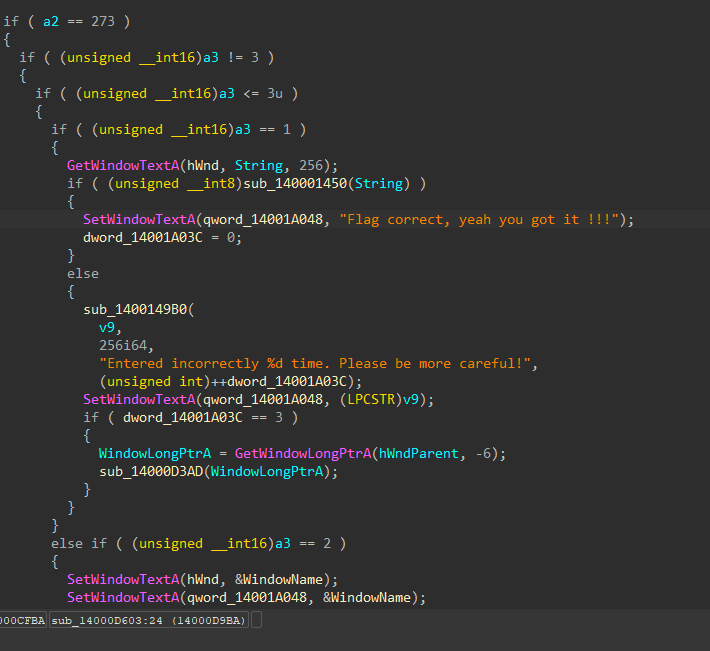
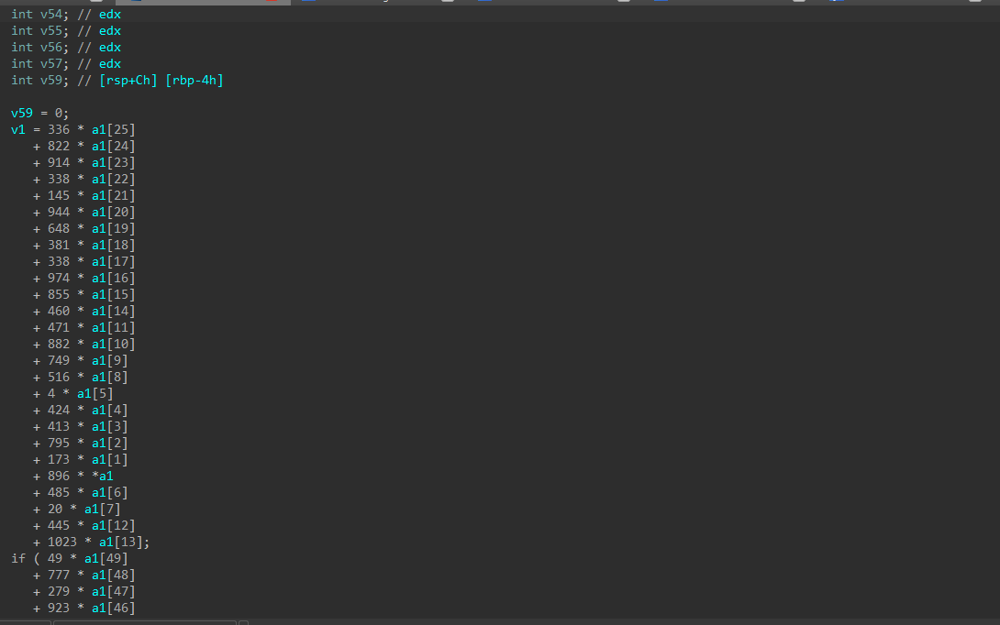

# FlagChecker.exe [First Solve Challenge]

## Mở đầu
- Đây là một challenge, giải toán thực sự, tôi cũng đã từng nhìn thấy về giải pháp cách làm này, nhưng tôi không nghĩ là nó có thể giải quyết được. Khá bất ngờ.
- Phần kiểm tra flag khi nhập vào khá dễ dàng để tìm thấy


- Khá rõ dàng , hàm check kia rồi 


- Nhận ra a1 là mảng flag của chúng ta , code tạo hàng loạt code so sánh và trả về true nếu đúng . Thứ chúng ta cần là tìm lại giá trị của mảng a1 , mảng a1 là mảng ord()
## Tản mạn
- Python là một ngôn ngữ mạnh nó hỗ trợ các thư viện tốt .Tôi từng biết đến 1 thư viện Z3. Nhưng tôi không biết nó có thể giải được những thứ phức tạp như thế này.

## Đến code giải
- Vì phần code khá dài nên tôi sẽ link code ở đây
[ấn vào để xem code](solve.py)
- Đây là phần đau đầu nhất, tôi đã mất hàng giờ để làm, phần phức tạp ở bài này chính là việc bóc tách dữ liệu, bạn thực sự cần kiên trì.
- Sau hàng giờ cố gắng tôi đã tìm thấy flag
```PTITCTF{Y0u_C4n_Br34k_Equ4tion_Ag41n_6861696e64!!!}```
# Kết
Đây là 1 challenge giúp chúng ta có thêm hiểu biết về thư viện trong python.

