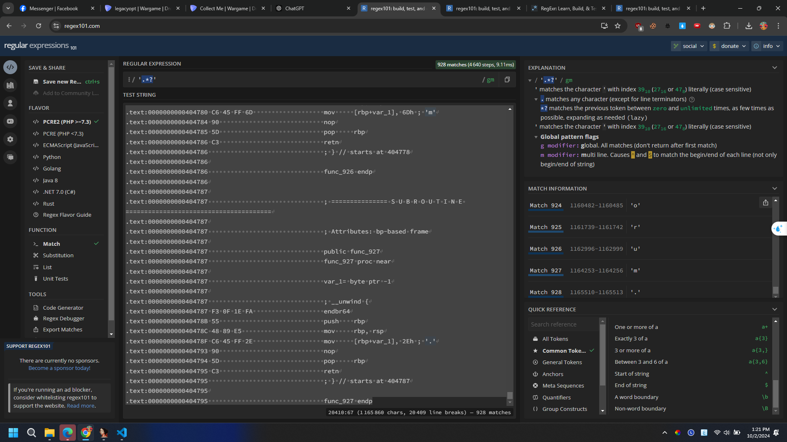

# Collect Me
## Solution
[Link challenge](https://dreamhack.io/wargame/challenges/672)


- Đọc qua đề bài chúng ta hiểu trong mỗi function chúng sẽ được khai báo 1 kí tự. Ghép lại tất cả các kí tự trong funcion đó sẽ ra được 1 đoạn văn và trong đoạn văn đó sẽ chứa flag.

- Thả vào IDA ta thấy cấu trúc 1 func như hình, nếu làm theo cách ngu ngốc nhất thì quá tốn thời gian từ fun 0 đến 927 quá tốn thời gian. 

- Sử dụng Regex để làm tối ưu thời gian trích xuất dữ liệu. Đây là trang web tôi sử dụng [Web Regex](https://regex101.com/)

- Tôi vào hàm main và tiến hành copy tất cả các function để tiến hành regex lấy dữ liệu.

- Sử dụng regex với pattern ```'.*?'``` , tôi đã thành công export được tất cả 928 kí tự. Đây là một pattern khá đơn giản nhưng lại hiểu quả đại loại là nó sẽ lấy nội dung từ kí tự bắt đầu đến kí tự kết thúc.

- Việc còn lại tiếp là loại bỏ dấu ' và dấu xuống dòng không cần thiết, tiến hành ghép chúng lại hoàn chỉnh thành một đoạn văn.
- Tôi lưu lại data vào file txt và viết 1 đoạn script nhỏ
```Python
with open('data.txt', 'r', encoding='utf-8') as file:
    lines = file.readlines()  
for line in lines:
    print(line.strip(),end="")  
```
- Sau khi chạy tôi nhận được nội dung hoàn chỉnh và chỉ cần Ctrl + H để loại bỏ nốt kí tự '. Tôi nhận được đoạn văn hoàn chỉnh và chứa flag

## Kết
- Nhận được flag ```DH{14d2f0c62de3cf038b52f9f60755af2b}```