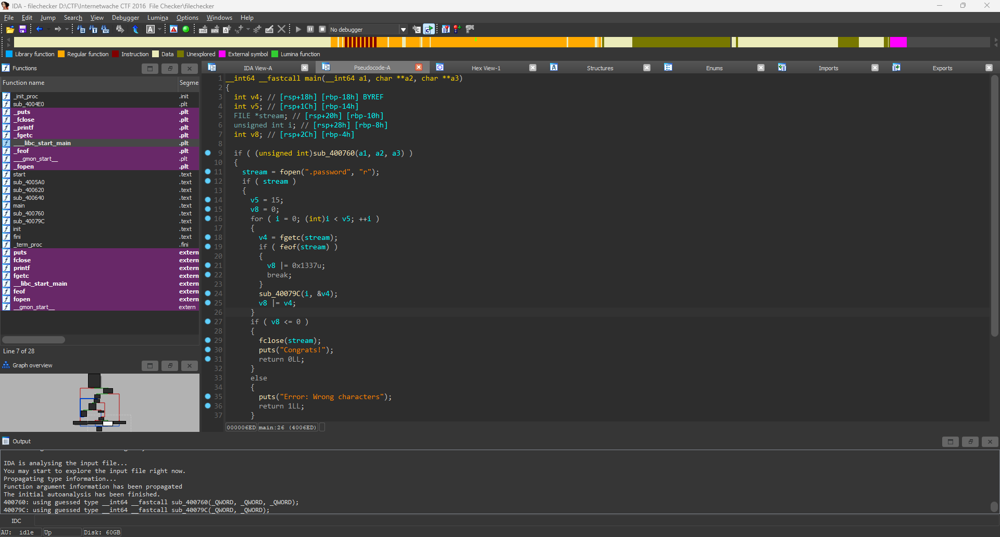
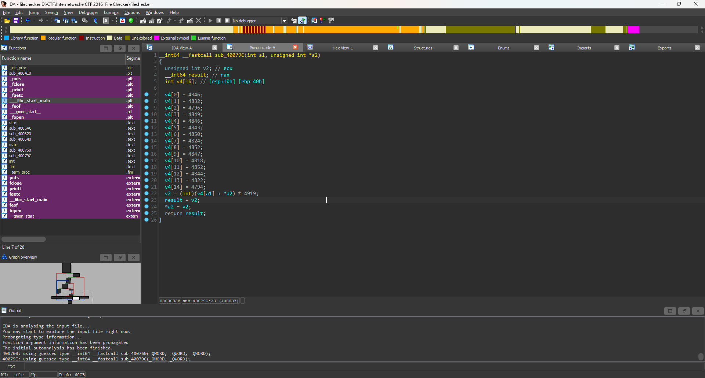

# filechecker
## Solution


- Tôi sử dụng IDA và tiến hành đọc hiểu code , chương trình này đọc data từ file <b>.password</b>, vòng for từ 0 đến 15, ta có thể dễ dàng đoán đây là chiều dài password, nó đọc từng kí tự trong đó và đưa vào hàm rồi nó thực hiện phép OR với v8 = 0.
- Nhìn xuống dưới nếu v8 <=0 thì sẽ là password đúng chứng tỏ phép v8 |= v4 phải bằng 0 chính là điều kiện cần thiết để đạt được điều chúng ta muốn.

- Đi vào hàm <b>sub_40079C</b> hàm này nhận 2 tham số thứ nhất là giá trị i của vòng lặp và kí tự i trong chuỗi password. 
- Đọc dưới điều kiện thì hàm trả a2 được gán bằng v2,
mà a2 chính là giá trị v4 của chúng ta mà ban đầu truyền vào. Chứng tỏ bây giờ nếu kí tự đúng trong pass thì v4 sẽ bằng 0.
- Bên trên ta thấy v2 = (int)(v4[a1] + *a2) % 4919
*a2 là giá trị chúng ta nhập như vậy dễ hiểu nếu input đúng thì  (int)(v4[a1] + *a2) = 4919
- Mà chúng ta đã có v4 bên trên , tôi tiến hành viết code python để giải mã.
```Python
v4 = [0]*15
v4[0] = 4846
v4[1] = 4832
v4[2] = 4796
v4[3] = 4849
v4[4] = 4846
v4[5] = 4843
v4[6] = 4850
v4[7] = 4824
v4[8] = 4852
v4[9] = 4847
v4[10] = 4818
v4[11] = 4852
v4[12] = 4844
v4[13] = 4822
v4[14] = 4794
print((v4[0] + 97) % 4919)
for i in range(15):
    v4[i] = 4919 - v4[i]
print(''.join(chr(x) for x in v4))
```
- Sau khi chạy tôi đã nhận được chuỗi pass
```IW{FILE_CHeCKa}```
