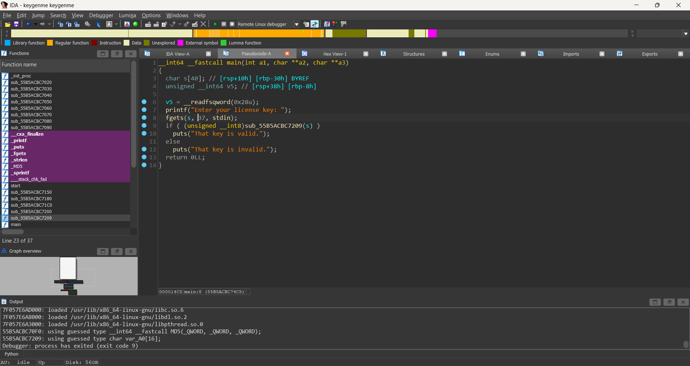
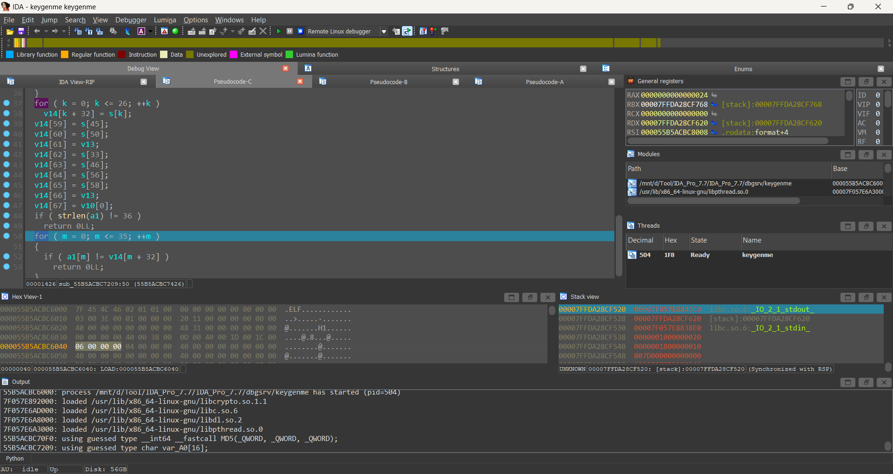

# Keygenme [PicoCTF]
[Link challenge](https://play.picoctf.org/practice/challenge/276?category=3&page=1&search=Keygen)

## Solution
- Đầu tiên tôi mở và view file bằng IDA

- Tóm lại chương trình này yêu cầu người dùng nhập và đi hàm hàm check kia

- Sau khi đọc code 1 lượt tôi đã hiểu , hàm này thực hiện việc gán dữ liệu, từ a1 là input sang v14. Việc làm của tôi chỉ là đặt breakpoint và lấy dữ liệu của v14 là thứ đang chứa flag
- Tôi tiến hành đặt breakpoint và lấy dữ liệu, tiến hành viết code solve
```Python
ida_chars = [ 99,  98,  98,  49,  56,  52, 100, 100,  56, 101, 48,  53,  99,  57,  55,  48,  57, 101,  53, 100, 99,  97, 101, 100,  97,  97,  48,  52,  57,  53, 99, 102, 112, 105,  99, 111,  67,  84,  70, 123, 98, 114,  49, 110, 103,  95, 121,  48, 117, 114, 95,  48, 119, 110,  95, 107,  51, 121,  95,  49, 57,  56,  51,  54,  99, 100,  56, 125]
data = "".join(chr(x) for x in ida_chars)
print(data)
```
- Sau khi chạy code, tôi nhận được flag ở cuối từ picoCTF{...}
# Kết
Flag là ```picoCTF{br1ng_y0ur_0wn_k3y_19836cd8}``` 