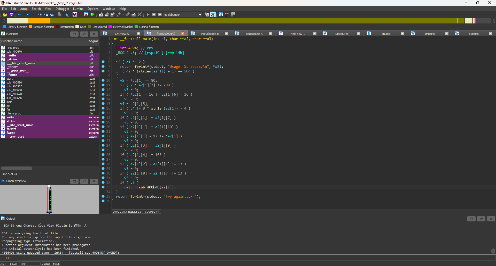
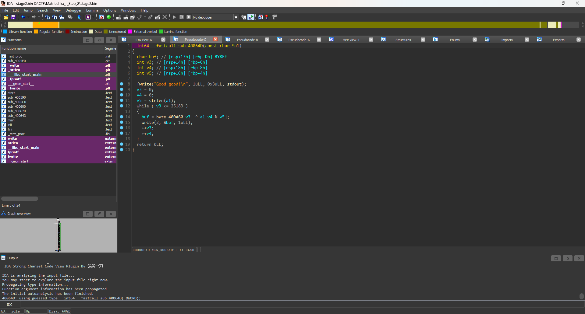

# Matriochka Step_2
## Solution

- Sau khi thả file vào IDA ta phân tích chương trình lấy, dữ liệu từ người dùng chuỗi pass
- Đầu tiên ta có thể dễ dàng tính được len của chuỗi nhờ vào câu lệnh điều kiện ban đầu 42 * (strlen(a2[1]) + 1) == 504 như vậy dễ dàng tính được len của chuỗi đúng sẽ là 11.
- Tiếp theo là 1 loạt câu lệnh so sánh và nếu v5 != 0 thì chương trình sẽ nhảy vào được hàm sub_40064D(a2[1]);

- Như vậy chỉ cần v5 != 0 thì chương trình sẽ đi đúng luồng chúng ta muốn, quay lại hàm main ban đầu

- Chúng ta có thể dễ dàng giải tay ngược lại những điều kiện kia để tìm lại được chuỗi đúng hoàn chỉnh,do có đúng 11 phương trình hoặc giá trị.
- Chúng ta có thể giải tay hoặc sử dụng module z3 đây là code mẫu của tôi trong 2 trường hợp
```Python
#SOLUTION 1
a1 = [0]*11
a1[0] = 80
a1[3] = 100
a1[6] = a1[0] + 16 + 16
a1[5] = 9 * 11 - 4
a1[1] = a1[0] + 17
a1[7] = a1[1]
a1[10] = a1[1]
a1[9] = a1[3]
a1[4] = 105
a1[2] = a1[1] + 13
a1[8] = a1[7] + 13
print(a1)
print(''.join(chr(x) for x in a1))
#SOLUTION 2
from z3 import *
solver = Solver()
a2_1 = [Int(f'a2_1[{i}]') for i in range(12)]
for i in range(12):
    solver.add(a2_1[i] >= 32, a2_1[i] <= 126)
solver.add(a2_1[0] == 80)
solver.add(2 * a2_1[3] == 200)
solver.add(a2_1[0] + 16 == a2_1[6] - 16)
solver.add(a2_1[5] == 9 * 11 - 4)
solver.add(a2_1[1] == a2_1[7])
solver.add(a2_1[1] == a2_1[10])
solver.add(a2_1[1] - 17 == a2_1[0])
solver.add(a2_1[3] == a2_1[9])
solver.add(a2_1[4] == 105)
solver.add(a2_1[2] - a2_1[1] == 13)
solver.add(a2_1[8] - a2_1[7] == 13)
if solver.check() == sat:
    model = solver.model()
    result = ''.join([chr(model[a2_1[i]].as_long()) for i in range(12)])
    print("Solution for a2[1]:", result)
else:
    print("No solution found")
```
## Kết
Sau khi chạy code ta nhận được mã đúng gồm 11 kí tự ```Pandi_panda```