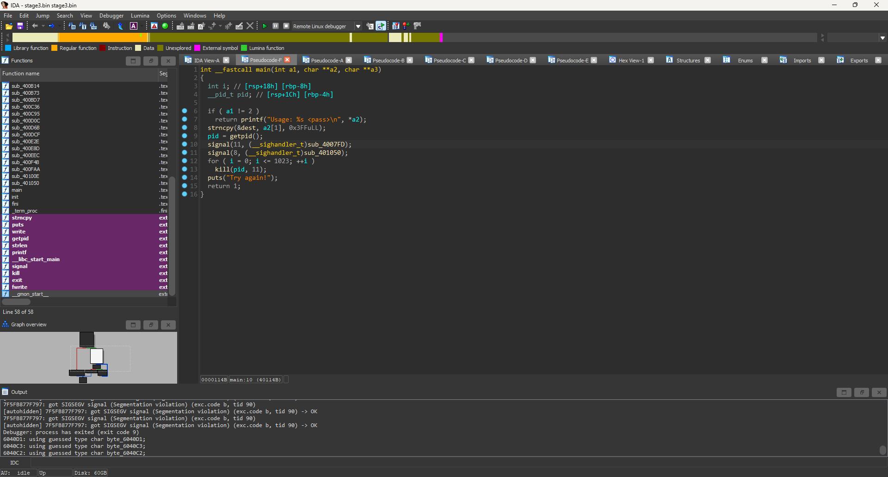
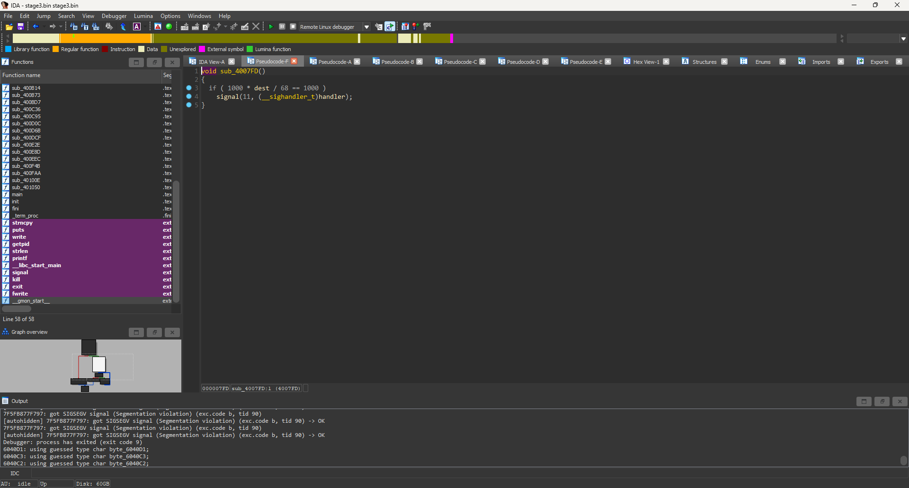

# Matriochka - Step 3
## Solution

- Sau khi thả code vào IDA, chúng ta nhận được mã giả,sau khi debug tôi biết dest là từng kí tự nhập vào, việc làm của tôi là duy trì chương trình, thỏa mãn các điều kiện, như 1 chuỗi đúng

- Việc làm của tôi chỉ là như vậy duy trì chương trình như những gì nó muốn và tôi sẽ tìm lại được chuỗi pass đúng.
```Python
a = [68,105,100,95,121,111,117,95,108,105,107,101,95,115,105,103,110,97,108,115,63]
print("".join(chr(x) for x in a))
```
## Kết
- Sau khi chạy code tôi đã nhận được mã nguồn của thử thách tiếp theo. Mã đúng là ```Did_you_like_signals?```