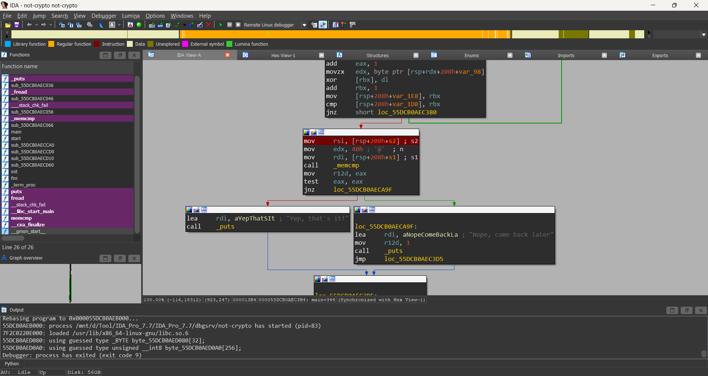
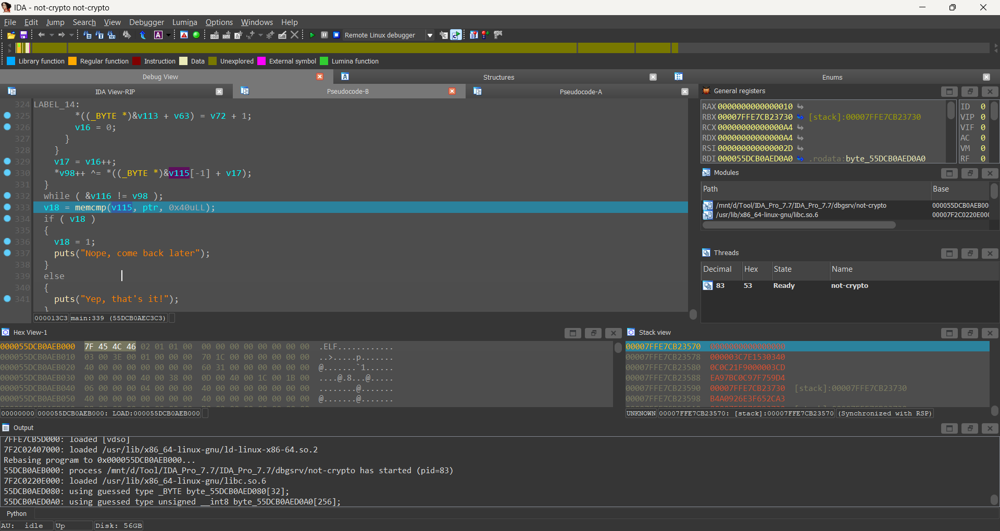
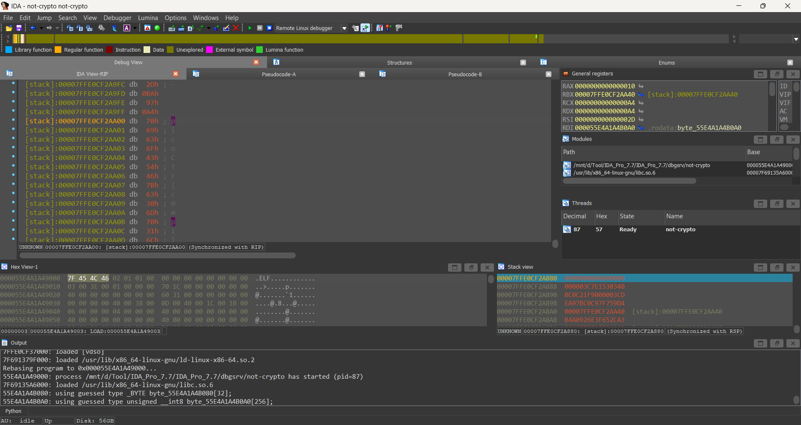

# not crypto [PicoCTF]

[Link challenge](https://play.picoctf.org/practice/challenge/222?category=3&difficulty=3&page=1&search=)

## Solution

- Bài này cũng khá tương tự bài Keygenme, việc tôi làm là kéo thả vào IDA và phân tích

- Đây là phần chúng ta cần chú ý. Tôi tiến hành phân tích.

- Tôi xác định dòng trên hàm memcmp nói về hàm này đây là thông tin tôi tìm hiểu được int memcmp(const void *buf1, const void *buf2, size_t count);
- Sau khi debug ở đây tôi nhận ra ptr là input của mình nhập vào còn lại chính là flag

- Quá rõ ràng tôi tiến hành viết code solve 
```Python
ida_chars =[0x70, 0x69, 0x63, 0x6F, 0x43, 0x54, 0x46, 0x7B, 0x63, 0x30, 
0x6D, 0x70, 0x31, 0x6C, 0x33, 0x72, 0x5F, 0x30, 0x70, 0x74, 
0x31, 0x6D, 0x31, 0x7A, 0x34, 0x74, 0x31, 0x30, 0x6E, 0x5F, 
0x31, 0x35, 0x5F, 0x70, 0x75, 0x72, 0x33, 0x5F, 0x77, 0x31, 
0x7A, 0x34, 0x72, 0x64, 0x72, 0x79, 0x5F, 0x62, 0x75, 0x74, 
0x5F, 0x6E, 0x30, 0x5F, 0x70, 0x72, 0x30, 0x62, 0x6C, 0x33, 
0x6D, 0x3F, 0x7D
]
flag = ""
for i in range(len(ida_chars)):
    flag += chr(int(ida_chars[i]))
print(flag)
```
# Kết
Sau khi chạy tôi đã nhận được flag ```picoCTF{c0mp1l3r_0pt1m1z4t10n_15_pur3_w1z4rdry_but_n0_pr0bl3m?}```