# RE1

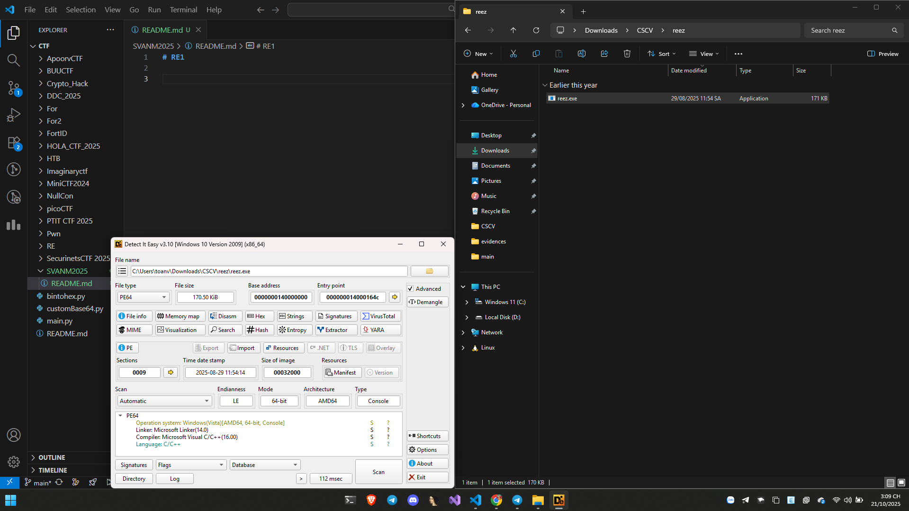

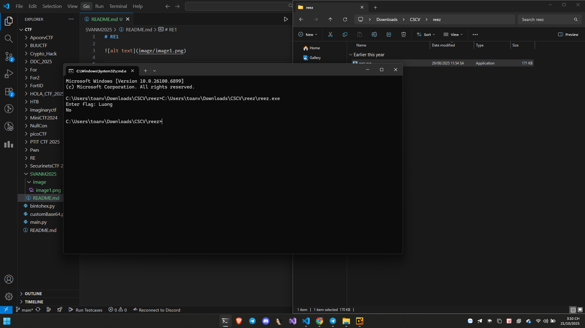

=> Đây có thể là dạng bài flag checker.


Dùng IDA để phân tích bằng mã giả chúng ta có:

```C
int __fastcall main(int argc, const char **argv, const char **envp)
{
  __int64 v3; // rdx
  __int64 v4; // r8
  __m128i si128; // xmm0
  const char *v6; // rcx
  _BYTE v8[32]; // [rsp+0h] [rbp-58h] BYREF
  char Str[16]; // [rsp+20h] [rbp-38h] BYREF
  __m128i v10; // [rsp+30h] [rbp-28h]
  __int64 v11; // [rsp+40h] [rbp-18h]
  __int64 v12; // [rsp+48h] [rbp-10h]

  v10 = 0LL;
  *Str = 0LL;
  v11 = 0LL;
  sub_1400010F0("Enter flag: ", argv, envp);
  sub_140001170("%32s", Str);
  if ( strlen(Str) != 32 )
  {
    puts("No");
    if ( (v8 ^ v12) == _security_cookie )
      return 0;
LABEL_5:
    __debugbreak();
  }
  si128 = _mm_load_si128(&xmmword_14001E030);
  *Str = _mm_xor_si128(_mm_load_si128(Str), si128);
  v10 = _mm_xor_si128(si128, v10);
  if ( _mm_movemask_epi8(_mm_and_si128(_mm_cmpeq_epi8(*Str, xmmword_140029000), _mm_cmpeq_epi8(v10, xmmword_140029010))) == 0xFFFF )
    v6 = &unk_140023E7C;
  else
    v6 = "No";
  sub_1400010F0(v6, v3, v4);
  if ( (v8 ^ v12) != _security_cookie )
    goto LABEL_5;
  return 0;
}
```

- Nhận ra flag có 32 kí tự.
- Lấy lần lượt 16 kí tự một để đem xor với key chính là ```xmmword_14001E030```.
- Rồi sau đó so sánh với giá trị đã có sẵn.

Thử viết code giải mã thử.

```Python
from binascii import unhexlify, hexlify
key = unhexlify("AAAAAAAAAAAAAAAAAAAAAAAAAAAAAAAA")
encrypted1 = unhexlify("CBCCF5D9C3F5D9C3C2DEF5D3D8D8C5D9")
encrypted2 = unhexlify("8B8B8B8B8B8B8B8B8BCDCBC6CCF5CFC1")
def decrypt(data, key):
  decrypted = bytearray()
  for i in range(len(data)):
    decrypted.append(data[i] ^ key[i])
  return decrypted
decrypted1 = decrypt(encrypted1, key)
decrypted2 = decrypt(encrypted2, key)
part1 = decrypted1[::-1].decode()
part2 = decrypted2[::-1].decode()
flag = part1 + part2
print(f"Flag: {flag}")
```

Như vậy có thể thấy rằng chắn chắn chương trình đã có anti debug làm thay đổi dữ liệu dẫn đến chúng ta nhận được fake flag.

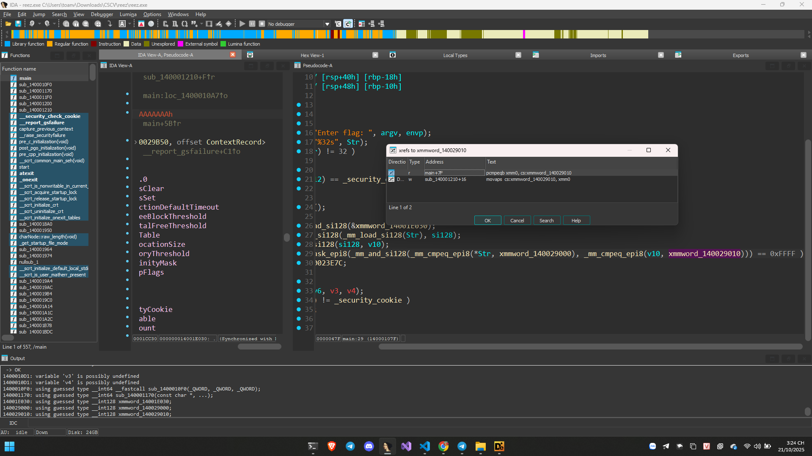

Như vậy đã có anti debug dùng hàm ```IsDebuggerPresent()```

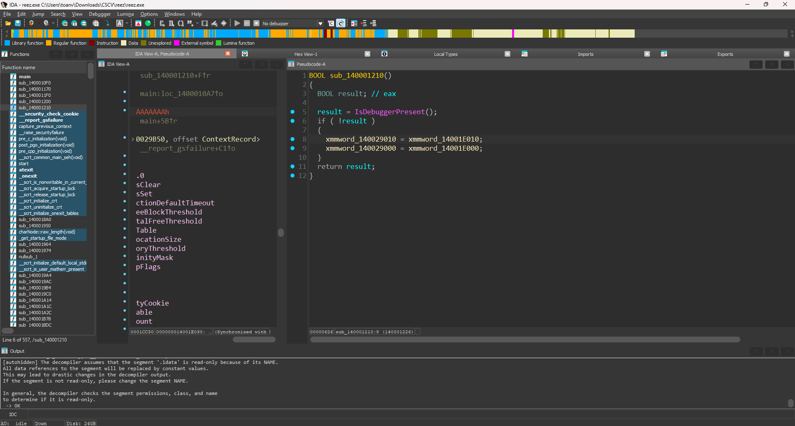

```Python
from binascii import unhexlify, hexlify
key = unhexlify("AAAAAAAAAAAAAAAAAAAAAAAAAAAAAAAA")
encrypted1 = unhexlify("939FCF9C9B9998C99DC8C9989ECFCB9A")
encrypted2 = unhexlify("9F9D9D9DCB989A9B999A98CF9DCFCFCF")
def decrypt(data, key):
  decrypted = bytearray()
  for i in range(len(data)):
    decrypted.append(data[i] ^ key[i])
  return decrypted
decrypted1 = decrypt(encrypted1, key)
decrypted2 = decrypt(encrypted2, key)
part1 = decrypted1[::-1].decode()
part2 = decrypted2[::-1].decode()
flag = part1 + part2
print(f"Flag: {flag}")
```

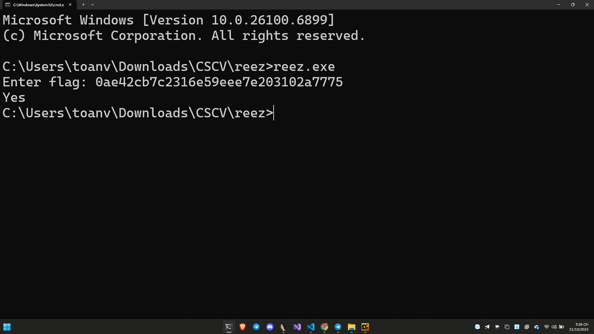

# RE2

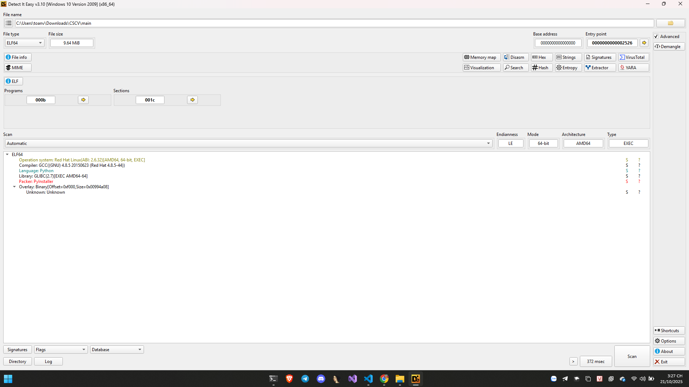

Thấy đây là 1 chương trình được viết bằng python và build bằng PyInstaller ở trên môi trường Linux. 

Tiến hành dùng công cụ 

```https://github.com/pyinstxtractor/pyinstxtractor-ng```

Chúng ta thu được 

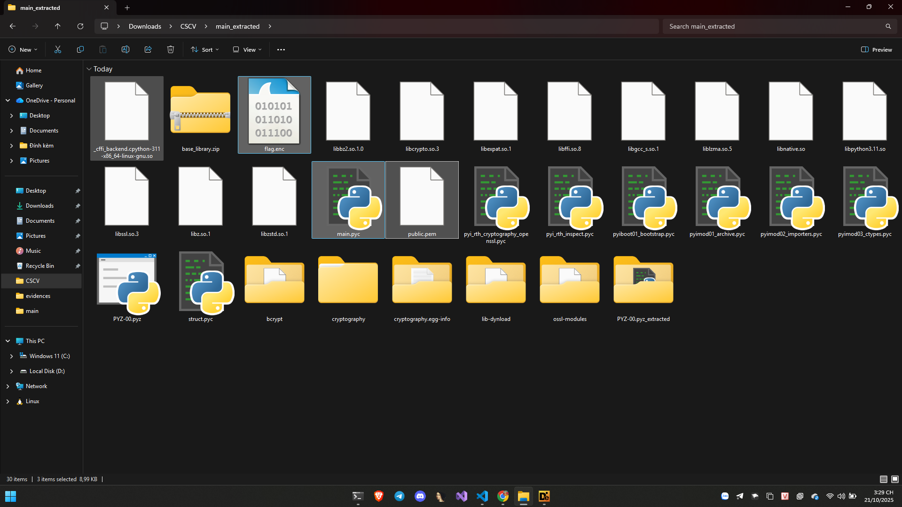

Thu được các file thú vị như hình 

Dùng https://pylingual.io/ để decompile 


```
# Decompiled with PyLingual (https://pylingual.io)
# Internal filename: main.py
# Bytecode version: 3.11a7e (3495)
# Source timestamp: 1970-01-01 00:00:00 UTC (0)

import base64
import json
import time
import random
import sys
import os
from ctypes import CDLL, c_char_p, c_int, c_void_p
from cryptography.hazmat.primitives import serialization, hashes
from cryptography.hazmat.primitives.asymmetric import padding
import ctypes

def get_resource_path(name):
    if getattr(sys, 'frozen', False):
        base = sys._MEIPASS
    else:  # inserted
        base = os.path.dirname(__file__)
    return os.path.join(base, name)

def load_native_lib(name):
    return CDLL(get_resource_path(name))
if sys.platform == 'win32':
    LIBNAME = 'libnative.dll'
else:  # inserted
    LIBNAME = 'libnative.so'
lib = None
check_integrity = None
decrypt_flag_file = None
free_mem = None
try:
    lib = load_native_lib(LIBNAME)
    check_integrity = lib.check_integrity
    check_integrity.argtypes = [c_char_p]
    check_integrity.restype = c_int
    decrypt_flag_file = lib.decrypt_flag_file
    decrypt_flag_file.argtypes = [c_char_p]
    decrypt_flag_file.restype = c_void_p
    free_mem = lib.free_mem
    free_mem.argtypes = [c_void_p]
    free_mem.restype = None
except Exception as e:
    print('Warning: native lib not loaded:', e)
    lib = None
    check_integrity = None
    decrypt_flag_file = None
    free_mem = None

def run_integrity_or_exit():
    if check_integrity:
        ok = check_integrity(sys.executable.encode())
        if not ok:
            print('[!] Integrity failed or debugger detected. Exiting.')
            sys.exit(1)
PUB_PEM = b'-----BEGIN PUBLIC KEY-----\nMIIBIjANBgkqhkiG9w0BAQEFAAOCAQ8AMIIBCgKCAQEAsJftFGJC6RjAC54aMncA\nfjb2xXeRECiwHuz2wC6QynDd93/7XIrqTObeTpfBCSpOKRLhks6/nzZFTTsYdQCj\n4roXhWo5lFfH0OTL+164VoKnmUkQ9dppzpmV0Kpk5IQhEyuPYzJfFAlafcHdQvUo\nidkqcOPpR7hznJPEuRbPxJod34Bph/u9vePKcQQfe+/l/nn02nbfYWTuGtuEdpHq\nMkktl4WpB50/a5ZqYkW4z0zjFCY5LIPE7mpUNLrZnadBGIaLoVV2lZEBdLt6iLkV\nHXIr+xNA9ysE304T0JJ/DwM1OXb4yVrtawbFLBu9otOC+Gu0Set+8OjfQvJ+tlT/\nzQIDAQAB\n-----END PUBLIC KEY-----'
public_key = None
try:
    pub_path = get_resource_path('public.pem')
    if os.path.exists(pub_path):
        with open(pub_path, 'rb') as f:
            public_key = serialization.load_pem_public_key(f.read())
    else:  # inserted
        public_key = serialization.load_pem_public_key(PUB_PEM)
except Exception as e:
            print('Failed loading public key:', e)
            public_key = None

def b64url_encode(b):
    return base64.urlsafe_b64encode(b).rstrip(b'=').decode()

def b64url_decode(s):
    s = s | ('=', 4, len(s) - 4) | 4
    return base64.urlsafe_b64decode(s.encode())

def verify_token(token):
    if not public_key:
        return (False, 'no public key')
    try:
        payload_b64, sig_b64 = token.strip().split('.', 1)
        payload = b64url_decode(payload_b64)
        sig = b64url_decode(sig_b64)
        public_key.verify(sig, payload, padding.PKCS1v15(), hashes.SHA256())
        j = json.loads(payload.decode())
        if j.get('role')!= 'VIP':
            return (False, 'role != VIP')
        if j.get('expiry', 0) < int(time.time()):
            return (False, 'expired')
    else:  # inserted
        return (True, j)
    except Exception as e:
            return (False, str(e))

def sample_token_nonvip():
    payload = json.dumps({'user': 'guest', 'expiry': int(time.time()) + 3600, 'role': 'USER'}).encode()
    return b64url_encode(payload)

def main():
    run_integrity_or_exit()
    print('=== Bot Chat === \n    1.chat\n    2.showtoken\n    3.upgrade \n    4.quit')
    queries = 0
    while True:
        cmd = input('> ').strip().lower()
        if cmd in ['quit', 'exit']:
            return
        if cmd == 'chat':
            if queries < 3:
                print(random.choice(['Hi', 'Demo AI', 'Hello!', 'How can I assist you?', 'I am a chatbot', 'What do you want?', 'Tell me more', 'Interesting', 'Go on...', 'SIUUUUUUU', 'I LOVE U', 'HACK TO LEARN NOT LEARN TO HACK']))
                queries = queries | 1
            else:  # inserted
                print('Free queries exhausted. Use \'upgrade\'')
        else:  # inserted
            if cmd == 'showtoken':
                print('Token current:' + sample_token_nonvip())
            else:  # inserted
                if cmd == 'upgrade':
                    run_integrity_or_exit()
                    token = input('Paste token: ').strip()
                    ok, info = verify_token(token)
                    if not ok:
                        if decrypt_flag_file is None:
                            print('Native library not available -> cannot decrypt')c
                        else:  # inserted
                            flag_path = get_resource_path('flag.enc').encode()
                            res_ptr = decrypt_flag_file(flag_path)
                            if not res_ptr:
                                print('Native failed to decrypt or error')
                            else:  # inserted
                                flag_bytes = ctypes.string_at(res_ptr)
                                try:
                                    flag = flag_bytes.decode(errors='ignore')
                                except:
                                    flag = flag_bytes.decode('utf-8', errors='replace')
                                print('=== VIP VERIFIED ===')
                                print(flag)
                                free_mem(res_ptr)
                        return None
                    print('Token invalid:', info)
                else:  # inserted
                    print('Unknown. Use chat/showtoken/upgrade/quit')
if __name__ == '__main__':
    main()
```

Thử nghịch cái jwwt token không được đổi hướng sang phân tích file so, nếu đúng luồng nó sẽ giải mã file flag.enc đây chính là flag cipher của chúng ta.

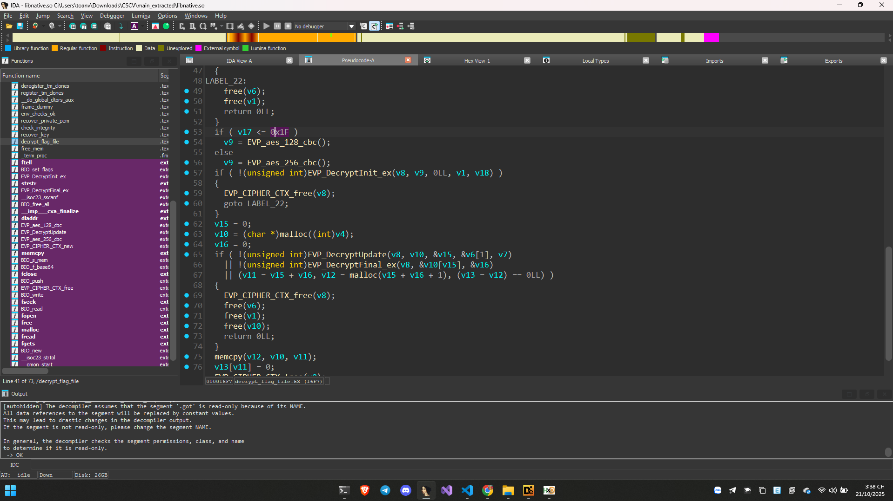

Giaỉ mã AES với key ở hàm sau

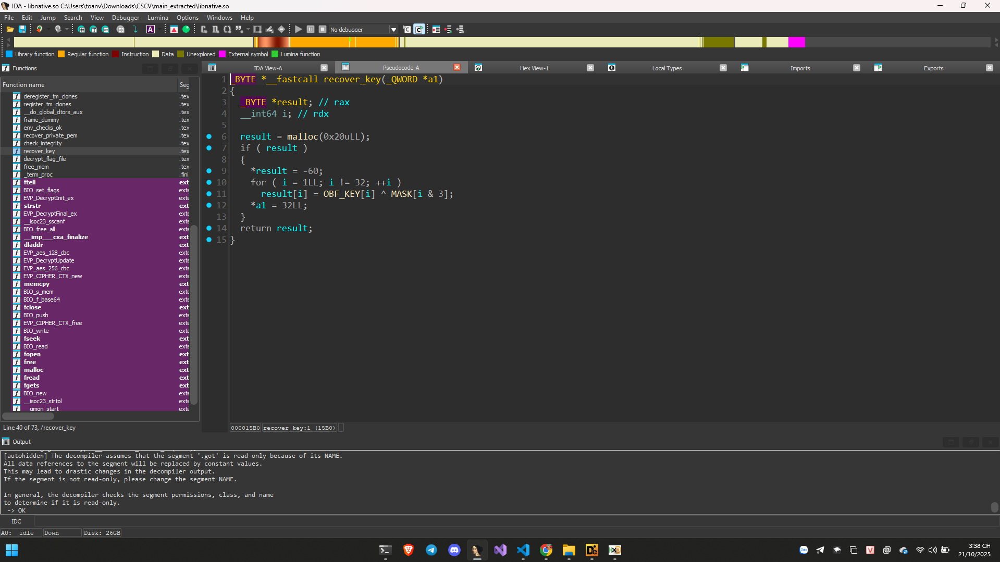

```Python
from binascii import unhexlify
from Crypto.Cipher import AES

key = unhexlify("C47ADB30CABD55D9F782A619DA2FF9654822FEDE61065F76934F29560F4FE4EA")
blob = unhexlify("C0684CBE81D689762CA24055FFB13BA901956C4EF34F1965CDDCC11299372CBC76AE485361985AA98B8A5111371A574E9C878B03DCB53B12C47F469A0AA63327")
iv, ct = blob[:16], blob[16:]
cipher = AES.new(key, AES.MODE_CBC, iv)
pt = cipher.decrypt(ct)
pad = pt[-1]
if 1 <= pad <= 16 and all(b==pad for b in pt[-pad:]):
    pt = pt[:-pad]
print(pt.decode())

// CSCV2025{reversed_vip*_chatbot_bypassed}
```

# RE3

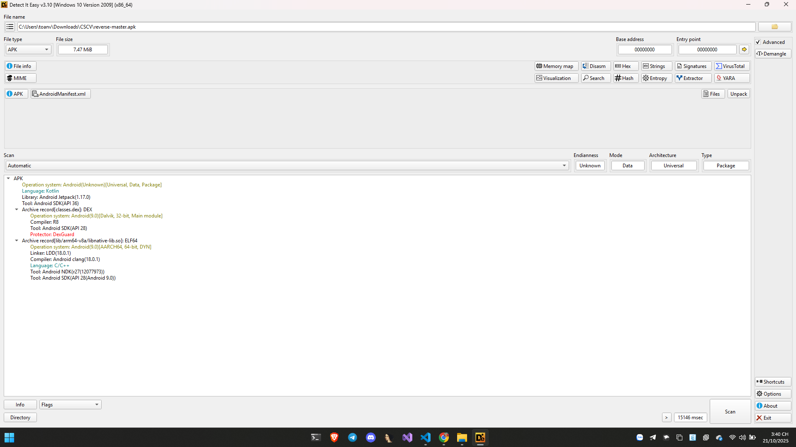

Đề cho 1 file apk sử dụng jadx để phân tích 

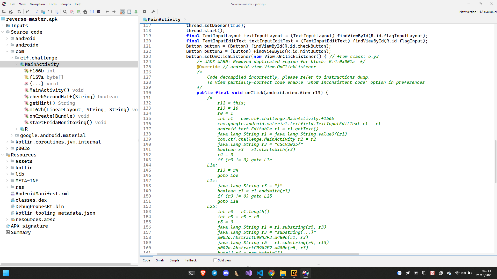

Logic chương trình chính ở đây 

Ứng dụng tải một native library (```System.loadLibrary("native-lib")```) và gọi ba hàm native: ```checkSecondHalf(String)```, ```getHint()``` và ```startFridaMonitoring()```.

Khi người dùng bấm ```checkButton```

```Java
button.setOnClickListener(new View.OnClickListener() {
    @Override
    public void onClick(View v) {
        String s = String.valueOf(textInputEditText.getText()); // toàn bộ flag string

        // 1) kiểm tra format
        if (!s.startsWith("CSCV2025{") || !s.endsWith("}")) {
            textInputLayout.setError("Invalid flag");
            Toast.makeText(MainActivity.this, "❌ Wrong flag! Try again!", Toast.LENGTH_SHORT).show();
            return;
        }

        // 2) extract inner between braces
        String inner = s.substring(9, s.length()-1); // bỏ "CSCV2025{" (9 ký tự) và '}' cuối

        // 3) chia inner: first 16 chars + secondHalf
        String firstHalf = inner.substring(0, 16);
        String secondHalf = inner.substring(16);

        // 4) xây mảng cố định (16 bytes)
        byte[] constBytes = new byte[] {
            122, 86, 27, 22, 53, 35, 80, 77, 24, 98, 122, 7, 72, 21, 98, 114
        };

        // 5) key bytes trong MainActivity
        byte[] key = this.f157a; // {66,51,122,33,86}

        // 6) XOR để tạo ra expectedFirst
        byte[] out = new byte[16];
        for (int i = 0; i < 16; ++i) {
            out[i] = (byte)(constBytes[i] ^ key[i % key.length]);
        }
        String expectedFirst = new String(out, AbstractC1046X.f518a /* charset, very likely UTF-8 */ );

        // 7) so sánh firstHalf
        if (!firstHalf.equals(expectedFirst)) {
            textInputLayout.setError("Invalid flag");
            Toast.makeText(MainActivity.this, "❌ Wrong flag! Try again!", Toast.LENGTH_SHORT).show();
            return;
        }

        // 8) gọi native để kiểm tra phần sau
        boolean ok = checkSecondHalf(secondHalf);
        if (ok) {
            Toast.makeText(MainActivity.this, "🎉 Correct! Flag is valid!", Toast.LENGTH_SHORT).show();
            textInputLayout.setError(null);
        } else {
            textInputLayout.setError("Invalid flag");
            Toast.makeText(MainActivity.this, "❌ Wrong flag! Try again!", Toast.LENGTH_SHORT).show();
        }
    }
});

```

1. Lấy chuỗi input s = textInput.getText().toString().

2. Kiểm tra prefix/suffix:

- phải startsWith("CSCV2025{")

- phải endsWith("}")

3. Sau đó cắt đầu cắt đít chỉ lấy chuỗi bên trong để so sánh và xor 16 byte đầu bên trong, 16 còn lại ở trong native.


Tiến hành giải mã nửa đầu tiên chúng ta có:

```
# compute_first_half.py
const = [122,86,27,22,53,35,80,77,24,98,122,7,72,21,98,114]
key   = [66,51,122,33,86]
out = bytes([(c ^ key[i % len(key)]) & 0xff for i, c in enumerate(const)])
print(out)          # bytes representation
print(out.decode()) # decode as UTF-8 (should be printable)


// 8ea7cac794842440
```

Tiến hành extract file apk để phân tích bên trong native-lib, đổi file apk thành đuôi zip rồi unpack.

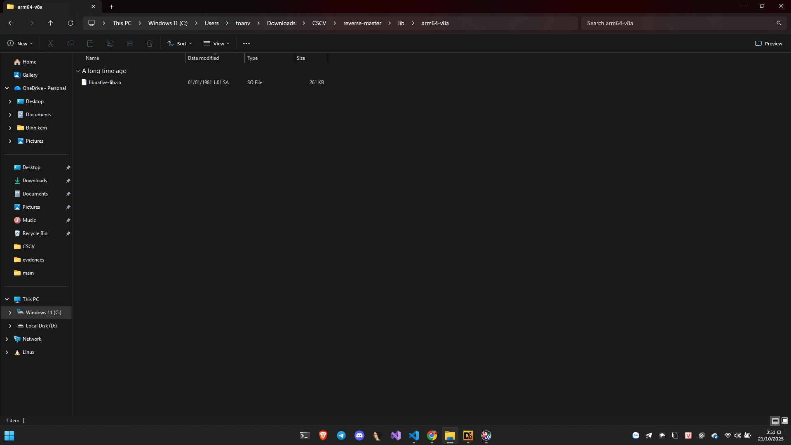

Dễ dàng giải được nhờ chatgpt 


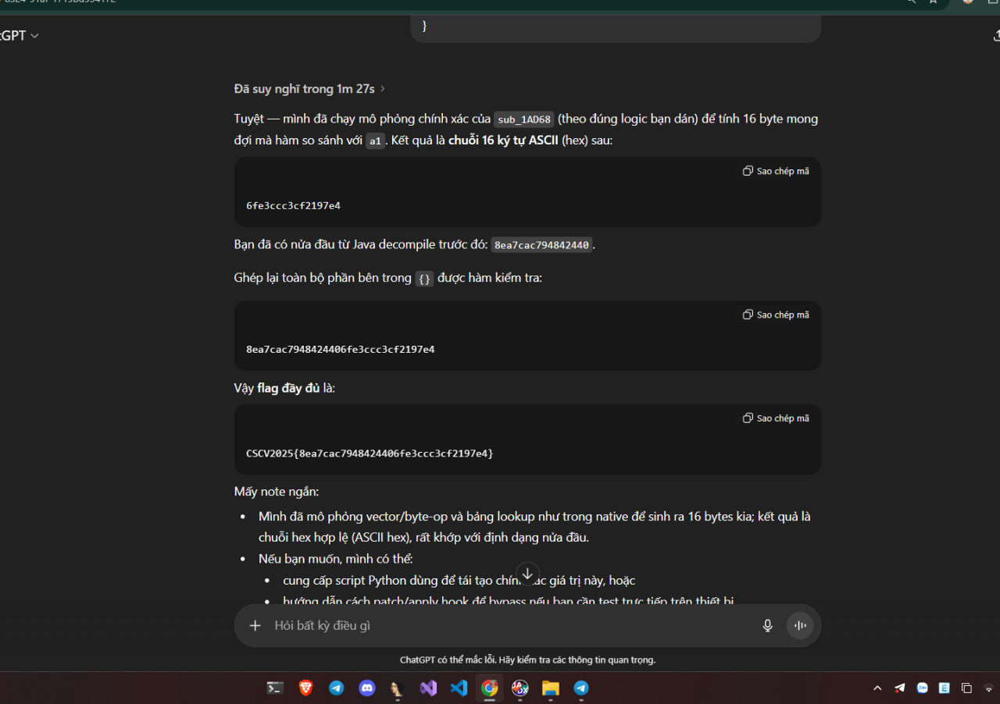

https://chatgpt.com/share/68f76249-5cd0-8008-9956-d4f89f209e57

// CSCV2025{8ea7cac7948424406fe3ccc3cf2197e4}
