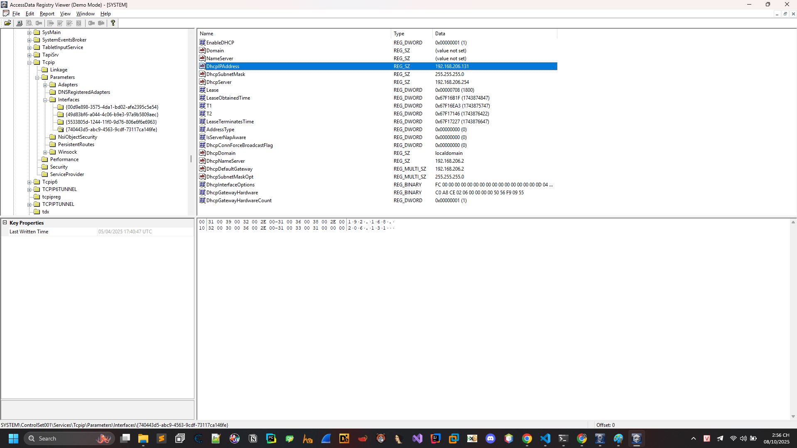

# Silent Visitor


Nhiệm vụ: Hỏi mã sha256 của file

Đây là một nhiệm vụ điều tra số khi netcat tới thì người ta sẽ hỏi mình các câu hỏi.


.ad1 lưu trữ ảnh logic của ổ đĩa, thư mục, hoặc tệp — tức là chỉ sao chép dữ liệu thực tế (không bao gồm không gian trống hoặc sector chưa dùng như ảnh vật lý .E01).

Nó thường được dùng trong điều tra số (digital forensics), khi ta cần trích xuất nội dung của một hệ thống mà không cần sao chép toàn bộ ổ đĩa.

## What is the SHA256 hash of the disk image provided? 
Sử dụng sha256sum


## Identify the OS build number of the victim’s system?!

Nhiệm vụ: Xác định số bản build (OS build number) của hệ thống nạn nhân?


Vào mục ```C:\Windows\System32\config\SOFTWARE``` để extract ra sau đó dùng AccessData_Registry_Viewer để xem xét.

Tại mục ```Microsoft\Windows NT\CurrentVersion```


## What is the ip of the victim's machine? 

Nhiệm vụ: Tìm địa chỉ ip của máy nạn nhân (IP LAN hay IP Local)

Đoạn này sẽ tìm chỗ mà phân giải IP trong mạng từ DHCP phân giải cho máy.


Vào mục ```C:\Windows\System32\config\SYSTEM``` để extract ra sau đó dùng AccessData_Registry_Viewer để xem xét.



Tại đây anh em tìm tiếp tại ```ControlSet001\Services\Tcpip\Parameters\Interfaces\``` thấy ngay IP đó là ```192.168.206.131```

## What is the name of the email application used by the victim?

Nhiệm vụ: Tên ứng dụng email mà nạn nhân dùng là gì?


Thấy ngay ứng dụng mail là Mozilla Thunderbird.


## What is the email of the victim?

Nhiệm vụ: Tìm địa chỉ email của nạn nhân

Tìm xem data của app này ở đâu thôi xem tại appdata thôi


Thấy ngay ```ammar55221133@gmail.com```


## What is the email of the attacker?

Nhiệm vụ: Tìm địa chỉ email của hacker


Dump inbox ra rồi phân tích thấy có email này rất khả nghi kèm link github
```masmoudim522@gmail.com```


## What is the URL that the attacker used to deliver the malware to the victim?

Nhiệm vụ: Tìm đường link mà kẻ tấn công đưa mã độc tới nạn nhân 

Nhập thử link github thì không đúng đi vào phân tích github https://github.com/lmdr7977/student-api


Ghi ngờ câu lệnh powershell ngay


Ngon ngay kia là link mã độc rồi.

```https://tmpfiles.org/dl/23860773/sys.exe```


## What is the SHA256 hash of the malware file?

Nhiệm vụ: tìm mã sha256 của file mã độc 

Từ trước đã thấy nó lưu ```$o = "$env:APPDATA\sys.exe";``` dump từ file ad1 ra thôi ở appdata rồi.


## What is the IP address of the C2 server that the malware communicates with?

Nhiệm vụ: Địa chỉ IP của máy chủ C2 mà phần mềm độc hại giao tiếp là gì?


Quăng lên virustotal 


```40.113.161.85```
## What port does the malware use to communicate with its Command & Control (C2) server?

Nhiệm vụ: Cổng địa chỉ IP của máy chủ C2 mà phần mềm độc hại giao tiếp là gì?

```5000```


## What is the url if the first Request made by the malware to the c2 server?

Nhiệm vụ: URL của yêu cầu ban đầu tới máy chủ điều khiển (C2) là gì?

Nhập thử ```http://40.113.161.85:5000/helppppiscofebabe23``` thấy thành công.


## The malware created a file to identify itself. What is the content of that file?

Nhiệm vụ: Phần mềm độc hại đã tạo ra một tệp để tự nhận dạng. Nội dung của tệp đó là gì?


```C:\Users\Public\Documents\id.txt``` khả năng lưu ở đây để xác định máy là máy nào.


## Which registry key did the malware modify or add to maintain persistence?

Nhiệm vụ: Malware đã sửa đổi hoặc thêm khóa registry nào để tự khởi động cùng hệ thống?


```HKEY_CURRENT_USER\SOFTWARE\Microsoft\Windows\CurrentVersion\Run\MyApp```

## What is the content of this registry?

Nhiệm vụ: Nội dung của registry


Chính là đường dẫn của file mã độc.

```C:\Users\ammar\Documents\sys.exe```


## The malware uses a secret token to communicate with the C2 server. What is the value of this key?

Nhiệm vụ: tìm key mà server giao tiếp.


Phân tích IDA thấy ngay 1 chuỗi hash thử và đúng ```e7bcc0ba5fb1dc9cc09460baaa2a6986```


Thu được flag