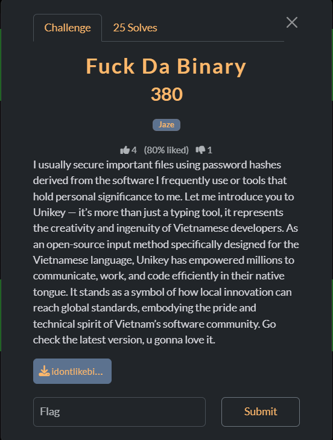
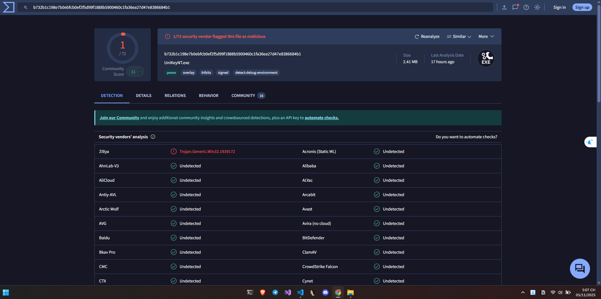
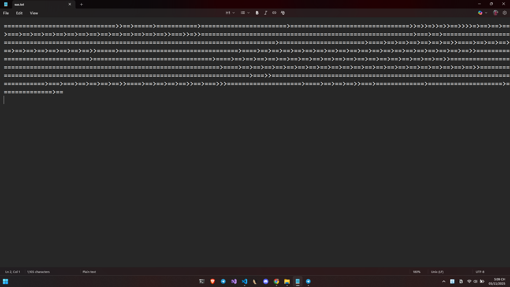
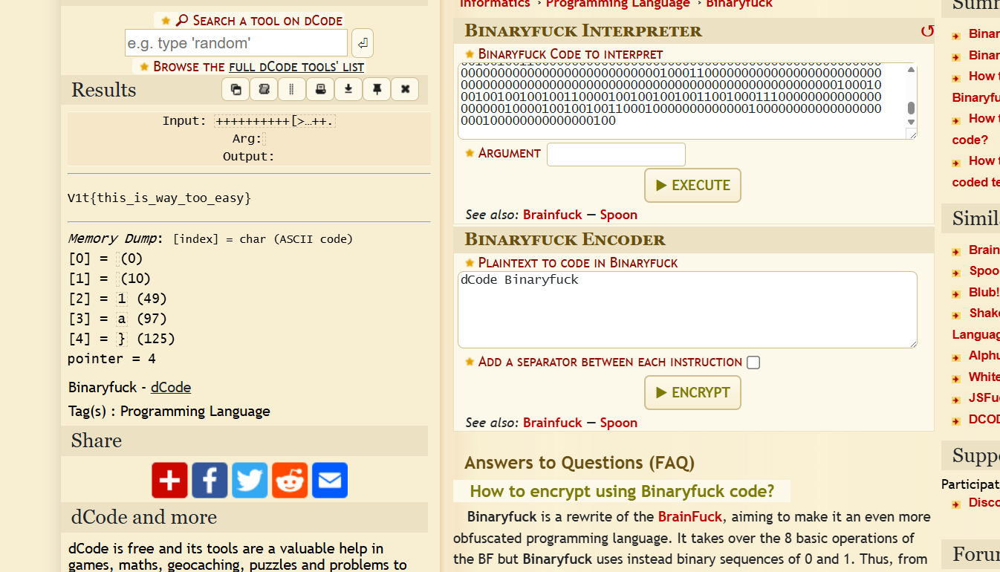
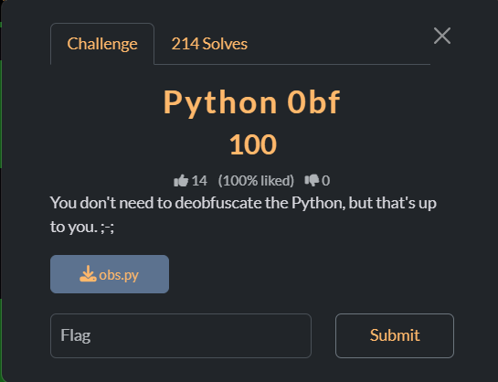
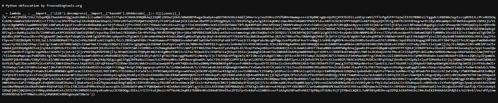
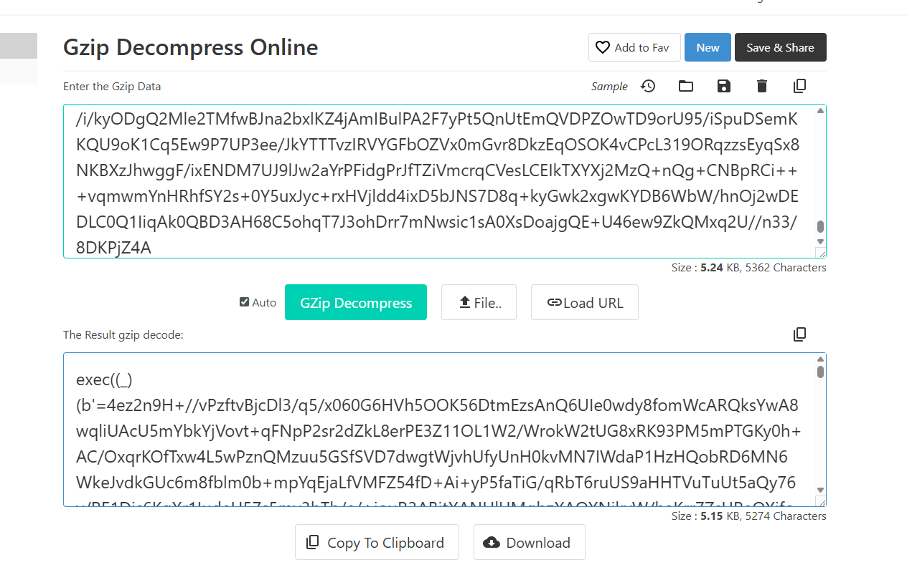
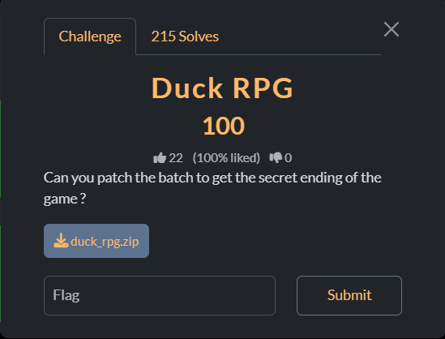
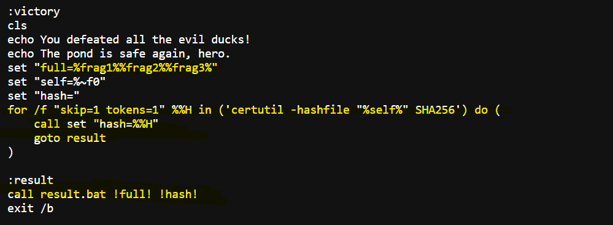

# Fuck Da Binary



Khi giải nén yêu cầu mật khẩu, nhưng ở đây lại không có thông tin gì đề bài lại liên quan đến unikey thử giải mã với mã hash được luôn :( giải thuần đoán)

Pass Unzip: ```b732b1c198e7b0ebfcb0ef2f5d99f1888b5900460c1fa36ea27d47e8386684b1```



Thu được nội dung như này thử đổi chuyển thành 0 và 1 rồi giải bằng binary fuck.






# Python 0bf



Thu được 1 file đã obf nhưng dạng này khá mềm anh em có thể dễ dàng nhìn ra được các để deof.

Đây là đã bị nén + đảo ngược + base64 việc của chúng ta là làm điều tương tự với chuỗi bên trong file py theo 1 cách ngược lại.



Và nó cứ làm như vậy bằng cách nhiều lớp. Chúng ta có thể viết script hoặc giải bằng GPT. 


Cuối cùng sẽ thu được source cuối cùng

```Python
flag = "v1t{d4ng_u_kn0w_pyth0n_d3bugg}"

inp = input("Input the flag: ")

if (inp != flag):
    print("wrong")
else:
    print("correct")
```



# Duck RPG



Thu được 2 file bat để ý trong file game có hàm victory ae để ý trong code thì đoạn này nó sẽ giải mã với 2 tham số khi gọi file bat

game.bat chúng ta sẽ thu được đó là các tham số unlock,the,duck. Sau đó chính là việc nó truyền vào sha256 của game.bat

Chạy

```result.bat "unlocktheduck" "8392dcc7b6fdebd5a70211c1e21497a553b31f2c70408b772c4a313615df7b60"``` sau đó thu được flag

```v1t{p4tch_th3_b4tch_t0_g3t_th3_s3cr3t_3nd1ng}```

