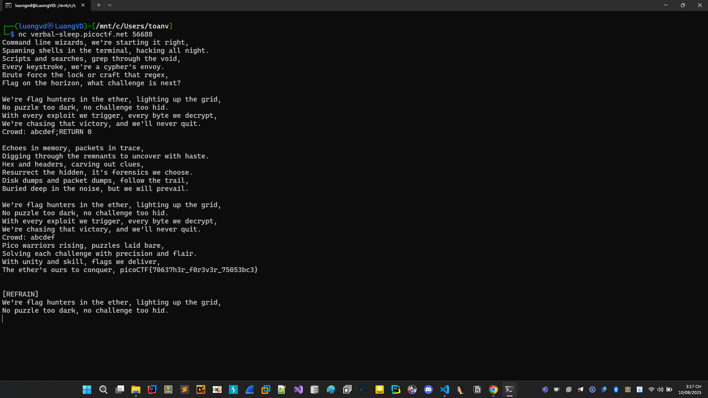

# Flag Hunters

```
Lyrics jump from verses to the refrain kind of like a subroutine call. There's a hidden refrain this program doesn't print by default. Can you get it to print it? There might be something in it for you.
Connect to the program with netcat:
$ nc verbal-sleep.picoctf.net 56688
Lời bài hát nhảy từ các đoạn (verse) sang điệp khúc (refrain) giống như một lệnh gọi hàm con (subroutine call).
Có một đoạn điệp khúc ẩn mà chương trình này mặc định sẽ không in ra.
Bạn có thể làm cho nó in ra không? Có thể sẽ có điều thú vị dành cho bạn.
```

File code [lyric-reader.py](./lyric-reader.py)

## Phân tích đề

Đề cho chúng ta file code đây là 1 file python. Sau một lúc đọc hiểu chúng ta biết như sau:

Bối cảnh ban đầu:
```flag``` được đọc từ file ```flag.txt``` ngay khi chương trình chạy:

```Python
flag = open('flag.txt', 'r').read()
```

Sau đó ```flag``` được trèn thẳng vào biến ```secret_intro``` ở phần mô tả bài hát:

```Python
secret_intro = '''Pico warriors rising... conquer, ''' + flag + '\n'
```

Nghĩa là flag nằm ngay ở đầu biến ```song_flag_hunters``` ở ngay đầu tiên.


Chú ý tiếp đến câu câu lệnh ở cuối ```reader(song_flag_hunters, '[VERSE1]')```, hàm này nhận vào hai tham số lời bài hát và điểm bắt đầu. Ở đây nó bắt đầu từ VERSE1 theo logic bình thường thì flag không thể bị in ra được.

Phân tích hàm ```reader()```

Hàm ```reader()``` hoạt động như một máy đọc lời bài hát có điều kiện nhảy:

Mấu chốt nằm ở đoạn xử lý ```CROWD```

```Python
elif re.match(r"CROWD.*", line):
    crowd = input('Crowd: ')
    song_lines[lip] = 'Crowd: ' + crowd
    lip += 1
```
Input của người dùng được nối thẳng vào chuỗi lời bài hát.
Sau đó chương trình phân tách dòng theo dấu ```;```

```Python
for line in song_lines[lip].split(';'):
```

## Khai thác

Giả sử với chuỗi ta nhập:

```abcdef;RETURN 0``` hoặc ```luongvd;abcd;RETURN 0```

Với input như này khi chương trình chạy nó sẽ phân tách thành các lệnh bằng spit dẫn tới chúng ta ```"RETURN 0"``` nhảy về đầu bài hát và các được flag.


## Kết luận

Bài này bản chất chính là một dạng command injection đơn giản (chèn vào script)

Khai thác với netcat và nhập input chúng ta sẽ có được flag.


