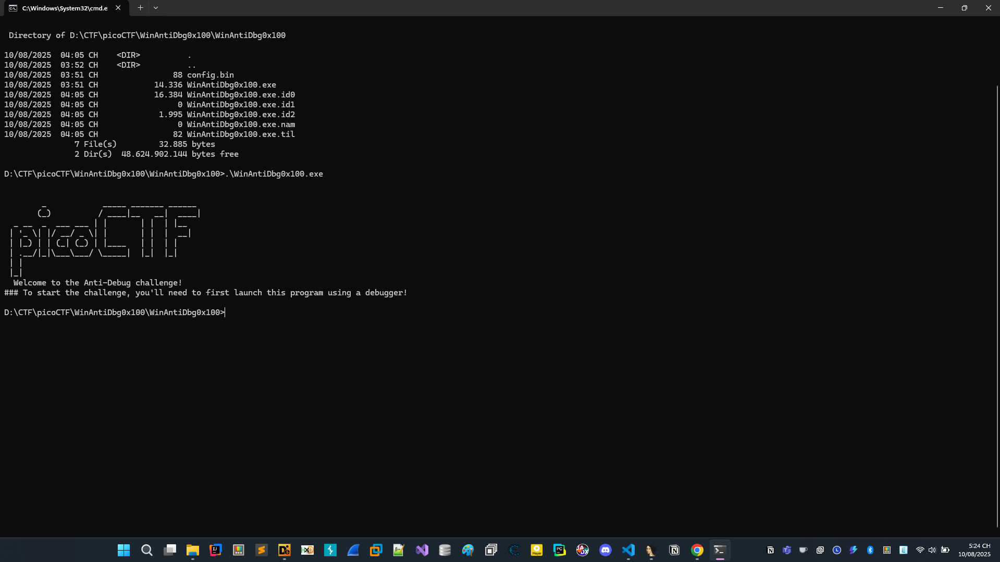
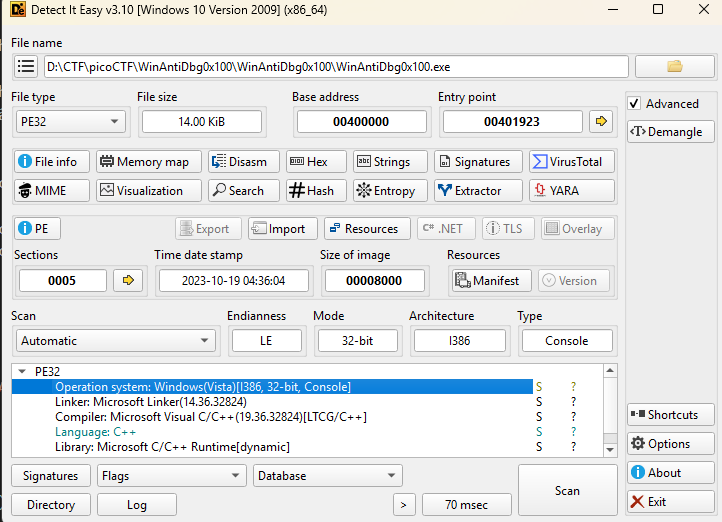
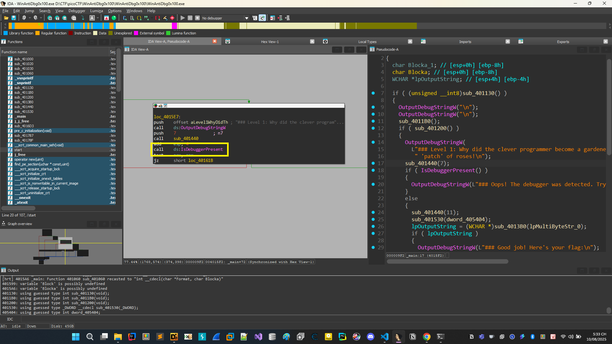
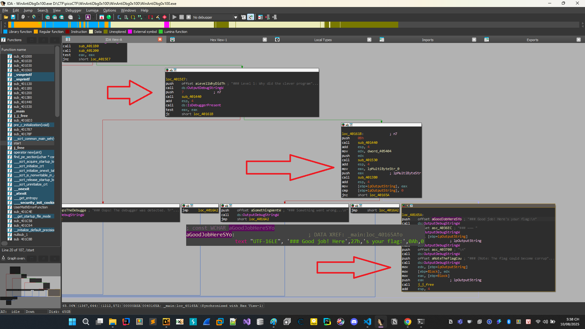
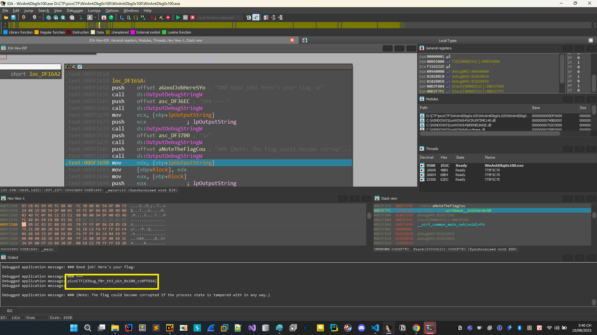

# WinAntiDbg0x100

```This challenge will introduce you to 'Anti-Debugging.' Malware developers don't like it when you attempt to debug their executable files because debugging these files reveals many of their secrets! That's why, they include a lot of code logic specifically designed to interfere with your debugging process.
Now that you've understood the context, go ahead and debug this Windows executable!
This challenge binary file is a Windows console application and you can start with running it using cmd on Windows.
Challenge can be downloaded here. Unzip the archive with the password picoctf
````

[WinAntiDbg0x100.zip](./WinAntiDbg0x100.zip)

```Thử thách này sẽ giới thiệu cho bạn về "Chống gỡ lỗi" (Anti-Debugging).
Những người phát triển phần mềm độc hại (malware) thường không thích khi bạn cố gắng gỡ lỗi (debug) các tệp thực thi của họ, vì việc gỡ lỗi sẽ tiết lộ nhiều bí mật bên trong!
Vì vậy, họ thường chèn rất nhiều đoạn mã đặc biệt nhằm cản trở quá trình gỡ lỗi của bạn.

Bây giờ bạn đã hiểu bối cảnh, hãy bắt tay vào gỡ lỗi tệp thực thi Windows này!
Tệp nhị phân của thử thách là một ứng dụng console trên Windows và bạn có thể bắt đầu bằng cách chạy nó trong cmd trên Windows.

Bạn có thể tải thử thách tại đây. Giải nén tệp bằng mật khẩu picoctf.
```

Tài liệu về anti debug [Anti debug](https://anti-debug.checkpoint.com/)

# Phân tích đề



Khi chạy chương trình thử chương trình yêu cầu chúng ta debug.

Kiểm tra bằng DIE rồi ném vào IDA phân tích thôi.




Đây là file code C++, 32 BIT, little endian.



Khi vào IDA, Chúng ta thấy rằng chương trình kiểm tra debug bằng hàm ```IsDebuggerPresent```

Sau một hồi xem xét chúng ta thấy chương trình có hàm in flag, bây giờ việc chúng ta cần làm là điều khiển luồng chương trình đến hàm in flag.

## Khai thác

Tiến hành debug theo flow như hình, thực hiện sửa lệnh bằng asm hoặc cờ.
Đây là bản dịch sang tiếng Việt:

---

Hàm **`kernel32!IsDebuggerPresent()`** dùng để xác định xem tiến trình hiện tại có đang bị debug bởi một trình gỡ lỗi (user-mode debugger) như **IDA** hoặc **x64dbg** hay không.
Thông thường, hàm này chỉ kiểm tra **cờ `BeingDebugged`** trong **Process Environment Block (PEB)**.

---

Bạn muốn mình dịch luôn đoạn mã mẫu đó sang tiếng Việt kèm giải thích từng dòng không?
Như vậy bạn sẽ dễ hiểu hơn cách hàm `IsDebuggerPresent` được dùng để chống debug.



## Kết luận

Thu được flag


