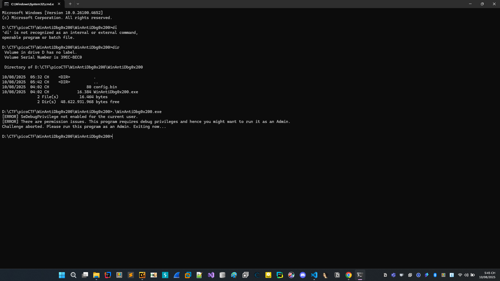
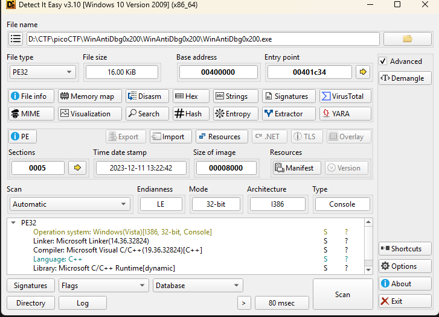
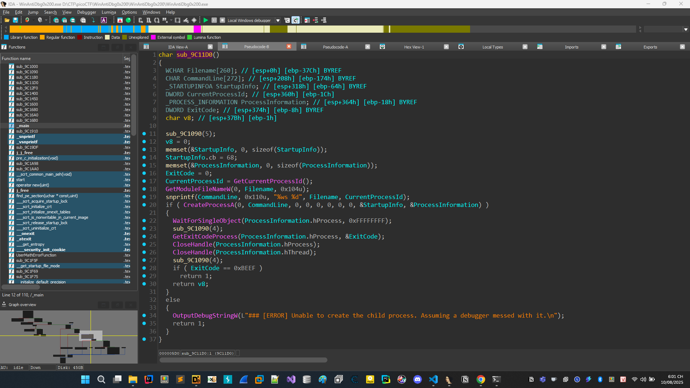
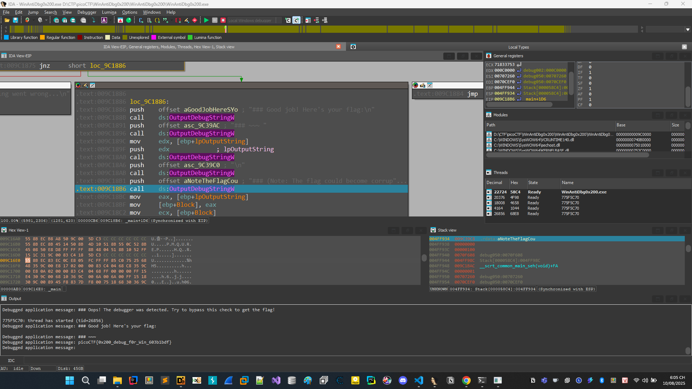

# WinAntiDbg0x200

```
If you have solved WinAntiDbg0x100, you'll discover something new in this one. Debug the executable and find the flag!
This challenge executable is a Windows console application, and you can start by running it using Command Prompt on Windows.
This executable requires admin privileges. You might want to start Command Prompt or your debugger using the 'Run as administrator' option.
Challenge can be downloaded here. Unzip the archive with the password picoctf

```

```
Nếu bạn đã giải được WinAntiDbg0x100, thì ở bài này bạn sẽ khám phá thêm một điều mới.

Hãy debug file thực thi và tìm flag!

File thực thi này là một ứng dụng console trên Windows, bạn có thể bắt đầu bằng cách chạy nó bằng Command Prompt trên Windows.

Chương trình này yêu cầu quyền quản trị (admin privileges). Bạn nên mở Command Prompt hoặc debugger bằng tùy chọn "Run as administrator".

Bạn có thể tải thử thách tại đây. Giải nén file nén bằng mật khẩu picoctf.
```


[WinAntiDbg0x200.zip](./WinAntiDbg0x200.zip)

# Phân tích đề bài



Chương trình yêu cầu quyền admin.

Ném vào DIE thử



Code C++, 32 bit.

Tiến hành đem vào IDA phân tích lưu ý phải chạy IDA dưới quyền admin.


# Khai thác

Vẫn thấy các hàm check debug như ```IsDebuggerPresent()```, có thể cả hàm ```sub_9C11D0```,và hàm chỗ in flag như bài WinAntiDbg0x100



Hàm này cũng thực hiện việc check debug bằng việc tạo 1 tiến trình con với tham số dòng lệnh là ```CurrentProcessId```. Sau đó nó đợi tiến trình con chạy xong nó lấy exit code, nếu là 0xBEEF hoặc không thể tạo được tiến trình con => nghi ngờ có debugger can thiệp.

Chúng ta lại tiến hành debug sửa asm, sửa cờ để chương trình đi đến được đúng nơi in flag.

## Kết luận


Sau khi đi đến được đúng thì thu được flag là 

