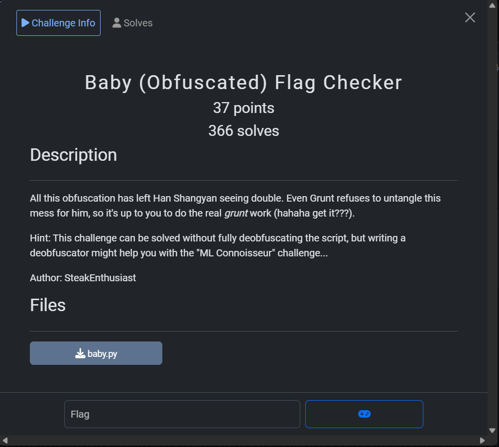
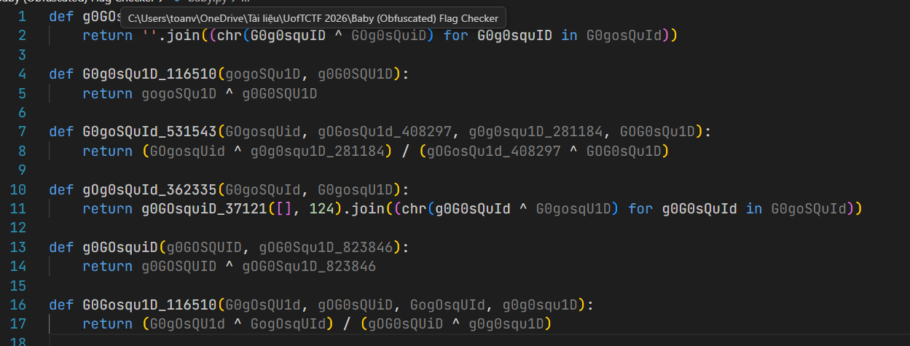
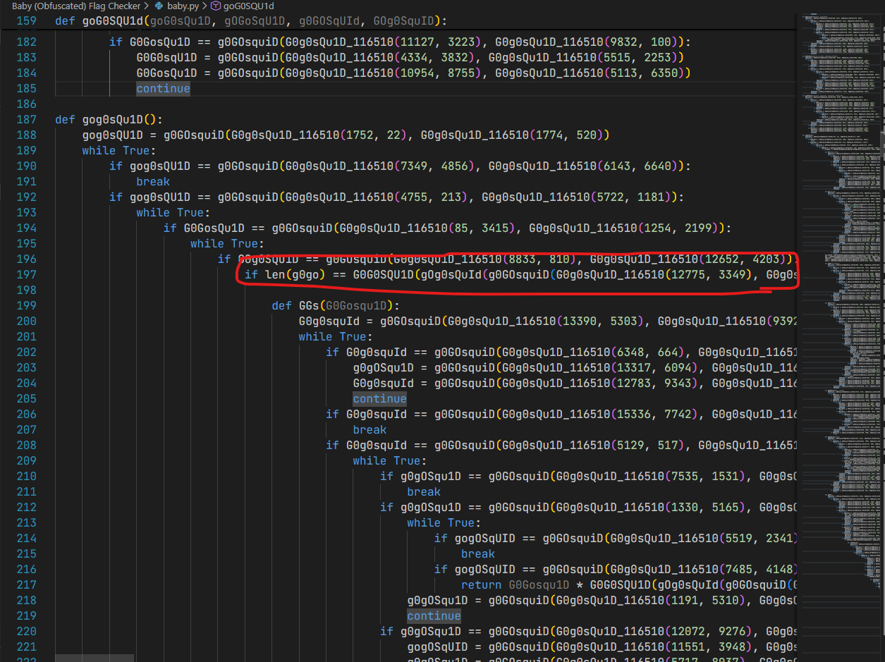
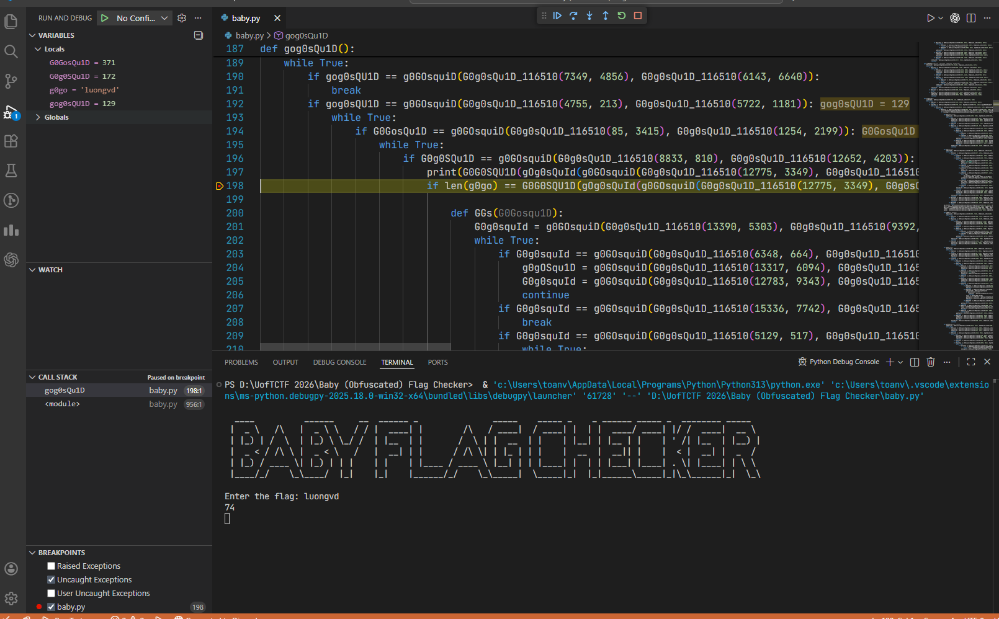
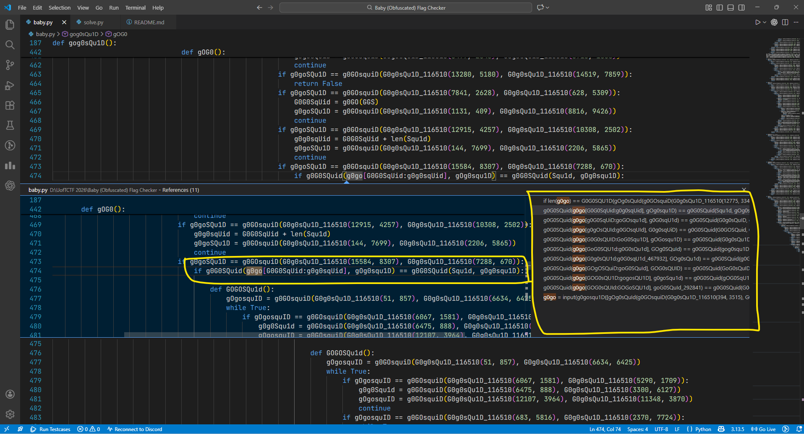
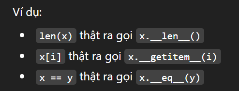
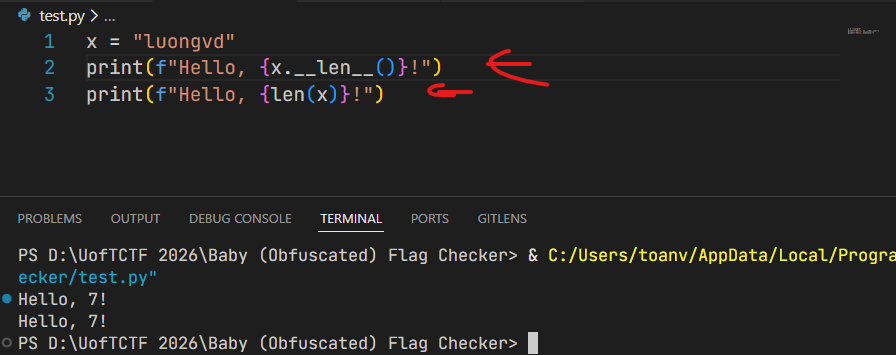
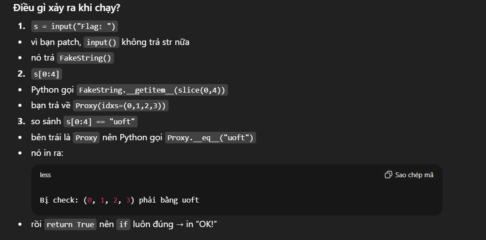

Bài này được cho 1 file code `baby.py`. Ngay từ đầu đề bài thấy bài này bị làm rối và từ đề bài người ta cũng đã gợi ý cho mình là bài này có thể giải mã hay tìm flag và không cần giải mã lại đoạn mã đã bị làm rối.

Những bài kiểu kiểu như này nếu người ta cho file binary thì thường sử dụng các công cụ như ```angr``` để tìm cách xử lý. Nhưng bài này cho source chúng ta sẽ thử đọc và phân tích để xem có gì hay ho bên trong.



File code khá lớn nhưng bài này logic của nó là mã hóa hết các giá trị thành phép xor có thể 1 hoặc nhiều lần, giải mã thì nó join lại thành chuỗi nó muốn.



Đọc logic của chương trình chúng ta thấy đoạn này giống nó check chiều dài của chuỗi truyền vào, kèm theo đó là việc nó check 1 số kí tự hoặc 1 phần kí tự của flag bằng việc nó compare.

Vì thế mình mạnh dạn cắt thử đoạn compare rồi chạy lại code hoặc debug.



> Oke vậy input hay flag sẽ có chiều dài là 74.



Biến ```g0go``` là input từ người dùng hợp lệ, chương trình biến đổi qua từng vòng lặp và check lần lượt 1 phần của flag.

=> Ý tưởng của bài này là việc chúng ta có thể lấy ra được nhưng giá trị nó so sánh như trên là có thể ghép được flag.

Vậy chúng ta cần viết code để patch lại hành vi của chương trình để lấy được các giá trị lúc so sánh.

Python cho phép định nghĩa hành vi của toán tử cú pháp

Ví dụ:





Mục tiêu là chúng ta sẽ tạo ra 1 object giả giống string của python chúng ta sẽ dùng monkey patch.

Nếu ta gán ```builtins.input = fake_input``` thì mọi chỗ gọi ```input()``` (kể cả trong ```baby.py```) sẽ chạy ```fake_input```

Vậy quy trình chúng ta muốn sẽ là:

1. Tạo 1 chuỗi fake_s (chuỗi giả 74 kí tự)
2. Chạy baby.py bằng exec
3. Patch input() để trả về fake_s
4. Chạy hàm chính gog0sQu1D() 
5. Nếu nó kiểm tra flag[start:end] == "something" thì tiến hành log ra.

Vậy chúng ta sẽ xây dựng 1 object dùng ```____eq__``` để log ra. Chúng ta sẽ hook 

1. len(s)
2. s[i] hoặc s[start:end]

Định nghĩa __len__ trả về len = 74. __get_item__ trả về SliceProxy cấu trúc mà chúng ta fake.

Sau khi chạy xong chúng ta đã hook được thành công lúc này fake_s.constraints sẽ là (indices_tuple, expected) từ đó chúng ta có thể ráp được flag hoàn chỉnh. Chúng ta cũng sẽ hook cho kết quả so sánh luôn trả về True để chương trình không bị gián đoạn.

Quá loằng ngoằng ví dụ:

```Python
s = input("Flag: ")
if s[0:4] == "uoft":
    print("OK, đúng 4 ký tự đầu!")
else:
    print("Sai!")
```

```Python
import builtins

class Proxy:
    def __init__(self, idxs):
        self.idxs = idxs

    def __eq__(self, other):
        print("Bị check:", self.idxs, "phải bằng", other)
        return True   # luôn cho qua

class FakeString:
    def __len__(self):
        return 10

    def __getitem__(self, key):
        # chỉ demo slice thôi
        if isinstance(key, slice):
            start, stop, step = key.indices(10)
            return Proxy(tuple(range(start, stop, step)))
        raise TypeError

# ---- PATCH INPUT ----
orig = builtins.input
builtins.input = lambda prompt="": FakeString()

# chạy checker (giả lập bằng exec cho gọn)
code = """
s = input("Flag: ")
if s[0:4] == "uoft":
    print("OK!")
else:
    print("Sai!")
"""
exec(code)

builtins.input = orig
```



Cuối cùng giải và thu được flag

```Python
import builtins
import contextlib
import io

# Proxy đại diện cho "một phần" của chuỗi input: có thể là 1 ký tự hoặc 1 đoạn slice
class SliceProxy:
    def __init__(self, hook_string, indices):
        self.hook = hook_string          # tham chiếu về HookString
        self.indices = tuple(indices)    # tuple các index trong input mà proxy đang đại diện

    def __getitem__(self, key):
        """
        Cho phép slice/index tiếp trên proxy.
        Ví dụ: s[10:20][2:5] vẫn hoạt động và ra proxy mới.
        """
        if isinstance(key, slice):
            return SliceProxy(self.hook, self.indices[key])
        if isinstance(key, int):
            return SliceProxy(self.hook, (self.indices[key],))
        raise TypeError("Only slice/int supported")

    def __eq__(self, other):
        """
        Khi baby.py làm: if s[a:b] == "expected":
        => gọi __eq__ tại đây.
        Ta log ra constraint rồi trả True để chương trình chạy tiếp.
        """
        print(self.indices, other)
        self.hook.constraints.append((self.indices, other))
        return True


# "Chuỗi giả" thay cho input thật
class HookString:
    def __init__(self, length):
        self.length = length
        self.constraints = []  # list các (indices_tuple, expected)

    def __len__(self):
        # để pass check len(s) == 74
        return self.length

    def __getitem__(self, key):
        """
        Khi baby.py truy cập s[i] hoặc s[a:b] => trả SliceProxy tương ứng.
        """
        if isinstance(key, slice):
            # chuẩn hóa slice theo length (xử lý None, âm, vượt biên)
            start, stop, step = key.indices(self.length)
            return SliceProxy(self, range(start, stop, step))

        if isinstance(key, int):
            # hỗ trợ index âm
            if key < 0:
                key += self.length
            return SliceProxy(self, (key,))
        raise TypeError("Only slice/int supported")

def run_with_hook(path_to_baby="baby.py", entry_func="gog0sQu1D", length=74):
    # buffer hứng stdout
    buf = io.StringIO()

    # namespace để exec baby.py
    ns = {}

    # object input giả
    fake_s = HookString(length)

    # exec baby.py => các hàm/biến nằm trong ns
    exec(open(path_to_baby, "r", encoding="utf-8").read(), ns, ns)

    # fake input: in prompt vào buffer rồi trả fake_s
    def fake_input(prompt=""):
        print(prompt, end="", file=buf)
        return fake_s

    # redirect stdout vào buf + patch builtins.input
    with contextlib.redirect_stdout(buf):
        original_input = builtins.input
        builtins.input = fake_input
        try:
            ns[entry_func]()   # chạy hàm chính
        finally:
            builtins.input = original_input

    # in ra toàn bộ output + trả constraint để post-process nếu cần
    print(buf.getvalue())
    return fake_s.constraints


if __name__ == "__main__":
    constraints = run_with_hook("baby.py", "gog0sQu1D", 74)
    # constraints là list (indices_tuple, expected_string)
    # bạn có thể dùng nó để ráp flag.
```

