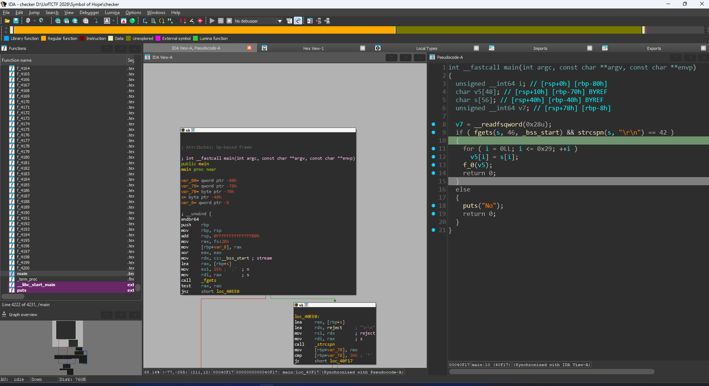
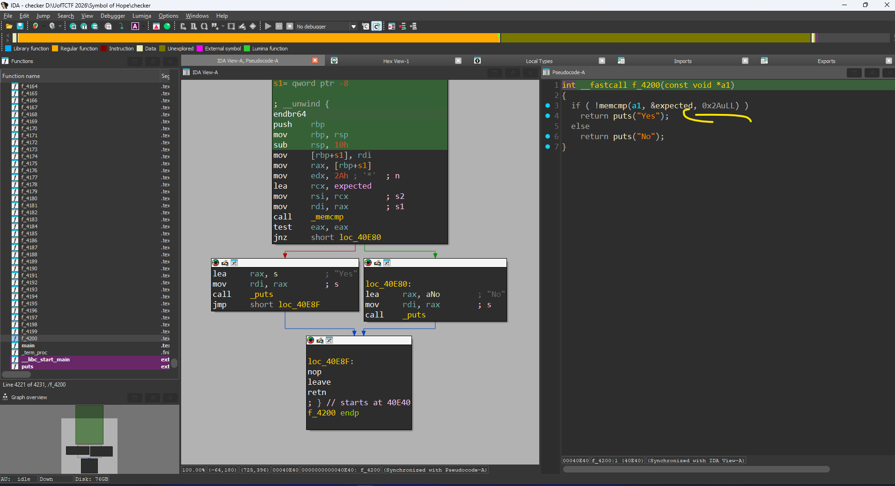
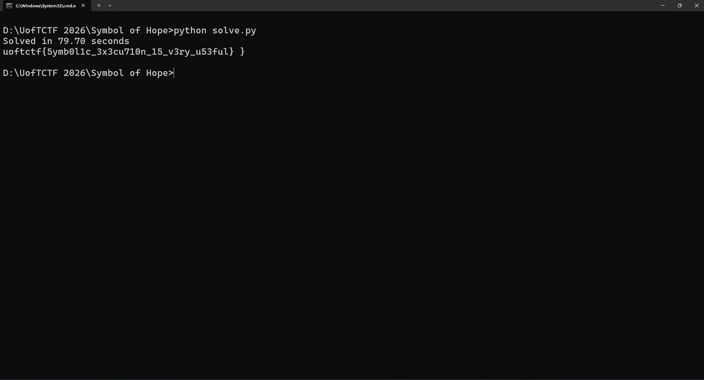

# Symbol of Hope

Unpack UPX ra được chương trình C.



Logic chương trình thì cũng khá dễ hiểu. Từ tên đề bài cũng đã gợi ý dạng trong chúng ta bài này thuộc dạng symbolic execution, theo kiểu chạy để tự động tìm flag. Hay nó cách khác chương trình in ra Yes.
Và chiều dài của flag = 42.



Điều khiến chúng ta bận tâm là các giá trị được kiểm tra bằng cách thông qua vô số các hàm con để làm đủ trò bên trong cuối cùng mới check. Số hàm quá lớn. Công cụ để xử lý việc này chính là angr.

Để dễ xây dựng hơn thì mình đã xây 1 con template về sau dùng cho tiện.

```Python
#!/usr/bin/env python3
import time
import angr
import claripy

BINARY = "./checker"

def solve(
    flag_len=44,
    prefix=b"uoftctf{",
    suffix=b"}",
    use_full_init_state=True,
    printable=True,
    find_addr=None,      # ví dụ: 0x401234 (địa chỉ nhánh đúng)
    avoid_addrs=None,    # ví dụ: [0x401111, 0x401222] (nhánh sai)
    success_output=b"Yes",  # dùng khi không có find_addr
):
    proj = angr.Project(BINARY, auto_load_libs=False)

    # --- 1) Create symbolic input (stdin) ---
    flag_chars = [claripy.BVS(f"b{i}", 8) for i in range(flag_len)]
    flag = claripy.Concat(*flag_chars)
    stdin = claripy.Concat(flag, claripy.BVV(b"\n")) # Concat để hoàn thành 1 buffer liên tục trong bộ nhớ vì thế lên cần thêm 2 kí tự \n

    simfile = angr.SimFileStream(name="stdin", content=stdin, has_end=False)

    if use_full_init_state:
        state = proj.factory.full_init_state(stdin=simfile)
    else:
        state = proj.factory.entry_state(stdin=simfile)

    # --- 2) Add constraints (format/charset) ---
    if prefix:
        for i, ch in enumerate(prefix):
            if i < flag_len:
                state.solver.add(flag_chars[i] == ch)

    if suffix:
        # Suffix thường là ký tự cuối: flag_chars[flag_len-1]
        # Nếu bài bạn cần vị trí khác, đổi index ở đây.
        state.solver.add(flag_chars[flag_len - 1] == suffix[0])

    if printable:
        for c in flag_chars:
            state.solver.add(c >= 0x20)
            state.solver.add(c <= 0x7e)

    # --- 3) Explore ---
    simgr = proj.factory.simgr(state)

    if find_addr is not None:
        # Cách sạch & nhanh nhất nếu bạn biết địa chỉ "Correct"
        simgr.explore(find=find_addr, avoid=avoid_addrs or [])
    else:
        # Fallback: dựa vào output
        def success(s):
            return success_output in s.posix.dumps(1)

        simgr.explore(find=success)

    # --- 4) Get result ---
    if simgr.found:
        found = simgr.found[0]
        model = found.solver.eval(flag, cast_to=bytes)
        return model
    return None


def main():
    time_start = time.time()
    res = solve(
        flag_len=44,
        prefix=b"uoftctf{",
        suffix=b"}",              # mặc định ép '}' ở cuối
        printable=True,
        find_addr=None,           # nếu biết addr thì điền vào
        avoid_addrs=None,         # nếu biết addr sai thì điền list
        success_output=b"Yes",    # chuỗi output báo đúng
    )
    time_end = time.time()
    print(f"Solved in {time_end - time_start:.2f} seconds")

    if res is None:
        print("No solution found")
    else:
        print(res.decode("ascii", errors="replace").strip())


if __name__ == "__main__":
    main()
```



