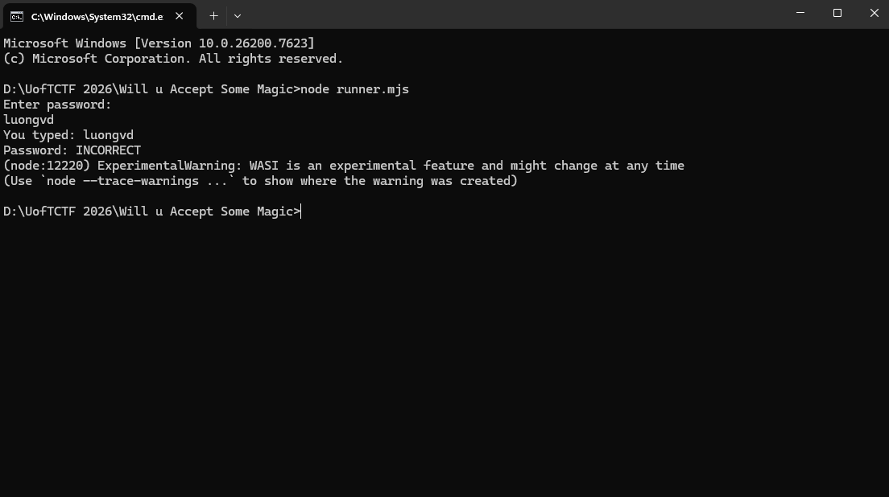
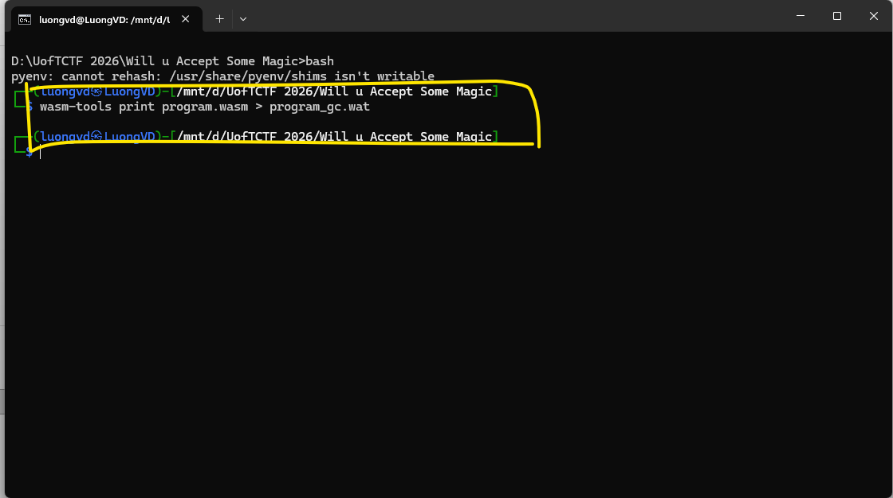
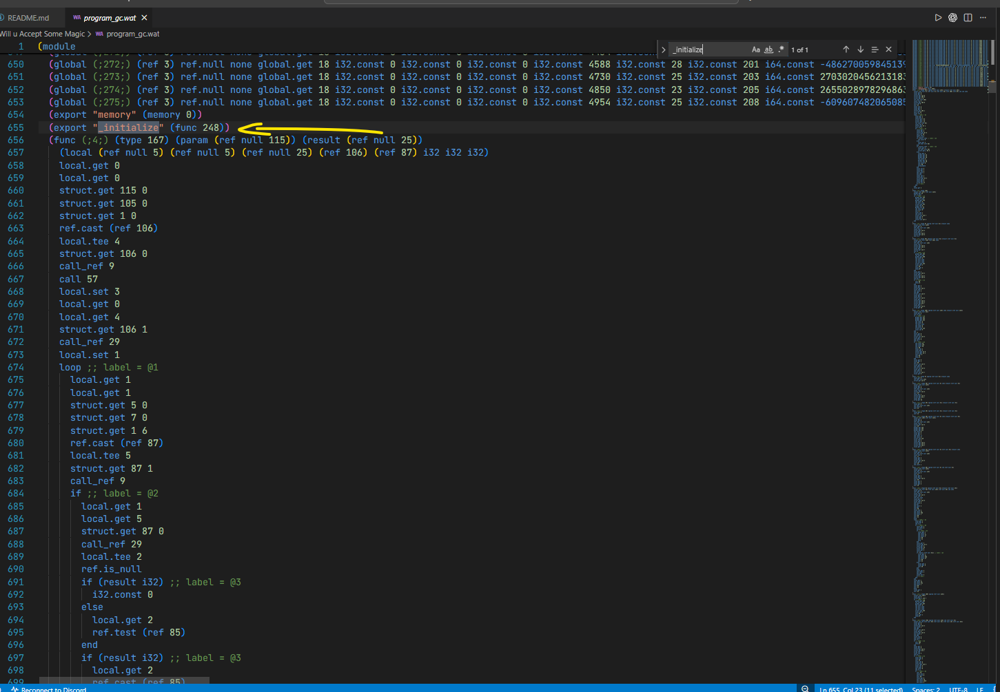
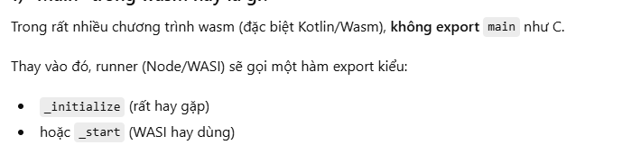
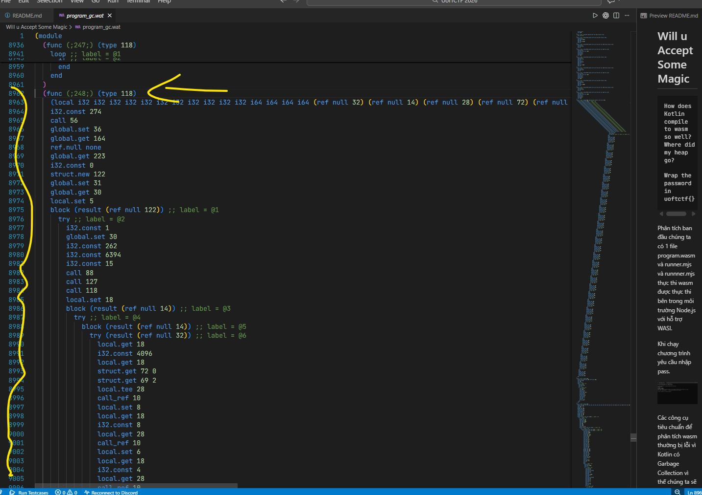
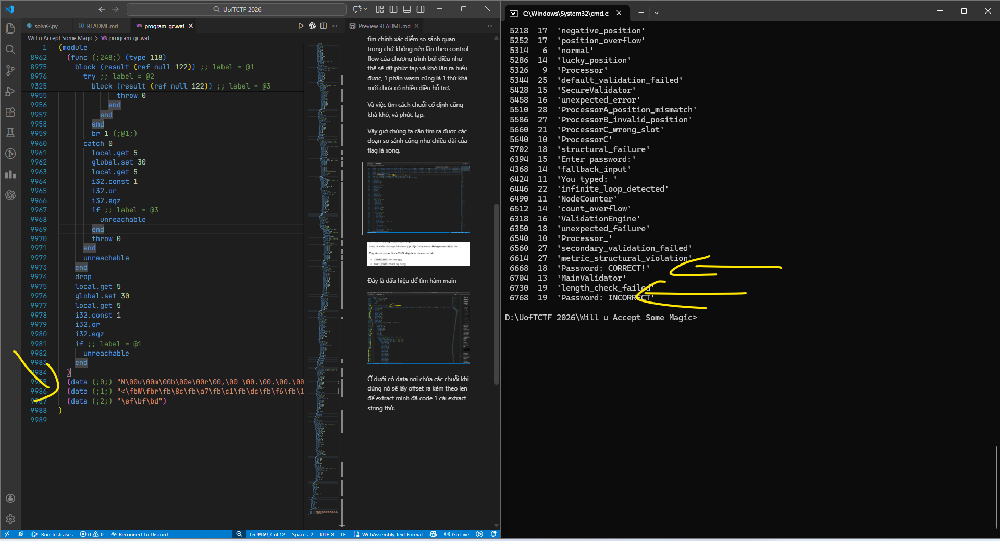
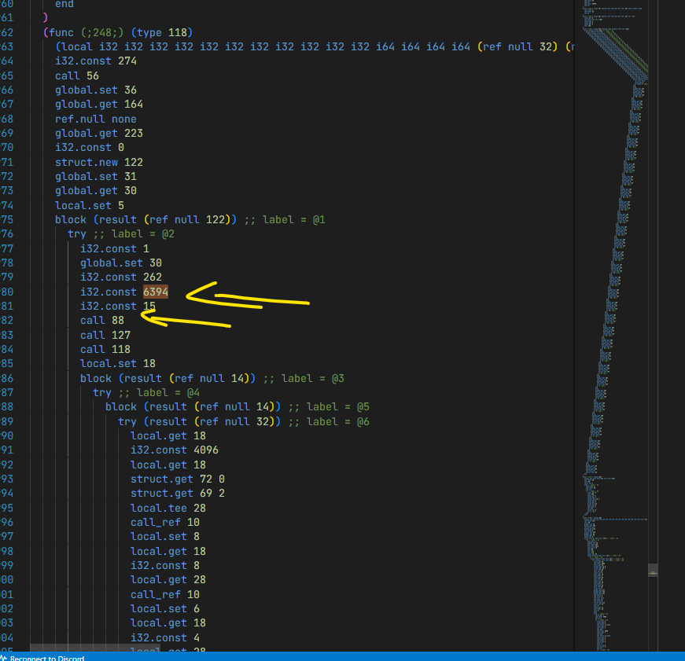
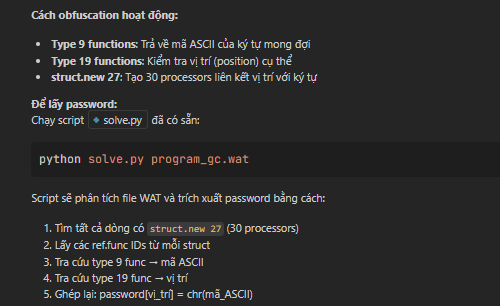

# Will u Accept Some Magic


```
How does Kotlin compile to wasm so well? Where did my heap go?

Wrap the password in uoftctf{}
```
Phân tích ban đầu chúng ta có 1 file program.wasm và runner.mjs và runnner.mjs thực thi wasm được thực thi bên trong môi trường Node.js với hỗ trợ WASI.

Khi chạy chương trình yêu cầu nhập pass.



Các công cụ tiêu chuẩn để phân tích wasm thường bị lỗi vì Kotlin có Garbage Collection vì thế chúng ta sẽ sử dụng tool mới 



Quá trình phân tích thì

Kotlin biên dịch sang Wasm-GC nên thay vì load/store nó dùng bằng struct/array, ref.cast.

Vậy để dịch ngược chúng ta nên đi tìm chính xác điểm so sánh quan trọng chứ không nên lần theo control flow của chương trình bởi điều như thế sẽ rất phức tạp và khó lần ra hiểu được, 1 phần wasm cũng là 1 thứ khá mới chưa có nhiều điều hỗ trợ.

Và việc tìm cách chuỗi cố định cũng khá khó, và phức tạp.

Vậy giờ chúng ta cần tìm ra được các đoạn so sánh cũng như chiều dài của flag là xong.






Đây là dấu hiệu để tìm hàm main



Ở dưới có data nơi chứa các chuỗi khi dùng nó sẽ lấy offset ra kèm theo len để extract mình đã code 1 cái extract string thử.



Xác định đây là nơi cần để ý.



Đoạn này nó call ra in pass nè.


Logic khá loằng ngoằng, mệt não đau đầu nhất là đoạn đọc và sử lý call các func nó gọi các hàm cùng các tham số tượng trưng rất khó hiểu.

Sau khi có sự trợ giúp của AI chúng ta biết được các dữ kiện qua quan trọng 



Vậy chương trình tạo ra 30 cái xử lý tương đương len flag = 30, và chúng ta ghép các func 9 với func19 là oke ra được flag.

```Python
#!/usr/bin/env python3
import re, sys

wat_path = sys.argv[1] if len(sys.argv) > 1 else "program_gc.wat"
lines = open(wat_path, "r", encoding="utf-8", errors="ignore").read().splitlines()

# type 9: func_id -> ascii_code
type9 = {}
for i, line in enumerate(lines):
    m = re.search(r"\(func\s+\(;(\d+);\).*\(type\s+9\)", line)
    if not m:
        continue
    fid = int(m.group(1))
    # usually the i32.const is right after
    for j in range(i, min(i + 6, len(lines))):
        cm = re.search(r"i32\.const\s+(\d+)", lines[j])
        if cm:
            type9[fid] = int(cm.group(1))
            break

# type 19: func_id -> position
type19_pos = {}
for i, line in enumerate(lines):
    m = re.search(r"\(func\s+\(;(\d+);\).*\(type\s+19\)", line)
    if not m:
        continue
    fid = int(m.group(1))
    # find pattern: i32.const <pos> then i32.eq, or i32.eqz for pos=0
    pos = None
    for j in range(i, min(i + 12, len(lines))):
        if "i32.eqz" in lines[j]:
            pos = 0
            break
        cm = re.search(r"i32\.const\s+(\d+)", lines[j])
        if cm and (j + 1) < len(lines) and "i32.eq" in lines[j + 1]:
            pos = int(cm.group(1))
            break
    if pos is not None:
        type19_pos[fid] = pos

# processor globals: grab struct.new 27 lines and their ref.func list
# assumption (matches the writeup structure):
# funcs[1] = type9_func, funcs[3] = type19_func
pos_to_char = {}
for line in lines:
    if "(ref 27)" not in line or "struct.new 27" not in line:
        continue
    funcs = [int(x) for x in re.findall(r"ref\.func\s+(\d+)", line)]
    if len(funcs) < 4:
        continue
    t9 = funcs[1]
    t19 = funcs[3]
    if t9 in type9 and t19 in type19_pos:
        
        pos = type19_pos[t19]
        ch = chr(type9[t9])
        pos_to_char[pos] = ch

password = "".join(pos_to_char.get(i, "?") for i in range(30))
print("password =", password)
print("flag =", f"uoftctf{{{password}}}")
```

```=== Result ===
password = 0QGFCBREENDFDONZRC39BDS3DMEH3E
flag     = uoftctf{0QGFCBREENDFDONZRC39BDS3DMEH3E}```